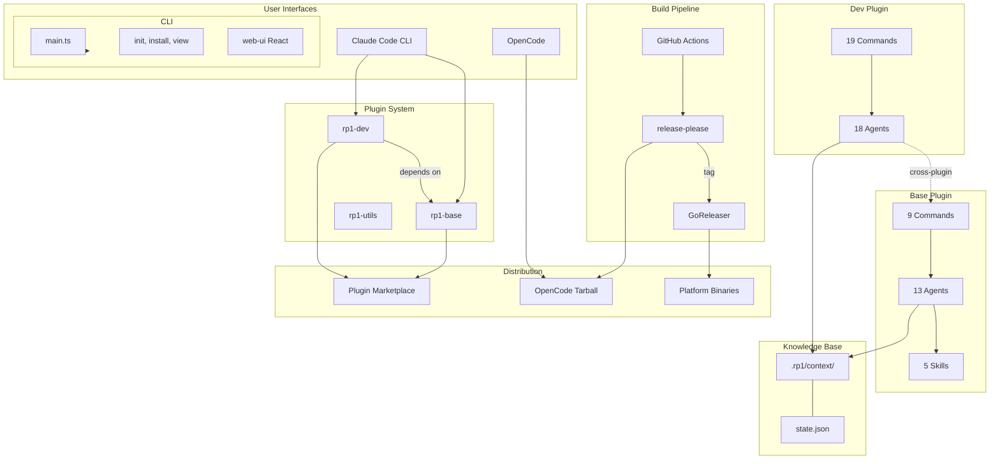
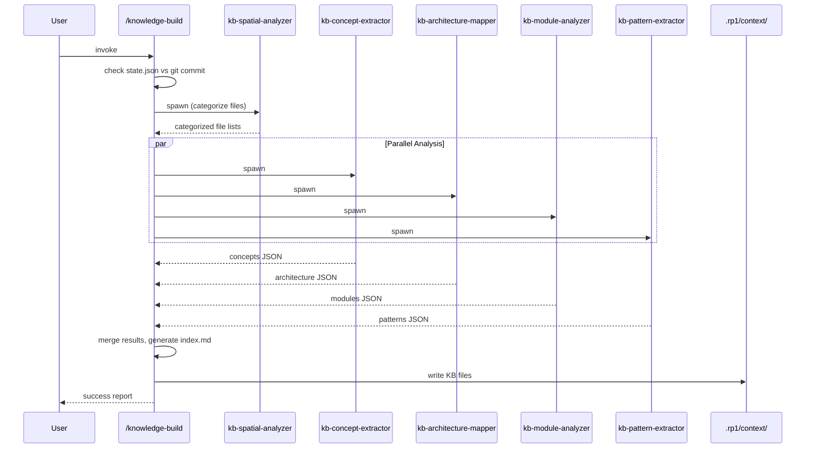
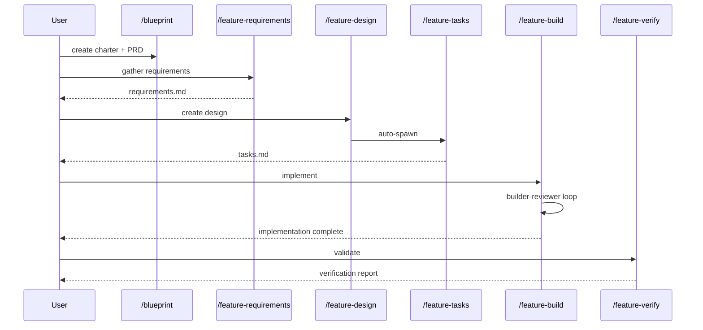
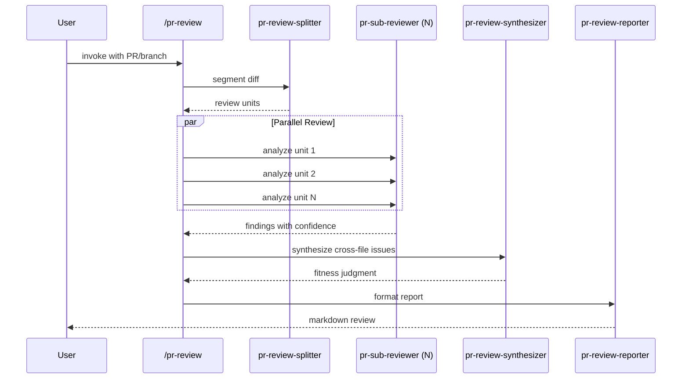

# System Architecture

**Project**: rp1 Plugin System
**Architecture Pattern**: Plugin Architecture with Map-Reduce Workflows
**Last Updated**: 2025-12-23

## High-Level Architecture

## Architectural Patterns

### Plugin Architecture
**Evidence**: `plugins/base/.claude-plugin/plugin.json`, `plugins/dev/.claude-plugin/plugin.json`, `plugins/utils/.claude-plugin/plugin.json`
**Description**: Three independent plugins (base, dev, utils) with explicit dependencies. Dev depends on base for shared capabilities. Each plugin has commands and agents; base owns all skills.

### Constitutional Agent Pattern
**Evidence**: `plugins/*/agents/*.md` (32 agents total)
**Description**: Agents follow structured format: YAML frontmatter, parameter tables, numbered workflow sections, JSON output contracts, anti-loop directives. Single-pass execution without iteration.

### Command-Agent Delegation
**Evidence**: `plugins/*/commands/*.md` (29 commands)
**Description**: Commands are thin wrappers (50-100 lines) that parse parameters and spawn constitutional agents (200-350 lines) via Task tool for workflow execution.

### Map-Reduce Orchestration
**Evidence**: `knowledge-build.md` spawns 4 parallel agents, `pr-review` uses splitter/sub-reviewers/synthesizer
**Description**: Complex workflows split into units, processed in parallel by specialized agents, then merged by orchestrator. Enables scalability for large codebases and PRs.

### Multi-Platform Distribution
**Evidence**: `.goreleaser.yml` (darwin-arm64/x64, linux-arm64/x64, windows-x64)
**Description**: Targets Claude Code (native plugins), OpenCode (tarballs), and standalone CLI (GoReleaser binaries via Homebrew/Scoop).

### Monorepo with Synchronized Versioning
**Evidence**: `.release-please-manifest.json`, all `plugin.json` files share version
**Description**: Single repository containing CLI, plugins, docs, and web-ui with synchronized semantic versioning via release-please.

## Layer Architecture

| Layer | Purpose | Components |
|-------|---------|------------|
| **Interface** | User-facing entry points | 29 commands across 3 plugins |
| **Agent** | Autonomous workflow execution | 32 agents across 3 plugins |
| **Skill** | Reusable shared capabilities | 5 skills (all in base) |
| **CLI** | Cross-platform tooling | main.ts, commands/*, web-ui |
| **Knowledge** | Persistent codebase knowledge | .rp1/context/*.md, state.json |
| **Build/Release** | CI/CD automation | GitHub Actions, GoReleaser |

## Key Workflows

### KB Generation Flow

### Feature Development Flow

### PR Review Flow

## Integration Points

### GitHub Actions
**Purpose**: CI/CD automation for testing, releases, and docs quality
**Workflows**:
- `ci.yml`: lint, typecheck, tests
- `release-please.yml`: versioning + changelog
- `goreleaser.yml`: binary distribution
- `lighthouse.yml`: docs performance
- `pr-title.yml`: conventional commit validation

### GoReleaser
**Purpose**: Cross-platform binary builds using Bun compiler
**Targets**: darwin-arm64/x64, linux-arm64/x64, windows-x64
**Distribution**: Homebrew cask (rp1-run/homebrew-tap), Scoop bucket (rp1-run/scoop-bucket)

### Release-Please
**Purpose**: Automated semantic versioning from conventional commits
**Features**: Creates release PRs with changelogs, tags releases to trigger GoReleaser, builds OpenCode artifacts

### Cloudflare Pages
**Purpose**: Documentation hosting for rp1.run
**Stack**: MkDocs Material, Lighthouse CI validation

### Plugin Marketplace
**Purpose**: Native plugin distribution for Claude Code users
**Install**: `/plugin install rp1-base`, `/plugin install rp1-dev`

### OpenCode
**Purpose**: Alternative AI coding assistant support
**Artifacts**: Tarball in GitHub releases, AGENTS.md instruction file

## Deployment Architecture

### Distribution Channels
| Channel | Target | Method |
|---------|--------|--------|
| Plugin Marketplace | Claude Code users | `/plugin install` |
| GitHub Releases | OpenCode users | Tarball download |
| Homebrew | macOS CLI users | `brew install rp1-run/tap/rp1` |
| Scoop | Windows CLI users | `scoop install rp1` |
| curl script | Linux CLI users | Direct binary download |

### Versioning Strategy
- Semantic versioning via release-please
- All components synchronized (plugins, CLI share version)
- Conventional commits drive version bumps

## Cross-References
- **Domain Concepts**: See [concept_map.md](concept_map.md)
- **Module Breakdown**: See [modules.md](modules.md)
- **Implementation Patterns**: See [patterns.md](patterns.md)
