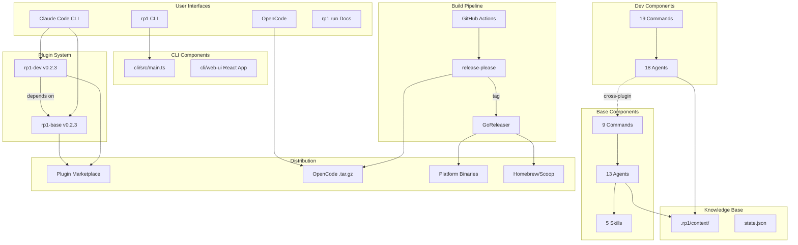
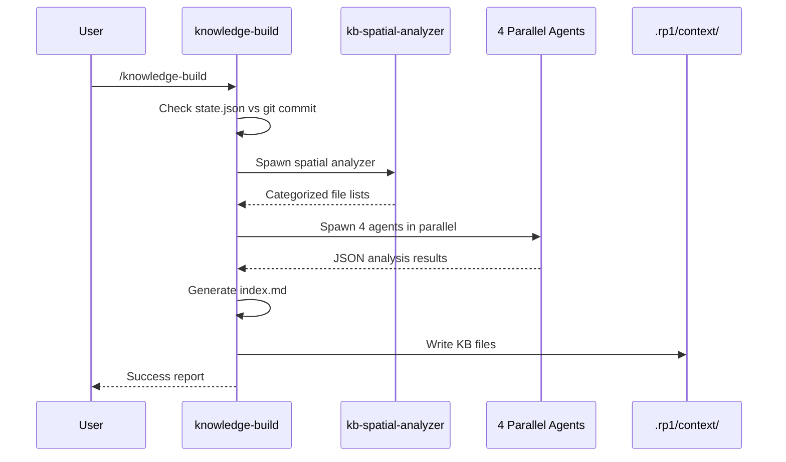
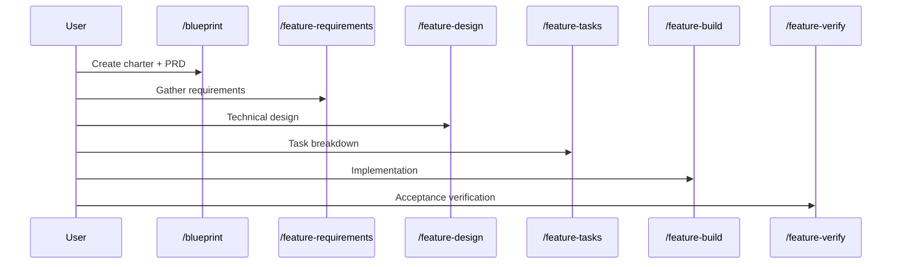
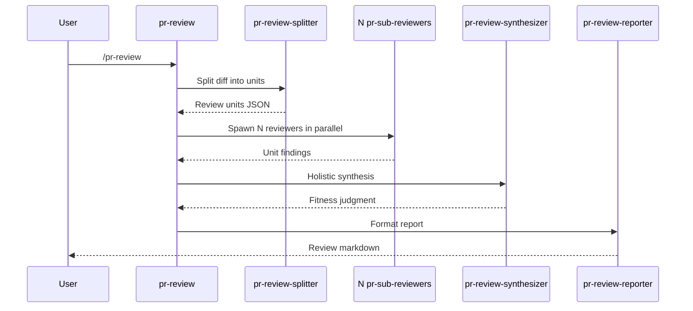

# System Architecture

**Project**: rp1 Plugin System
**Architecture Pattern**: Two-Plugin Monorepo with Constitutional Agents
**Last Updated**: 2025-12-21
**Version**: 0.2.3

## High-Level Architecture

## Architectural Patterns

### Two-Plugin Monorepo
**Evidence**: `plugins/base/.claude-plugin/plugin.json`, `plugins/dev/.claude-plugin/plugin.json`
**Description**: Modular plugin architecture with rp1-base (foundation: knowledge, docs, strategy, security) and rp1-dev (workflows: features, code quality, PR management). Dev depends on base for shared capabilities.

### Constitutional Agent Pattern
**Evidence**: `plugins/*/agents/*.md` (31 agents: 13 base, 18 dev)
**Description**: Agents follow structured format: YAML frontmatter, parameter tables, numbered workflow sections, JSON output contracts, anti-loop directives. Single-pass execution without iteration.

### Command-Agent Delegation
**Evidence**: All command files delegate to agents via Task tool
**Description**: Commands are thin wrappers (50-100 lines) that parse parameters and spawn constitutional agents (200-350 lines) for workflow execution.

### Map-Reduce Orchestration
**Evidence**: `knowledge-build`, `pr-review` commands
**Description**: Complex workflows split into units, processed in parallel by specialized agents, then merged. Enables scalability for large codebases and PRs.

### Multi-Platform Distribution
**Evidence**: `.goreleaser.yml`, release-please workflows
**Description**: Claude Code (native plugins via marketplace), OpenCode (tarballs), CLI (binaries via GoReleaser with Homebrew/Scoop).

### Release-Please Automation
**Evidence**: `.github/workflows/release-please.yml`, `.release-please-manifest.json`
**Description**: Automated semantic versioning from conventional commits. Creates release PRs, builds artifacts on tag.

## Layer Architecture

| Layer | Purpose | Components |
|-------|---------|------------|
| Interface | User entry points | 9 base + 19 dev commands |
| Agent | Workflow execution | 13 base + 18 dev agents |
| Skill | Reusable capabilities | 5 skills (all in base) |
| CLI | Cross-platform tooling | build, install, init, view, self-update |
| Build/Release | CI/CD automation | GitHub Actions, GoReleaser, release-please |
| Documentation | Public docs | MkDocs Material at rp1.run |

## Data Flow

### KB Generation Flow

### Feature Development Flow

### PR Review Flow

## Integration Points

### External Services
- **GitHub Actions**: CI/CD for releases, testing, docs quality
- **GoReleaser**: Cross-platform binary distribution (darwin, linux, windows)
- **Release-Please**: Automated semantic versioning from conventional commits
- **Homebrew/Scoop**: Package manager distribution
- **MkDocs Material**: Documentation site at rp1.run

### Internal Communication
- **Command → Agent**: Task tool invocation with subagent_type
- **Agent → KB**: Direct file read via Read tool
- **Cross-Plugin**: Dev agents can invoke base commands with error handling

## Deployment Architecture

### Distribution Channels
| Channel | Target | Mechanism |
|---------|--------|-----------|
| Plugin Marketplace | Claude Code | Native plugin install |
| GitHub Releases | OpenCode | .tar.gz artifacts |
| Homebrew | macOS | rp1-run/homebrew-tap |
| Scoop | Windows | rp1-run/scoop-bucket |
| curl | All | install.sh script |

### Build Targets
- darwin-arm64, darwin-x64
- linux-arm64, linux-x64
- windows-x64

### Versioning
- **Strategy**: Semantic versioning via release-please
- **Current**: v0.2.3
- **Synchronized**: All components share same version (plugins, CLI)
