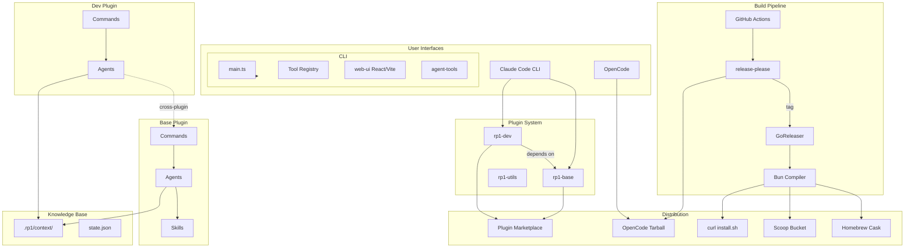
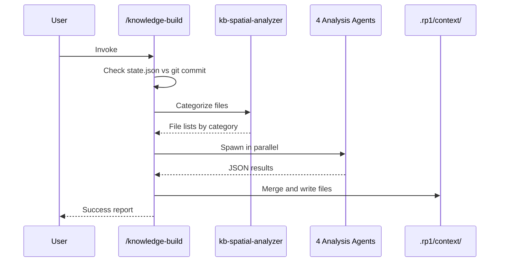
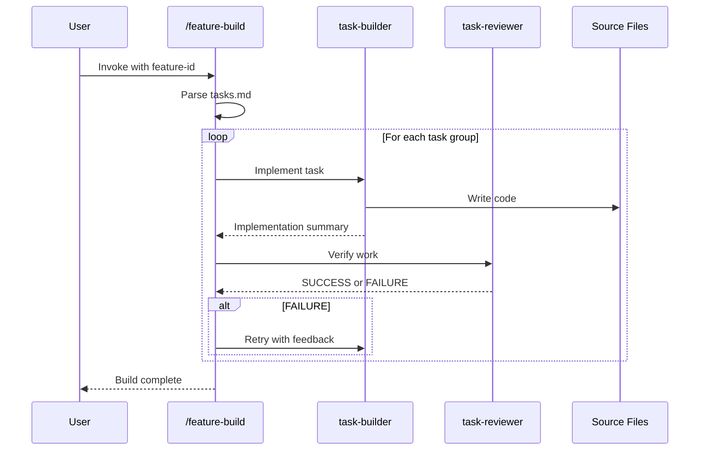
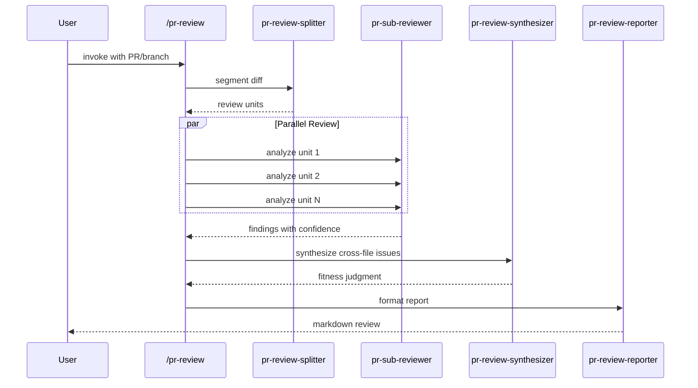

# System Architecture

**Project**: rp1 Plugin System
**Architecture Pattern**: Plugin Architecture with Map-Reduce Orchestration
**Last Updated**: 2025-12-27

## High-Level Architecture

## Architectural Patterns

### Plugin Architecture
**Evidence**: `plugins/base/.claude-plugin/plugin.json`, `plugins/dev/.claude-plugin/plugin.json`
**Description**: Three independent plugins (base, dev, utils) with explicit dependencies. Dev depends on base for shared capabilities. Each plugin has commands and agents; base owns all skills.

### Constitutional Agent Pattern
**Evidence**: `plugins/*/agents/*.md` structure with YAML frontmatter, parameter tables, anti-loop directives
**Description**: Agents follow structured format: parameter tables, numbered workflow sections, JSON output contracts. Single-pass execution without iteration.

### Command-Agent Delegation
**Evidence**: `plugins/*/commands/*.md` spawn agents via Task tool
**Description**: Commands are thin wrappers (50-100 lines) that parse parameters and spawn constitutional agents (200-350 lines) for workflow execution.

### Map-Reduce Orchestration
**Evidence**: `knowledge-build` spawns parallel agents, `pr-review` uses splitter/sub-reviewers/synthesizer
**Description**: Complex workflows split into units, processed in parallel by specialized agents, then merged by orchestrator. Enables scalability for large codebases.

### Multi-Platform Distribution
**Evidence**: `.goreleaser.yml` (darwin-arm64/x64, linux-arm64/x64, windows-x64), homebrew_casks, scoops config
**Description**: Targets Claude Code (native plugins), OpenCode (tarballs), and standalone CLI via GoReleaser binaries with Homebrew/Scoop distribution.

### Embedded Asset Bundling
**Evidence**: `cli/src/assets/embedded.ts`, goreleaser.yml verification of IS_BUNDLED flag
**Description**: Plugin assets embedded at build time into single executable binary via Bun compiler with compile-time verification.

### Monorepo with Synchronized Versioning
**Evidence**: `release-please-config.json` updates plugins/base, plugins/dev, cli/package.json simultaneously
**Description**: Single repository containing CLI, plugins, and docs with synchronized semantic versioning via release-please.

## Layer Architecture

| Layer | Purpose | Components |
|-------|---------|------------|
| **Interface** | User-facing entry points for AI assistants | `plugins/*/commands/*.md` |
| **Agent** | Autonomous workflow execution | `plugins/*/agents/*.md` |
| **Skill** | Reusable shared capabilities | `plugins/base/skills/*.md` |
| **CLI** | Cross-platform tooling | `cli/src/main.ts`, `cli/web-ui/*` |
| **Config** | Tool registry and configuration | `cli/src/config/supported-tools.*` |
| **Knowledge** | Persistent codebase knowledge | `.rp1/context/*.md` |
| **Build/Release** | CI/CD automation | `.github/workflows/*`, `.goreleaser.yml` |

## Key Workflows

### KB Generation Flow

### Feature Build Flow

### PR Review Flow

## Integration Points

### GitHub Actions
**Purpose**: CI/CD automation for testing, releases, and binary distribution
- `ci.yml`: lint, typecheck, tests via Bun and `just` task runner
- `release-please.yml`: versioning + OpenCode artifact builds
- `goreleaser.yml`: binary builds triggered by tag

### GoReleaser
**Purpose**: Cross-platform binary builds using Bun compiler
**Targets**: darwin-arm64/x64, linux-arm64/x64, windows-x64
**Distribution**: Homebrew cask (rp1-run/homebrew-tap), Scoop bucket (rp1-run/scoop-bucket)

### Release-Please
**Purpose**: Automated semantic versioning from conventional commits
**Configuration**: Syncs versions across plugins/base, plugins/dev, cli/package.json

### MkDocs Material
**Purpose**: Documentation site at rp1.run
**Features**: Material theme, Mermaid diagrams, search, tabs, code copy

### Claude Code Plugin Marketplace
**Purpose**: Native plugin distribution
**Usage**: `/plugin install rp1-base`, `/plugin install rp1-dev`

### OpenCode
**Purpose**: Alternative AI coding assistant support
**Distribution**: Tarball in GitHub releases with AGENTS.md instruction file

## Deployment Architecture

### Distribution Channels
| Channel | Target | Method |
|---------|--------|--------|
| Claude Code | Plugin marketplace | `/plugin install` |
| OpenCode | GitHub releases | Tarball download |
| macOS | Homebrew | `brew install --cask rp1-run/tap/rp1` |
| Windows | Scoop | `scoop install rp1` |
| Linux | curl script | `curl -fsSL https://rp1.run/install.sh \| bash` |

### Build Pipeline
1. Release-please creates version tag from conventional commits
2. GoReleaser workflow triggers on tag
3. Bun compiles embedded assets with IS_BUNDLED=true
4. GoReleaser builds cross-platform binaries
5. Artifacts uploaded to GitHub Releases
6. Homebrew/Scoop formulas updated automatically

### Versioning Strategy
- Semantic versioning via release-please
- All components synchronized (plugins, CLI share version)
- Conventional commits drive version bumps

## Performance Considerations

### Lazy Loading
- Agent-tools (puppeteer) lazy-loaded to reduce CLI startup time
- Heavy dependencies only loaded when needed

### Parallel Execution
- KB generation uses 4 parallel agents
- PR review uses parallel sub-reviewers
- mmd-validate uses shared browser instance for batch validation

### Incremental Updates
- KB tracks git commit in state.json
- Only changed files analyzed on subsequent runs
- 2-5 min incremental vs 10-15 min full build

## Cross-References
- **Domain Concepts**: See [concept_map.md](concept_map.md)
- **Module Breakdown**: See [modules.md](modules.md)
- **Implementation Patterns**: See [patterns.md](patterns.md)
