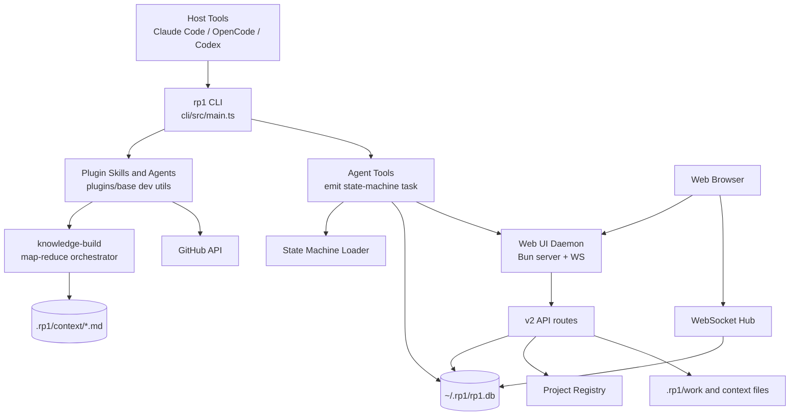

# Architecture

**Repository**: rp1
**Type**: Monorepo
**Last Updated**: 2026-03-15

## Overview

rp1 is a plugin-driven Bun and TypeScript monorepo for AI-assisted development workflows. A CLI entrypoint dispatches commands and lazy-loads heavy subsystems, markdown-authored skills and agents define orchestration behavior, SQLite-backed runtime services persist workflow data, and a local Web UI daemon exposes APIs and live updates for project and run visibility.

## System Diagram

```mermaid
flowchart TB
    Host["Host Tools\nClaude Code / OpenCode / Codex"] --> CLI["rp1 CLI\ncli/src/main.ts"]
    CLI --> Skills["Plugin Skills and Agents\nplugins/base dev utils"]
    CLI --> Tools["Agent Tools\nemit state-machine task"]
    Skills --> KBBuild["knowledge-build\nmap-reduce orchestrator"]
    KBBuild --> KBFiles[(".rp1/context/*.md")]
    Tools --> SM["State Machine Loader"]
    Tools --> EmitDB[("~/.rp1/rp1.db")]
    Tools --> Daemon["Web UI Daemon\nBun server + WS"]
    Daemon --> API["v2 API routes"]
    API --> EmitDB
    API --> Registry["Project Registry"]
    API --> Workspace[".rp1/work and context files"]
    Browser["Web Browser"] --> Daemon
    Browser --> WS["WebSocket Hub"]
    WS --> EmitDB
    Skills --> GitHub["GitHub API"]
```

## Layers

| Layer | Purpose | Contains |
|------|---------|----------|
| Interaction Layer | Accepts user and host-tool entrypoints and launches CLI or daemon flows. | `cli/src/main.ts`, `cli/src/commands/`, `cli/src/config/supported-tools.yaml` |
| Workflow Definition Layer | Defines orchestration, prompts, and state-machine rules in markdown-first assets. | `plugins/base/skills/`, `plugins/dev/skills/`, `plugins/utils/skills/`, agent markdown files |
| Runtime Services Layer | Provides deterministic agent tools for state tracking, artifacts, validation, and integration. | `cli/src/agent-tools/`, daemon helpers, state-machine loading |
| Persistence And Knowledge Layer | Stores local operational state and generated repository knowledge. | `~/.rp1/*.db`, `.rp1/context/*.md`, registry/config files |
| Presentation Layer | Serves the dashboard, APIs, WebSocket streams, and artifact views. Uses a warm stone gray design system with Commit Mono typography and HSL token architecture. | `cli/web-ui/src/server/`, `cli/web-ui/src/app/`, `cli/web-ui/src/styles/globals.css`, `cli/web-ui/tailwind.config.ts` |

## Key Interactions

- Supported-tool metadata defines host capabilities and instruction-file contracts before execution.
- The CLI launches workflow skills, which delegate implementation or analysis to agents.
- `knowledge-build` runs a spatial pass, then parallel specialist analyzers, then writes KB artifacts.
- Workflow definitions call agent tools for root resolution, state updates, artifacts, and validation.
- The Web UI daemon reads persisted run data, replays events, and pushes live updates over WebSockets.
- API routes serve workflow metadata, project registry data, and scoped workspace files.

## Integrations

| Integration | Role |
|------------|------|
| Bun | Primary runtime for CLI, server, packaging, and local tooling. |
| SQLite | Embedded local persistence for runs, events, artifacts, annotations, and tasks. |
| GitHub API | Deterministic repository and PR integration for workflow automation. |
| React + Vite | Frontend runtime and build path for the Web UI. |
| MkDocs Material | Published documentation site generation. |
| Cloudflare Pages | Docs hosting target. |
| Claude Code / OpenCode / Codex | Supported host agents that consume rp1 plugin artifacts. |

## Architectural Patterns

- Plugin-based monorepo with explicit namespace and dependency rules.
- Markdown-first workflow authoring with prompts as source-of-truth assets.
- Map-reduce orchestration for large analysis jobs such as KB generation and PR review.
- Unified local persistence: all workflow events, artifacts, and tasks are stored in `rp1.db`.
- Local-first observability where agent tools write state and the Web UI rebroadcasts it.
- Lazy loading to keep the common CLI path lightweight.

## Security Notes

- The local daemon binds to loopback, reducing accidental remote exposure.
- File and artifact reads are path-scoped and validated before serving.
- Namespace rules, supported-tool contracts, and state-machine validation constrain workflow execution. Emit step names are strictly validated against the workflow's state machine; invalid steps are rejected before persistence, preventing data corruption in run timelines.
- Project-registry writes are atomic and use local-only storage expectations.
- External repository actions rely on host-provided credentials such as `GITHUB_TOKEN`.

## Performance Notes

- CLI startup defers heavyweight modules until special commands are invoked.
- Web UI handlers use focused route loading and database-backed replay instead of full refreshes.
- SQLite connections, indexes, and WAL-style local usage support frequent event updates.
- Incremental KB generation is available for small change sets; large diffs fall back to full analysis for reliability.
