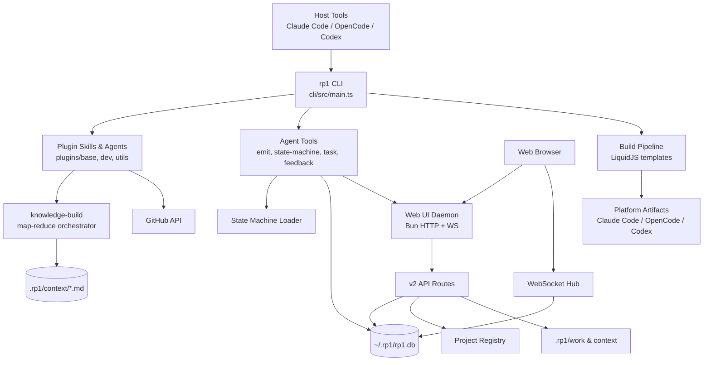

# System Architecture

**Project**: rp1
**Architecture Pattern**: Plugin-based CLI with Event-Sourced Dashboard
**Last Updated**: 2026-03-26

## High-Level Architecture


```mermaid
flowchart TB
    Host["Host Tools\nClaude Code / OpenCode / Codex"] --> CLI["rp1 CLI\ncli/src/main.ts"]
    CLI --> Skills["Plugin Skills & Agents\nplugins/base, dev, utils"]
    CLI --> Tools["Agent Tools\nemit, state-machine, task, feedback"]
    Skills --> KBBuild["knowledge-build\nmap-reduce orchestrator"]
    KBBuild --> KBFiles[(".rp1/context/*.md")]
    Tools --> SM["State Machine Loader"]
    Tools --> EmitDB[("~/.rp1/rp1.db")]
    Tools --> Daemon["Web UI Daemon\nBun HTTP + WS"]
    Daemon --> API["v2 API Routes"]
    API --> EmitDB
    API --> Registry["Project Registry"]
    API --> Workspace[".rp1/work & context"]
    Browser["Web Browser"] --> Daemon
    Browser --> WS["WebSocket Hub"]
    WS --> EmitDB
    Skills --> GitHub["GitHub API"]
    CLI --> BuildPipeline["Build Pipeline\nLiquidJS templates"]
    BuildPipeline --> Platforms["Platform Artifacts\nClaude Code / OpenCode / Codex"]
```

## Architecture Layers

| Layer | Purpose | Key Components |
|-------|---------|----------------|
| Interaction | User and host-tool entry points | `cli/src/main.ts`, `cli/src/commands/` |
| Workflow Definition | Skills, agents, state machines | `plugins/base/`, `plugins/dev/`, `plugins/utils/` |
| Runtime Services | Agent tools, event emission, validation | `cli/src/agent-tools/`, `cli/src/lib/` |
| Build & Distribution | Plugin compilation, artifact generation | `cli/src/build/`, `cli/scripts/`, `scripts/` |
| Presentation | Arcade dashboard SPA, REST APIs, WebSocket | `cli/web-ui/src/app/`, `cli/web-ui/src/server/` |
| Persistence | SQLite event store, KB files, work artifacts, project identity | `~/.rp1/rp1.db`, `.rp1/project_id`, `.rp1/context/`, `.rp1/work/` |
| Evaluation | Prompt quality validation, attestation | `evals/` |

## Architectural Patterns

### Plugin Architecture
Three plugins (base, dev, utils) with `.claude-plugin/plugin.json` manifests. Dependency direction enforced: dev depends on base, never reverse. Each plugin provides skills and agents compiled to platform-specific artifacts.

### Event-Sourced State with Replay
Events inserted into SQLite with monotonic IDs. Reconnecting WebSocket clients receive missed events (up to 100) or a state snapshot for larger gaps. Run status derived from event history.

### Cross-Platform Build Pipeline
Single SKILL.md source compiles to Claude Code, OpenCode, and Codex formats via shared `executeBuild` function with platform-specific LiquidJS templates and custom filters/tags.

### State-Machine-Driven Workflows
Mermaid stateDiagram-v2 definitions parsed into typed graph models. Runtime validation of step transitions with predecessor auto-completion and namespaced sub-agent steps.

### fp-ts Functional Pipelines
Typed error propagation via `Either<CLIError, A>` and `TaskEither<CLIError, A>` throughout CLI modules. Re-exported via `cli/shared/fp.ts` facade.

### Map-Reduce Agent Orchestration
Large analysis jobs fan out to parallel specialist agents and merge results. Used for KB generation (spatial analyzer + 4 parallel agents), PR review (splitter + N sub-reviewers), and deep research.

## Key Data Flows

### Event Pipeline
```
Agent emit call -> Step validation (state machine) -> SQLite insert -> HTTP notify -> WebSocket broadcast -> Dashboard UI
```

### KB Generation
```
Spatial analyzer (scan & categorize) -> 4 parallel agents (concept, arch, module, pattern) -> Orchestrator merge -> .rp1/context/*.md
```

### Plugin Build Pipeline
```
SKILL.md source -> LiquidJS preprocessing (platform tags, filters) -> Platform-specific artifacts -> dist/{platform}/
```

### Feedback Lifecycle
```
User annotates in Arcade -> SQLite + WebSocket broadcast -> Agent reads via feedback tool -> Agent resolves/replies/accepts
```

## Integration Points

| Integration | Purpose | Type |
|-------------|---------|------|
| Bun | Runtime, HTTP/WS server, binary compilation, test runner | Runtime |
| bun:sqlite | Events, runs, artifacts, annotations, tasks storage (WAL mode) | Embedded DB |
| GitHub API (@octokit/rest) | PR review, comment management, reactions | REST API |
| React + Vite | Arcade dashboard SPA with Tailwind, Radix UI, Milkdown | Frontend |
| LiquidJS | Multi-platform artifact generation from SKILL.md templates | Build pipeline |
| chokidar | File watching for `.rp1/work` and `.rp1/context` directories | Runtime |
| promptfoo | Eval harness for prompt quality testing with attestation | Testing |
| Release Please | Automated semver with coordinated version bumps | CI/CD |
| GitHub Actions | CI (lint, typecheck, test), release automation, PR review | CI/CD |
| Lefthook | Git hooks for pre-commit lint/format and pre-push typecheck | Dev tooling |
| Biome | Linting and formatting for TypeScript/TSX | Dev tooling |
| MkDocs Material | Documentation site at rp1.run | Documentation |

## Deployment

- **Distribution**: GitHub releases via GoReleaser (Homebrew, Scoop, curl installer, npm, Claude Code marketplace)
- **Targets**: darwin-arm64, darwin-x64, linux-arm64, linux-x64, windows-x64
- **Daemon**: Background Bun HTTP+WS server on port 7710 with PID-file lifecycle, version-aware restart, LRU file watcher pool (max 10 projects)
- **Versioning**: Unified semver via release-please across CLI and all plugins

## Cross-References
- **Module details**: See [modules.md](modules.md)
- **Domain concepts**: See [concept_map.md](concept_map.md)
- **Code patterns**: See [patterns.md](patterns.md)
