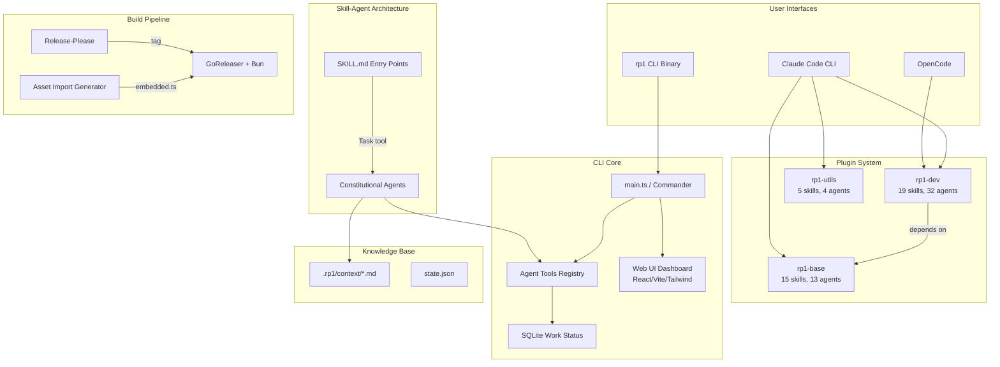

# System Architecture

**Project**: rp1
**Architecture Pattern**: Plugin-based CLI with Skill-Agent Delegation
**Last Updated**: 2026-03-01

## High-Level Architecture

```mermaid
graph TB
    subgraph "User Interfaces"
        CC[Claude Code CLI]
        OC[OpenCode]
        CLI[rp1 CLI Binary]
    end

    subgraph "Plugin System"
        Base["rp1-base<br/>15 skills, 13 agents"]
        Dev["rp1-dev<br/>19 skills, 32 agents"]
        Utils["rp1-utils<br/>5 skills, 4 agents"]
        Dev -->|depends on| Base
    end

    subgraph "Skill-Agent Architecture"
        Skills[SKILL.md Entry Points]
        Agents[Constitutional Agents]
        Skills -->|Task tool| Agents
    end

    subgraph "CLI Core"
        Main[main.ts / Commander]
        AgentTools[Agent Tools Registry]
        WebUI["Web UI Dashboard<br/>React/Vite/Tailwind"]
        SQLite[SQLite Work Status]
        Main --> AgentTools
        Main --> WebUI
        AgentTools --> SQLite
    end

    subgraph "Knowledge Base"
        KB[".rp1/context/*.md"]
        State[state.json]
    end

    subgraph "Build Pipeline"
        RP[Release-Please]
        GR[GoReleaser + Bun]
        AssetGen[Asset Import Generator]
        RP -->|tag| GR
        AssetGen -->|embedded.ts| GR
    end

    CC --> Base
    CC --> Dev
    CC --> Utils
    OC --> Dev
    CLI --> Main
    Agents --> KB
    Agents --> AgentTools
```

## Architectural Layers

| Layer | Purpose | Components |
|-------|---------|------------|
| **Interface (Skills)** | User-facing entry points via slash commands | `plugins/*/skills/*/SKILL.md` |
| **Agent** | Autonomous constitutional agents for single-pass execution | `plugins/*/agents/*.md` |
| **CLI** | Cross-platform tooling, agent-tools, web dashboard | `cli/src/main.ts`, `commands/`, `agent-tools/`, `install/`, `build/` |
| **Web UI** | Read-only markdown viewer and status dashboard | `cli/web-ui/src/` (React/Vite/Tailwind) |
| **Config** | Tool registry and project configuration | `cli/src/config/supported-tools.yaml`, `.rp1/config/` |
| **Knowledge** | Persistent codebase documentation | `.rp1/context/*.md`, `state.json` |
| **Data** | SQLite-based work status tracking | `cli/src/agent-tools/work/migrations/*.sql` |
| **Build/Release** | CI/CD, binary compilation, asset bundling | `.github/workflows/`, `.goreleaser.yml`, `Justfile` |
| **Evaluation** | Prompt testing with content-addressable attestation | `evals/src/attestation/`, `evals/suites/` |

## Key Interaction Flows

### KB Generation (Map-Reduce)
1. User invokes `/rp1-base:knowledge-build`
2. Skill checks state.json for incremental vs full mode
3. Spawns `kb-spatial-analyzer` to categorize files
4. Spawns 4 parallel analysis agents (architecture, modules, patterns, concepts)
5. Orchestrator merges results → writes `.rp1/context/*.md` + `state.json`

### Feature Build (Builder-Reviewer Loop)
1. User invokes `/rp1-dev:build` with feature-id
2. Detects artifacts and parses task DAG
3. For each task: spawns `task-builder` → `task-reviewer`
4. On FAILURE: re-spawns builder with feedback (single retry)
5. On SUCCESS: proceeds to next task

### PR Review (Map-Reduce)
1. User invokes `/rp1-dev:pr-review`
2. `pr-review-splitter` segments diff into review units
3. N parallel `pr-sub-reviewer` agents analyze units with confidence scoring
4. `pr-review-synthesizer` merges cross-file issues → fitness judgment
5. Posts comments to GitHub PR

### Binary Build Pipeline
1. `bun run build:opencode` generates OpenCode artifacts from plugin sources
2. `bun run build:web-ui` compiles React dashboard via Vite
3. `generate-asset-imports.ts` reads bundle-manifest.json → generates `embedded.ts`
4. `bun build --compile` produces single-file executable with all assets

### Release Pipeline
1. Conventional commits merged to main → release-please creates rolling release PR
2. Merging release PR creates git tag → triggers GoReleaser
3. GoReleaser builds Bun binaries for 5 platform targets (darwin-arm64/x64, linux-arm64/x64, windows-x64)
4. Publishes to GitHub Releases, Homebrew tap, Scoop bucket, OpenCode tarballs

## External Integrations

| Service | Purpose |
|---------|---------|
| **GitHub Actions** | CI/CD: lint/typecheck/test, release versioning, binary builds, PR review |
| **GoReleaser** | Cross-platform binary compilation via Bun for 5 targets |
| **Release-Please** | Semantic versioning from conventional commits |
| **Cloudflare Pages** | Documentation hosting at rp1.run |
| **Promptfoo** | Eval framework with custom claude-with-tools provider |
| **SQLite (Bun native)** | Work status tracking for agent task progress |
| **Lefthook** | Git hooks: pre-commit (lint, format), pre-push (typecheck, test) |

## Deployment

- **Claude Code**: Plugin marketplace via `plugin install` (3 plugins)
- **OpenCode**: GitHub release tarballs, installed via `rp1 install opencode`
- **Homebrew**: `brew install rp1-run/tap/rp1` (macOS cask)
- **Scoop**: Windows package via GoReleaser
- **curl**: `curl -fsSL https://rp1.run/install.sh | sh`
- **npm**: `@rp1-run/rp1` package
- **Current Version**: 0.4.8
