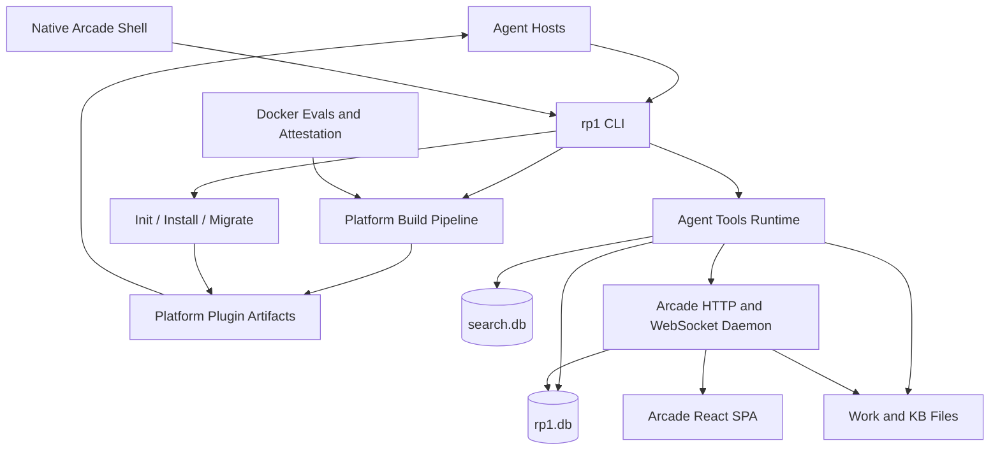

# System Architecture

**Project**: rp1
**Architecture Pattern**: Local-first plugin CLI with event-sourced workflow runtime and multi-platform prompt compilation
**Last Updated**: 2026-05-06

## High-Level Architecture

```mermaid
flowchart TB
  Hosts[Agent Hosts] --> CLI[rp1 CLI]
  Native[Native Arcade Shell] --> CLI
  CLI --> Init[Init / Install / Migrate]
  CLI --> Build[Platform Build Pipeline]
  CLI --> Tools[Agent Tools Runtime]
  Build --> Artifacts[Platform Plugin Artifacts]
  Artifacts --> Hosts
  Init --> Artifacts
  Tools --> DB[(rp1.db)]
  Tools --> Work[Work and KB Files]
  Tools --> Search[(search.db)]
  Tools --> Daemon[Arcade HTTP and WebSocket Daemon]
  Daemon --> Web[Arcade React SPA]
  Daemon --> DB
  Daemon --> Work
  Evals[Docker Evals and Attestation] --> Build
```

## Architectural Layers

| Layer | Purpose | Key Components |
|-------|---------|----------------|
| Host Interaction | Entry points for users and host AI tools. | `cli/src/main.ts`, `cli/src/commands/`, `native-app/src/bun/index.ts` |
| Workflow Definition | Markdown-authored skills, agents, templates, and discovery metadata. | `plugins/base/`, `plugins/dev/`, `plugins/utils/`, `catalog/agents.yaml` |
| Build and Catalog | Compile source prompts into host-specific artifacts and catalog views. | `cli/src/build/`, `cli/src/catalog/`, `cli/src/config/supported-tools.yaml` |
| Runtime Services | Agent-facing tools for emit, bootstrap, workflow state, search, tasks, PR operations, and debate locks. | `cli/src/agent-tools/` |
| Persistence | Durable local state for workflows, projects, artifacts, annotations, search, KB, and work files. | `~/.rp1/rp1.db`, `.rp1/search.db`, `.rp1/context/`, `.rp1/work/` |
| Arcade Service | Bun HTTP API, WebSocket replay/broadcast, static assets, registry, activity search, artifacts, annotations. | `cli/web-ui/src/server.ts`, `cli/web-ui/src/server/`, `cli/web-ui/src/daemon/` |
| Presentation | Browser SPA and native desktop shell. | `cli/web-ui/`, `native-app/` |
| Install and Init | Project setup, migrations, platform installs, asset extraction, and verification. | `cli/src/init/`, `cli/src/install/`, `cli/src/migrate/` |
| Quality and Distribution | CI, plugin validation, native app checks, docs, Docker evals, release attestation. | `.github/workflows/ci.yml`, `Justfile`, `docker/`, `evals/`, `mkdocs.yml` |

## Primary Patterns

| Pattern | Description | Evidence |
|---------|-------------|----------|
| Plugin Architecture | Base, dev, and utils plugin packs are the capability boundary; base/dev are distributable while utils is internal. | `plugins/*/.claude-plugin/plugin.json`, `cli/src/catalog/registry.ts` |
| Multi-Platform Prompt Compilation | One source skill/agent tree renders to OpenCode, Claude Code, Codex, and GitHub Copilot artifacts. | `cli/src/build/platform-definitions.ts`, `cli/src/build/command.ts` |
| Event-Sourced Workflow Runtime | Runs, events, artifacts, annotations, notifications, project registry data, activity search, and duel state persist in SQLite and project to Arcade. | `cli/src/agent-tools/emit/database.ts`, `cli/web-ui/src/server/websocket.ts` |
| Deterministic Workflow Bootstrap | Workflows resolve schema, arguments, directories, host, harness, run policy, and identity before emitting state. | `cli/src/agent-tools/workflow-bootstrap/index.ts` |
| Artifact-Backed Handoffs | Workflow outputs are registered with explicit storage roots, file/URL location kind, doc_id reconciliation, and canonical display paths. | `cli/src/agent-tools/emit/index.ts`, `cli/web-ui/src/server/routes/artifacts-api.ts` |
| DB-Backed Project Registry | The prior `projects.json` registry is now SQLite-backed with one-time legacy hydration. | `cli/web-ui/src/server/registry.ts` |
| Project-Local Work Search | Work artifact search uses `.rp1/search.db` FTS chunks, separate from the global workflow event DB. | `cli/src/agent-tools/work-search/database.ts` |
| Leased Debate Coordination | Socratic Duel uses participant rows, active target uniqueness, lease tokens, lock refresh, and terminal close semantics. | `cli/src/agent-tools/socratic-duel/database.ts` |
| Native Arcade Shell | Electrobun wraps the Arcade daemon and loads the local loopback UI with native runtime metadata. | `native-app/electrobun.config.ts`, `native-app/src/bun/index.ts` |
| Dockerized Eval and Attestation | Prompt evals run in Docker and can be content-hash attested into a manifest. | `docker/Dockerfile`, `evals/src/attestation/prompt-hash.ts` |

## Key Data Flows

### Runtime Event Pipeline

1. Skill or agent calls `rp1 agent-tools emit`.
2. Emit resolves canonical directories and inserts or backfills run metadata.
3. State-machine validation, skipped-step detection, artifact registration, and annotation updates run before event insertion.
4. `rp1.db` stores the event and derived run status.
5. The daemon receives best-effort notification posts and broadcasts WebSocket events or replay snapshots to Arcade.

### Tracked Workflow Bootstrap

1. Generated skill calls `workflow-bootstrap` with name, schema path, args, project root, and harness.
2. Bootstrap resolves initialized directories and generated or installed schema.
3. Structured arguments and identity args are resolved.
4. `findOrCreateWorkflowRun` creates or resumes the run by policy and work identity.
5. Tool returns run id, directories, arguments, workflow metadata, and trace.

### Platform Build

1. Build command selects platform definitions for OpenCode, Claude Code, Codex, and Copilot.
2. Skills and agents are parsed from frontmatter.
3. Liquid conditionals and semantic tags are preprocessed.
4. Platform templates render skills, agents, manifests, state-machine assets, and bundle manifests.
5. Lint and platform validators gate output.
6. Artifacts are written to dist platform directories for installation or embedding.

### Arcade Startup and Recovery

1. `ensureDaemon` acquires lifecycle lock and reads PID state.
2. Manager reuses, repairs, replaces, or starts `_daemon-server`.
3. Server opens `rp1.db` and project registry state.
4. `daemon-state.json` high-water mark drives missed event replay.
5. Stale projects are pruned and inactive runs are reclassified.
6. WebSocket replay provider serves missed events or state snapshots.

### Artifact and Annotation Editing

1. Arcade API resolves run, project, and artifact metadata.
2. Artifact paths are validated against canonical project, work, or KB roots.
3. `doc_id` reconciliation scans moved markdown artifacts when cached paths are stale.
4. File edits, annotation rows, baselines, and patches update SQLite and disk.
5. WebSocket broadcasts reconcile UI state.

### Work Artifact Search

1. `work-search` resolves project scope and optional refresh.
2. Documents under work root are chunked with metadata into `.rp1/search.db`.
3. FTS5 queries return ranked chunks, snippets, headings, and artifact metadata.

## Integration Points

| Integration | Purpose | Type |
|-------------|---------|------|
| Bun | CLI runtime, package scripts, HTTP/WebSocket server, SQLite binding, tests, single-binary compilation. | Runtime |
| `bun:sqlite` | Embedded DB for workflow state, registry, activity projection, Socratic Duel, work search. | Database |
| Claude Code | Host platform for rp1 Claude plugin artifacts. | Agent host |
| OpenCode | Host platform for rp1 skills, agents, and hooks. | Agent host |
| Codex CLI | Host platform for rp1 skills and TOML agents. | Agent host |
| GitHub Copilot CLI | Host platform for native Copilot plugin artifacts staged via local marketplace. | Agent host |
| GitHub CLI/API | Copilot lifecycle, PR review operations, release metadata, repository workflows. | CLI/API |
| React and Vite | Arcade SPA build and dev server. | Frontend |
| Electrobun | Native desktop shell for Arcade. | Native runtime |
| LiquidJS | Platform prompt templating and conditional preprocessing. | Template engine |
| Docker | Isolated dev/stable harnesses and eval execution. | Container runtime |
| promptfoo | Prompt evaluation runs and dashboard. | Evaluation |
| GitHub Actions | CI checks for tests, catalogs, platform builds, and release attestation. | CI/CD |
| Release Please | Version and release automation. | Release automation |
| MkDocs Material | User documentation publishing. | Documentation |

## Persistence Model

- **Global runtime state**: `~/.rp1/rp1.db` for runs, events, artifacts, annotations, notifications, project registry, activity projections, and duel coordination.
- **Project search state**: `.rp1/search.db` for rebuildable work artifact search.
- **Project artifacts**: `.rp1/work/` for workflow outputs and `.rp1/context/` for the knowledge base.
- **Daemon state**: platform config directory plus `~/.rp1/daemon-state.json` for lifecycle and replay cursors.

## Deployment and Distribution

rp1 is distributed as a local CLI and host-plugin system:

- npm package: `@rp1-run/rp1`
- Bun-compiled single executable with embedded platform assets
- Platform artifacts for OpenCode, Claude Code, Codex, and GitHub Copilot
- Local Copilot marketplace staging
- Optional macOS native Arcade app through Electrobun
- Docker stable/dev images for prompt evals and test harnesses

CI installs Bun and `just`, runs CLI/native checks and tests, verifies catalog freshness, builds all platform plugins, and gates release-please PRs on attestation verification.

## Prior Reconciliation

| Prior Claim | Status | Result |
|-------------|--------|--------|
| Plugin-based CLI with tracked workflow state and multi-platform prompt compilation. | Refined | Still valid; platform scope now explicitly includes GitHub Copilot alongside OpenCode, Claude Code, and Codex. |
| Project Registry uses `projects.json` plus async mutex. | Contradicted | Current evidence shows DB-backed projects and `project_registry_meta` tables with legacy hydration. |
| Arcade is browser-only HTTP/WS presentation. | Refined | Browser Arcade remains, and a native Electrobun shell launches the same local daemon. |
| Persistence is `~/.rp1/rp1.db` plus KB/work files. | Refined | Still valid, with added project-local `.rp1/search.db` and expanded runtime tables. |
| Dockerized eval execution. | Confirmed | Docker stable/dev images and eval wrapper remain, with attestation manifest hashing. |
