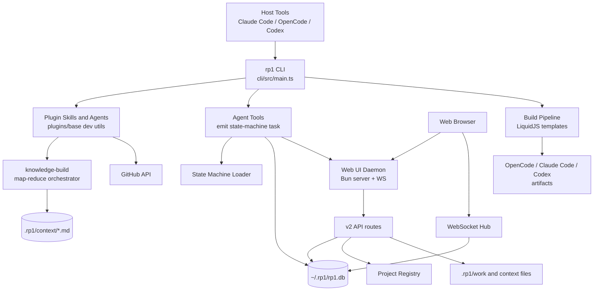

# Architecture

## System Diagram

```mermaid
flowchart TB
    Host["Host Tools\nClaude Code / OpenCode / Codex"] --> CLI["rp1 CLI\ncli/src/main.ts"]
    CLI --> Skills["Plugin Skills and Agents\nplugins/base dev utils"]
    CLI --> Tools["Agent Tools\nemit state-machine task"]
    Skills --> KBBuild["knowledge-build\nmap-reduce orchestrator"]
    KBBuild --> KBFiles[(".rp1/context/*.md")]
    Tools --> SM["State Machine Loader"]
    Tools --> EmitDB[("~/.rp1/rp1.db")]
    Tools --> Daemon["Web UI Daemon\nBun server + WS"]
    Daemon --> API["v2 API routes"]
    API --> EmitDB
    API --> Registry["Project Registry"]
    API --> Workspace[".rp1/work and context files"]
    Browser["Web Browser"] --> Daemon
    Browser --> WS["WebSocket Hub"]
    WS --> EmitDB
    Skills --> GitHub["GitHub API"]
    CLI --> BuildPipeline["Build Pipeline\nLiquidJS templates"]
    BuildPipeline --> Platforms["OpenCode / Claude Code / Codex\nartifacts"]
```

## Architecture Patterns

### Plugin Architecture
Extensible system where plugins provide skills and agents; dev depends on base, not vice versa
**Evidence**: Three plugins (base, dev, utils) with .claude-plugin/plugin.json and explicit namespace rules

### Markdown-First Workflow Authoring
Prompts are source-of-truth assets parsed by the build pipeline into platform artifacts
**Evidence**: plugins/*/skills/*/SKILL.md and plugins/*/agents/*.md define orchestration

### Map-Reduce Orchestration
Large analysis jobs fan out to parallel agents and merge results
**Evidence**: knowledge-build runs spatial pass then parallel specialist analyzers

### State-Machine-Driven Workflows
Workflow steps are validated against state machine graphs; skipped steps auto-detected, predecessors auto-completed
**Evidence**: cli/src/agent-tools/state-machine/ with Mermaid stateDiagram-v2 parsing and step validation

### Background Daemon
CLI spawns a detached Bun server for the Web UI with graceful lifecycle management
**Evidence**: cli/web-ui/src/daemon/manager.ts with PID file, health checks, version-aware restart

### Cross-Platform Build Pipeline
Single plugin source compiles to multiple host-tool formats with conditional preprocessing and lint
**Evidence**: cli/src/build/command.ts with LiquidJS templates generating OpenCode, Claude Code, and Codex artifacts

### Lazy Loading
Heavyweight modules loaded only when needed to keep common CLI path fast
**Evidence**: main.ts checks isAgentToolsCommand/isDaemonServerCommand before dynamic import

### fp-ts Functional Pipelines
Typed error propagation through async operations using Either and TaskEither
**Evidence**: TaskEither chains throughout agent-tools (emit, build, manifest)

### Eval Attestation Lifecycle
Prompt quality validated via eval suites; changes require re-attestation enforced by git hooks
**Evidence**: evals/ with promptfoo, attestation CLI, pre-push verify-evals hook

## System Layers

- **Interaction Layer**: Accepts user and host-tool entrypoints and launches CLI or daemon flows
- **Workflow Definition Layer**: Defines orchestration, prompts, and state-machine rules in markdown-first assets
- **Runtime Services Layer**: Provides deterministic agent tools for state tracking, artifacts, validation, and integration
- **Build and Distribution Layer**: Compiles plugin source into platform-specific artifacts via LiquidJS templates
- **Persistence and Knowledge Layer**: Stores local operational state and generated repository knowledge
- **Presentation Layer**: Serves dashboard, APIs, WebSocket streams, and artifact views with inline Milkdown editor
- **Evaluation Layer**: Validates prompt quality via promptfoo suites with attestation tracking

## Key Flows

### KB Generation
**Type**: synchronous map-reduce orchestration
1. User invokes /rp1-base:knowledge-build
1. Skill spawns spatial analyzer to scan repository
1. Skill spawns parallel specialist agents (architecture, modules, patterns, concept_map)
1. Skill merges results and writes .rp1/context/*.md KB files

### Workflow Event Emission
**Type**: synchronous with best-effort async notification
1. Agent calls rp1 agent-tools emit with event type and run-id
1. Emit pipeline validates step against state machine
1. Auto-detects skipped steps and auto-completes predecessors
1. Inserts event into SQLite, derives run status
1. Notifies daemon via HTTP for live WebSocket broadcast

### Plugin Build
**Type**: synchronous batch
1. Developer runs just build or rp1 build:opencode
1. Build pipeline discovers plugins in plugins/ directory
1. Parses SKILL.md and agent markdown with frontmatter extraction
1. Applies platform-conditional preprocessing
1. Renders through LiquidJS templates per platform
1. Validates and lints artifacts, writes to dist/

### Web UI Live Updates
**Type**: event-driven streaming
1. Browser connects via WebSocket to daemon on port 7710
1. Daemon subscribes client to project events
1. Agent tools emit events to SQLite and notify daemon
1. Daemon broadcasts typed event envelopes to subscribed clients
1. File watcher pool detects .rp1/work changes and pushes updates

### Daemon Lifecycle
**Type**: background process management
1. CLI calls ensureDaemon() which reads PID file
1. If no daemon running, spawns detached rp1 _daemon-server process
1. Writes PID file with port and PID
1. Polls health endpoint until responsive
1. Version-aware: restarts daemon on version mismatch or dev builds

## External Integrations

- **Bun** (runtime): Primary runtime for CLI, server, packaging, binary compilation, and test runner
- **SQLite** (database): Embedded local persistence for runs, events, artifacts, annotations, and tasks
- **GitHub API** (REST API): PR review operations, comment management, and reactions via @octokit/rest
- **React + Vite** (frontend framework): Frontend runtime and build for the Web UI dashboard
- **GoReleaser** (build and release): Cross-platform binary compilation and release automation
- **Release Please** (release automation): Automated semver releases with coordinated version bumps
- **GitHub Actions CI** (CI/CD): Lint, typecheck, test, plugin-dist verification, and eval attestation checks
- **MkDocs Material** (documentation): Published documentation site at rp1.run
- **promptfoo** (testing): Eval harness for prompt quality testing with attestation lifecycle
- **Lefthook** (developer tooling): Git hooks for pre-commit lint/format and pre-push typecheck and attestation verification

## Deployment

**Type**: Plugin System + Standalone Binary
**Environment**: Local CLI (Claude Code, OpenCode, Codex host agents)
**Distribution**: GitHub releases via GoReleaser with Homebrew cask, Scoop bucket, and curl installer. npm publish for CLI package. Claude Code marketplace for plugins.
**Targets**: darwin-arm64, darwin-x64, linux-arm64, linux-x64, windows-x64
