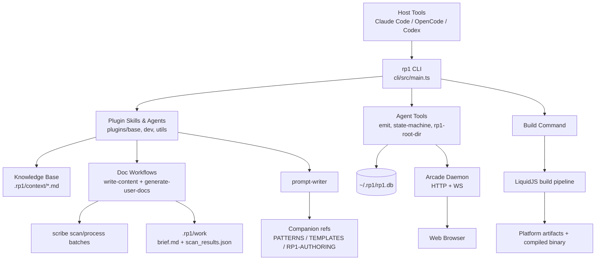

# System Architecture

**Project**: rp1
**Architecture Pattern**: Plugin-based CLI with tracked workflow state, artifact-backed handoffs, and multi-platform prompt compilation
**Last Updated**: 2026-04-04

## High-Level Architecture

```mermaid
flowchart TB
    Host["Host Tools<br/>Claude Code / OpenCode / Codex"] --> CLI["rp1 CLI<br/>cli/src/main.ts"]
    CLI --> Skills["Plugin Skills & Agents<br/>plugins/base, dev, utils"]
    CLI --> AgentTools["Agent Tools<br/>emit, state-machine, rp1-root-dir"]
    CLI --> Build["Build Command"]
    AgentTools --> EventDB[("~/.rp1/rp1.db")]
    AgentTools --> Daemon["Arcade Daemon<br/>HTTP + WS"]
    Daemon --> Browser["Web Browser"]
    Skills --> KB["Knowledge Base<br/>.rp1/context/*.md"]
    Skills --> DocFlows["Doc Workflows<br/>write-content + generate-user-docs"]
    DocFlows --> Scribe["scribe scan/process batches"]
    DocFlows --> Work[".rp1/work<br/>brief.md + scan_results.json"]
    Skills --> PromptWriter["prompt-writer"]
    PromptWriter --> Refs["Companion refs<br/>PATTERNS / TEMPLATES / RP1-AUTHORING"]
    Build --> Pipeline["LiquidJS build pipeline"]
    Pipeline --> Artifacts["Platform artifacts + compiled binary"]
```

## Architectural Patterns

| Pattern | Meaning | Current Evidence |
|---------|---------|------------------|
| Plugin Architecture | The repo stays organized as plugin-scoped capability packs, with base owning end-user workflows and utils owning reusable authoring tooling. | `write-content` and `generate-user-docs` remain in `plugins/base`; prompt authoring assets remain in `plugins/utils`. |
| Event-Sourced Runtime State | Runtime progress is tracked as events, while larger phase payloads live in durable files outside the event stream. | Frontier workflows still standardize on `rp1 agent-tools emit` with `status_change`, `waiting_for_user`, and `artifact_registered`. |
| Cross-Platform Build Pipeline | Markdown workflow specs remain the source of truth and compile into host-specific artifacts through the shared build pipeline. | `cli/src/main.ts` now exposes `buildCommand`; `RP1-AUTHORING.md` still documents build-time injection and semantic platform tags. |
| State-Machine-Driven Workflows | Long-running skills are modeled as explicit state machines with named phases, user gates, and terminal status emission. | `write-content`, `generate-user-docs`, and `prompt-writer` each declare `stateDiagram-v2` phases and emit explicit step transitions. |
| Map-Reduce Agent Orchestration | Heavy analysis and editing work fans out to narrow workers and rejoins through a parent orchestrator. | `generate-user-docs` batches docs in groups of five, dispatches background `scribe` workers, and aggregates JSON responses. |
| Artifact-Backed Workflow Handoffs | Multi-phase workflows bridge context through durable files in `.rp1/work/` and then register those files for dashboard visibility. | `write-content` persists `brief.md`; `generate-user-docs` persists `scan_results.json`; prompt-authoring rules codify `artifact_registered` and `storageRoot`. |
| Progressive-Disclosure Reference Packs | Some skills pair a thin executable prompt with local reference packs so deeper guidance is loaded only when needed. | `prompt-writer` now loads `PATTERNS.md`, `TEMPLATES.md`, and `RP1-AUTHORING.md` on demand. |
| fp-ts Functional Pipelines | The CLI functional core remains organized around fp-ts-style error and task pipelines. | No contradicting evidence appeared in the frontier. |
| Catalog-as-Code with Checksum Guards | Generated skill and agent catalogs remain governed by checksum-guarded quality gates. | No contradicting evidence appeared in the frontier. |
| Build-Time Asset Embedding | Platform artifacts and configuration assets remain embedded into the compiled binary for single-executable distribution. | No contradicting evidence appeared in the frontier. |
| Git Worktree-Aware Project Resolution | Project resolution derives shared KB and work paths from repository identity rather than session-local env vars. | `RP1-AUTHORING.md` still standardizes `rp1-root-dir` and worktree-aware path discovery. |
| Prompt Attestation with Content-Addressable Hashing | Prompt quality validation and freshness enforcement remain part of the architecture. | No contradicting evidence appeared in the frontier. |
| Session Hooks with Platform Adaptation | Host-specific hooks still sit at the session boundary to start supporting services and adapt behavior per platform. | No contradicting evidence appeared in the frontier. |

## Layers

| Layer | Purpose | Components |
|-------|---------|------------|
| Interaction | Host-tool entry points and user-visible CLI commands | `cli/src/main.ts`, `cli/src/commands/` |
| Workflow Definition | Markdown-defined skills, agents, and skill-local reference packs | `plugins/base/`, `plugins/dev/`, `plugins/utils/`, `plugins/utils/skills/prompt-writer/*.md` |
| Runtime Services | Event emission, state validation, directory resolution, and agent-tool primitives | `cli/src/agent-tools/`, `cli/src/lib/`, `cli/shared/` |
| Build & Distribution | Compile workflow specs into host-specific artifacts and shipped binaries | `cli/src/build/`, `cli/scripts/`, `scripts/` |
| Presentation | Arcade dashboard SPA, REST APIs, and WebSocket updates | `cli/web-ui/src/app/`, `cli/web-ui/src/server/` |
| Persistence | Store event history, KB snapshots, and durable workflow artifacts | `~/.rp1/rp1.db`, `.rp1/context/`, `.rp1/work/` |
| Evaluation | Prompt attestation and eval execution | `evals/` |
| Quality Gates | Catalog, lint, format, and attestation enforcement | `lefthook.yml`, `scripts/check-catalog.sh`, `cli/biome.json` |

## Key Interaction Flows

### Event Pipeline
Skill or agent emits a workflow event, state-machine validation checks the step transition, the runtime persists the event to SQLite, and the daemon broadcasts updates to Arcade via HTTP and WebSocket surfaces.

### KB Generation
The KB orchestrator selects `FULL`, `INCREMENTAL`, or `FEATURE_LEARNING`, runs spatial analysis, fans out specialist KB agents, reconciles each section against prior context, and writes `.rp1/context/*.md` plus `state.json`.

### Documentation Sync
`generate-user-docs` discovers user-facing docs, infers style, validates KB freshness, scans files in parallel via `scribe`, persists `scan_results.json`, asks once for approval, then processes updates in bounded batches.

### Content Writing
`write-content` normalizes the request, creates `.rp1/work/content/.../brief.md`, asks only blocking clarification questions, drafts and self-reviews against the brief, then registers final artifacts.

### Prompt Authoring
`prompt-writer` classifies the target, loads companion references only when needed, composes or rewrites the prompt using templates and reusable patterns, validates rp1 conventions, and emits completion state.

### Plugin Build Pipeline
The top-level build command parses prompt sources, applies LiquidJS preprocessing and semantic tag rendering, generates host-specific artifacts for Claude Code, OpenCode, and Codex, and bundles assets into the compiled binary.

### Feedback Lifecycle
Users annotate artifacts in Arcade, the runtime persists the feedback in SQLite, WebSocket broadcasts update connected clients, and agents reply, resolve, or accept edits through feedback tooling.

### Project Discovery
`rp1-root-dir` walks up from the current working directory, resolves project identity from `.rp1/project_id`, checks worktree metadata when needed, and returns project, KB, and work roots.

## Integrations

| Service | Purpose | Type |
|---------|---------|------|
| Bun | CLI runtime, HTTP/WS server, binary compilation, and tests | Runtime |
| `bun:sqlite` | Persist events, runs, artifacts, annotations, and tasks | Embedded DB |
| Git CLI | Detect KB staleness, compute diffs, and resolve repo context | Version control |
| GitHub API (`@octokit/rest`) | PR review, comments, and reactions | REST API |
| React + Vite | Arcade dashboard SPA | Frontend |
| LiquidJS | Render platform-specific prompt artifacts | Build |
| chokidar | Watch `.rp1/work` and `.rp1/context` for live updates | Runtime |
| promptfoo | Run prompt quality evaluations | Testing |
| Release Please | Drive semver and release automation | CI/CD |
| GitHub Actions | Run CI, release, and automation jobs | CI/CD |
| Lefthook | Enforce local quality gates | Dev tooling |
| Biome | Linting and formatting for TS/TSX | Dev tooling |
| MkDocs Material | Publish docs at `rp1.run` | Documentation |
| Docker | Provide cross-platform testing environments | Dev tooling |

## Deployment

- **Type**: Single-executable CLI with embedded assets plus a background daemon
- **Targets**: `darwin-arm64`, `darwin-x64`, `linux-arm64`, `linux-x64`, `windows-x64`
- **Distribution**: GitHub releases via GoReleaser plus marketplace artifacts
- **Daemon**: Background Bun HTTP+WS server on port `7710` with PID-file lifecycle and version-aware restart
- **Local Build Surface**: Top-level `rp1 build` entrypoint now exposes the build pipeline directly

## Cross-References

- **Surface behavior**: See [interaction-model.md](interaction-model.md)
- **Component inventory**: See [modules.md](modules.md)
- **Code conventions**: See [patterns.md](patterns.md)
- **Domain terminology**: See [concept_map.md](concept_map.md)
