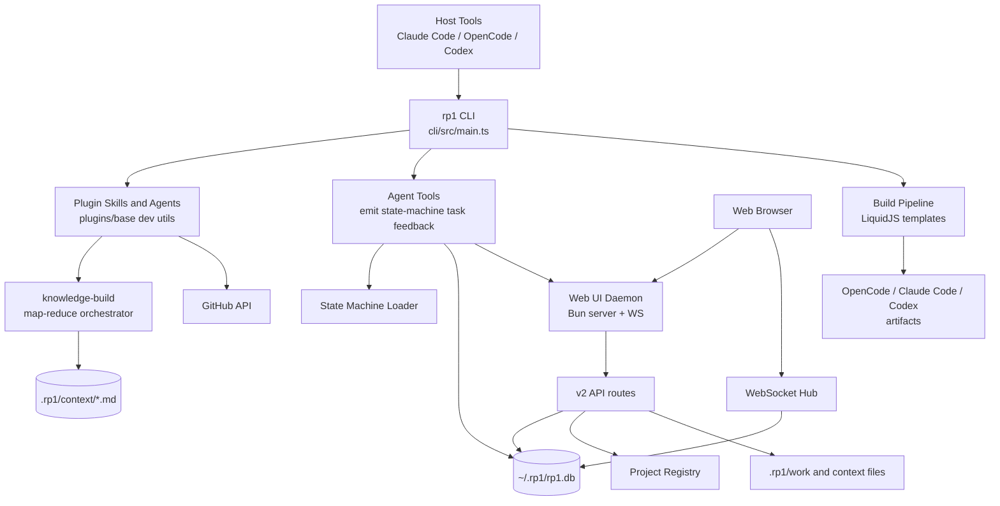
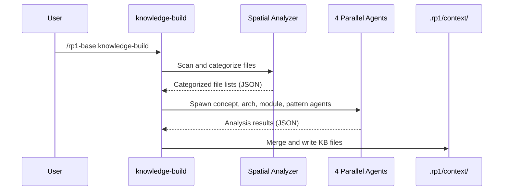

# System Architecture

**Project**: rp1
**Architecture Pattern**: Plugin-based CLI + Event-Sourced Dashboard + Map-Reduce Agent Orchestration
**Last Updated**: 2026-03-25

## High-Level Architecture

```mermaid
flowchart TB
    Host["Host Tools\nClaude Code / OpenCode / Codex"] --> CLI["rp1 CLI\ncli/src/main.ts"]
    CLI --> Skills["Plugin Skills and Agents\nplugins/base dev utils"]
    CLI --> Tools["Agent Tools\nemit state-machine task feedback"]
    Skills --> KBBuild["knowledge-build\nmap-reduce orchestrator"]
    KBBuild --> KBFiles[(".rp1/context/*.md")]
    Tools --> SM["State Machine Loader"]
    Tools --> EmitDB[("~/.rp1/rp1.db")]
    Tools --> Daemon["Web UI Daemon\nBun server + WS"]
    Daemon --> API["v2 API routes"]
    API --> EmitDB
    API --> Registry["Project Registry"]
    API --> Workspace[".rp1/work and context files"]
    Browser["Web Browser"] --> Daemon
    Browser --> WS["WebSocket Hub"]
    WS --> EmitDB
    Skills --> GitHub["GitHub API"]
    CLI --> BuildPipeline["Build Pipeline\nLiquidJS templates"]
    BuildPipeline --> Platforms["OpenCode / Claude Code / Codex\nartifacts"]
```

## Architectural Patterns

### Plugin Architecture
Three plugins (base, dev, utils) with `.claude-plugin/plugin.json` manifests, namespace rules, and explicit dependency direction (dev depends on base, not vice versa). Each plugin provides skills, agents, and hooks compiled to platform-specific artifacts.

### Markdown-First Workflow Authoring
Prompts authored as markdown with YAML frontmatter, compiled to Claude Code, OpenCode, and Codex formats via LiquidJS templates with conditional preprocessing.

### Map-Reduce Orchestration
Large analysis jobs fan out to parallel specialist agents and merge results. Used for KB generation (spatial analyzer + 4 parallel agents), PR review (diff splitting + parallel sub-reviewers + synthesizer), and deep research.

### State-Machine-Driven Workflows
Workflow orchestration via declarative Mermaid stateDiagram-v2 definitions parsed into typed graph models. Steps validated against transitions at runtime with auto-completion of predecessors and sub-agent step namespacing.

### Cross-Platform Build Pipeline
Single plugin source compiles to Claude Code, OpenCode, and Codex formats via LiquidJS templates with platform registries and conditional preprocessing.

### Event-Sourced State with Replay
Events inserted into SQLite with sequential IDs. Reconnecting WebSocket clients receive missed events or a state snapshot depending on gap size (up to 100 events replayed).

### fp-ts Functional Pipelines
Typed error propagation via `Either<CLIError, A>` and `TaskEither<CLIError, A>` throughout agent-tools, build, install, and server modules. Re-exported via `cli/shared/fp.ts` facade.

## System Layers

| Layer | Purpose | Key Components |
|-------|---------|----------------|
| Interaction | User and host-tool entry points | `cli/src/main.ts`, `cli/src/commands/` |
| Workflow Definition | Orchestration prompts, state machines, skills | `plugins/base/`, `plugins/dev/`, `plugins/utils/` |
| Runtime Services | Agent tools, state tracking, validation | `cli/src/agent-tools/`, `cli/src/lib/` |
| Build & Distribution | Plugin compilation, binary packaging | `cli/src/build/`, `cli/scripts/`, `scripts/` |
| Presentation | Dashboard SPA, REST APIs, WebSocket | `cli/web-ui/src/app/`, `cli/web-ui/src/server/` |
| Persistence | Local state, KB, project registry | `.rp1/context/`, `~/.rp1/rp1.db`, `.rp1/work/` |
| Evaluation | Prompt quality validation, attestation | `evals/` |

## Key Data Flows

### KB Generation Flow

```mermaid
sequenceDiagram
    participant User
    participant Orchestrator as knowledge-build
    participant Spatial as Spatial Analyzer
    participant Agents as 4 Parallel Agents
    participant KB as .rp1/context/

    User->>Orchestrator: /rp1-base:knowledge-build
    Orchestrator->>Spatial: Scan and categorize files
    Spatial-->>Orchestrator: Categorized file lists (JSON)
    Orchestrator->>Agents: Spawn concept, arch, module, pattern agents
    Agents-->>Orchestrator: Analysis results (JSON)
    Orchestrator->>KB: Merge and write KB files
```

### Workflow Event Pipeline
1. Agent calls `rp1 agent-tools emit` with workflow, step, and run-id
2. Validate step against state machine graph; auto-complete predecessor steps
3. Insert event into SQLite with monotonic ID
4. Derive run status from event history
5. Notify daemon via HTTP POST `/api/v2/status/notify`
6. Daemon broadcasts typed event envelope via WebSocket to subscribed clients

### Web UI Live Updates
1. Browser connects via WebSocket to daemon (port 7710) with optional lastEventId
2. Daemon replays missed events (up to 100) or sends state snapshot
3. FileWatcherPool watches `.rp1/work` and `.rp1/context` with chokidar
4. File changes debounced and broadcast as file:changed or tree:changed messages
5. Agent tools emit events to SQLite and notify daemon via HTTP

### Feedback Lifecycle
1. User annotates artifacts in Arcade dashboard (create, reply, resolve)
2. Annotations stored in SQLite, broadcast via WebSocket
3. Agent calls `rp1 agent-tools feedback read --run-id <id>`
4. Returns open annotations and pending file edits with summary counts
5. Agent processes feedback, then resolves/replies/accepts via agent-tools

## Integration Points

| Service | Purpose | Integration |
|---------|---------|-------------|
| Bun | Runtime, HTTP/WS server, binary compilation, test runner | Runtime |
| SQLite (bun:sqlite) | Events, runs, artifacts, annotations, tasks | Embedded DB, WAL mode |
| GitHub API (@octokit) | PR review, comment management, reactions | REST API |
| React + Vite | Frontend dashboard SPA | Dev port 6810 -> backend 6710 |
| LiquidJS | Multi-platform artifact generation from SKILL.md | Build pipeline |
| GoReleaser | Cross-platform binary compilation | darwin/linux/windows |
| Release Please | Automated semver with coordinated version bumps | CI/CD |
| promptfoo | Eval harness for prompt quality testing | Testing |
| Lefthook | Git hooks for pre-commit lint/format/typecheck | Dev tooling |
| chokidar | File watching for .rp1/work and .rp1/context | Runtime |
| MkDocs Material | Documentation site at rp1.run | Cloudflare Pages |

## Deployment

- **Type**: Plugin System + Standalone Binary + Background Daemon
- **Environment**: Local CLI hosted by Claude Code, OpenCode, or Codex agents
- **Distribution**: GitHub releases via GoReleaser (Homebrew, Scoop, curl installer, npm, Claude Code marketplace)
- **Targets**: darwin-arm64, darwin-x64, linux-arm64, linux-x64, windows-x64
- **Versioning**: Unified semver via release-please across CLI and all plugins
- **Daemon**: Background Bun HTTP+WS server on port 7710 with PID-file lifecycle, version-aware restart, LRU file watcher pool (max 10 projects)
