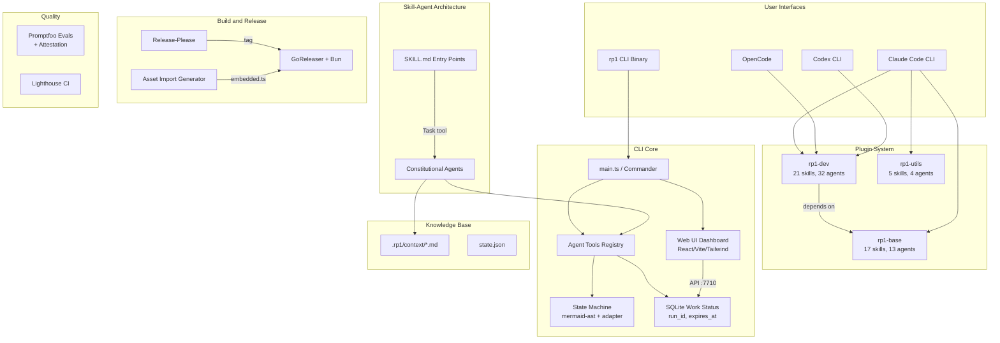
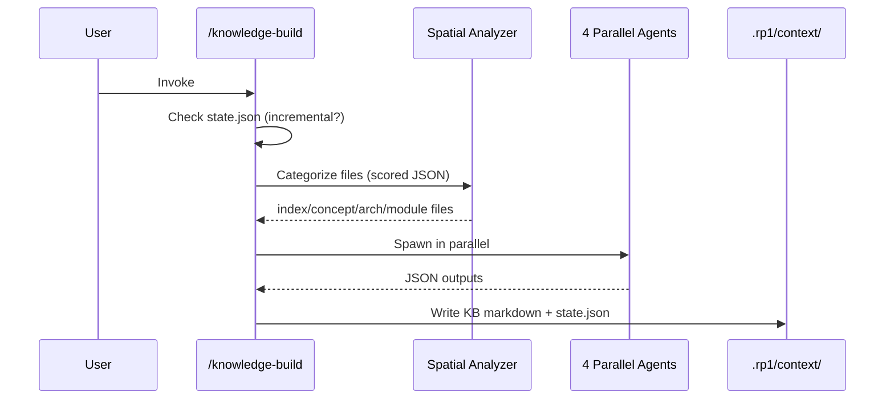
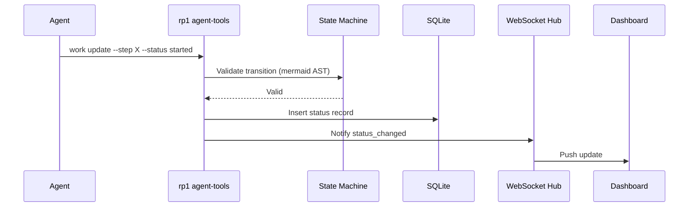

# System Architecture

**Project**: rp1
**Architecture Pattern**: Plugin-based Multi-Platform CLI with Constitutional AI Agents
**Last Updated**: 2026-03-09

## High-Level Architecture

```mermaid
graph TB
    subgraph "User Interfaces"
        CC[Claude Code CLI]
        OC[OpenCode]
        CX[Codex CLI]
        CLI[rp1 CLI Binary]
    end

    subgraph "Plugin System"
        Base["rp1-base\n17 skills, 13 agents"]
        Dev["rp1-dev\n21 skills, 32 agents"]
        Utils["rp1-utils\n5 skills, 4 agents"]
        Dev -->|depends on| Base
    end

    subgraph "Skill-Agent Architecture"
        Skills[SKILL.md Entry Points]
        Agents[Constitutional Agents]
        Skills -->|Task tool| Agents
    end

    subgraph "CLI Core"
        Main[main.ts / Commander]
        AgentTools[Agent Tools Registry]
        SM["State Machine\nmermaid-ast + adapter"]
        WebUI["Web UI Dashboard\nReact/Vite/Tailwind"]
        SQLite["SQLite Work Status\nrun_id, expires_at"]
        Main --> AgentTools
        Main --> WebUI
        AgentTools --> SQLite
        AgentTools --> SM
    end

    subgraph "Knowledge Base"
        KB[".rp1/context/*.md"]
        State[state.json]
    end

    subgraph "Build and Release"
        RP[Release-Please]
        GR[GoReleaser + Bun]
        AssetGen[Asset Import Generator]
        RP -->|tag| GR
        AssetGen -->|embedded.ts| GR
    end

    subgraph "Quality"
        Evals["Promptfoo Evals\n+ Attestation"]
        LHCI[Lighthouse CI]
    end

    CC --> Base
    CC --> Dev
    CC --> Utils
    OC --> Dev
    CX --> Dev
    CLI --> Main
    Agents --> KB
    Agents --> AgentTools
    WebUI -->|API :7710| SQLite
```

## Architectural Layers

| Layer | Purpose | Key Components |
|-------|---------|----------------|
| Interface (Skills) | User-facing entry points via slash commands | `plugins/*/skills/*/SKILL.md` |
| Agent Layer | Autonomous constitutional agents for single-pass execution | `plugins/*/agents/*.md` |
| CLI Core | Commander-based CLI with agent-tools registry and build pipeline | `cli/src/main.ts`, `cli/src/commands/`, `cli/src/agent-tools/` |
| Web UI | React/Vite/Tailwind real-time dashboard with WebSocket on port 7710 | `cli/web-ui/src/` |
| Data Layer | SQLite work status tracking with WAL mode, run isolation, TTL expiry | `cli/src/agent-tools/work/`, `~/.rp1/status.db` |
| Knowledge Layer | Persistent codebase documentation generated by KB agents | `.rp1/context/*.md`, `.rp1/context/state.json` |
| Build/Release | CI/CD, binary compilation, asset bundling, multi-channel distribution | `.github/workflows/`, `.goreleaser.yml`, `scripts/` |
| Evaluation | Promptfoo evals with content-addressable attestation | `evals/src/` |
| Shared Packages | Reusable internal libraries | `packages/catppuccin-mermaid/`, `cli/shared/` |

## Architectural Patterns

- **Plugin Architecture**: Three plugins (base, dev, utils) with `.claude-plugin` manifests; dev depends on base
- **Skill-Agent Delegation**: Skills are user-facing slash commands that delegate execution to autonomous markdown-defined agents
- **Map-Reduce Workflows**: Complex tasks split into parallel agent invocations with results merged by orchestrator
- **Builder-Reviewer Loop**: Builder agent produces work, reviewer validates with single-retry on failure
- **Constitutional Prompting**: Agents are declarative markdown specs constraining AI behavior through structural rules
- **Multi-Platform Distribution**: Single codebase generates platform-specific artifacts for Claude Code, OpenCode, and Codex
- **Single-File Executable**: GoReleaser + `bun --compile` produces standalone binaries with embedded web-ui and artifacts

## Data Flows

### KB Generation (Map-Reduce)

```mermaid
sequenceDiagram
    participant User
    participant Orchestrator as /knowledge-build
    participant Spatial as Spatial Analyzer
    participant Agents as 4 Parallel Agents
    participant FS as .rp1/context/

    User->>Orchestrator: Invoke
    Orchestrator->>Orchestrator: Check state.json (incremental?)
    Orchestrator->>Spatial: Categorize files (scored JSON)
    Spatial-->>Orchestrator: index/concept/arch/module files
    Orchestrator->>Agents: Spawn in parallel
    Agents-->>Orchestrator: JSON outputs
    Orchestrator->>FS: Write KB markdown + state.json
```

### Work Status Tracking

```mermaid
sequenceDiagram
    participant Agent
    participant CLI as rp1 agent-tools
    participant SM as State Machine
    participant DB as SQLite
    participant WS as WebSocket Hub
    participant UI as Dashboard

    Agent->>CLI: work update --step X --status started
    CLI->>SM: Validate transition (mermaid AST)
    SM-->>CLI: Valid
    CLI->>DB: Insert status record
    CLI->>WS: Notify status_changed
    WS->>UI: Push update
```

### Release Pipeline
1. Conventional commits merged to main
2. Release-Please maintains rolling release PR with changelog
3. Merging release PR creates git tag
4. GoReleaser triggered: generates asset bundle, compiles 5 platform binaries
5. OpenCode artifacts built and uploaded to GitHub release
6. Cloudflare Pages deployment for docs
7. Lighthouse CI audits deployed docs site

## Integration Points

| Service | Purpose | Type |
|---------|---------|------|
| GitHub Actions | CI/CD: lint/test, PR validation, release, binary builds, AI PR review | Workflow automation |
| GoReleaser v2 | Cross-platform binary compilation (darwin/linux/windows, arm64/x64) | Build automation |
| Release-Please | Semantic versioning from conventional commits | Version management |
| Cloudflare Pages | Docs hosting at rp1.run (MkDocs Material) | Static hosting |
| Promptfoo | Eval framework for agent prompt testing with attestation | Testing framework |
| SQLite (Bun native) | Work status tracking with WAL mode and TTL-based expiry | Embedded database |
| Lefthook | Git hooks: pre-commit (lint, format), pre-push (typecheck, test) | Developer tooling |
| Claude Code Plugins | Primary distribution channel via marketplace | Plugin marketplace |
| OpenCode | Secondary platform via tarball artifacts | Platform integration |
| Codex CLI | Third platform target (min_version 0.110.0, uses AGENTS.md) | Platform integration |
| Lighthouse CI | Performance/accessibility auditing for docs site | Quality assurance |

## Deployment Architecture

- **Distribution**: Multi-channel (Claude Code marketplace, OpenCode tarballs, GoReleaser binaries, Homebrew, Scoop, npm)
- **Target Platforms**: darwin-arm64, darwin-x64, linux-arm64, linux-x64, windows-x64
- **Installer**: `curl -fsSL https://rp1.run/install.sh | sh`
- **Docs**: Cloudflare Pages at rp1.run (MkDocs Material)
- **Current Version**: 0.5.1
