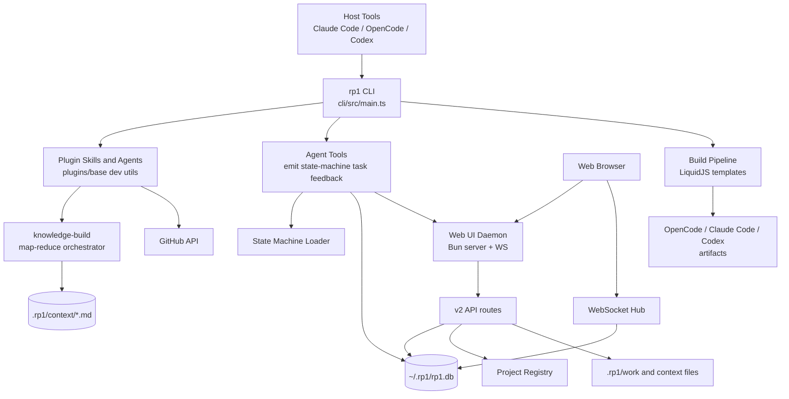

# System Architecture

**Project**: rp1
**Architecture Pattern**: Plugin-based CLI + Daemon + SPA Dashboard
**Last Updated**: 2026-03-23

## High-Level Architecture


```mermaid
flowchart TB
    Host["Host Tools\nClaude Code / OpenCode / Codex"] --> CLI["rp1 CLI\ncli/src/main.ts"]
    CLI --> Skills["Plugin Skills and Agents\nplugins/base dev utils"]
    CLI --> Tools["Agent Tools\nemit state-machine task feedback"]
    Skills --> KBBuild["knowledge-build\nmap-reduce orchestrator"]
    KBBuild --> KBFiles[(".rp1/context/*.md")]
    Tools --> SM["State Machine Loader"]
    Tools --> EmitDB[("~/.rp1/rp1.db")]
    Tools --> Daemon["Web UI Daemon\nBun server + WS"]
    Daemon --> API["v2 API routes"]
    API --> EmitDB
    API --> Registry["Project Registry"]
    API --> Workspace[".rp1/work and context files"]
    Browser["Web Browser"] --> Daemon
    Browser --> WS["WebSocket Hub"]
    WS --> EmitDB
    Skills --> GitHub["GitHub API"]
    CLI --> BuildPipeline["Build Pipeline\nLiquidJS templates"]
    BuildPipeline --> Platforms["OpenCode / Claude Code / Codex\nartifacts"]
```

## Architectural Layers

| Layer | Purpose | Key Components |
|-------|---------|----------------|
| Interaction | User/host-tool entry, CLI launch | `cli/src/main.ts`, `cli/src/commands/` |
| Workflow Definition | Orchestration prompts, state machines | `plugins/base/agents/`, `plugins/dev/agents/` |
| Runtime Services | Agent tools, state tracking, validation, feedback lifecycle | `cli/src/agent-tools/`, `cli/src/lib/` |
| Build & Distribution | Plugin compilation to platform artifacts | `cli/src/build/`, `scripts/build.sh`, `.goreleaser.yml` |
| Persistence & Knowledge | Local state and generated KB | `.rp1/context/*.md`, `~/.rp1/rp1.db`, `.rp1/work/` |
| Presentation | Dashboard, APIs, WebSocket streams | `cli/web-ui/` |
| Evaluation | Prompt quality validation, attestation | `evals/` |

## Key Architectural Patterns

### Plugin Architecture
Three plugins (base, dev, utils) with `.claude-plugin/plugin.json` manifests and explicit namespace rules. Dev depends on base, not vice versa.

### Markdown-First Workflow Authoring
Prompts in SKILL.md and agent.md are source-of-truth assets parsed by the build pipeline into platform artifacts via LiquidJS templates.

### Map-Reduce Orchestration
Large analysis jobs (KB generation, PR review) fan out to parallel specialist agents and merge results. Spatial analyzer categorizes files, then 4+ agents process in parallel.

### State-Machine-Driven Workflows
Mermaid stateDiagram-v2 parsed into typed graph models. Steps validated against transitions; skipped steps auto-detected; predecessors auto-completed. Agents embed execution diagrams inline for self-documenting orchestration.

### Cross-Platform Build Pipeline
Single plugin source compiles to Claude Code, OpenCode, and Codex formats via LiquidJS templates with conditional preprocessing and lint.

### Background Daemon
CLI spawns a detached Bun server for the Web UI with PID-file lifecycle, health checks, and version-aware restart.

### Lazy Loading
`main.ts` checks `isAgentToolsCommand`/`isDaemonServerCommand` before dynamic import to keep common CLI path fast.

### fp-ts Functional Pipelines
Typed error propagation via `Either<CLIError, A>` and `TaskEither<CLIError, A>` throughout agent-tools, build, and install.

### Protocol-Aware WebSocket
WebSocket provider auto-selects `wss://` or `ws://` based on page protocol, enabling secure connections when the dashboard is served over HTTPS.

## Data Flow

### KB Generation
```
User invokes /rp1-base:knowledge-build
  -> Spatial analyzer scans repository
  -> 4 parallel agents (architecture, modules, patterns, concepts)
  -> Orchestrator merges results
  -> Writes .rp1/context/*.md
```

### Workflow Event Pipeline
```
Agent calls rp1 agent-tools emit
  -> Validate step against state machine
  -> Auto-complete predecessor steps
  -> Insert event into SQLite
  -> Derive run status
  -> Notify daemon via HTTP for WebSocket broadcast
```

### Plugin Build Pipeline
```
Developer runs just build or rp1 build
  -> Discover plugins in plugins/ directory
  -> Parse SKILL.md/agent.md with frontmatter extraction
  -> Apply platform-conditional preprocessing
  -> Render through LiquidJS templates per platform
  -> Validate and lint artifacts
  -> Write to dist/
```

### Web UI Live Updates
```
Browser connects via WebSocket to daemon (port 7710)
  -> Daemon subscribes client to project events
  -> Agent tools emit events to SQLite and notify daemon
  -> Daemon broadcasts typed event envelopes
  -> File watcher pool detects .rp1/work changes and pushes updates
```

### Feedback Lifecycle
```
User annotates artifacts in the Arcade dashboard
  -> Agent calls rp1 agent-tools feedback read --run-id <id>
  -> Returns open annotations and pending file edits with summary counts
  -> Agent processes feedback, then resolves/replies/accepts
  -> Resolution and replies written to SQLite, broadcast via WebSocket
```

## Integration Points

| Service | Purpose | Type |
|---------|---------|------|
| Bun | Runtime for CLI, server, packaging, binary compilation, tests | Runtime |
| SQLite (bun:sqlite) | Embedded persistence for runs, events, artifacts, annotations, tasks | Database |
| GitHub API (@octokit/rest) | PR review operations, comment management, reactions | REST API |
| React + Vite | Frontend runtime and build for Web UI dashboard (dev server port 6810) | Frontend |
| GoReleaser | Cross-platform binary compilation (darwin/linux/windows, arm64/x64) | Release |
| Release Please | Automated semver releases with coordinated version bumps | Release |
| GitHub Actions CI | 5-job pipeline: check, test, plugin-dist, catalog, attestation | CI/CD |
| MkDocs Material | Documentation site at rp1.run via Cloudflare Pages | Docs |
| promptfoo | Eval harness for prompt quality testing with attestation | Testing |
| Lefthook | Git hooks for pre-commit lint/format and pre-push typecheck | Dev tooling |
| Cloudflare Pages | Documentation hosting with deploy hooks on release | Hosting |
| LiquidJS | Template engine for multi-platform artifact generation | Build |

## Deployment Architecture

**Type**: Plugin System + Standalone Binary
**Environment**: Local CLI (Claude Code, OpenCode, Codex host agents)
**Distribution**: GitHub releases via GoReleaser with Homebrew cask, Scoop bucket, curl installer, npm publish, Claude Code marketplace
**Targets**: darwin-arm64, darwin-x64, linux-arm64, linux-x64, windows-x64
**Versioning**: Unified semver via release-please; single version (0.6.0) across CLI and all plugins

## Cross-References
- **Module Breakdown**: See [modules.md](modules.md)
- **Implementation Patterns**: See [patterns.md](patterns.md)
- **Domain Concepts**: See [concept_map.md](concept_map.md)
