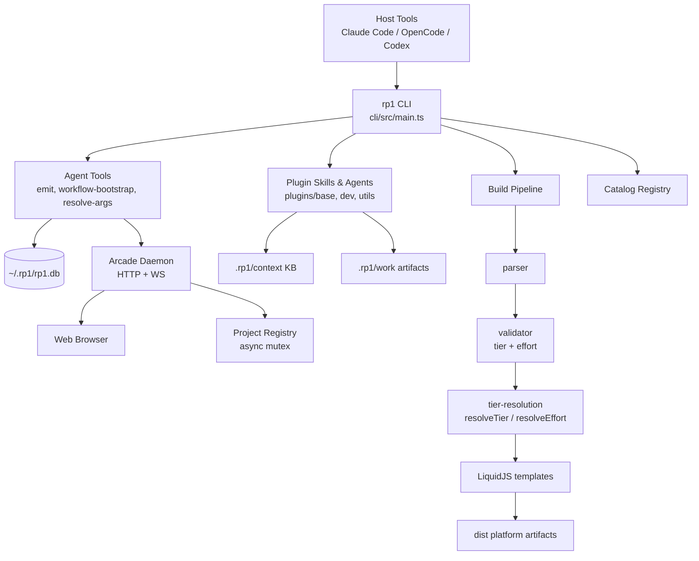

# System Architecture

**Project**: rp1
**Architecture Pattern**: Plugin-based CLI with tracked workflow state, artifact-backed handoffs, and multi-platform prompt compilation
**Last Updated**: 2026-06-30

rp1 is a Bun/TypeScript CLI + plugin monorepo that compiles markdown-defined skills and agents into host-specific artifacts, tracks workflow runtime state as events, and serves a live Arcade dashboard.

## High-Level Architecture

```mermaid
flowchart TB
    Host["Host Tools<br/>Claude Code / OpenCode / Codex"] --> CLI["rp1 CLI<br/>cli/src/main.ts"]
    CLI --> Skills["Plugin Skills & Agents<br/>plugins/base, dev, utils"]
    CLI --> AgentTools["Agent Tools<br/>emit, workflow-bootstrap, resolve-args"]
    CLI --> Build["Build Pipeline"]
    CLI --> Catalog["Catalog Registry"]
    AgentTools --> EventDB[("~/.rp1/rp1.db")]
    AgentTools --> Daemon["Arcade Daemon<br/>HTTP + WS"]
    Daemon --> Browser["Web Browser"]
    Daemon --> Registry["Project Registry<br/>async mutex"]
    Skills --> KB[".rp1/context KB"]
    Skills --> Work[".rp1/work artifacts"]
    Build --> Parse["parser"]
    Parse --> Validate["validator<br/>tier + effort"]
    Validate --> TierRes["tier-resolution<br/>resolveTier / resolveEffort"]
    TierRes --> Render["LiquidJS templates"]
    Render --> Artifacts["dist platform artifacts"]
```

## Architectural Patterns

- **Cross-Platform Build Pipeline** — single-source agent/skill markdown compiles to 6 targets (Claude Code, OpenCode, Codex, Copilot, Antigravity, Gemini) via data-driven `PlatformDefinition` configs + LiquidJS templates.
- **Additive-Field Tier Resolution** — agent `model` tier (deep/standard/fast/inherit) and `effort` (low–max) are resolved at build time from abstract aliases to platform-specific model IDs and effort field names, propagated as additive fields through the template context so templates stay format-only. (New in tiered-models-effort.)
- **Event-Sourced Runtime State** — all workflow state changes are `rp1 agent-tools emit` events persisted to SQLite and broadcast over WebSocket.
- **State-Machine-Driven Workflows** — skills declare `stateDiagram-v2` phases; steps are validated against the graph at emit time.
- **Map-Reduce Agent Orchestration** — heavy analysis fans out to narrow workers and rejoins through a parent orchestrator (KB build, PR review).
- **Deterministic Workflow Bootstrap** — `workflow-bootstrap` resolves directories, arguments, and run identity atomically; skills declare `runPolicy` + `identityArgs`.
- **Artifact-Backed Handoffs** — inter-phase state persists as markdown/JSON under `.rp1/work/`.
- **Catalog-as-Code** — the skill/agent catalog is derived from source frontmatter at build time.
- **Worktree-Aware Code Editing** — agents distinguish `codeRoot` (edit target, worktree-aware) from `workRoot`/`kbRoot` (canonical `.rp1/`).

## Layers

| Layer | Purpose | Components |
|-------|---------|-----------|
| Interaction | User-facing CLI commands, host tool integration | `cli/src/commands/` |
| Workflow Definition | Plugin skills + agents | `plugins/{base,dev,utils}/` |
| Runtime Services | Agent tools, emit, bootstrap, resolve-args | `cli/src/agent-tools/` |
| Build & Distribution | Multi-platform compile with tier resolution, validation, rendering | `cli/src/build/`, `cli/src/catalog/` |
| Presentation | Arcade SPA with real-time WS | `cli/web-ui/` |
| Persistence | SQLite event store, KB, work artifacts | `~/.rp1/rp1.db`, `.rp1/context/`, `.rp1/work/` |
| Evaluation | Dockerized prompt evals | `evals/` |

## Data Flows

- **Build Pipeline (per-agent artifact)**: parse frontmatter (model tier + effort) → validate tier/effort/protected for all platforms → preprocess includes/conditionals → `resolveTier` → concrete model ID → `resolveEffort` → provider-specific `{fieldName, value}` → build `AgentArtifactData` → render platform Liquid template (conditional emit) → lint → write platform artifacts.
- **Event Pipeline**: skill/agent emits event → state-machine validation → SQLite persist → HTTP daemon notify → WebSocket broadcast to Arcade.
- **KB Generation**: orchestrator selects mode (FULL/INCREMENTAL/FEATURE_LEARNING) → spatial analysis → parallel specialist agents → reconcile → write `.rp1/context/*.md` + `state.json`.

## Integration Points

- **Runtime/build**: Bun (runtime, HTTP/WS server, binary compile, tests), `bun:sqlite` (event store), LiquidJS (template engine, `greedy:true` whitespace control).
- **VCS/CI**: Git CLI (KB staleness, diffs, worktree resolution), GitHub API via `gh` (PR review), Release Please + GitHub Actions, Lefthook + Biome (local quality gates).
- **Frontend**: React + Vite (Arcade SPA), chokidar (file watching), promptfoo + Docker (evals).

## Deployment

Single-executable CLI per platform (darwin/linux/windows) via GitHub releases, plus a background Bun HTTP+WS daemon on port 7710 with PID-file lifecycle, version-aware restart, and NDJSON diagnostics. Config dir is OS-specific.

## Related KB

- Component detail: `modules.md` · Concepts: `concept_map.md` · Conventions: `patterns.md` · Surfaces: `interaction-model.md`
