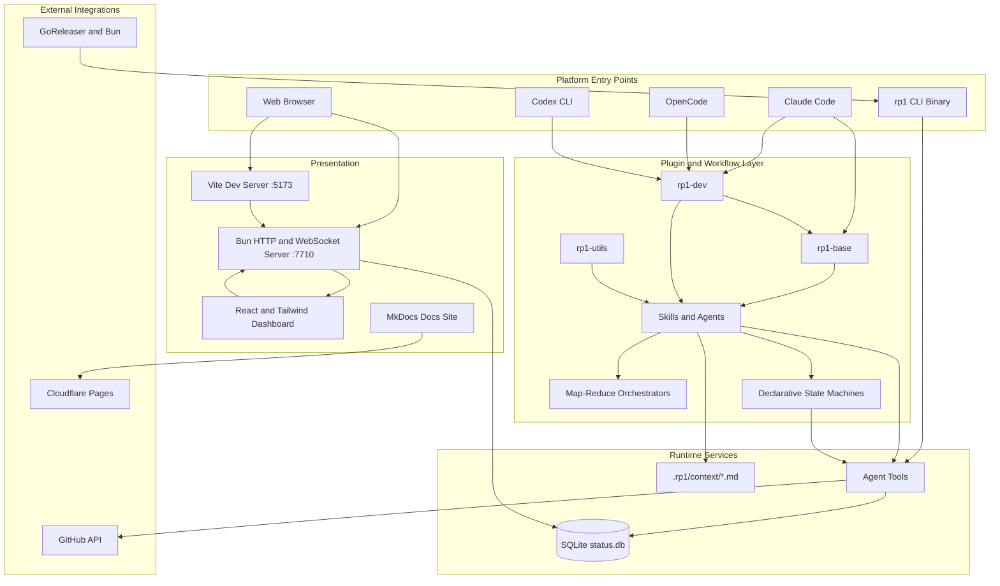

# System Architecture

**Project**: rp1
**Architecture Pattern**: Plugin-based layered monorepo
**Last Updated**: 2026-03-09

## High-Level Architecture

```mermaid
flowchart TB
    subgraph Platforms[Platform Entry Points]
        CC[Claude Code]
        OC[OpenCode]
        CX[Codex CLI]
        BIN[rp1 CLI Binary]
        WEB[Web Browser]
    end

    subgraph Plugins[Plugin and Workflow Layer]
        BASE[rp1-base]
        DEV[rp1-dev]
        UTILS[rp1-utils]
        SKILLS[Skills and Agents]
        MAPR[Map-Reduce Orchestrators]
        STM[Declarative State Machines]
    end

    subgraph Runtime[Runtime Services]
        TOOLS[Agent Tools]
        DB[(SQLite status.db)]
        KB[.rp1/context/*.md]
    end

    subgraph UI[Presentation]
        WS[Bun HTTP and WebSocket Server :7710]
        VITE[Vite Dev Server :5173]
        DASH[React and Tailwind Dashboard]
        DOCS[MkDocs Docs Site]
    end

    subgraph External[External Integrations]
        GH[GitHub API]
        REL[GoReleaser and Bun]
        CF[Cloudflare Pages]
    end

    CC --> BASE
    CC --> DEV
    OC --> DEV
    CX --> DEV
    BIN --> TOOLS
    WEB --> VITE
    WEB --> WS

    DEV --> BASE
    BASE --> SKILLS
    DEV --> SKILLS
    UTILS --> SKILLS
    SKILLS --> MAPR
    SKILLS --> STM
    SKILLS --> TOOLS
    SKILLS --> KB

    STM --> TOOLS
    TOOLS --> DB
    TOOLS --> GH
    WS --> DB
    WS --> DASH
    VITE --> WS
    DASH --> WS

    REL --> BIN
    DOCS --> CF
```

## Architectural Patterns

- **Plugin Architecture**: Capabilities are grouped into `base`, `dev`, and `utils` plugins with explicit namespace and dependency rules.
- **Skill-Agent Delegation**: Skills are thin orchestration surfaces; agents carry the real execution policy.
- **Declarative Workflow Control**: State machines live in markdown and are enforced by reusable runtime tooling.
- **Map-Reduce Orchestration**: Larger jobs such as KB generation and PR review split into parallel specialist passes.
- **Embedded Local State Store**: Operational workflow state lives in local SQLite instead of a remote service.
- **Dual-Surface Product**: The CLI is the execution surface, and the Web UI is the live operational view over the same state.

## System Layers

### Interaction Layer

**Purpose**: Expose user and agent entry points.
**Key Components**:

- `cli/src/main.ts`
- `cli/src/config/supported-tools.yaml`
- `cli/web-ui/src/server.ts`
- `docs/reference/agent-tools.md`

### Workflow Layer

**Purpose**: Define skills, agents, map-reduce flows, and stateful execution rules.
**Key Components**:

- `plugins/*/skills/`
- `plugins/*/agents/`
- `docs/concepts/map-reduce-workflows.md`
- `docs/concepts/state-machines.md`

### Runtime Services Layer

**Purpose**: Provide deterministic tooling for workflow tracking, root resolution, and platform integrations.
**Key Components**:

- `cli/src/agent-tools/work/`
- `cli/src/agent-tools/rp1-root-dir/`
- `cli/src/agent-tools/github-pr/`
- `cli/src/agent-tools/state-machine/`

### Persistence Layer

**Purpose**: Persist workflow status, run metadata, artifacts, and TTL cleanup state.
**Key Components**:

- `cli/src/agent-tools/work/database.ts`
- `~/.rp1/status.db`

### Presentation Layer

**Purpose**: Serve the dashboard and docs experiences.
**Key Components**:

- `cli/web-ui/src/`
- `cli/web-ui/vite.config.ts`
- `cli/web-ui/tailwind.config.ts`
- `mkdocs.yml`

### Knowledge Layer

**Purpose**: Store generated project context for knowledge-aware execution.
**Key Components**:

- `.rp1/context/index.md`
- `.rp1/context/architecture.md`
- `.rp1/context/modules.md`
- `.rp1/context/patterns.md`

## Primary Flows

### Knowledge Base Generation

1. A skill invokes the KB workflow.
2. A spatial pass categorizes files by KB section.
3. Specialist agents analyze concepts, architecture, modules, and patterns in parallel.
4. The orchestrator reduces those outputs into `.rp1/context/*`.

### Workflow State Update

1. A skill or agent reports a step transition.
2. The state-machine runtime validates the transition.
3. The work database stores status, run data, and artifacts.
4. The dashboard receives updates through daemon notifications and WebSocket fan-out.

### Web UI Monitoring

1. The browser loads the React dashboard.
2. Vite proxies local dev traffic to the Bun server.
3. The Bun server reads workflow state and exposes API and WebSocket routes.
4. Operators see project and run status in near real time.

## Integration Points

- **Claude Code / OpenCode / Codex CLI**: Supported execution platforms declared in `cli/src/config/supported-tools.yaml`. When evaluating a new harness, see `./core-capabilties-matrix.md` for the minimum capability checklist.
- **GitHub API**: Used by deterministic PR tooling instead of shelling out ad hoc.
- **SQLite**: The embedded operational store for workflow state and artifacts.
- **MkDocs Material**: Generates the published documentation site.
- **Cloudflare Pages**: Hosts the docs site.
- **GoReleaser + Bun**: Build and distribute standalone binaries.

## Security Architecture

### Authentication

- GitHub PR operations require `GITHUB_TOKEN`.
- The local CLI and Web UI do not define a separate first-party auth model in the analyzed paths.

### Authorization

- Capability boundaries are namespace- and platform-driven.
- Cross-plugin calls are constrained by declared dependency rules, especially `dev -> base`.

### Data Protection

- Workflow data is stored locally in SQLite with run isolation and TTL cleanup.
- The analyzed paths show local-first defaults, not a centralized secrets or encryption subsystem.

## Deployment Architecture

### Development

- The Web UI runs through Vite on `5173` and proxies to the Bun server on `7710`.
- Agent workflows operate against local `.rp1` context files and the local SQLite database.

### Production

- rp1 ships as Bun-compiled standalone binaries.
- Documentation is built separately with MkDocs and deployed to `rp1.run`.

### Infrastructure

- Local runtime state uses embedded SQLite.
- Browser observability uses the built-in HTTP and WebSocket server.
- Release and docs delivery rely on GitHub releases, GoReleaser, and Cloudflare Pages.
