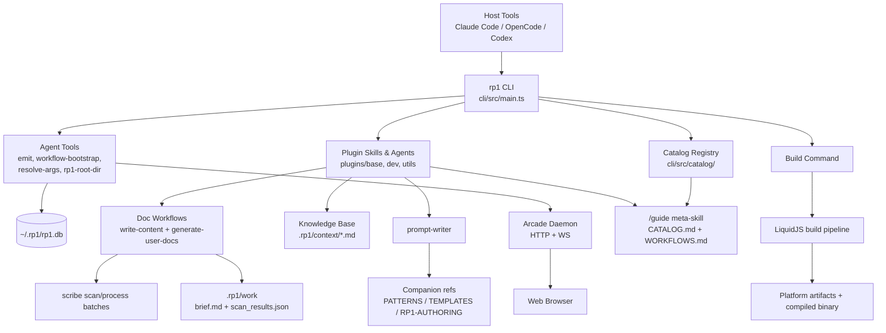

# System Architecture

**Project**: rp1
**Architecture Pattern**: Plugin-based CLI with tracked workflow state, artifact-backed handoffs, and multi-platform prompt compilation
**Last Updated**: 2026-04-12

## High-Level Architecture

```mermaid
flowchart TB
    Host["Host Tools\nClaude Code / OpenCode / Codex"] --> CLI["rp1 CLI\ncli/src/main.ts"]
    CLI --> Skills["Plugin Skills & Agents\nplugins/base, dev, utils"]
    CLI --> AgentTools["Agent Tools\nemit, workflow-bootstrap,\nresolve-args, rp1-root-dir"]
    CLI --> Build["Build Command"]
    CLI --> Catalog["Catalog Registry\ncli/src/catalog/"]
    AgentTools --> EventDB[("~/.rp1/rp1.db")]
    AgentTools --> Daemon["Arcade Daemon\nHTTP + WS"]
    Daemon --> Browser["Web Browser"]
    Skills --> KB["Knowledge Base\n.rp1/context/*.md"]
    Skills --> DocFlows["Doc Workflows\nwrite-content + generate-user-docs"]
    DocFlows --> Scribe["scribe scan/process batches"]
    DocFlows --> Work[".rp1/work\nbrief.md + scan_results.json"]
    Skills --> PromptWriter["prompt-writer"]
    PromptWriter --> Refs["Companion refs\nPATTERNS / TEMPLATES / RP1-AUTHORING"]
    Skills --> Guide["/guide meta-skill\nCATALOG.md + WORKFLOWS.md"]
    Build --> Pipeline["LiquidJS build pipeline"]
    Pipeline --> Artifacts["Platform artifacts + compiled binary"]
    Catalog --> Guide
```

## Architectural Patterns

| Pattern | Meaning | Current Evidence |
|---------|---------|------------------|
| Plugin Architecture | The repo stays organized as plugin-scoped capability packs, with base owning end-user workflows, dev owning development lifecycle, and utils owning reusable authoring tooling. | `write-content` and `generate-user-docs` remain in `plugins/base`; prompt authoring assets remain in `plugins/utils`; `/guide` meta-skill introduced in base to expose distributable catalog. |
| Event-Sourced Runtime State | Runtime progress is tracked as events, while larger phase payloads live in durable files outside the event stream. RunRecord now carries `runPolicy`, `workIdentity`, and `bootstrapContext` for deterministic run selection. | Frontier workflows still standardize on `rp1 agent-tools emit` with `status_change`, `waiting_for_user`, and `artifact_registered`. |
| Cross-Platform Build Pipeline | Markdown workflow specs remain the source of truth and compile into host-specific artifacts through the shared build pipeline. Platform-hint routing now lets `resolve-args` and schema lookup prefer the active harness. | `cli/src/main.ts` exposes `buildCommand`; platform definitions provide hook-driven extensibility via `PlatformDefinition` with lifecycle hooks (`preparePlugin`, `enrichAgentContext`, `postSkillWrite`, `postPluginBuild`). |
| State-Machine-Driven Workflows | Long-running skills are modeled as explicit state machines with named phases, user gates, and terminal status emission. | `write-content`, `generate-user-docs`, and `prompt-writer` each declare `stateDiagram-v2` phases and emit explicit step transitions. |
| Map-Reduce Agent Orchestration | Heavy analysis and editing work fans out to narrow workers and rejoins through a parent orchestrator. | `generate-user-docs` batches docs in groups of five, dispatches background `scribe` workers, and aggregates JSON responses. |
| Artifact-Backed Workflow Handoffs | Multi-phase workflows bridge context through durable files in `.rp1/work/` and then register those files for dashboard visibility. | `write-content` persists `brief.md`; `generate-user-docs` persists `scan_results.json`; prompt-authoring rules codify `artifact_registered` and `storageRoot`. |
| Progressive-Disclosure Reference Packs | Some skills pair a thin executable prompt with local reference packs so deeper guidance is loaded only when needed. | `prompt-writer` loads `PATTERNS.md`, `TEMPLATES.md`, and `RP1-AUTHORING.md` on demand; `/guide` loads `CATALOG.md` and `WORKFLOWS.md`. |
| Deterministic Workflow Bootstrap | `workflow-bootstrap` resolves canonical directories, arguments, and run identity in one atomic call before any workflow emits progress. Skills declare `runPolicy` (fresh/resumable) and `identityArgs` in frontmatter metadata to drive deterministic run creation or resumption. | `cli/src/agent-tools/workflow-bootstrap/` implements bootstrap; `WorkflowRunPolicy` type added to `events.ts` and `build/models.ts`; RunRecord schema extended with `run_policy`, `work_identity`, `bootstrap_context`. |
| Catalog-as-Code with Registry-Backed Discovery | Catalog generation migrated from shell scripts to a TypeScript registry (`cli/src/catalog/`) that parses frontmatter, groups by category, and renders distributable discovery views. The `/guide` meta-skill consumes `CATALOG.md` generated from this registry. | `cli/src/catalog/registry.ts` and `cli/src/catalog/maintenance.ts` replace `scripts/generate-catalog.sh`; `catalog/skills.yaml` removed. |
| Build-Time Asset Embedding | Platform artifacts and configuration assets remain embedded into the compiled binary for single-executable distribution. | No contradicting evidence appeared in the frontier. |
| Git Worktree-Aware Project Resolution | Project resolution derives shared KB and work paths from repository identity rather than session-local env vars. Home-directory guard prevents accidental adoption of `~/.rp1` as a project root. `requireProjectId` option now fails with actionable error for legacy projects. | `directory-resolution.ts` added `DirectoryResolutionOptions` with `allowHomeProjectRoot` and `requireProjectId`; `resolve-args` now returns `ResolvedDirectories` alongside arguments. |
| Prompt Attestation with Content-Addressable Hashing | Prompt quality validation and freshness enforcement remain part of the architecture. | No contradicting evidence appeared in the frontier. |
| Session Hooks with Platform Adaptation | Host-specific hooks still sit at the session boundary to start supporting services and adapt behavior per platform. | `plugins/base/hooks/hooks.json` starts the Arcade daemon and runs update checks on `SessionStart`. |
| fp-ts Functional Pipelines | The CLI functional core remains organized around fp-ts-style error and task pipelines. | No contradicting evidence appeared in the frontier. |
| Versioned Stanza Markers | Instruction-file stanzas now carry version stamps (`<!-- rp1:start:vX.Y.Z -->`) so the migrate command can detect and upgrade stale injections. | `cli/src/init/comment-fence.ts` parses versioned markers; `rp1 migrate` can backfill run metadata and upgrade stanzas. |
| Dockerized Eval Execution | Prompt evaluations run inside the `rp1-dev` Docker container via `docker/eval-run.sh`, isolating harness CLIs and eval dependencies from the host. Attestation results are committed on the host after the container exits. | `docker/eval-run.sh` new; `Justfile` `eval-run` delegates to Docker; CI attestation job builds platform artifacts then verifies inside the same container. |

## Layers

| Layer | Purpose | Components |
|-------|---------|------------|
| Interaction | Host-tool entry points and user-visible CLI commands | `cli/src/main.ts`, `cli/src/commands/` |
| Workflow Definition | Markdown-defined skills, agents, skill-local reference packs, and catalog discovery views | `plugins/base/`, `plugins/dev/`, `plugins/utils/`, `plugins/base/skills/guide/` |
| Runtime Services | Event emission, state validation, directory resolution, workflow bootstrap, and agent-tool primitives | `cli/src/agent-tools/`, `cli/src/lib/`, `cli/shared/` |
| Build & Distribution | Compile workflow specs into host-specific artifacts and shipped binaries; generate catalog artifacts | `cli/src/build/`, `cli/src/catalog/`, `cli/scripts/`, `scripts/` |
| Presentation | Arcade dashboard SPA with notification sidebar, REST APIs, and WebSocket updates | `cli/web-ui/src/app/`, `cli/web-ui/src/server/` |
| Persistence | Store event history, KB snapshots, and durable workflow artifacts | `~/.rp1/rp1.db`, `.rp1/context/`, `.rp1/work/` |
| Evaluation | Prompt attestation, Dockerized eval execution, and eval suite management | `evals/`, `docker/eval-run.sh`, `docker/Dockerfile` |
| Quality Gates | Catalog freshness, lint, format, typecheck, and attestation enforcement | `lefthook.yml`, `cli/src/catalog/maintenance.ts`, `cli/biome.json` |

## Key Interaction Flows

### Event Pipeline
Skill or agent emits a workflow event, state-machine validation checks the step transition, the runtime persists the event to SQLite, and the daemon broadcasts updates to Arcade via HTTP and WebSocket surfaces.

### Workflow Bootstrap
A tracked skill invokes `rp1 agent-tools workflow-bootstrap` which resolves canonical directories via `resolve-args`, validates the workflow target contract (runPolicy, identityArgs), then deterministically creates a fresh run or resumes an existing one based on project identity and work identity. The result provides `runId`, `directories`, and `arguments` as a single atomic context before any progress emission.

### KB Generation
The KB orchestrator selects `FULL`, `INCREMENTAL`, or `FEATURE_LEARNING`, runs spatial analysis, fans out specialist KB agents, reconciles each section against prior context, and writes `.rp1/context/*.md` plus `state.json`.

### Documentation Sync
`generate-user-docs` discovers user-facing docs, infers style, validates KB freshness, scans files in parallel via `scribe`, persists `scan_results.json`, asks once for approval, then processes updates in bounded batches.

### Content Writing
`write-content` normalizes the request, creates `.rp1/work/content/.../brief.md`, asks only blocking clarification questions, drafts and self-reviews against the brief, then registers final artifacts.

### Prompt Authoring
`prompt-writer` classifies the target, loads companion references only when needed, composes or rewrites the prompt using templates and reusable patterns, validates rp1 conventions, and emits completion state.

### Plugin Build Pipeline
The top-level build command parses prompt sources, applies LiquidJS preprocessing and semantic tag rendering, generates host-specific artifacts for Claude Code, OpenCode, and Codex via data-driven `PlatformDefinition` configs with lifecycle hooks, and bundles assets into the compiled binary.

### Catalog Generation
The TypeScript catalog registry (`cli/src/catalog/registry.ts`) scans plugin frontmatter, collects entries with category/workflow metadata, and renders `CATALOG.md` for the `/guide` meta-skill. `catalog/agents.yaml` is regenerated as a transitional freshness artifact via `cli/src/catalog/maintenance.ts`.

### Feedback Lifecycle
Users annotate artifacts in Arcade, the runtime persists the feedback in SQLite, WebSocket broadcasts update connected clients, and agents reply, resolve, or accept edits through feedback tooling.

### Project Discovery
`rp1-root-dir` walks up from the current working directory, resolves project identity from `.rp1/project_id`, checks worktree metadata when needed, guards against home-directory adoption, and returns project, KB, and work roots. `resolve-args` now co-returns `ResolvedDirectories` alongside argument values.

### Eval Execution
`just eval-run` builds the `rp1-dev` Docker image and runs `eval-run-local` inside the container with forwarded API keys. Passing `--attest --commit` attests passing suites inside the container and commits attestation changes on the host after the container exits.

## Integrations

| Service | Purpose | Type |
|---------|---------|------|
| Bun | CLI runtime, HTTP/WS server, binary compilation, and tests | Runtime |
| `bun:sqlite` | Persist events, runs, artifacts, annotations, and tasks | Embedded DB |
| Git CLI | Detect KB staleness, compute diffs, and resolve repo context | Version control |
| GitHub API (`@octokit/rest`) | PR review, comments, and reactions | REST API |
| React + Vite | Arcade dashboard SPA | Frontend |
| LiquidJS | Render platform-specific prompt artifacts | Build |
| chokidar | Watch `.rp1/work` and `.rp1/context` for live updates | Runtime |
| promptfoo | Run prompt quality evaluations | Testing |
| Release Please | Drive semver and release automation | CI/CD |
| GitHub Actions | Run CI, release, and automation jobs | CI/CD |
| Lefthook | Enforce local quality gates | Dev tooling |
| Biome | Linting and formatting for TS/TSX | Dev tooling |
| MkDocs Material | Publish docs at `rp1.run` | Documentation |
| Docker | Provide cross-platform testing and Dockerized eval execution environments | Dev tooling |

## Deployment

- **Type**: Single-executable CLI with embedded assets plus a background daemon
- **Targets**: `darwin-arm64`, `darwin-x64`, `linux-arm64`, `linux-x64`, `windows-x64`
- **Distribution**: GitHub releases via GoReleaser plus marketplace artifacts; beta releases via `just beta-release` workflow
- **Daemon**: Background Bun HTTP+WS server on port `7710` with PID-file lifecycle and version-aware restart
- **Local Build Surface**: Top-level `rp1 build` entrypoint now exposes the build pipeline directly
- **Docker Environments**: Multi-stage Dockerfile (`base` -> `target-repo` -> `stable` | `dev`) providing isolated testing and eval execution

## Cross-References

- **Surface behavior**: See [interaction-model.md](interaction-model.md)
- **Component inventory**: See [modules.md](modules.md)
- **Code conventions**: See [patterns.md](patterns.md)
- **Domain terminology**: See [concept_map.md](concept_map.md)
