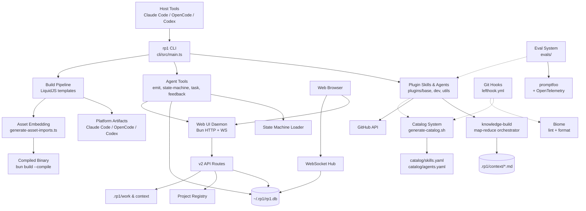

# System Architecture

**Project**: rp1
**Architecture Pattern**: Plugin-based CLI with Event-Sourced State and Map-Reduce Agent Orchestration
**Last Updated**: 2026-04-03

## High-Level Architecture


```mermaid
flowchart TB
    Host["Host Tools\nClaude Code / OpenCode / Codex"] --> CLI["rp1 CLI\ncli/src/main.ts"]
    CLI --> Skills["Plugin Skills & Agents\nplugins/base, dev, utils"]
    CLI --> Tools["Agent Tools\nemit, state-machine, task, feedback"]
    Skills --> KBBuild["knowledge-build\nmap-reduce orchestrator"]
    KBBuild --> KBFiles[(".rp1/context/*.md")]
    Tools --> SM["State Machine Loader"]
    Tools --> EmitDB[("~/.rp1/rp1.db")]
    Tools --> Daemon["Web UI Daemon\nBun HTTP + WS"]
    Daemon --> API["v2 API Routes"]
    API --> EmitDB
    API --> Registry["Project Registry"]
    API --> Workspace[".rp1/work & context"]
    Browser["Web Browser"] --> Daemon
    Browser --> WS["WebSocket Hub"]
    WS --> EmitDB
    Skills --> GitHub["GitHub API"]
    CLI --> BuildPipeline["Build Pipeline\nLiquidJS templates"]
    BuildPipeline --> Platforms["Platform Artifacts\nClaude Code / OpenCode / Codex"]
    BuildPipeline --> AssetEmbed["Asset Embedding\ngenerate-asset-imports.ts"]
    AssetEmbed --> Binary["Compiled Binary\nbun build --compile"]
    Catalog["Catalog System\ngenerate-catalog.sh"] --> CatalogFiles["catalog/skills.yaml\ncatalog/agents.yaml"]
    Skills -.-> Catalog
    Lefthook["Git Hooks\nlefthook.yml"] -.-> Catalog
    Lefthook -.-> Biome["Biome\nlint + format"]
    Evals["Eval System\nevals/"] --> Promptfoo["promptfoo\n+ OpenTelemetry"]
    Evals -.-> Skills
```

## Architectural Patterns

### Plugin Architecture
Three plugins (base, dev, utils) with plugin.json manifests. Dependency direction enforced: dev depends on base, never reverse. Utils is internal-only (excluded from catalog distribution).

### Event-Sourced State with Replay
SQLite event store with monotonic IDs. WebSocket reconnect sends missed events (up to 100) or state snapshot for larger gaps. Run status derived from event history.

### Cross-Platform Build Pipeline
Single SKILL.md source compiles to Claude Code, OpenCode, and Codex formats via shared `executeBuild` function with platform-specific LiquidJS templates and custom filters/tags. Asset embedding generates an EMBEDDED_MANIFEST keyed by platform.

### State-Machine-Driven Workflows
Mermaid stateDiagram-v2 definitions parsed into typed graph models. Runtime validation of step transitions with predecessor auto-completion and namespaced sub-agent steps.

### fp-ts Functional Pipelines
Typed error propagation via `Either<CLIError, A>` and `TaskEither<CLIError, A>` throughout CLI modules. Re-exported via `cli/shared/fp.ts` facade.

### Map-Reduce Agent Orchestration
Large analysis jobs fan out to parallel specialist agents and merge results. Used for KB generation, PR review, deep research, and user docs generation.

### Catalog-as-Code with Checksum Guards
Auto-generated skill and agent catalogs with SHA-256 checksums and cross-reference maps. Staleness detection enforced by git hooks.

### Build-Time Asset Embedding
Configuration files and platform artifacts embedded into the compiled binary at build time via generate-asset-imports, producing a platform-keyed EMBEDDED_MANIFEST for single-executable distribution.

## Layers

| Layer | Purpose | Key Components |
|-------|---------|----------------|
| Interaction | User and host-tool entry points | `cli/src/main.ts`, `cli/src/commands/` |
| Workflow Definition | Skills, agents, state machines as markdown | `plugins/base/`, `plugins/dev/`, `plugins/utils/` |
| Runtime Services | Agent tools, event emission, validation | `cli/src/agent-tools/`, `cli/src/lib/`, `cli/src/config/` |
| Build & Distribution | Plugin compilation, asset embedding | `cli/src/build/`, `cli/scripts/`, `scripts/` |
| Presentation | Arcade dashboard SPA, REST APIs, WebSocket | `cli/web-ui/src/app/`, `cli/web-ui/src/server/` |
| Persistence | SQLite event store, KB files, work artifacts | `~/.rp1/rp1.db`, `.rp1/context/`, `.rp1/work/` |
| Evaluation | Prompt quality validation, attestation | `evals/` |
| Quality Gates | Catalog checks, lint/format, typecheck | `lefthook.yml`, `scripts/check-catalog.sh` |

## Key Data Flows

### Event Pipeline
```
Agent emit call -> Step validation (state machine) -> SQLite insert -> HTTP notify -> WebSocket broadcast -> Dashboard UI update
```

### KB Generation
```
Spatial analyzer (file scoring 0-5) -> 4 parallel agents (concept, arch, module, pattern) -> Orchestrator merge -> .rp1/context/*.md
```

### Plugin Build Pipeline
```
SKILL.md parsed -> LiquidJS preprocessing with platform tags -> Platform-specific artifacts -> bundle-manifest.json -> Asset embedding into binary
```

### Feedback Lifecycle
```
User annotates in Arcade -> SQLite + WebSocket broadcast -> Agent reads via feedback tool -> Agent resolves/replies/accepts
```

### Catalog Integrity
```
Plugin files modified -> Pre-commit hook (advisory) -> Pre-push hook (blocking) -> generate-catalog.sh -> SHA-256 checksums + cross-references
```

## Integrations

| Service | Purpose | Type |
|---------|---------|------|
| Bun | Runtime, HTTP/WS server, binary compilation, test runner | Runtime |
| bun:sqlite | Events, runs, artifacts, annotations, tasks (WAL mode) | Embedded DB |
| GitHub API (@octokit/rest) | PR review, comment management, reactions | REST API |
| React + Vite | Arcade dashboard SPA with Tailwind, Radix UI, Milkdown | Frontend |
| LiquidJS | Multi-platform artifact generation from SKILL.md templates | Build |
| chokidar | File watching for .rp1/work and .rp1/context directories | Runtime |
| promptfoo | Eval harness for prompt quality testing with attestation | Testing |
| OpenTelemetry | Distributed tracing for eval runs | Observability |
| Release Please | Automated semver across CLI and plugins | CI/CD |
| GitHub Actions | CI (lint, typecheck, test), release automation, PR review | CI/CD |
| Lefthook | Git hooks for pre-commit and pre-push quality gates | Dev tooling |
| Biome | Linting and formatting for TypeScript/TSX | Dev tooling |
| MkDocs Material | Documentation site at rp1.run | Documentation |
| Docker | Multi-stage container for install testing and development | Dev tooling |

## Deployment

- **Type**: Single-executable CLI with embedded assets + background daemon
- **Environment**: Local developer machines (macOS, Linux, Windows)
- **Distribution**: GitHub releases via GoReleaser (Homebrew, Scoop, curl, npm); Claude Code marketplace
- **Targets**: darwin-arm64, darwin-x64, linux-arm64, linux-x64, windows-x64
- **Daemon**: Background Bun HTTP+WS server on port 7710 with PID-file lifecycle, version-aware restart, LRU file watcher pool (max 10 projects)
- **Versioning**: Unified semver via release-please across CLI and all plugins
