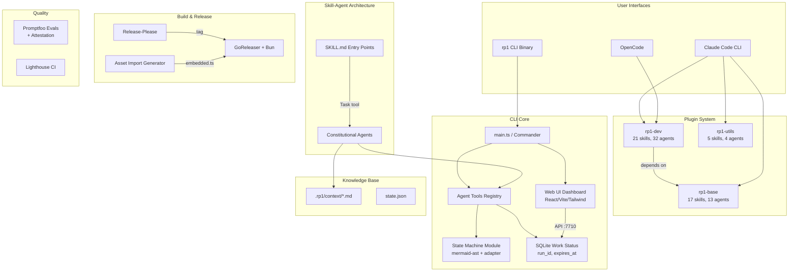
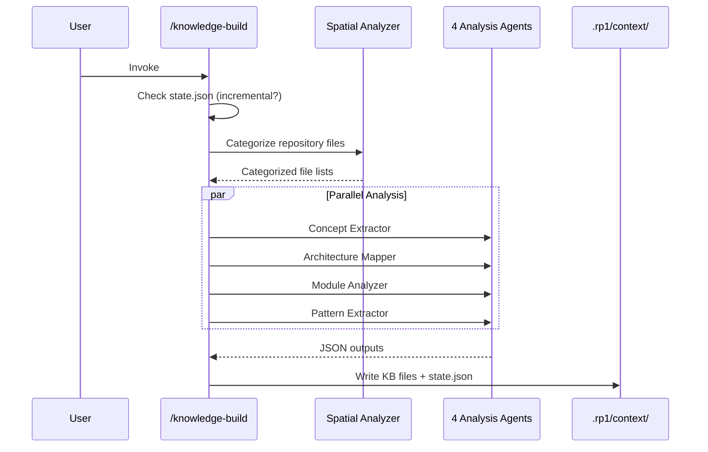
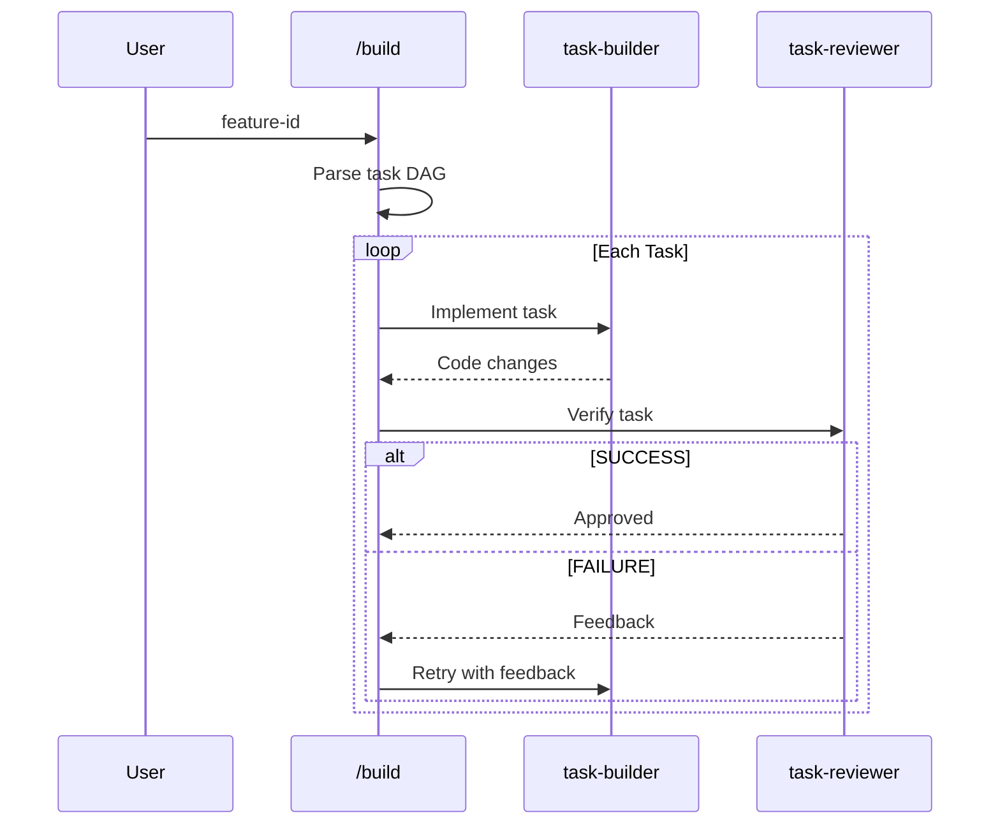
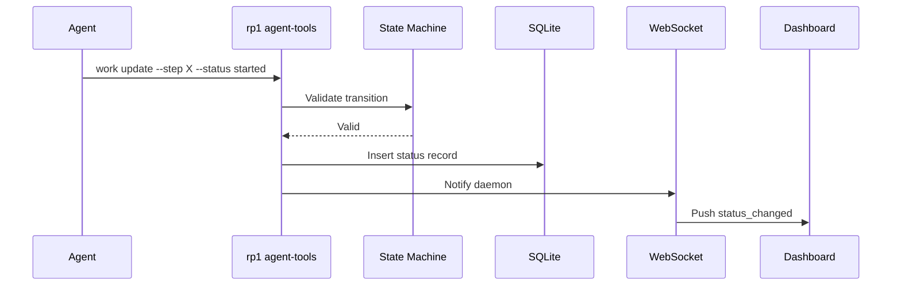

# System Architecture

**Project**: rp1
**Architecture Pattern**: Plugin-based Skill-Agent Delegation with Map-Reduce Workflows
**Last Updated**: 2026-03-08

## High-Level Architecture

```mermaid
graph TB
    subgraph "User Interfaces"
        CC[Claude Code CLI]
        OC[OpenCode]
        CLI[rp1 CLI Binary]
    end

    subgraph "Plugin System"
        Base["rp1-base<br/>17 skills, 13 agents"]
        Dev["rp1-dev<br/>21 skills, 32 agents"]
        Utils["rp1-utils<br/>5 skills, 4 agents"]
        Dev -->|depends on| Base
    end

    subgraph "Skill-Agent Architecture"
        Skills[SKILL.md Entry Points]
        Agents[Constitutional Agents]
        Skills -->|Task tool| Agents
    end

    subgraph "CLI Core"
        Main[main.ts / Commander]
        AgentTools[Agent Tools Registry]
        SM["State Machine Module<br/>mermaid-ast + adapter"]
        WebUI["Web UI Dashboard<br/>React/Vite/Tailwind"]
        SQLite["SQLite Work Status<br/>run_id, expires_at"]
        Main --> AgentTools
        Main --> WebUI
        AgentTools --> SQLite
        AgentTools --> SM
    end

    subgraph "Knowledge Base"
        KB[".rp1/context/*.md"]
        State[state.json]
    end

    subgraph "Build & Release"
        RP[Release-Please]
        GR[GoReleaser + Bun]
        AssetGen[Asset Import Generator]
        RP -->|tag| GR
        AssetGen -->|embedded.ts| GR
    end

    subgraph "Quality"
        Evals["Promptfoo Evals<br/>+ Attestation"]
        LHCI[Lighthouse CI]
    end

    CC --> Base
    CC --> Dev
    CC --> Utils
    OC --> Dev
    CLI --> Main
    Agents --> KB
    Agents --> AgentTools
    WebUI -->|API :7710| SQLite
```

## Architectural Patterns

| Pattern | Description | Evidence |
|---------|-------------|----------|
| Plugin Architecture | Three plugins (base, dev, utils) with .claude-plugin manifests; dev depends on base | `plugins/*/` |
| Skill-Agent Delegation | SKILL.md entry points spawn single-pass constitutional agents via Task tool | `plugins/*/skills/`, `plugins/*/agents/` |
| Map-Reduce Workflows | Complex tasks split into parallel agent invocations, results merged by orchestrator | KB generation (5 agents), PR review (N sub-reviewers) |
| Builder-Reviewer Loop | Builder agent produces work, reviewer validates with single-retry on failure | `/build`, `/build-fast` workflows |
| Single-File Executable | GoReleaser + bun build --compile with embedded web-ui and OpenCode artifacts | `.goreleaser.yml`, `cli/scripts/generate-asset-imports.ts` |
| Constitutional Prompting | Agents defined as declarative markdown with parameter tables, anti-loop directives, output contracts | All agent .md files |

## Layer Architecture

| Layer | Purpose | Key Components |
|-------|---------|---------------|
| Interface (Skills) | User-facing entry points via slash commands | `plugins/*/skills/*/SKILL.md` |
| Agent Layer | Autonomous constitutional agents for single-pass execution | `plugins/*/agents/*.md` |
| CLI Core | Commander-based CLI, agent-tools registry, state machine, build pipeline | `cli/src/main.ts`, `cli/src/commands/`, `cli/src/agent-tools/` |
| Web UI | React/Vite/Tailwind status dashboard on port 7710 | `cli/web-ui/src/` |
| Data Layer | SQLite work status tracking with run isolation and TTL expiry | `cli/src/agent-tools/work/`, `~/.rp1/status.db` |
| Knowledge Layer | Persistent codebase documentation | `.rp1/context/*.md` |
| Build/Release | CI/CD, binary compilation, asset bundling | `.github/workflows/`, `.goreleaser.yml`, `Justfile` |
| Evaluation | Promptfoo evals with content-addressable attestation | `evals/src/` |
| Shared Packages | Reusable internal libraries | `packages/catppuccin-mermaid/`, `cli/shared/` |

## Key Data Flows

### KB Generation (Map-Reduce)

```mermaid
sequenceDiagram
    participant User
    participant Orchestrator as /knowledge-build
    participant SA as Spatial Analyzer
    participant Agents as 4 Analysis Agents
    participant FS as .rp1/context/

    User->>Orchestrator: Invoke
    Orchestrator->>Orchestrator: Check state.json (incremental?)
    Orchestrator->>SA: Categorize repository files
    SA-->>Orchestrator: Categorized file lists
    par Parallel Analysis
        Orchestrator->>Agents: Concept Extractor
        Orchestrator->>Agents: Architecture Mapper
        Orchestrator->>Agents: Module Analyzer
        Orchestrator->>Agents: Pattern Extractor
    end
    Agents-->>Orchestrator: JSON outputs
    Orchestrator->>FS: Write KB files + state.json
```

### Feature Build (Builder-Reviewer)

```mermaid
sequenceDiagram
    participant User
    participant Build as /build
    participant Builder as task-builder
    participant Reviewer as task-reviewer

    User->>Build: feature-id
    Build->>Build: Parse task DAG
    loop Each Task
        Build->>Builder: Implement task
        Builder-->>Build: Code changes
        Build->>Reviewer: Verify task
        alt SUCCESS
            Reviewer-->>Build: Approved
        else FAILURE
            Reviewer-->>Build: Feedback
            Build->>Builder: Retry with feedback
        end
    end
```

### Work Status Tracking

```mermaid
sequenceDiagram
    participant Agent
    participant CLI as rp1 agent-tools
    participant SM as State Machine
    participant DB as SQLite
    participant WS as WebSocket
    participant UI as Dashboard

    Agent->>CLI: work update --step X --status started
    CLI->>SM: Validate transition
    SM-->>CLI: Valid
    CLI->>DB: Insert status record
    CLI->>WS: Notify daemon
    WS->>UI: Push status_changed
```

## Integration Points

| Service | Purpose | Type |
|---------|---------|------|
| GitHub Actions | CI/CD: lint/test, release versioning, binary builds, PR review | Workflow automation |
| GoReleaser | Cross-platform binary compilation (darwin/linux/windows, arm64/x64) | Build automation |
| Release-Please | Semantic versioning from conventional commits | Version management |
| Cloudflare Pages | Documentation hosting at rp1.run (MkDocs Material) | Static hosting |
| Promptfoo | Eval framework for agent prompt testing with attestation | Testing framework |
| SQLite (Bun native) | Work status tracking with WAL mode and TTL | Embedded database |
| Lefthook | Git hooks: pre-commit (lint, format), pre-push (typecheck, test) | Developer tooling |
| Claude Code Plugin System | Primary distribution via plugin marketplace | Plugin marketplace |
| OpenCode | Secondary platform via tarball artifacts | Platform integration |
| Lighthouse CI | Performance/accessibility auditing for docs site | Quality assurance |

## Deployment Architecture

**Distribution Channels**:
- Claude Code: Plugin marketplace install (3 plugins)
- OpenCode: GitHub release tarballs via `rp1 install opencode`
- Homebrew: `brew install rp1-run/tap/rp1` (macOS cask)
- Scoop: Windows package via GoReleaser
- curl: `curl -fsSL https://rp1.run/install.sh | sh`
- npm: `@rp1-run/rp1` (public registry)
- Docs: Cloudflare Pages at rp1.run

**Target Platforms**: darwin-arm64, darwin-x64, linux-arm64, linux-x64, windows-x64

**Current Version**: 0.5.1
