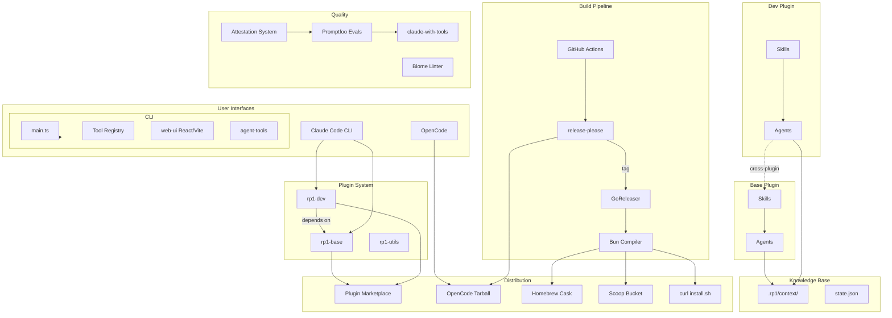
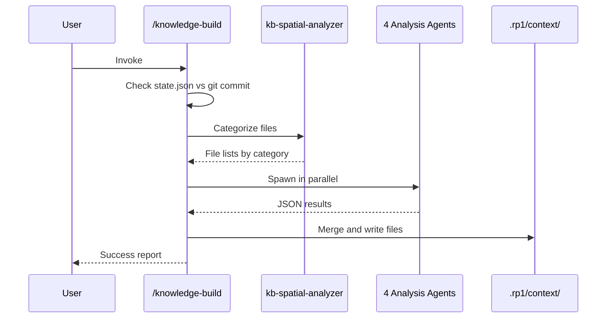
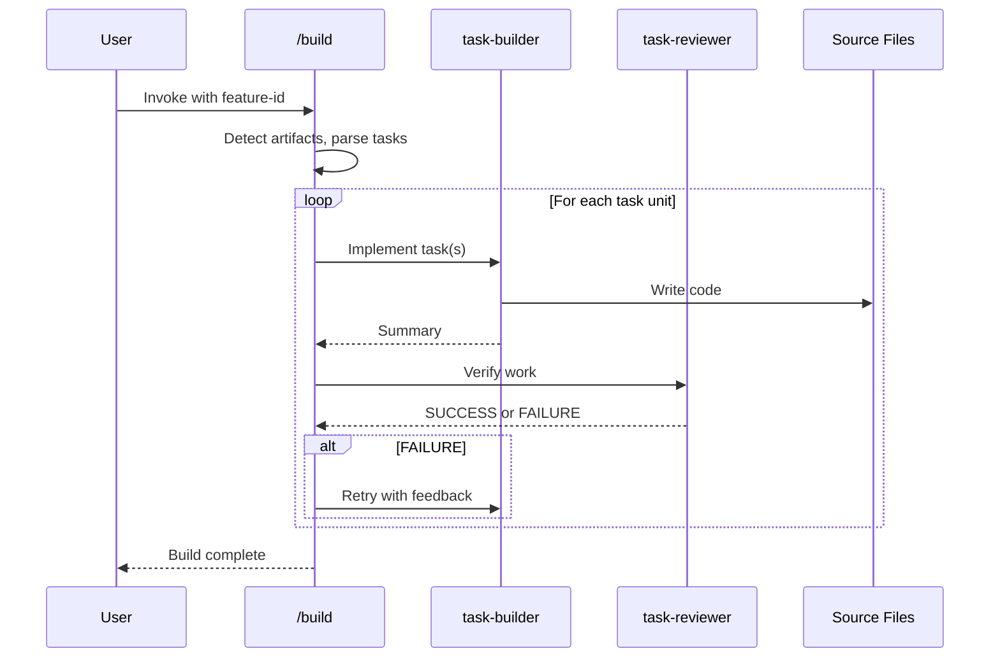
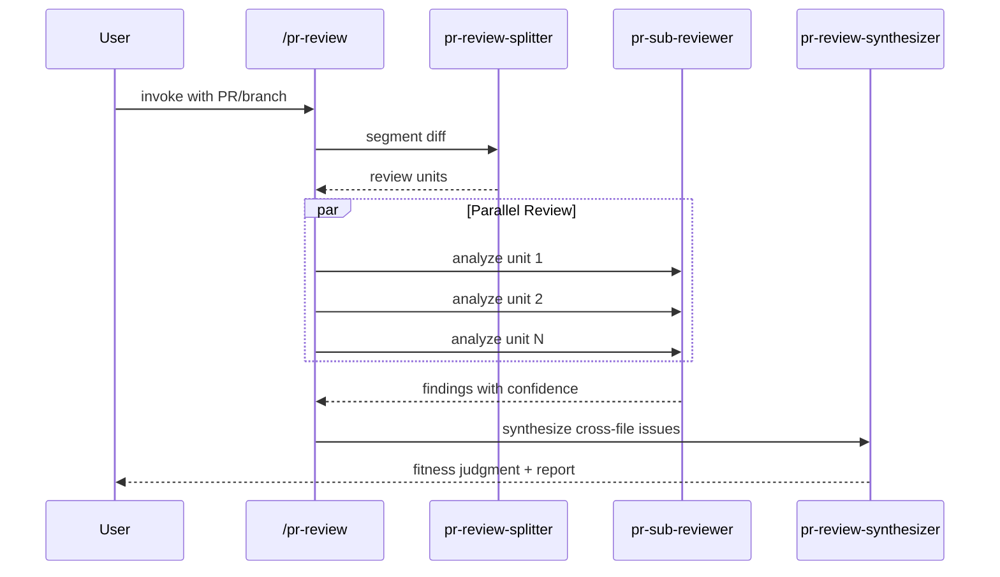

# System Architecture

**Project**: rp1 Plugin System
**Architecture Pattern**: Plugin Architecture with Map-Reduce Orchestration
**Last Updated**: 2026-02-05

## High-Level Architecture

```mermaid
graph TB
    subgraph "User Interfaces"
        CC[Claude Code CLI]
        OC[OpenCode]
        CLI[rp1 CLI]
    end

    subgraph "Plugin System"
        Base[rp1-base]
        Dev[rp1-dev]
        Utils[rp1-utils]
        Dev -->|depends on| Base
    end

    subgraph "Base Plugin"
        BaseSkills[Skills]
        BaseAgents[Agents]
        BaseSkills --> BaseAgents
    end

    subgraph "Dev Plugin"
        DevSkills[Skills]
        DevAgents[Agents]
        DevSkills --> DevAgents
        DevAgents -.->|cross-plugin| BaseSkills
    end

    subgraph "CLI"
        CLIMain[main.ts]
        ToolRegistry[Tool Registry]
        WebUI[web-ui React/Vite]
        AgentTools[agent-tools]
    end

    subgraph "Knowledge Base"
        KB[.rp1/context/]
        State[state.json]
    end

    subgraph "Build Pipeline"
        GHActions[GitHub Actions]
        RP[release-please]
        GR[GoReleaser]
        Bun[Bun Compiler]
        GHActions --> RP
        RP -->|tag| GR
        GR --> Bun
    end

    subgraph "Distribution"
        Marketplace[Plugin Marketplace]
        Tarball[OpenCode Tarball]
        Homebrew[Homebrew Cask]
        Scoop[Scoop Bucket]
        Curl[curl install.sh]
    end

    subgraph "Quality"
        Evals[Promptfoo Evals]
        Attest[Attestation System]
        Provider[claude-with-tools]
        Biome[Biome Linter]
        Evals --> Provider
        Attest --> Evals
    end

    CC --> Base
    CC --> Dev
    OC --> Tarball
    CLI --> CLIMain

    BaseAgents --> KB
    DevAgents --> KB

    Bun --> Homebrew
    Bun --> Scoop
    Bun --> Curl
    Base --> Marketplace
    Dev --> Marketplace
    RP --> Tarball
```

## Architectural Patterns

### Plugin Architecture
**Evidence**: `plugins/base/.claude-plugin/plugin.json`, `plugins/dev/.claude-plugin/plugin.json`
**Description**: Three independent plugins (base, dev, utils) with explicit dependencies. Dev depends on base for shared capabilities. Each plugin has skills (SKILL.md) and agents; skills are the single artifact type for all invocable prompts.

### Constitutional Agent Pattern
**Evidence**: `plugins/*/agents/*.md` structure with YAML frontmatter, parameter tables, anti-loop directives
**Description**: Agents follow structured format: parameter tables, numbered workflow sections, JSON output contracts. Single-pass execution without iteration.

### Skill-Agent Delegation
**Evidence**: `plugins/*/skills/*/SKILL.md` spawn agents via Task tool
**Description**: Skills (SKILL.md files) are entry points that extract parameters via model-driven parsing and spawn constitutional agents (200-350 lines) for workflow execution. All 31 invocable prompts use the SKILL.md canonical format.

### Map-Reduce Orchestration
**Evidence**: `skills/knowledge-build` spawns parallel agents, `skills/pr-review` uses splitter/sub-reviewers/synthesizer
**Description**: Complex workflows split into units, processed in parallel by specialized agents, then merged by orchestrator.

### Content-Addressable Attestation
**Evidence**: `evals/src/attestation/` module with SHA-256 hashing and dependency graph derivation
**Description**: Prompt files tracked via content hashes with dependency graphs. Changes require eval suite re-attestation before merge.

### Two-Phase Eval Workflow
**Evidence**: `Justfile` run-evals and attest-evals recipes, `evals/src/attestation/commands.ts`
**Description**: Eval execution separated from attestation generation. Phase 1 runs promptfoo with fixed output file. Phase 2 reads output, validates 100% pass, updates attestation without spawning Claude.

### Multi-Platform Distribution
**Evidence**: `.goreleaser.yml` (darwin-arm64/x64, linux-arm64/x64, windows-x64)
**Description**: Targets Claude Code (native plugins), OpenCode (tarballs), and standalone CLI via GoReleaser binaries.

### Embedded Asset Bundling
**Evidence**: `cli/src/assets/embedded.ts`, goreleaser.yml verification of IS_BUNDLED flag
**Description**: Plugin assets embedded at build time into single executable binary via Bun compiler.

### Git Worktree Isolation
**Evidence**: `.rp1/work/worktrees/` directory structure, worktree CLI command
**Description**: Agents execute in isolated git worktrees with disabled hooks, protecting user's uncommitted work.

### Tool Registry Pattern
**Evidence**: `cli/src/config/supported-tools.yaml`, `cli/src/agent-tools/index.ts`
**Description**: Centralized registry for agent tools with registration, lookup, and listing.

## Layer Architecture

| Layer | Purpose | Components |
|-------|---------|------------|
| **Interface (Skills)** | User-facing entry points | `plugins/*/skills/*/SKILL.md` |
| **Agent** | Autonomous workflow execution | `plugins/*/agents/*.md` |
| **CLI** | Cross-platform tooling | `cli/src/main.ts`, `cli/web-ui/*`, `agent-tools` |
| **Config** | Tool registry | `cli/src/config/supported-tools.*` |
| **Knowledge** | Persistent codebase docs | `.rp1/context/*.md`, `state.json` |
| **Build/Release** | CI/CD automation | `.github/workflows/*`, `.goreleaser.yml` |
| **Evaluation** | Prompt testing | `evals/`, `evals/src/attestation/*` |

## Key Workflows

### KB Generation Flow

```mermaid
sequenceDiagram
    participant User
    participant Command as /knowledge-build
    participant Spatial as kb-spatial-analyzer
    participant Agents as 4 Analysis Agents
    participant KB as .rp1/context/

    User->>Command: Invoke
    Command->>Command: Check state.json vs git commit
    Command->>Spatial: Categorize files
    Spatial-->>Command: File lists by category
    Command->>Agents: Spawn in parallel
    Agents-->>Command: JSON results
    Command->>KB: Merge and write files
    Command-->>User: Success report
```

### Feature Build Flow

```mermaid
sequenceDiagram
    participant User
    participant Build as /build
    participant Builder as task-builder
    participant Reviewer as task-reviewer
    participant Files as Source Files

    User->>Build: Invoke with feature-id
    Build->>Build: Detect artifacts, parse tasks
    loop For each task unit
        Build->>Builder: Implement task(s)
        Builder->>Files: Write code
        Builder-->>Build: Summary
        Build->>Reviewer: Verify work
        Reviewer-->>Build: SUCCESS or FAILURE
        alt FAILURE
            Build->>Builder: Retry with feedback
        end
    end
    Build-->>User: Build complete
```

### PR Review Flow

```mermaid
sequenceDiagram
    participant User
    participant PR as /pr-review
    participant Splitter as pr-review-splitter
    participant SubReviewer as pr-sub-reviewer
    participant Synth as pr-review-synthesizer

    User->>PR: invoke with PR/branch
    PR->>Splitter: segment diff
    Splitter-->>PR: review units

    par Parallel Review
        PR->>SubReviewer: analyze unit 1
        PR->>SubReviewer: analyze unit 2
        PR->>SubReviewer: analyze unit N
    end

    SubReviewer-->>PR: findings with confidence
    PR->>Synth: synthesize cross-file issues
    Synth-->>User: fitness judgment + report
```

## Integration Points

### GitHub Actions
- `ci.yml`: lint, typecheck, tests via Bun
- `release-please.yml`: versioning + OpenCode artifact builds
- `goreleaser.yml`: binary builds triggered by tag
- `rp1-pr-review.yml`: automated PR review workflow

### Distribution Channels
| Channel | Target | Method |
|---------|--------|--------|
| Claude Code | Plugin marketplace | `/plugin install` |
| OpenCode | GitHub releases | Tarball download |
| macOS | Homebrew | `brew install --cask rp1-run/tap/rp1` |
| Windows | Scoop | `scoop install rp1` |
| Linux | curl script | `curl -fsSL https://rp1.run/install.sh \| bash` |

### External Services
- **GoReleaser**: Cross-platform binary builds (darwin/linux/windows)
- **Release-Please**: Semantic versioning from conventional commits
- **Cloudflare Pages**: Documentation site at rp1.run
- **Promptfoo**: Evaluation framework with custom provider

## Performance Considerations

### Lazy Loading
- Agent-tools lazy-loaded to reduce CLI startup time
- Heavy dependencies only loaded when needed

### Parallel Execution
- KB generation uses 4 parallel agents
- PR review uses parallel sub-reviewers
- mmd-validate uses shared browser instance for batch validation

### Incremental Updates
- KB tracks git commit in state.json
- Only changed files analyzed on subsequent runs
- 2-5 min incremental vs 10-15 min full build

## Cross-References
- **Domain Concepts**: See [concept_map.md](concept_map.md)
- **Module Breakdown**: See [modules.md](modules.md)
- **Implementation Patterns**: See [patterns.md](patterns.md)
