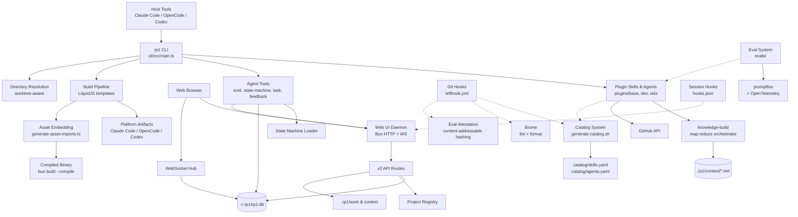

# System Architecture

**Project**: rp1
**Architecture Pattern**: Plugin-based CLI with event-sourced state and map-reduce agent orchestration
**Last Updated**: 2026-04-03

## High-Level Architecture

```mermaid
flowchart TB
    Host["Host Tools\nClaude Code / OpenCode / Codex"] --> CLI["rp1 CLI\ncli/src/main.ts"]
    CLI --> Skills["Plugin Skills & Agents\nplugins/base, dev, utils"]
    CLI --> Tools["Agent Tools\nemit, state-machine, task, feedback"]
    Skills --> KBBuild["knowledge-build\nmap-reduce orchestrator"]
    KBBuild --> KBFiles[(".rp1/context/*.md")]
    Tools --> SM["State Machine Loader"]
    Tools --> EmitDB[("~/.rp1/rp1.db")]
    Tools --> Daemon["Web UI Daemon\nBun HTTP + WS"]
    Daemon --> API["v2 API Routes"]
    API --> EmitDB
    API --> Registry["Project Registry"]
    API --> Workspace[".rp1/work & context"]
    Browser["Web Browser"] --> Daemon
    Browser --> WS["WebSocket Hub"]
    WS --> EmitDB
    Skills --> GitHub["GitHub API"]
    CLI --> BuildPipeline["Build Pipeline\nLiquidJS templates"]
    BuildPipeline --> Platforms["Platform Artifacts\nClaude Code / OpenCode / Codex"]
    BuildPipeline --> AssetEmbed["Asset Embedding\ngenerate-asset-imports.ts"]
    AssetEmbed --> Binary["Compiled Binary\nbun build --compile"]
    Catalog["Catalog System\ngenerate-catalog.sh"] --> CatalogFiles["catalog/skills.yaml\ncatalog/agents.yaml"]
    Skills -.-> Catalog
    Lefthook["Git Hooks\nlefthook.yml"] -.-> Catalog
    Lefthook -.-> Biome["Biome\nlint + format"]
    Lefthook -.-> EvalAttest["Eval Attestation\ncontent-addressable hashing"]
    Evals["Eval System\nevals/"] --> Promptfoo["promptfoo\n+ OpenTelemetry"]
    Evals -.-> Skills
    Hooks["Session Hooks\nhooks.json"] -.-> Daemon
    CLI --> DirRes["Directory Resolution\nworktree-aware"]
```

## Architectural Patterns

### Plugin Architecture
Three plugins (base, dev, utils) with plugin.json manifests. Dependency direction enforced: dev depends on base, never reverse; utils is internal-only.

### Event-Sourced State with Replay
SQLite event store with monotonic IDs. WebSocket reconnect sends missed events (up to 100) or state snapshot for larger gaps. Run status derived from event history.

### Cross-Platform Build Pipeline
Single SKILL.md source compiles to Claude Code, OpenCode, and Codex formats via shared executeBuild with LiquidJS templates, custom filters/tags, and EMBEDDED_MANIFEST keyed by platform.

### State-Machine-Driven Workflows
Mermaid stateDiagram-v2 definitions parsed into typed graph models. Runtime step validation with predecessor auto-completion and namespaced sub-agent steps.

### fp-ts Functional Pipelines
Either<CLIError, A> and TaskEither<CLIError, A> throughout CLI. Re-exported via cli/shared/fp.ts facade.

### Map-Reduce Agent Orchestration
Large analysis jobs fan out to parallel specialist agents and merge results. Used for KB generation (spatial analyzer -> 5 parallel agents -> merge), PR review (diff splitter -> N sub-reviewers -> synthesizer), deep research, and user docs.

### Catalog-as-Code with Checksum Guards
Auto-generated skill and agent catalogs with SHA-256 checksums. Lefthook enforces: advisory at pre-commit, blocking at pre-push.

### Build-Time Asset Embedding
Configuration files and platform artifacts embedded into the compiled binary at build time via generate-asset-imports.ts for single-executable distribution.

### Git Worktree-Aware Project Resolution
Project discovery walks up from cwd looking for .rp1/project_id, with special handling for git worktrees to share identity, KB, and work artifacts across all worktrees via git common-dir detection.

### Prompt Attestation with Content-Addressable Hashing
Content-addressable hashing of prompt sources with dependency graph tracking. Pre-push hooks enforce attestation freshness to prevent behavioral drift.

### Session Hooks with Platform Adaptation
Plugin hooks auto-start the Arcade daemon and check for updates on session startup, with platform-specific hook definitions for each supported host tool.

## Layers

| Layer | Purpose | Components |
|-------|---------|------------|
| Interaction | User and host-tool entry points | `cli/src/main.ts`, `cli/src/commands/` |
| Workflow Definition | Skills, agents, state machines as markdown | `plugins/base/`, `plugins/dev/`, `plugins/utils/` |
| Runtime Services | Agent tools, event emission, validation, directory resolution | `cli/src/agent-tools/`, `cli/src/lib/`, `cli/shared/` |
| Build & Distribution | Plugin compilation, asset embedding, platform artifacts | `cli/src/build/`, `cli/scripts/`, `scripts/` |
| Presentation | Arcade dashboard SPA, REST APIs, WebSocket hub | `cli/web-ui/src/app/`, `cli/web-ui/src/server/` |
| Persistence | SQLite event store, KB files, work artifacts | `~/.rp1/rp1.db`, `.rp1/context/`, `.rp1/work/` |
| Evaluation | Prompt quality validation with content-addressable attestation | `evals/` |
| Quality Gates | Catalog checks, lint/format, typecheck, attestation verification | `lefthook.yml`, `scripts/check-catalog.sh`, `cli/biome.json` |

## Key Interaction Flows

### Event Pipeline
Agent emit call -> Step validation (state machine) -> SQLite insert -> HTTP notify -> WebSocket broadcast -> Dashboard UI update

### KB Generation (Map-Reduce)
1. Orchestrator detects mode (FULL/INCREMENTAL/FEATURE_LEARNING) via git diff or FEATURE_ID
2. Spatial analyzer ranks files 0-5 and categorizes into 5 sections
3. 5 parallel agents (concept, arch, interaction, module, pattern) analyze assigned files
4. Each agent reconciles against prior KB and performs novelty scan
5. Orchestrator merges JSON outputs into .rp1/context/*.md + state.json

### Plugin Build Pipeline
SKILL.md parsed -> LiquidJS preprocessing with platform-specific tags -> Platform artifacts for Claude Code/OpenCode/Codex -> bundle-manifest.json -> Asset embedding into compiled binary

### Feedback Lifecycle
User annotates in Arcade -> SQLite insert + WebSocket broadcast -> Agent reads via feedback tool -> Agent resolves/replies/accepts

### Session Startup
Host tool triggers SessionStart hook -> Update check (10s timeout) -> Arcade daemon starts on port 7710 -> System message injected

### Project Discovery
rp1-root-dir called from cwd -> Walk up for .rp1/project_id -> If git worktree, resolve to main repo .rp1/ -> Return projectRoot, kbRoot, workRoot, isWorktree

## Integrations

| Service | Purpose | Type |
|---------|---------|------|
| Bun | Runtime, HTTP/WS server, binary compilation, test runner | Runtime |
| bun:sqlite | Events, runs, artifacts, annotations, tasks (WAL mode) | Embedded DB |
| GitHub API (@octokit/rest) | PR review, comment management, reactions | REST API |
| React + Vite | Arcade dashboard SPA with Tailwind, Radix UI, Milkdown | Frontend |
| LiquidJS | Multi-platform artifact generation from SKILL.md templates | Build |
| chokidar | File watching for .rp1/work and .rp1/context directories | Runtime |
| promptfoo | Eval harness for prompt quality testing with attestation | Testing |
| Release Please | Automated semver across CLI and plugins | CI/CD |
| GitHub Actions | CI (lint, typecheck, test), release automation, PR review | CI/CD |
| Lefthook | Git hooks for pre-commit and pre-push quality gates | Dev tooling |
| Biome | Linting and formatting for TypeScript/TSX | Dev tooling |
| MkDocs Material | Documentation site at rp1.run | Documentation |
| Docker | Multi-stage container for cross-platform testing | Dev tooling |

## Deployment

- **Type**: Single-executable CLI with embedded assets + background daemon
- **Targets**: darwin-arm64, darwin-x64, linux-arm64, linux-x64, windows-x64
- **Distribution**: GitHub releases via GoReleaser (Homebrew, Scoop, curl, npm); Claude Code marketplace
- **Daemon**: Background Bun HTTP+WS server on port 7710 with PID-file lifecycle, version-aware restart, LRU file watcher pool (max 10 projects)
- **Versioning**: Unified semver via release-please across CLI and all plugins

## Cross-References
- **Surface behavior**: See [interaction-model.md](interaction-model.md)
- **Component inventory**: See [modules.md](modules.md)
- **Code conventions**: See [patterns.md](patterns.md)
- **Domain terminology**: See [concept_map.md](concept_map.md)
