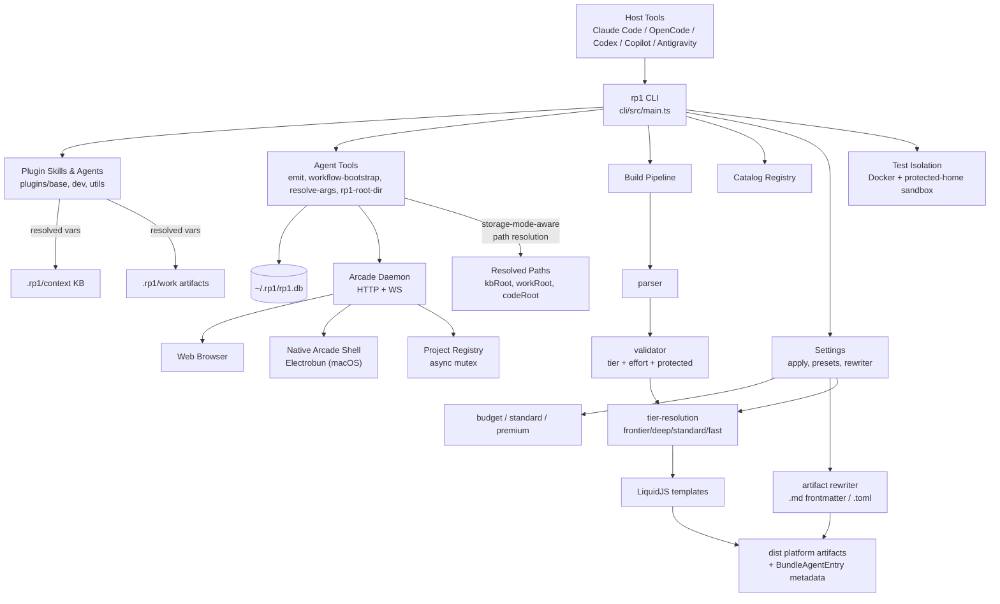

# System Architecture

**Project**: rp1
**Architecture Pattern**: Plugin-based CLI with tracked workflow state, artifact-backed handoffs, multi-platform prompt compilation, and native desktop shell
**Last Updated**: 2026-07-25

rp1 is a Bun/TypeScript CLI + plugin monorepo that compiles markdown-defined skills and agents into host-specific artifacts, tracks workflow runtime state as events, serves a live Arcade dashboard (web and native macOS shell via Electrobun), enforces containerized test isolation with protected-home filesystem boundaries, and lets users remap agent model tiers on their own machines at install time.

## High-Level Architecture

```mermaid
flowchart TB
    Host["Host Tools<br/>Claude Code / OpenCode / Codex / Copilot / Antigravity"] --> CLI["rp1 CLI<br/>cli/src/main.ts"]
    CLI --> Skills["Plugin Skills & Agents<br/>plugins/base, dev, utils"]
    CLI --> AgentTools["Agent Tools<br/>emit, workflow-bootstrap, resolve-args, rp1-root-dir"]
    CLI --> Build["Build Pipeline"]
    CLI --> Catalog["Catalog Registry"]
    CLI --> Settings["Settings<br/>apply, presets, rewriter"]
    CLI --> TestBoundary["Test Isolation<br/>Docker + protected-home sandbox"]
    AgentTools --> EventDB[("~/.rp1/rp1.db")]
    AgentTools --> Daemon["Arcade Daemon<br/>HTTP + WS"]
    Daemon --> Browser["Web Browser"]
    Daemon --> NativeApp["Native Arcade Shell<br/>Electrobun (macOS)"]
    Daemon --> Registry["Project Registry<br/>async mutex"]
    AgentTools -->|"storage-mode-aware<br/>path resolution"| PathRes["Resolved Paths<br/>kbRoot, workRoot, codeRoot"]
    Skills -->|"resolved vars"| KB[".rp1/context KB"]
    Skills -->|"resolved vars"| Work[".rp1/work artifacts"]
    Build --> Parse["parser"]
    Parse --> Validate["validator<br/>tier + effort + protected"]
    Validate --> TierRes["tier-resolution<br/>frontier/deep/standard/fast"]
    TierRes --> Render["LiquidJS templates"]
    Render --> Artifacts["dist platform artifacts<br/>+ BundleAgentEntry metadata"]
    Settings --> Presets["budget / standard / premium"]
    Settings --> Rewriter["artifact rewriter<br/>.md frontmatter / .toml"]
    Settings --> TierRes
    Rewriter --> Artifacts
```

## Architectural Patterns

- **Cross-Platform Build Pipeline** — single-source agent/skill markdown compiles to 5 targets (Claude Code, OpenCode, Codex, Copilot, Antigravity) via data-driven `PlatformDefinition` configs + LiquidJS templates. (Gemini platform removed.)
- **Additive-Field Tier Resolution with Frontier Tier** — agent `model` tier (frontier/deep/standard/fast/inherit) and `effort` (low–max) are resolved at build time from abstract aliases to platform-specific model IDs. Frontier maps to fable (CC), gpt-5.5 (Codex), gemini-3.1-pro (Antigravity); Codex clamps effort `max`→`xhigh`; OpenCode provider-dependent effort logic removed.
- **Install-Time Tier Remapping** — user-controlled post-install model remapping via `settings.toml` `[models.<platform>]` sections or presets (budget/standard/premium): load → validate against `TIER_MODEL_MAP` → discover agents from bundle metadata → rewrite CC (.md frontmatter) and Codex (.toml) artifacts in place → strip effort on fast-class remaps → warn on protected-agent downgrades. `rp1 update` re-applies automatically (try/catch isolated).
- **Protected Agent Downgrade Guards** — 14 reasoning-critical agents flagged in `PROTECTED_AGENTS`; build and remapping emit warnings via `TIER_RANK` comparison when they would drop below deep.
- **Grace-Fallback Settings Migration** — legacy `settings.json` arcade fields auto-migrate to `settings.toml` `[arcade]` in two places: the `rp1 migrate` workflow (`cli/src/migrate/arcade-settings.ts`, dry-run capable, renames originals to `.migrated`) and daemon startup via `arcade-settings-bridge.ts`. Both use the comment-preserving `arcade-writer` with idempotent key merge.
- **Containerized Test Isolation with Protected-Home Boundary** — CI tests run inside a disposable Docker container (`test-isolation.Dockerfile`) with a root-owned, read-only protected home directory and a sentinel file. `test-with-isolated-home.ts` creates ephemeral sandbox directories that redirect all user-state environment variables (HOME, XDG_*, APPDATA, TMPDIR, and 20+ tool-specific paths like CARGO_HOME, CLAUDE_CONFIG_DIR, GOPATH) away from the real home. `verify-test-home-boundary.ts` proves the container cannot write to the protected home (create, overwrite, rename, delete, chmod, utimes all denied) while the sandbox remains fully writable. A static analysis tool (`check-test-home-env.ts`) parses test source files via the TypeScript compiler API to detect direct mutations of protected environment variables and unsafe env replacements in child-process spawns (Bun.spawn, Node exec/fork/spawn, Worker). The CI pipeline verifies zero host or volume mounts before running tests.
- **Native Desktop Arcade Shell** — macOS native app (`native-app/`) built with Electrobun bundles the rp1 binary and renders the Arcade dashboard as a native window. Configured via `electrobun.config.ts` with app identifier `run.rp1.arcade`. Build and install recipes (`just build-native-app`, `just install-native-app`) produce a standalone .app in `~/Applications`. CI runs `just check-native-app` (typecheck) and `just test-native-app` as separate jobs.
- **Cross-Platform Interview Composition Contracts** — `tests/interview-composition.test.ts` validates that parent-owned interview contracts (blueprint, bootstrap) render correctly on every registered platform by building all platform plugins into a temp directory and asserting structural invariants: parent-owned question flow ordering, dispatch counts, argument resolution sequences, artifact registration with storage-mode-aware paths, and finalizer non-interactivity. This catches platform-specific rendering regressions that single-platform builds miss.
- **Parallel Wave Dispatch with Strict Message Ordering** — the /build skill dispatches all ready verification/build agents back-to-back in a single message with no intervening prose, guaranteeing single-message parallel scheduling of task waves.
- **Event-Sourced Runtime State** — all workflow state changes are `rp1 agent-tools emit` events persisted to SQLite and broadcast over WebSocket.
- **State-Machine-Driven Workflows** — skills declare `stateDiagram-v2` phases; steps are validated against the graph at emit time.
- **Map-Reduce Agent Orchestration** — heavy analysis fans out to narrow workers and rejoins through a parent orchestrator (KB build, PR review).
- **Deterministic Workflow Bootstrap** — `workflow-bootstrap` resolves directories, arguments, and run identity atomically; skills declare `runPolicy` + `identityArgs`. Directory resolution is storage-mode-aware: `kbRoot`/`workRoot` may resolve outside the project tree under a non-default storage mode.
- **Storage-Mode-Agnostic Path Resolution** — skills and agents reference KB/work directories through resolver-provided variables (`{kbRoot}`/`{workRoot}` in skills, `{KB_ROOT}`/`{WORK_ROOT}` in agent arguments), never literal paths. Build lint L014 enforces the contract. Prerequisite for pluggable storage backends (`settings.toml [storage] mode = local | central`).
- **Artifact-Backed Handoffs** — inter-phase state persists as markdown/JSON under `.rp1/work/`.
- **Catalog-as-Code** — the skill/agent catalog is derived from source frontmatter at build time; checksums cover agent body content, so every prompt edit requires catalog regeneration.
- **Worktree-Aware Code Editing** — agents distinguish `codeRoot` (edit target, worktree-aware) from `workRoot`/`kbRoot`, which resolve against the main repository even in worktree contexts.

## Layers

| Layer | Purpose | Components |
|-------|---------|-----------|
| Interaction | User-facing CLI commands, host tool integration | `cli/src/commands/` |
| Workflow Definition | Plugin skills + agents | `plugins/{base,dev,utils}/` |
| Runtime Services | Agent tools: emit, bootstrap, resolve-args, rp1-root-dir (storage-mode-aware) | `cli/src/agent-tools/` |
| Build & Distribution | Multi-platform compile with tier resolution, validation, rendering, and install-time remapping | `cli/src/build/`, `cli/src/catalog/`, `cli/src/settings/` |
| Presentation | Arcade SPA with real-time WS | `cli/web-ui/` |
| Native Desktop | macOS native Arcade shell via Electrobun | `native-app/` (Electrobun config, bun entrypoint, HTML views) |
| Persistence | SQLite event store, KB, work artifacts, settings | `~/.rp1/rp1.db`, `.rp1/context/`, `.rp1/work/`, `settings.toml` |
| Test Infrastructure | Containerized test isolation with protected-home filesystem boundary and static env-safety analysis | `cli/scripts/test-with-isolated-home.ts`, `cli/scripts/verify-test-home-boundary.ts`, `cli/scripts/check-test-home-env.ts`, `.github/test-isolation.Dockerfile`, `cli/test-fixtures/test-home/` |
| Evaluation | Dockerized prompt evals with content-addressable attestation | `evals/` (attestation gates release-please PRs; Node 24 pinned for better-sqlite3 prebuilt compatibility) |

## Data Flows

- **Build Pipeline (per-agent artifact)**: parse frontmatter (model tier + effort) → validate tier/effort/protected → preprocess → `resolveTier` → concrete model ID → `resolveEffort` → `{fieldName, value}` → build `AgentArtifactData` + `BundleAgentEntry` (tier/effort metadata) → render platform Liquid template → lint → write platform artifacts.
- **Install-Time Tier Remapping**: load `[models]` from project+user settings.toml (project wins) → resolve preset if any → validate (platforms, model IDs, effort compatibility) → discover installed agents via `BundleAgentEntry` metadata in the embedded manifest → rewrite artifacts → report modified / already-current / effort adjustments / protected warnings. Dry-run previews without writing.
- **Event Pipeline**: skill/agent emits event → state-machine validation → SQLite persist → HTTP daemon notify → WebSocket broadcast to Arcade.
- **KB Generation**: orchestrator selects mode (FULL/INCREMENTAL/FEATURE_LEARNING) → spatial analysis → parallel specialist agents (dispatched with resolved `KB_ROOT`) → reconcile → write `{kbRoot}/*.md` + `state.json`.
- **Directory Resolution**: `rp1-root-dir` locates `.rp1/project_id` → checks active storage mode → returns `projectRoot`/`kbRoot`/`workRoot`/`codeRoot`; consumed by workflow-bootstrap and resolve-args, then passed to agents as dispatch arguments.
- **Test Isolation Boundary**: CI builds Docker image from `test-isolation.Dockerfile` → verifies zero host mounts → `verify-test-home-boundary.ts` proves root-owned sentinel is immutable → `test-with-isolated-home.ts` creates ephemeral sandbox with redirected env vars → `check-test-home-env.ts` statically audits test sources for env mutations → tests execute inside sandbox → sandbox cleaned up.

## Integration Points

- **Runtime/build**: Bun (runtime, HTTP/WS server, binary compile, tests), `bun:sqlite` (event store), LiquidJS (template engine, `greedy:true` whitespace control), Electrobun (native macOS shell).
- **VCS/CI**: Git CLI (KB staleness, diffs, worktree resolution), GitHub API via `gh` (PR review), Release Please + GitHub Actions (attestation gates release-please PRs; Node 24 pinned for better-sqlite3), Lefthook + Biome (local quality gates), Docker (containerized test isolation + eval execution).
- **Frontend**: React + Vite (Arcade SPA), chokidar (file watching), promptfoo + Docker (evals).

## Deployment

Single-executable CLI per platform (darwin/linux/windows) via GitHub releases, plus a background Bun HTTP+WS daemon on port 7710 with PID-file lifecycle, version-aware restart, and NDJSON diagnostics. Config dir is OS-specific. Agent tier metadata ships inside the binary's embedded manifest, enabling settings-driven remapping without source access.

Dockerized evals handle TLS-intercepting networks (e.g. Cloudflare WARP): `docker/eval-run.sh` exports the host gateway CA into `docker/certs/`, the Dockerfile bakes it into the container trust store, and `NODE_EXTRA_CA_CERTS` covers Node/bun downloads in-container.

A macOS native Arcade shell (`run.rp1.arcade`) is built with Electrobun and bundled with the rp1 binary; it provides a standalone desktop window alternative to the browser-based Arcade. CI test execution runs inside disposable Docker containers with a protected-home filesystem boundary that prevents tests from reading or writing the real home directory; the boundary is verified on every CI run via a sentinel-based filesystem probe.

## Related KB

- Component detail: `modules.md` · Concepts: `concept_map.md` · Conventions: `patterns.md` · Surfaces: `interaction-model.md` · Capabilities: `features.md`
