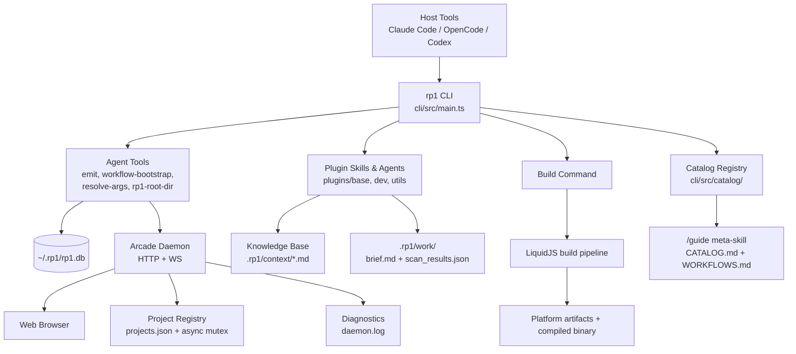

# System Architecture

**Project**: rp1
**Architecture Pattern**: Plugin-based CLI with tracked workflow state, artifact-backed handoffs, and multi-platform prompt compilation
**Last Updated**: 2026-04-12

## System Layers

```text
Interaction          CLI commands (cli/src/commands/)
Workflow Definition  Plugin skills & agents (plugins/*)
Runtime Services     Agent tools, emit, bootstrap (cli/src/agent-tools/)
Build & Distribution Build pipeline, catalog (cli/src/build/, cli/src/catalog/)
Presentation         Arcade SPA + HTTP/WS server (cli/web-ui/)
Persistence          SQLite (~/.rp1/rp1.db), KB files (.rp1/context/), work artifacts (.rp1/work/)
Evaluation           Dockerized eval execution (evals/)
Quality Gates        Lefthook, Biome, catalog checks
```

## Architecture Diagram


```mermaid
flowchart TB
    Host["Host Tools\nClaude Code / OpenCode / Codex"] --> CLI["rp1 CLI\ncli/src/main.ts"]
    CLI --> Skills["Plugin Skills & Agents\nplugins/base, dev, utils"]
    CLI --> AgentTools["Agent Tools\nemit, workflow-bootstrap,\nresolve-args, rp1-root-dir"]
    CLI --> Build["Build Command"]
    CLI --> Catalog["Catalog Registry\ncli/src/catalog/"]
    AgentTools --> EventDB[("~/.rp1/rp1.db")]
    AgentTools --> Daemon["Arcade Daemon\nHTTP + WS"]
    Daemon --> Browser["Web Browser"]
    Daemon --> Registry["Project Registry\nprojects.json + async mutex"]
    Daemon --> Diagnostics["Diagnostics\ndaemon.log"]
    Skills --> KB["Knowledge Base\n.rp1/context/*.md"]
    Skills --> Work[".rp1/work/\nbrief.md + scan_results.json"]
    Build --> Pipeline["LiquidJS build pipeline"]
    Pipeline --> Artifacts["Platform artifacts + compiled binary"]
    Catalog --> Guide["/guide meta-skill\nCATALOG.md + WORKFLOWS.md"]
```

## Architectural Patterns

| Pattern | Description |
|---------|-------------|
| Plugin Architecture | Three plugin packs (base, dev, utils) with scoped capabilities and enforced dependency direction |
| Event-Sourced Runtime State | Workflow progress tracked as events via `rp1 agent-tools emit` with status_change, waiting_for_user, artifact_registered, subflow_registered |
| Cross-Platform Build Pipeline | Markdown specs compile into host-specific artifacts through shared LiquidJS pipeline. All 3 platform templates emit `arcade_tracked` field |
| State-Machine-Driven Workflows | Skills declare `stateDiagram-v2` phases with explicit step transitions and validation |
| Map-Reduce Agent Orchestration | Heavy analysis fans out to narrow workers and rejoins through parent orchestrator |
| Artifact-Backed Workflow Handoffs | Multi-phase workflows bridge context through durable files in `.rp1/work/` |
| Deterministic Workflow Bootstrap | `workflow-bootstrap` resolves directories, arguments, and run identity atomically. Skills declare `runPolicy` and `identityArgs` |
| Catalog-as-Code | TypeScript catalog registry parses frontmatter, groups by category, renders CATALOG.md and init skill-awareness blocks |
| Session Hooks | Host-specific hooks start services at session boundary using `--format hook-json` for structured output |
| Cross-Process Registry Serialization | `withRegistryLock` async mutex serializes all registry mutations preventing race conditions |
| Daemon Diagnostics Logging | Structured NDJSON log entries to `daemon.log` for post-mortem debugging |
| Git Worktree-Aware Project Resolution | Project resolution derives paths from repo identity; guards against home-directory adoption |
| Versioned Stanza Markers | Instruction-file stanzas carry version stamps for staleness detection and `rp1 migrate` upgrades |
| Dockerized Eval Execution | Prompt evals run inside Docker containers isolating harness CLIs and dependencies |

## Key Data Flows

### Event Pipeline
Skill/agent emits workflow event -> State machine validation -> SQLite persistence -> HTTP notify daemon -> WebSocket broadcast to Arcade

### Workflow Bootstrap
Tracked skill invokes `workflow-bootstrap` -> Resolves canonical directories -> Validates workflow contract -> Creates/resumes run -> Returns runId + directories + arguments

### KB Generation
Orchestrator selects mode (FULL/INCREMENTAL/FEATURE_LEARNING) -> Spatial analysis -> Parallel specialist agents -> Reconcile each section -> Write `.rp1/context/*.md` + `state.json`

### Startup Recovery
Server reads `daemon-state.json` high-water mark -> Queries SQLite for missed events -> Replays via WebSocket hub -> Prunes stale projects from registry

### Project Registry
Registration/access from CLI/hooks -> Worktree normalization -> UUID-keyed entry -> Async-mutex-serialized read-modify-write -> Atomic temp-file + rename

## Integrations

| Service | Purpose | Type |
|---------|---------|------|
| Bun | CLI runtime, HTTP/WS server, binary compilation, tests | Runtime |
| bun:sqlite | Persist events, runs, artifacts, annotations, notifications | Embedded DB |
| Git CLI | KB staleness, diffs, repo context, worktree resolution | Version control |
| GitHub API | PR review, comments, reactions | REST API |
| React + Vite | Arcade dashboard SPA | Frontend |
| LiquidJS | Multi-platform prompt artifact rendering | Build |
| chokidar | Watch `.rp1/work` and `.rp1/context` for live updates | Runtime |
| promptfoo | Prompt quality evaluations | Testing |
| Release Please | Semver and release automation | CI/CD |
| GitHub Actions | CI, release, and automation jobs | CI/CD |
| Lefthook | Local quality gates (lint, format, catalog check) | Dev tooling |
| Biome | Linting and formatting for TS/TSX | Dev tooling |
| MkDocs Material | Publish docs at `rp1.run` | Documentation |
| Docker | Cross-platform testing and eval execution | Dev tooling |

## Deployment

- **Distribution**: Single-executable CLI with embedded assets plus background daemon
- **Targets**: darwin-arm64, darwin-x64, linux-arm64, linux-x64, windows-x64
- **Daemon**: Background Bun HTTP+WS server on port 7710 with PID-file lifecycle, version-aware restart, SIGTERM->SIGKILL escalation, diagnostic logging
- **Config directory**: macOS `~/Library/Application Support/rp1/`, Linux `$XDG_CONFIG_HOME/rp1/`, Windows `%APPDATA%\rp1\`
- **Docker**: Multi-stage Dockerfile (base -> target-repo -> stable | dev) for isolated testing and eval execution
