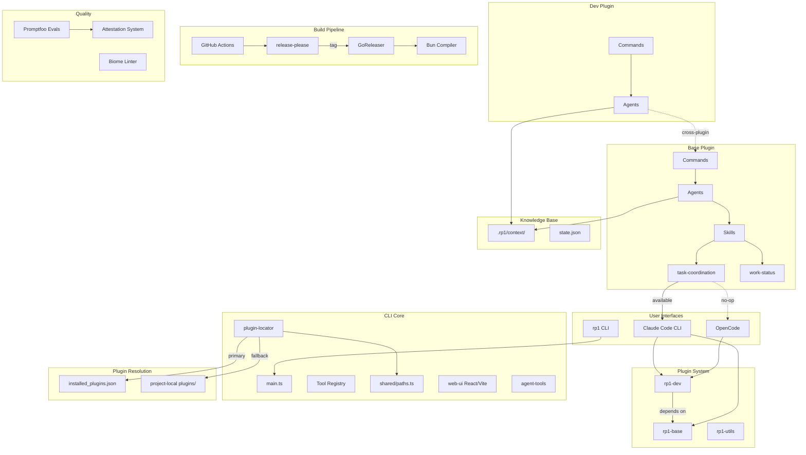

# System Architecture

**Project**: rp1 Plugin System
**Architecture Pattern**: Layered Plugin Architecture with Map-Reduce Orchestration
**Last Updated**: 2026-02-20

## High-Level Architecture

```mermaid
graph TB
    subgraph "User Interfaces"
        CC[Claude Code CLI]
        OC[OpenCode]
        CLI[rp1 CLI]
    end

    subgraph "Plugin System"
        Base[rp1-base]
        Dev[rp1-dev]
        Utils[rp1-utils]
        Dev -->|depends on| Base
    end

    subgraph "Base Plugin"
        BaseCmd[Commands]
        BaseAgents[Agents]
        Skills[Skills]
        TC[task-coordination]
        WS[work-status]
        BaseCmd --> BaseAgents
        BaseAgents --> Skills
        Skills --> TC
        Skills --> WS
    end

    subgraph "Dev Plugin"
        DevCmd[Commands]
        DevAgents[Agents]
        DevCmd --> DevAgents
        DevAgents -.->|cross-plugin| BaseCmd
    end

    subgraph "CLI Core"
        CLIMain[main.ts]
        ToolRegistry[Tool Registry]
        SharedPaths[shared/paths.ts]
        PluginLocator[plugin-locator]
        WebUI[web-ui React/Vite]
        AgentTools[agent-tools]
        PluginLocator --> SharedPaths
    end

    subgraph "Plugin Resolution"
        IPJson[installed_plugins.json]
        ProjLocal[project-local plugins/]
        PluginLocator -->|primary| IPJson
        PluginLocator -->|fallback| ProjLocal
    end

    subgraph "Knowledge Base"
        KB[.rp1/context/]
        State[state.json]
    end

    subgraph "Build Pipeline"
        GHActions[GitHub Actions]
        RP[release-please]
        GR[GoReleaser]
        Bun[Bun Compiler]
        GHActions --> RP
        RP -->|tag| GR
        GR --> Bun
    end

    subgraph "Quality"
        Evals[Promptfoo Evals]
        Attest[Attestation System]
        Biome[Biome Linter]
        Evals --> Attest
    end

    CC --> Base
    CC --> Dev
    OC --> Dev
    CLI --> CLIMain
    TC -->|available| CC
    TC -.->|no-op| OC
    BaseAgents --> KB
    DevAgents --> KB
```

## Architectural Layers

| Layer | Purpose | Components |
|-------|---------|-----------|
| Interface | User-facing entry points (slash commands) | `plugins/*/commands/*.md` |
| Agent | Autonomous workflow execution | `plugins/*/agents/*.md` |
| Skill | Reusable shared capabilities | `plugins/base/skills/*/SKILL.md` |
| CLI | Cross-platform tooling, plugin resolution | `cli/src/main.ts`, `cli/src/agent-tools/`, `cli/src/shared/` |
| Config | Tool registry, plugin metadata | `cli/src/config/supported-tools.*`, `plugins/*/.claude-plugin/` |
| Knowledge | Persistent codebase documentation | `.rp1/context/*.md`, `.rp1/context/state.json` |
| Build/Release | CI/CD automation, binary builds | `.github/workflows/*`, `.goreleaser.yml` |
| Evaluation | Prompt testing and attestation | `evals/` |

## Key Architectural Patterns

### Command-Agent Delegation
Commands are thin wrappers (~50-150 lines) that delegate to constitutional agents (~200-350 lines) via Task tool. Commands handle user interface/routing; agents handle business logic.

### Map-Reduce Orchestration
- **KB Generation**: spatial analyzer -> 4 parallel agents -> orchestrator merge
- **PR Review**: splitter -> N sub-reviewers -> synthesizer -> reporter

### Two-Tier Plugin Resolution
Plugin commands resolved first from Claude Code's `installed_plugins.json` (marketplace installs), falling back to project-local `plugins/` directory. Uses fp-ts `TE.orElse` for graceful degradation.

### Platform-Agnostic Task Coordination
Skill abstracts Claude Code Task tools with first-call feature detection and silent no-op fallback for non-Claude-Code platforms.

### Content-Addressable Attestation
Prompt files tracked via SHA-256 hashes with dependency graphs. Changes require eval suite re-attestation before merge.

### Embedded Asset Bundling
Plugin assets embedded at build time into single executable binary via Bun compiler.

### Git Worktree Isolation
Agents execute in isolated git worktrees with disabled hooks, protecting user's uncommitted work.

## Data Flows

### KB Generation Flow
1. User invokes `/rp1-base:knowledge-build`
2. Command checks state.json vs git commit for incremental detection
3. Spawns kb-spatial-analyzer to categorize files
4. Creates 4 parallel Task Coordination tasks (if available)
5. Spawns 4 analysis agents in parallel (concept, architecture, module, pattern)
6. Agents return JSON results; tasks marked completed/failed
7. Command merges results and writes KB files

### Feature Build Flow
1. User invokes `/rp1-dev:build` with feature-id
2. Command detects artifacts, parses tasks
3. For each task unit: spawn task-builder, then task-reviewer
4. On reviewer FAILURE: retry builder with feedback
5. Task coordination tracks 6 steps in Claude Code task UI

### Plugin Command Resolution Flow
1. CLI receives plugin-command identifier (e.g., `rp1-dev:build`)
2. Attempts resolution from `installed_plugins.json` via `getClaudePluginDirs`
3. If not found, falls back to project-local `plugins/` directory
4. Extracts YAML frontmatter and argument-hint from resolved command file

## Integration Points

| Service | Purpose | Type |
|---------|---------|------|
| GitHub Actions | CI/CD for linting, testing, releases, PR review | Workflow automation |
| GoReleaser | Cross-platform binaries (darwin/linux/windows) with Bun compiler | Build pipeline |
| Release-Please | Semantic versioning from conventional commits | Release management |
| Cloudflare Pages | Documentation site at rp1.run via MkDocs Material | Docs hosting |
| Promptfoo | Evaluation framework with custom claude-with-tools provider | Testing/validation |
| Claude Code Tasks | Native task UI for real-time workflow progress | Platform integration |

## Deployment & Distribution

| Channel | Method |
|---------|--------|
| Claude Code | Plugin marketplace (`/plugin install`) |
| OpenCode | GitHub release tarballs |
| macOS | Homebrew cask (`rp1-run/tap/rp1`) with macOS-only xattr quarantine removal |
| Windows | Scoop bucket (`rp1-run/scoop-bucket`) |
| Linux | `curl install.sh` from rp1.run |
