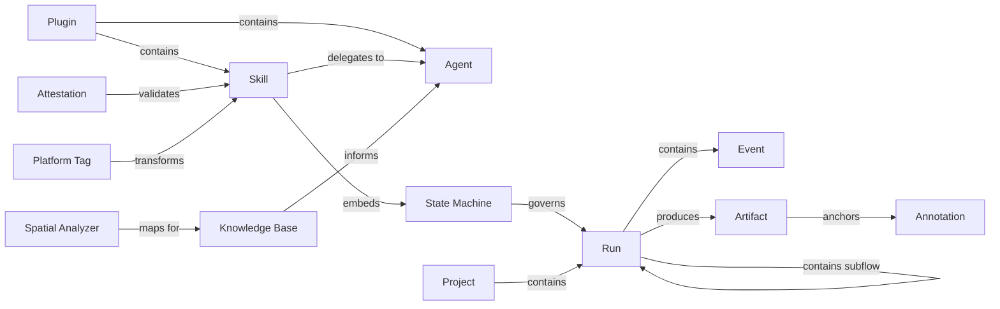

# Domain Concepts & Terminology

**Project**: rp1
**Domain**: AI Agent Orchestration & Developer Tooling

## Core Concepts

### Plugin
**Definition**: Capability package (rp1-base, rp1-dev, rp1-utils) grouping skills and agents under a namespace prefix. Dependency direction enforced: dev depends on base, never reverse.
**Source**: `AGENTS.md`, `plugins/base/skills/knowledge-build/SKILL.md`

### Skill
**Definition**: User-facing workflow entry point defined by SKILL.md with YAML frontmatter, structured arguments, agent delegation, and optional state machine. Follows the Agent Skills open standard (agentskills.io).
**Source**: `docs/concepts/skill-format.md`, `docs/concepts/skills.md`

### Agent
**Definition**: Focused autonomous worker executing workflow body in a single pass with numbered sections and anti-loop directives. Receives pre-resolved parameters from parent skills.
**Source**: `docs/concepts/command-agent-pattern.md`, `docs/concepts/constitutional-prompting.md`

### Run
**Definition**: Tracked workflow execution with UUID run-id, status, steps, events, artifacts, subflows, and agent tasks.
**Source**: `cli/shared/events.ts`, `docs/concepts/state-machines.md`

### Event
**Definition**: Typed record emitted against a run via `rp1 agent-tools emit` with 6 payload types: status_change, artifact_registered, annotation_updated, waiting_for_user, btw_update, subflow_registered.
**Source**: `cli/shared/events.ts`, `cli/src/agent-tools/emit/models.ts`

### Artifact
**Definition**: Typed output file registered against a run with docId, step association, storageRoot routing (absolute/project/work_dir), and optional baseline content for edit tracking.
**Source**: `cli/shared/events.ts`, `docs/concepts/state-machines.md`

### Annotation
**Definition**: Threaded inline comment anchored to artifact via text-selection, hidden-anchor, or line anchor types; supports replies, resolution, and orphan detection.
**Source**: `cli/src/agent-tools/feedback/models.ts`

### State Machine
**Definition**: Mermaid stateDiagram-v2 parsed into typed graph model (SMState, SMTransition) with transition validation, ordered steps, and predecessor auto-completion.
**Source**: `cli/src/agent-tools/state-machine/models.ts`, `docs/concepts/state-machines.md`

### Knowledge Base
**Definition**: Structured codebase documentation in `.rp1/context/` generated via map-reduce spatial analysis and parallel specialist agents. Loaded progressively by task type.
**Source**: `docs/concepts/knowledge-aware-agents.md`, `plugins/base/skills/knowledge-build/SKILL.md`

### Attestation
**Definition**: Content-addressable record linking prompt SHA-256 hash + dependency hash to eval pass/fail result for release gating.
**Source**: `docs/concepts/eval-system.md`

### Task Queue
**Definition**: Persistent task records with lifecycle states (pending/in_progress/completed/failed/cancelled), free-form type, optional payload JSON, and project scoping for cross-agent work coordination.
**Source**: `cli/src/agent-tools/task/models.ts`

### Project
**Definition**: Registered workspace with UUID project_id, path, availability flag, run statistics, and last-activity timestamp.
**Source**: `cli/src/init/models.ts`, `cli/shared/config.ts`

### PR Review
**Definition**: Map-reduce PR analysis with configurable verdict modes, CI platform detection, confidence-gated findings, bot marker identification, and GitHub API integration.
**Source**: `cli/src/agent-tools/github-pr/models.ts`

### Platform Tag
**Definition**: Semantic Liquid custom tag abstracting platform-varying behavior (dispatch_agent, ask_user, edit_model, plan_tool, web_access, permissions) at build time.
**Source**: `docs/concepts/platform-tags.md`

### CanonicalName
**Definition**: Structured identity for plugin artifacts using `plugin:artifact` format with parse/format functions for cross-platform namespace translation (colon for CC, slash with @ prefix for OpenCode, dash for Codex).
**Source**: `AGENTS.md`

### Spatial Analyzer
**Definition**: Scan-only KB agent that performs single-pass repository inventory, ranks files 0-5, and categorizes them into six KB sections for downstream parallel analysis.
**Source**: `plugins/base/agents/kb-spatial-analyzer.md`

## Terminology Glossary

### Workflow & Execution
- **run-id**: UUID identifier for an individual workflow execution
- **emit**: Agent-tools command recording workflow events against a run with type, step, and data payload
- **StatusValue**: Activity category (WHAT is happening): not_started, running, waiting, completed, failed, skipped
- **WorkflowState**: Workflow phase (WHERE in the workflow): defined by state diagram step IDs
- **Predecessor Auto-Completion**: Graph-based mechanism that auto-completes direct predecessor steps when a new step starts running
- **Namespaced Step**: Sub-agent step prefixed with `{agent-name}:` to bypass parent state machine validation
- **--unit**: Emit flag enabling per-task tracking within an agent; disables predecessor auto-completion
- **Subflow**: Nested workflow within a parent run, registered via subflow_registered event
- **BTW Update**: Informal progress message emitted by agents without state transition
- **Logical Step**: Effective-status abstraction that collapses namespaced sub-agent lifecycle steps to their namespace prefix

### Artifacts & Feedback
- **docId**: Content-addressable identifier linking artifacts to annotations and feedback operations
- **storageRoot**: Artifact path routing: 'absolute' (as-is), 'project' (relative to project root), or 'work_dir' (relative to .rp1/work/)
- **Artifact Baseline**: Stored content snapshot enabling diff detection of user edits on registered artifacts
- **AnchorType**: How an annotation attaches to an artifact: text-selection, hidden-anchor, or line
- **Accept-Edit**: Feedback operation that clears artifact baseline, acknowledging a user's direct file edit
- **ArtifactType**: Classification for registered artifacts: markdown, code, diagram, diff, report, or other

### Skills & Build
- **SKILL.md**: Canonical file format for invocable skills with YAML frontmatter following the Agent Skills open standard
- **allowed-tools**: SKILL.md frontmatter field specifying permitted tool calls as comma-separated patterns
- **Validation Level**: Build validation severity: L1 (errors that block build) and L2 (warnings that are advisory)
- **implies chain**: Boolean argument dependency where setting one flag transitively sets others
- **Resolve Args**: 5-layer argument precedence (user input > project settings > user settings > env fallback > schema default)
- **sub_agents**: SKILL.md metadata field declaring agent references for build-time validation

### Dashboard & Communication
- **Arcade**: Web UI dashboard (port 7710) for monitoring agent runs, artifacts, annotations, and notifications
- **State Snapshot**: Full WebSocket recovery payload containing all active runs, steps, artifacts, and last event ID
- **Event Replay**: WebSocket mechanism replaying missed events after reconnection
- **Attention Data**: Dashboard grouping of runs by urgency: waiting, failed, running
- **Verdict**: PR review submission mode: approve, request_changes, comment, or auto
- **Confidence Gating**: PR review finding filter: 65%+ included, 40-64% (critical/high) investigated, below 40% excluded
- **bot_marker**: HTML comment tag identifying rp1-generated PR review comments for idempotent updates

### Infrastructure
- **project directories**: Deterministic rp1 paths; KB at `.rp1/context/`, work artifacts at `.rp1/work/`
- **meta.json**: Local-only KB metadata file containing repo_root and current_project_path; should be gitignored
- **state.json**: Shareable KB build metadata containing strategy, repo_type, git_commit, files_analyzed, languages, and metrics
- **Worktree**: Git worktree detected by rp1-root-dir; rp1 tracks isWorktree and worktreeName
- **ProjectContext**: Init wizard classification: brownfield (existing code) or greenfield (new project)
- **CIPlatform**: Detected CI environment: github_actions, buildkite, gitlab_ci, or generic_ci

### Patterns & Methodology
- **Builder-Reviewer**: Adversarial cooperation pattern where a builder implements and a reviewer verifies with single retry
- **Constitutional Prompting**: Pattern encoding expert knowledge, anti-loop directives, and output contracts into agent prompts
- **Progressive Disclosure**: Load index.md always, then additional KB files only when needed by task type
- **Scratch Pad**: Visible file section used by stateless agents to persist interview state across sessions
- **Diff Frontier**: Scoped changed-file list used in KB modes to bias file inclusion toward recently changed files
- **Bayesian Reconciliation**: KB update strategy treating existing content as prior hypotheses and new evidence as updates
- **Novelty Scan**: Explicit post-reconciliation step where KB agents search for material knowledge absent from prior

## Concept Relationships

```mermaid
graph LR
    Plugin -->|contains| Skill
    Plugin -->|contains| Agent
    Skill -->|delegates to| Agent
    Skill -->|embeds| SM[State Machine]
    SM -->|governs| Run
    Run -->|contains| Event
    Run -->|produces| Artifact
    Run -->|contains subflow| Run
    Artifact -->|anchors| Annotation
    KB[Knowledge Base] -->|informs| Agent
    Attestation -->|validates| Skill
    Project -->|contains| Run
    PlatformTag[Platform Tag] -->|transforms| Skill
    SpatialAnalyzer[Spatial Analyzer] -->|maps for| KB
```

## Bounded Contexts

| Context | Scope | Key Concepts |
|---------|-------|--------------|
| Knowledge Management | rp1-base | KB Generation, Spatial Analysis, Progressive Loading, Bayesian Reconciliation |
| Feature Delivery | rp1-dev | Build Workflow, Builder-Reviewer, Blueprint/PRD, PR Review, Feature Archive |
| Prompt Tooling | rp1-utils | Eval Extraction, Prompt Writing, Tersification |
| Runtime Services | cli/src | Build Pipeline, Install, Init, Agent Tools, Settings |
| Dashboard | cli/web-ui | Arcade, Run Visualization, Annotations, WebSocket |
| Quality Assurance | evals/ | Attestation, Content-Addressable Hashing, Verification |
| Platform Abstraction | Build pipeline | Platform Tags, Liquid Preprocessing, Namespace Translation |

## Cross-Cutting Concerns

- **Error Handling**: Tagged union CLIError with _tag discriminant, 14 variants, fp-ts Either/TaskEither integration
- **Real-Time Communication**: WebSocket message union with typed event notifications, reconnection recovery via state snapshot + event replay
- **State Management**: Two-layer model (StatusValue x WorkflowState), declarative state machines, predecessor auto-completion
- **Platform Portability**: Semantic Liquid tags with build-time rendering per platform; CanonicalName for cross-platform identity
- **Configuration**: Five-layer argument precedence with implies chains; TOML settings at global and project levels
- **Runtime Detection**: Bun-preferred with Node.js fallback via detectRuntime(); host platform detection for Claude Code, OpenCode, Codex

## Cross-References
- **System topology**: See [architecture.md](architecture.md)
- **Component inventory**: See [modules.md](modules.md)
- **Implementation idioms**: See [patterns.md](patterns.md)
- **Surface behavior**: See [interaction-model.md](interaction-model.md)
