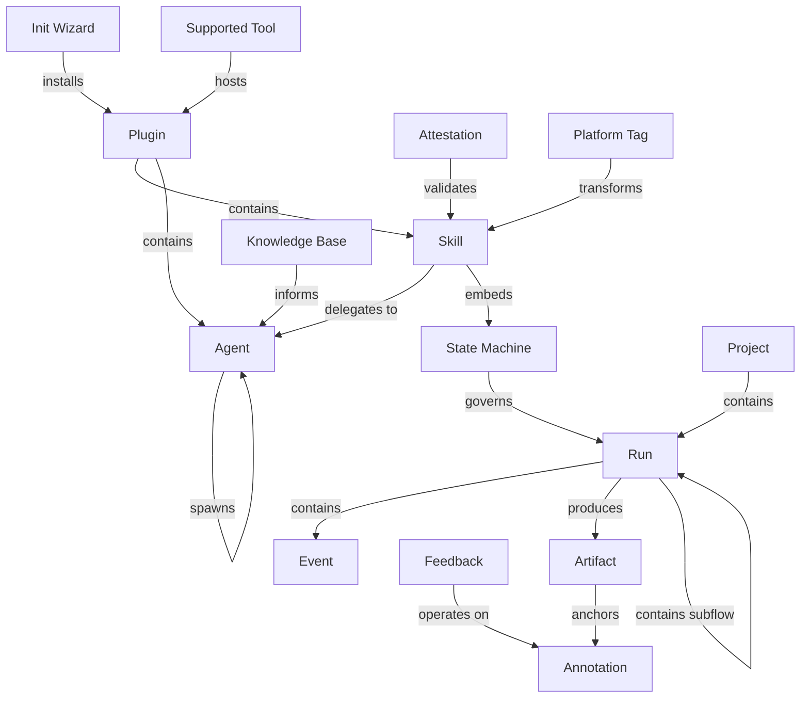

# Domain Concepts & Terminology

**Project**: rp1
**Domain**: AI Agent Orchestration & Developer Tooling

## Core Concepts

### Plugin
**Definition**: Capability package (rp1-base, rp1-dev, rp1-utils) grouping skills and agents under a namespace prefix.
**Implementation**: `plugins/{name}/.claude-plugin/plugin.json`, `catalog/skills.yaml`, `catalog/agents.yaml`
**Key Properties**:
- Namespace prefix: `/rp1-base:`, `/rp1-dev:`, `/rp1-utils:`
- Contains skills (SKILL.md) and agents (.md)
- Dependency direction: dev depends on base, never reverse

### Skill
**Definition**: User-facing workflow entry point defined by SKILL.md with YAML frontmatter, parameters, agent delegation, and optional state machine.
**Implementation**: `plugins/{plugin}/skills/{name}/SKILL.md`
**Key Properties**:
- YAML frontmatter with `allowed-tools`, `argument-hint`
- Delegates work to agents via Task tool
- May embed `## STATE-MACHINE` with stateDiagram-v2

### Agent
**Definition**: Focused autonomous worker executing workflow body in a single pass with numbered sections and anti-loop directives.
**Implementation**: `plugins/{plugin}/agents/{name}.md`
**Key Properties**:
- Constitutional prompting pattern (numbered sections, output contracts)
- Cannot spawn other agents when running as sub-agent
- Namespaced step tracking (`{agent-name}:step`)

### Run
**Definition**: Tracked workflow execution with UUID run-id, status, steps, events, artifacts, subflows, and agent tasks.
**Implementation**: `cli/shared/events.ts`, `cli/web-ui/src/types/runs.ts`
**Key Properties**:
- UUID `run-id` identifier
- Two-layer state: StatusValue (what) x WorkflowState (where)
- Contains ordered events, artifacts, subflows

### Event
**Definition**: Typed record emitted against a run via `rp1 agent-tools emit` with 6 payload types: status_change, artifact_registered, annotation_updated, waiting_for_user, btw_update, subflow_registered.
**Implementation**: `cli/shared/events.ts`, `cli/src/agent-tools/emit/models.ts`

### Artifact
**Definition**: Typed output file registered against a run with docId, step association, and optional baseline content for edit tracking.
**Implementation**: `cli/shared/events.ts`, `cli/web-ui/src/types/runs.ts`

### Annotation
**Definition**: Threaded inline comment anchored to artifact via text-selection, hidden-anchor, or line; supports replies, resolution, and orphan detection.
**Implementation**: `cli/web-ui/src/types/annotations.ts`

### Feedback
**Definition**: Agent-tools subcommand enabling agents to programmatically interact with Arcade annotations: read (with status filtering), resolve, reply, and accept-edit.
**Implementation**: `cli/src/agent-tools/feedback/models.ts`

### State Machine
**Definition**: Mermaid stateDiagram-v2 parsed into typed graph model (SMState, SMTransition) with transition validation, ordered steps, and predecessor auto-completion.
**Implementation**: `cli/src/agent-tools/state-machine/models.ts`, `docs/concepts/state-machines.md`
**Key Properties**:
- Sub-agent steps namespaced with `{agent-name}:` prefix
- `--unit` flag enables per-task tracking
- Predecessor auto-completion preserves parallel branch correctness

### Knowledge Base
**Definition**: Structured codebase documentation in `.rp1/context/` generated via map-reduce spatial analysis and parallel specialist agents.
**Implementation**: `docs/concepts/knowledge-aware-agents.md`
**Key Properties**:
- Progressive disclosure loading pattern
- 5 files: index, concept_map, architecture, modules, patterns
- Incremental updates via git diff change detection

### Attestation
**Definition**: Content-addressable record linking prompt SHA-256 hash + dependency hash to eval pass/fail result for release gating.
**Implementation**: `evals/src/attestation/types.ts`

### Task Queue
**Definition**: Persistent task records with lifecycle states (pending/in_progress/completed/failed/cancelled) for cross-agent work coordination.
**Implementation**: `cli/src/agent-tools/task/models.ts`

### Project
**Definition**: Registered workspace with path, availability flag, run statistics, and last-activity timestamp.
**Implementation**: `cli/web-ui/src/types/projects.ts`

### PR Review
**Definition**: Map-reduce PR analysis with configurable verdict modes, CI platform detection, confidence-gated findings, and GitHub API integration.
**Implementation**: `cli/src/pr-review/models.ts`, `cli/src/agent-tools/github-pr/models.ts`

### Init Wizard
**Definition**: Multi-step initialization workflow with project context detection (brownfield/greenfield), tool detection, plugin installation, and health checks.
**Implementation**: `cli/src/init/models.ts`

### Supported Tool
**Definition**: Registered agentic host platform (Claude Code, OpenCode, Codex) with binary, version, instruction file, and capabilities.
**Implementation**: `cli/src/config/supported-tools.ts`, `cli/src/config/supported-tools.yaml`

### ToolResult Envelope
**Definition**: Standard JSON response `{success, tool, data, errors}` returned by all agent tools for consistent AI agent parsing.
**Implementation**: `cli/src/agent-tools/models.ts`

### Platform Tag
**Definition**: Semantic Liquid custom tag abstracting platform-varying behavior (dispatch_agent, ask_user, edit_model, permissions) at build time.
**Implementation**: `docs/concepts/platform-tags.md`

## Terminology Glossary

### Core Terms
- **SKILL.md**: Canonical file format for invocable skills with YAML frontmatter following the Agent Skills open standard
- **RP1_ROOT**: Resolved `.rp1/` workspace root via env variable, git-common-dir (worktree), or cwd traversal
- **run-id**: UUID identifier for an individual workflow execution
- **emit**: Agent-tools command recording workflow events against a run with type, step, and data payload
- **Arcade**: Web UI dashboard (port 7710) for monitoring agent runs, artifacts, and annotations with WebSocket real-time updates
- **docId**: Content-addressable identifier linking artifacts to annotations and feedback operations

### Status & State Terms
- **StatusValue**: Activity category (WHAT is happening): not_started, running, waiting, completed, failed, skipped
- **WorkflowState**: Workflow phase (WHERE in the workflow): defined by state diagram step IDs
- **Predecessor Auto-Completion**: Graph-based mechanism that auto-completes direct predecessor steps when a new step starts running
- **Namespaced Step**: Sub-agent step prefixed with `{agent-name}:` to bypass parent state machine validation
- **--unit**: Emit flag enabling per-task tracking within an agent; disables predecessor auto-completion

### Error & Validation Terms
- **CLIError**: Tagged union error type with `_tag` discriminant, 14 variants, factory functions, and exit code mapping
- **Validation Level**: Build validation severity: L1 (errors that block build) and L2 (warnings that are advisory)
- **Confidence Gating**: PR review finding filter: 65%+ included, 40-64% (critical/high) investigated, below 40% excluded

### Workflow Pattern Terms
- **Builder-Reviewer**: Adversarial cooperation pattern where a builder agent implements and a reviewer agent verifies, with single retry and escalation
- **Constitutional Prompting**: Pattern encoding expert knowledge, anti-loop directives, numbered sections, and output contracts into agent prompts
- **Scratch Pad**: Visible file section used by stateless agents to persist interview state across sessions for resumability
- **BTW Update**: Informal progress message emitted by agents without state transition via btw_update event type
- **Subflow**: Nested workflow within a parent run, registered via subflow_registered event with parentStepId

### Annotation Terms
- **AnchorType**: How an annotation attaches to an artifact: text-selection, hidden-anchor, or line
- **Accept-Edit**: Feedback operation that clears artifact baseline, acknowledging a user's direct file edit
- **Artifact Baseline**: Stored content snapshot enabling diff detection of user edits on registered artifacts

### Platform Terms
- **Verdict**: PR review submission mode: approve, request_changes, comment, or auto
- **CIPlatform**: Detected CI environment: github_actions, buildkite, gitlab_ci, or generic_ci
- **AIHarness**: Tool runtime used for PR reviews: claude-code or opencode
- **EvalPlatform**: Target platform for attestation: claude-code, opencode, or codex
- **ProjectContext**: Init wizard classification: brownfield (existing code) or greenfield (new project)
- **allowed-tools**: SKILL.md frontmatter field specifying permitted tool calls

## Concept Relationships

```mermaid
graph TB
    Plugin -->|contains| Skill
    Plugin -->|contains| Agent
    Skill -->|delegates to| Agent
    Skill -->|embeds| SM[State Machine]
    Agent -->|spawns| Agent
    SM -->|governs| Run
    Run -->|contains| Event
    Run -->|produces| Artifact
    Run -->|contains subflow| Run
    Artifact -->|anchors| Annotation
    Feedback -->|operates on| Annotation
    KB[Knowledge Base] -->|informs| Agent
    Attestation -->|validates| Skill
    Project -->|contains| Run
    InitWizard[Init Wizard] -->|installs| Plugin
    SupportedTool[Supported Tool] -->|hosts| Plugin
    PlatformTag[Platform Tag] -->|transforms| Skill
```

## Bounded Contexts

| Context | Scope | Key Concepts |
|---------|-------|--------------|
| Knowledge Management | rp1-base plugin | KB Generation, Spatial Analysis, Progressive Loading |
| Feature Delivery | rp1-dev plugin | Build Workflow, Builder-Reviewer, Blueprint/PRD, PR Review |
| Prompt Tooling | rp1-utils plugin | Eval Extraction, Prompt Writing, Tersification |
| Runtime Services | cli/src | Build Pipeline, Install, Init, Agent Tools, Settings |
| Dashboard | cli/web-ui | Arcade, Run Visualization, Annotations, WebSocket |
| Quality Assurance | evals/ | Attestation, Content-Addressable Hashing, Verification |

## Cross-References
- **Architecture layers**: See [architecture.md](architecture.md)
- **Module responsibilities**: See [modules.md](modules.md)
- **Implementation patterns**: See [patterns.md](patterns.md)
