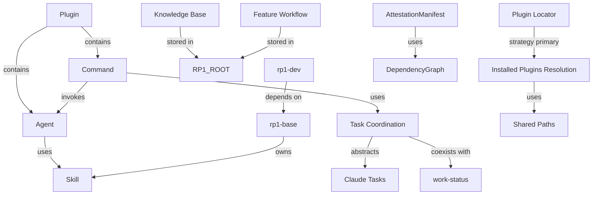

# Domain Concepts & Terminology

**Project**: rp1 Plugin System
**Domain**: AI-Assisted Development Workflows

## Core Concepts

### Plugin
**Type**: Entity
**Definition**: Self-contained unit providing commands, agents, and skills for Claude Code/OpenCode platforms. Three plugins exist: rp1-base (foundation), rp1-dev (development workflows), rp1-utils (prompt utilities).
**Source**: `plugins/base/.claude-plugin/plugin.json`, `plugins/dev/.claude-plugin/plugin.json`

### Command
**Type**: Entity
**Definition**: User-facing slash command acting as a thin wrapper (50-100 lines) that parses parameters and delegates to agents via the Task tool. Contains no business logic.
**Source**: `plugins/*/commands/*.md`

### Agent
**Type**: Entity
**Definition**: Autonomous worker (200-350 lines) with constitutional structure that executes complete workflows in single-pass with anti-loop directives and JSON output contracts.
**Source**: `plugins/*/agents/*.md`

### Skill
**Type**: Entity
**Definition**: Reusable capability defined exclusively in base plugin. Provides templates, workflows, and utilities that agents can invoke for specialized tasks.
**Source**: `plugins/base/skills/`

### Knowledge Base
**Type**: Entity
**Definition**: Auto-generated codebase documentation stored in `{RP1_ROOT}/context/` containing index.md, concept_map.md, architecture.md, modules.md, patterns.md, state.json.
**Source**: `.rp1/context/`

### RP1_ROOT
**Type**: Entity
**Definition**: Root directory for rp1 artifacts. Resolution-aware: from env override, git common-dir (linked worktree), or cwd. Contains `context/` (KB files), `work/` (features, worktrees).
**Source**: `cli/src/agent-tools/rp1-root-dir/resolver.ts`

### Feature Workflow
**Type**: Process
**Definition**: Six-step development process: blueprint -> requirements -> design -> tasks -> build -> verify. Artifacts stored in `{RP1_ROOT}/work/features/{FEATURE_ID}/`.
**Source**: `plugins/dev/commands/`

### Worktree Workflow
**Type**: Process
**Definition**: Four-phase isolated git workflow for safe agent execution: Setup -> Implementation -> Publish -> Cleanup.
**Source**: `plugins/dev/skills/worktree-workflow/SKILL.md`

### Task Coordination
**Type**: Process
**Definition**: Platform-agnostic skill that surfaces real-time workflow progress in Claude Code's native task UI via TaskCreate/TaskUpdate tools, with silent no-op fallback on platforms without Task tools (OpenCode).
**Source**: `plugins/base/skills/task-coordination/SKILL.md`, `docs/concepts/task-coordination.md`

### Installed Plugins Resolution
**Type**: Mechanism
**Definition**: Plugin command lookup strategy that resolves commands from Claude Code's installed_plugins.json file (prefix-matched by plugin ID), falling back to project-local paths if unavailable.
**Source**: `cli/src/agent-tools/transform-args/plugin-locator.ts`

### Shared Paths
**Type**: Utility
**Definition**: Single source of truth for Claude Code plugin directory resolution across the CLI. Cross-platform (macOS/Linux `~/.claude/plugins`, XDG fallback, Windows AppData).
**Source**: `cli/src/shared/paths.ts`

### Stateless Agent
**Type**: Pattern
**Definition**: Agent pattern for resumable interview workflows. Uses file-based scratch pad for state instead of conversation context.
**Source**: `docs/concepts/stateless-agents.md`, `plugins/dev/agents/charter-interviewer.md`

### ToolResult
**Type**: Entity
**Definition**: Standard JSON envelope for all agent tools with success, tool name, data, and optional errors fields.
**Source**: `cli/src/agent-tools/models.ts`

### AttestationManifest
**Type**: Entity
**Definition**: Root structure tracking command attestations, file hashes, and schema version for content-addressable verification of prompt files.
**Source**: `evals/src/attestation/types.ts`

### DependencyGraph
**Type**: Entity
**Definition**: Command dependency tree mapping command -> agents -> skills for hash computation and change tracking.
**Source**: `evals/src/attestation/deps-graph.ts`

## Terminology Glossary

| Term | Definition |
|------|-----------|
| Single-Pass Execution | Agent execution model where complete workflow is performed in one run without iteration |
| Thin Wrapper | Command design pattern with no business logic, only parameter parsing and agent routing (50-100 lines) |
| Output Contract | Agent specification defining exactly what artifacts/files/structures the agent produces |
| Anti-Loop Directive | Explicit instruction preventing iteration loops, forcing single-pass completion |
| Direct KB Loading | Agents read `context/*.md` files directly via Read tool (subagent limitation workaround) |
| Positional Parameters | Argument syntax using `$1`, `$2`, `$ARGUMENTS` for cross-platform compatibility |
| Incremental Build | KB rebuild mode that only processes changed files via git diff comparison |
| First-Call Probe | Feature detection pattern where the first real operation doubles as availability detection |
| No-Op Fallback | Silent skip pattern where operations return null/empty with zero errors when platform capabilities unavailable |
| Claude Tasks | Ephemeral runtime coordination objects (TaskCreate/TaskUpdate) in Claude Code's native task UI, distinct from tasks.md planning artifacts |
| tasks.md | Durable planning artifact created by feature-tasker containing implementation tasks with acceptance criteria |
| installed_plugins.json | Claude Code's registry file mapping plugin names (e.g., `rp1-dev@rp1-local`) to installPath directories |
| Conventional Commit | Commit format: `type(scope): description`. Types: feat, fix, refactor, docs, test, chore |
| Prompt Hash | SHA-256 hash of command prompt file content (excluding frontmatter), prefixed with `sha256:` |
| Deps Hash | Combined hash of all transitive dependencies (agents + skills) for a command |
| Review Unit | Segmented piece of PR diff created by splitter for focused analysis |
| Confidence Gating | PR review filtering: 65%+ include, 40-64% investigate (critical/high only), <40% exclude |
| Scratch Pad | File-based state storage for stateless agents |

## Relationships

```mermaid
graph TB
    Plugin -->|contains| Command
    Plugin -->|contains| Agent
    Command -->|invokes| Agent
    Agent -->|uses| Skill
    Base[rp1-base] -->|owns| Skill
    Dev[rp1-dev] -->|depends on| Base
    KB[Knowledge Base] -->|stored in| ROOT[RP1_ROOT]
    FW[Feature Workflow] -->|stored in| ROOT
    TC[Task Coordination] -->|abstracts| CT[Claude Tasks]
    Command -->|uses| TC
    TC -->|coexists with| WS[work-status]
    IPR[Installed Plugins Resolution] -->|uses| SP[Shared Paths]
    PL[Plugin Locator] -->|strategy primary| IPR
    AM[AttestationManifest] -->|uses| DG[DependencyGraph]
```

## Bounded Contexts

| Context | Scope | Key Concepts |
|---------|-------|-------------|
| Knowledge Management | Base plugin | KB Generation, Spatial Analysis, Progressive Loading |
| Development Workflows | Dev plugin | Feature Workflows, Code Quality, PR Management, Worktree Isolation |
| CLI Tools | `cli/src/agent-tools/` | Worktree Mgmt, RP1 Root Resolution, Plugin Locator, Shared Paths |
| Web UI | `cli/web-ui/` | Runs, Steps, Artifacts, Annotations, WebSocket Updates |
| Eval Attestation | `evals/` | Content Hashing, Dependency Graph, Attestation Manifest |
| Runtime Coordination | Base plugin skills | Task Coordination, Work Status, Claude Tasks |

## Cross-Cutting Concerns

- **Error Handling**: Fallback patterns - parallel to sequential on failure; installed plugins to project-local paths
- **Platform Compatibility**: Feature detection with no-op fallback; cross-platform path resolution; positional parameters
- **State Management**: File-based via RP1_ROOT, SQLite for dashboard, ephemeral Claude Tasks for runtime
- **Configuration**: RP1_ROOT resolution with env override, git common-dir, cwd fallback; shared paths module
