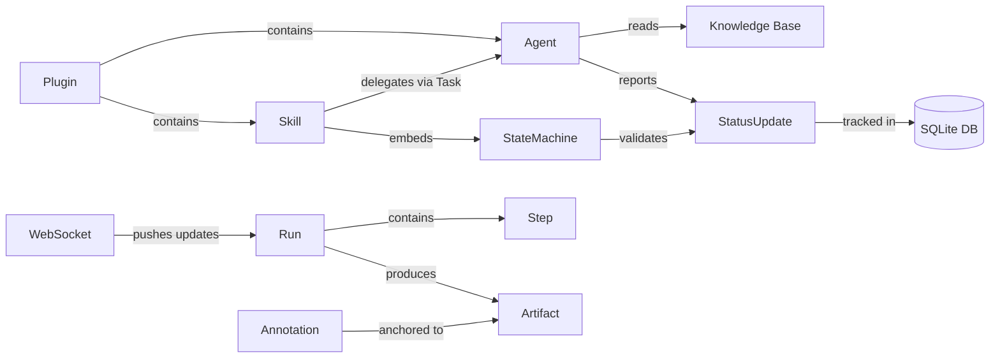

# Domain Concepts & Terminology

**Project**: rp1
**Domain**: AI-Powered Development Workflow Automation

## Core Concepts

### Plugin
**Definition**: Self-contained unit providing skills, agents, and commands for Claude Code/OpenCode platforms.
**Implementation**: `plugins/{base,dev,utils}/`
**Variants**:
- **rp1-base**: Foundation (knowledge management, documentation, strategy, security)
- **rp1-dev**: Development workflows (feature lifecycle, code quality, PR management)
- **rp1-utils**: Meta-tooling (prompt engineering, eval generation)

**Rules**: Dev depends on base (one-way); base is independent; utils is independent.

### Skill
**Definition**: Primary invocable unit in SKILL.md canonical format (Agent Skills open standard). Minimal wrapper parsing parameters via model-driven extraction, delegating to agents via Task tool.
**Implementation**: `plugins/{plugin}/skills/{name}/SKILL.md`
**Key Properties**:
- Frontmatter: name, description, allowed-tools, metadata
- Thin wrapper pattern: no business logic, only parameter parsing + agent routing

### Agent
**Definition**: Autonomous worker (200-350 lines) with constitutional structure. Executes complete workflows in single-pass with anti-loop directives and JSON output contracts.
**Implementation**: `plugins/{plugin}/agents/{name}.md`
**Key Properties**:
- Constitutional structure: parameter table, execution instructions, output contract
- Single-pass execution: no iteration or feedback loops
- Cannot spawn other agents (subagent limitation)

### Knowledge Base (KB)
**Definition**: Auto-generated codebase documentation in `.rp1/context/` built via map-reduce with 5 parallel agents. Supports progressive loading.
**Implementation**: `.rp1/context/{index,concept_map,architecture,modules,patterns}.md`
**Key Properties**:
- Progressive disclosure: load index.md first, then task-specific files
- Incremental updates via git commit comparison
- State tracked in state.json

### Feature Workflow
**Definition**: Six-step development process: requirements -> design -> tasks -> build -> verify -> archive.
**Implementation**: `.rp1/work/features/{FEATURE_ID}/`
**Artifacts**: requirements.md, design.md, tasks.md, field-notes.md
**State tracking**: Via embedded Mermaid stateDiagram-v2 and SQLite status DB

### ToolResult
**Definition**: Standard JSON envelope for all agent tools: `{ success, tool, data, errors? }`.
**Implementation**: `cli/src/agent-tools/models.ts`

### RP1_ROOT
**Definition**: Root directory for rp1 artifacts. Resolution-aware: env override, git-common-dir (linked worktree), or cwd.
**Implementation**: `cli/src/agent-tools/rp1-root-dir/`
**Contains**: `context/` (KB) and `work/` (features, worktrees)

### StatusUpdate
**Definition**: Work status record in SQLite (`~/.rp1/status.db`) with project path, feature, step, workflow, agent, task, run-id, status value, and metadata.
**Implementation**: `cli/src/agent-tools/work/models.ts`, `cli/src/agent-tools/work/database.ts`
**Two-layer state model**: StatusValue (activity category) x WorkflowState (phase from state diagram)

### StateMachine
**Definition**: Declarative workflow state management via embedded Mermaid stateDiagram-v2 blocks in skill/agent markdown.
**Implementation**: `cli/src/agent-tools/state-machine/`
**Provides**: Transition validation, dashboard step timelines, run isolation, agent sub-state tracking

### Run
**Definition**: Agent execution instance tracked by Status Dashboard with status (queued/running/waiting-input/completed/failed/needs-review), steps, artifacts, and events.
**Implementation**: `cli/web-ui/src/types/runs.ts`

### Artifact
**Definition**: Output file produced by a run (markdown, code, diagram, diff, report, other). Registered via CLI and stored in artifacts table.
**Implementation**: `cli/src/agent-tools/work/models.ts`

### Worktree
**Definition**: Isolated git workspace for parallel agent work. Created via CLI tool with branch name and basedOn commit SHA. Hooks disabled for agent safety.
**Implementation**: `cli/src/agent-tools/worktree/`
**Lifecycle**: setup -> implementation -> publish -> cleanup

### Annotation
**Definition**: Inline comment on an artifact with anchor (text-selection, hidden-anchor, or line), threaded replies, and resolution status.
**Implementation**: `cli/web-ui/src/types/annotations.ts`

### CLIError
**Definition**: Tagged union error type with 14 variants (usage, not-found, config, runtime, port-in-use, parse, transform, validation, generation, prerequisite, install, backup, verification, strict-mode). Each maps to an exit code.
**Implementation**: `cli/shared/errors.ts`

### PRReviewConfig
**Definition**: Configuration for automated PR review from `.rp1/config/pr-review.yaml`. Controls AI harness, verdict mode, inline comments, CI platform, and confidence gating thresholds.
**Implementation**: `cli/src/pr-review/models.ts`

### AttestationManifest
**Definition**: Content-addressable tracking of skill attestations (prompt_hash, deps_hash, version, last_eval). SHA-256 hashes detect prompt changes requiring re-evaluation.
**Implementation**: `evals/src/attestation/types.ts`

## Terminology Glossary

### Design Patterns
- **Constitutional Prompting**: Agent behavior defined through structured markdown with rules and constraints, enabling consistent single-pass execution
- **Single-Pass Execution**: Agent completes workflow in one run without iteration or feedback loops
- **Anti-Loop Directive**: Explicit instruction preventing iteration loops, forcing autonomous completion
- **Thin Wrapper**: Skill pattern with no business logic, only parameter parsing and agent routing via Task tool
- **Model-Driven Parameter Parsing**: AI model infers parameters from natural language using ## Parameters table
- **Adversarial Cooperation (Builder-Reviewer)**: Two agents work together: builder implements, reviewer critiques with one retry before escalation
- **Map-Reduce**: Split work into independent units, process N agents in parallel, merge results
- **Stateless Agent Pattern**: Resumable workflow where agent reads state from file-based scratch pad, not conversation memory

### Workflow Terms
- **Progressive KB Loading**: Load index.md first, then selectively load additional KB files based on task type (reduces context 50-70%)
- **SKILL.md Format**: Canonical format based on Agent Skills open standard replacing legacy command format
- **Confidence Gating**: PR review filtering: 65%+ include, 40-64% investigate critical only, below 40% exclude
- **Review Unit**: Segmented piece of PR diff for focused sub-reviewer analysis
- **Attention Status**: Work status values (waiting-input, needs-review) signaling human attention needed
- **Two-Layer State Model**: Orthogonal state dimensions: StatusValue (what) x WorkflowState (where)
- **Run Isolation**: Each --run-id UUID creates an independent workflow invocation
- **Spatial Analysis**: KB phase that scans repository and categorizes files with importance scores (0-5)
- **basedOn Commit**: SHA from which worktree branch was created; used for commit ownership validation
- **Scratch Pad**: File-based state storage for stateless agents; visible markdown persisted across sessions
- **Allowed-Tools**: SKILL.md frontmatter field pre-authorizing Bash commands to avoid permission prompts
- **Content-Addressable Attestation**: SHA-256 hashes create cryptographic links between prompt content and test results

## Concept Relationships

```mermaid
graph LR
    Plugin -->|contains| Skill
    Plugin -->|contains| Agent
    Skill -->|"delegates via Task"| Agent
    Agent -->|reads| KB[Knowledge Base]
    Agent -->|reports| StatusUpdate
    StatusUpdate -->|tracked in| SQLite[(SQLite DB)]
    StateMachine -->|validates| StatusUpdate
    Run -->|contains| Step
    Run -->|produces| Artifact
    Annotation -->|anchored to| Artifact
    Skill -->|embeds| StateMachine
    WebSocket -->|pushes updates| Run
```

## Concept Boundaries

| Context | Scope | Key Concepts |
|---------|-------|--------------|
| Base Plugin | Foundation/utilities | KB management, documentation, strategy, security |
| Dev Plugin | Development workflows | Feature lifecycle, code quality, PR review, builder-reviewer |
| Utils Plugin | Prompt utilities | Eval generation, prompt optimization, attestation |
| CLI Agent-Tools | Agent-facing utilities | Worktree, mermaid validation, comment extraction, work status, state machine, GitHub PR, RP1_ROOT |
| Installation System | Plugin lifecycle | Manifests, prerequisites, staging, backup/restore, verification |
| Web UI | Real-time dashboard | Projects, runs, steps, artifacts, annotations, WebSocket events, attention grouping |
| Status Database | SQLite persistence | Status updates, artifacts table, migrations, WAL mode, TTL expiry, run isolation |

## Cross-Cutting Concerns

- **Error Handling**: Tagged union CLIError with fp-ts TaskEither pipelines across CLI, agent tools, and installation
- **State Management**: SQLite + state machine validation + WebSocket push for real-time dashboard updates
- **Platform Compatibility**: SKILL.md format works on Claude Code and generates OpenCode artifacts via build pipeline
- **Real-time Communication**: WebSocket with typed ServerMessage union (status_changed, run:event, run:artifact, annotation:*)
