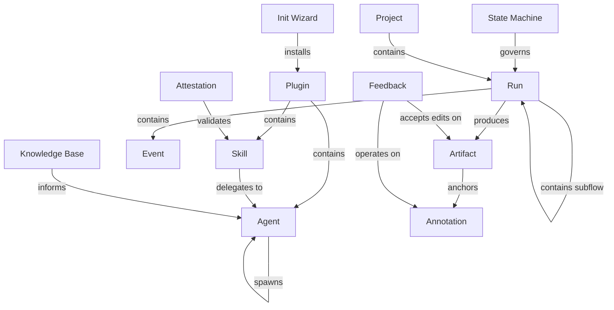

# Domain Concepts & Terminology

**Project**: rp1
**Domain**: AI Agent Orchestration & Developer Tooling

## Core Concepts

### Plugin
**Definition**: Capability package (rp1-base, rp1-dev, rp1-utils) grouping skills and agents under a namespace prefix
**Implementation**: `plugins/{base,dev,utils}/`
**Key Properties**:
- Manifest at `.claude-plugin/plugin.json` with version and metadata
- Contains skills (SKILL.md) and agents (agent.md)
- Namespace prefix determines command routing (`/rp1-base:*`, `/rp1-dev:*`, `/rp1-utils:*`)

**Dependency Rules**:
- Dev may depend on base at runtime
- Base must never call dev commands
- Utils is independent

### Skill
**Definition**: User-facing workflow entry point defined by SKILL.md with YAML frontmatter, parameters, agent delegation, and optional state machine
**Implementation**: `plugins/{plugin}/skills/{name}/SKILL.md`
**Key Properties**:
- `allowed-tools` in frontmatter for permission control
- Parameters via `$1`, `$2`, `$ARGUMENTS` positional args
- Delegates execution to agents via Task tool

### Agent
**Definition**: Focused autonomous worker executing workflow body in a single pass with numbered sections and anti-loop directives
**Implementation**: `plugins/{plugin}/agents/{name}.md`
**Key Properties**:
- Stateless execution (scratch pad pattern for interview workflows)
- Constitutional prompting: encoded expertise, output contracts
- Sub-agent step namespacing (`{agent-name}:{step}`)

### Run
**Definition**: Tracked workflow execution with UUID run-id, status, steps, events, artifacts, subflows, and agent tasks
**Implementation**: `cli/shared/events.ts`, `cli/web-ui/src/types/runs.ts`
**Key Properties**:
- StatusValue (what): running, waiting, completed, failed
- WorkflowState (where): step IDs from state diagram
- Contains ordered events, registered artifacts, nested subflows

### Event
**Definition**: Typed record emitted against a run via `rp1 agent-tools emit`
**Types**: status_change, artifact_registered, annotation_updated, waiting_for_user, btw_update, subflow_registered
**Implementation**: `cli/shared/events.ts`, `cli/src/agent-tools/emit/models.ts`

### Artifact
**Definition**: Typed output file registered against a run with docId, step association, and optional baseline content for edit tracking
**Types**: markdown, code, diagram, diff, report, other
**Implementation**: `cli/shared/events.ts`

### Annotation
**Definition**: Threaded inline comment anchored to artifact via text-selection, hidden-anchor, or line; supports replies, resolution, and orphan detection
**Implementation**: `cli/web-ui/src/types/annotations.ts`

### Feedback
**Definition**: Agent-tools subcommand enabling agents to programmatically interact with Arcade annotations: read (with status filtering), resolve, reply, and accept-edit
**Implementation**: `cli/src/agent-tools/feedback/models.ts`

### State Machine
**Definition**: Mermaid stateDiagram-v2 parsed into typed graph model (SMState, SMTransition) with transition validation, ordered steps, and predecessor auto-completion
**Implementation**: `cli/src/agent-tools/state-machine/models.ts`
**Key Properties**:
- Graph-based predecessor auto-completion preserves parallel branch correctness
- Namespaced sub-agent steps bypass parent validation
- Cache -> bundle -> filesystem discovery chain with TE.orElse fallback

### Knowledge Base
**Definition**: Structured codebase documentation in `.rp1/context/` generated via map-reduce spatial analysis and parallel specialist agents
**Loading**: Progressive disclosure — index.md first, then task-specific files

### Attestation
**Definition**: Content-addressable record linking prompt SHA-256 hash + dependency hash to eval pass/fail result for release gating
**Implementation**: `evals/src/attestation/types.ts`

### Task Queue
**Definition**: Persistent task records with lifecycle states (pending/in_progress/completed/failed/cancelled) for cross-agent work coordination
**Implementation**: `cli/src/agent-tools/task/models.ts`

### Project
**Definition**: Registered workspace with path, availability flag, run statistics, and last-activity timestamp
**Implementation**: `cli/web-ui/src/types/projects.ts`

### PR Review
**Definition**: Map-reduce PR analysis with configurable verdict modes, CI platform detection, confidence-gated findings, and GitHub API integration
**Implementation**: `cli/src/pr-review/models.ts`, `cli/src/agent-tools/github-pr/models.ts`

### Init Wizard
**Definition**: Multi-step initialization workflow with project context detection (brownfield/greenfield), tool detection, plugin installation, and health checks
**Implementation**: `cli/src/init/models.ts`

## Terminology Glossary

### Core Terms
- **SKILL.md**: Canonical file format for invocable skills with YAML frontmatter following the Agent Skills open standard
- **RP1_ROOT**: Resolved `.rp1/` workspace root via env variable, git-common-dir (worktree), or cwd traversal
- **run-id**: UUID identifier for an individual workflow execution
- **emit**: Agent-tools command recording workflow events against a run
- **Arcade**: Web UI dashboard (port 7710) for monitoring agent runs, artifacts, and annotations
- **ToolResult Envelope**: Standard JSON response `{success, tool, data, errors}` returned by all agent tools
- **CLIError**: Tagged union error type with `_tag` discriminant, 13 variants, factory functions, and exit code mapping

### Workflow Terms
- **Verdict**: PR review submission mode: approve, request_changes, comment, or auto
- **BTW Update**: Informal progress message emitted by agents without state transition
- **Scratch Pad**: Visible file section used by stateless agents to persist interview state across sessions
- **Attention Grouping**: Dashboard partitioning runs into waiting, failed, and running groups
- **Subflow**: Nested workflow within a parent run, registered via subflow_registered event
- **Namespaced Step**: Sub-agent step prefixed with `{agent-name}:` to bypass parent state machine validation
- **--unit**: Emit flag enabling per-task tracking; disables predecessor auto-completion

### Annotation Terms
- **AnchorType**: How an annotation attaches: text-selection, hidden-anchor, or line
- **Accept-Edit**: Feedback operation that clears artifact baseline, acknowledging a user's direct file edit
- **AnnotationStatusFilter**: Query filter for feedback read: open, resolved, or all
- **Artifact Baseline**: Stored content snapshot enabling diff detection of user edits

### Platform Terms
- **allowed-tools**: SKILL.md frontmatter field specifying permitted tool calls
- **Platform Tags**: Semantic Liquid tags abstracting platform-varying behavior at build time
- **Confidence Gating**: PR review finding filter: 65%+ included, 40-64% investigated, below 40% excluded
- **Constitutional Prompting**: Encoding expert knowledge and anti-loop directives into agent prompts
- **Spatial Analyzer**: KB generation agent that scans files, ranks by importance (0-5), and categorizes by KB section
- **EvalPlatform**: Target platform for attestation: claude-code, opencode, or codex
- **CIPlatform**: Detected CI environment: github_actions, buildkite, gitlab_ci, or generic_ci
- **AIHarness**: Tool runtime used for PR reviews: claude-code or opencode
- **Validation Level**: Build validation severity: L1 (errors) and L2 (warnings)

## Concept Relationships

```mermaid
graph TB
    Plugin -->|contains| Skill
    Plugin -->|contains| Agent
    Skill -->|delegates to| Agent
    Agent -->|spawns| Agent
    SM[State Machine] -->|governs| Run
    Run -->|contains| Event
    Run -->|produces| Artifact
    Run -->|contains subflow| Run
    Artifact -->|anchors| Annotation
    Feedback -->|operates on| Annotation
    Feedback -->|accepts edits on| Artifact
    KB[Knowledge Base] -->|informs| Agent
    Attestation -->|validates| Skill
    Project -->|contains| Run
    InitWizard[Init Wizard] -->|installs| Plugin
```

## Bounded Contexts

| Context | Scope | Key Concepts |
|---------|-------|--------------|
| Knowledge Management | rp1-base | KB Generation, Spatial Analysis, Progressive Loading |
| Feature Delivery | rp1-dev | Build Workflow, Builder-Reviewer, Blueprint/PRD, PR Review |
| Prompt Tooling | rp1-utils | Eval Extraction, Prompt Writing, Attestation |
| Runtime Services | cli/src | Build Pipeline, Install, Init, Agent Tools, State Machine |
| Dashboard | cli/web-ui | Arcade, Run Visualization, Annotations, WebSocket Events |
| Quality Assurance | evals/ | Attestation, Content-Addressable Hashing, Dependency Graph |

## Cross-Cutting Concerns

- **Error Handling**: Tagged union CLIError with 13 variants, fp-ts Either/TaskEither propagation
- **Platform Abstraction**: Platform tags and build pipeline transform skills into Claude Code, OpenCode, and Codex artifacts
- **Real-time Communication**: WebSocket message types with reconnection recovery via lastEventId
- **State Tracking**: Two-layer model (StatusValue x WorkflowState) with Mermaid-defined state machines
- **Configuration**: CLIConfig/ArcadeConfig with RP1_ROOT resolution, PR review YAML config with env overrides

## Cross-References
- **Architecture**: See [architecture.md](architecture.md)
- **Module Details**: See [modules.md](modules.md)
- **Implementation Patterns**: See [patterns.md](patterns.md)
