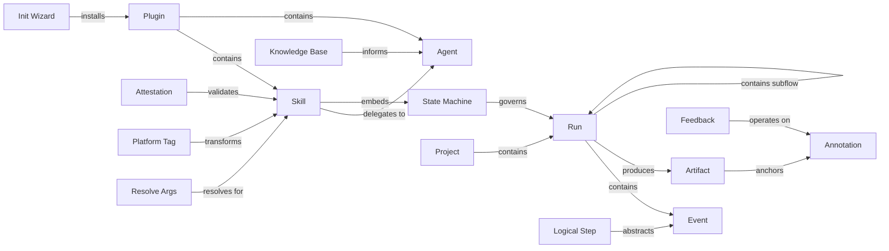

# Domain Concepts & Terminology

**Project**: rp1
**Domain**: AI Agent Orchestration & Developer Tooling

## Core Concepts

### Plugin
Capability package (rp1-base, rp1-dev, rp1-utils) grouping skills and agents under a namespace prefix. Dependency direction enforced: dev depends on base, never reverse.

### Skill
User-facing workflow entry point defined by SKILL.md with YAML frontmatter, structured arguments, agent delegation, and optional state machine. Follows the Agent Skills open standard (agentskills.io).

### Agent
Focused autonomous worker executing workflow body in a single pass with numbered sections and anti-loop directives. Receives pre-resolved parameters from parent skills.

### Run
Tracked workflow execution with UUID run-id, status, steps, events, artifacts, subflows, and agent tasks.

### Event
Typed record emitted against a run via `rp1 agent-tools emit` with 6 payload types: status_change, artifact_registered, annotation_updated, waiting_for_user, btw_update, subflow_registered.

### Artifact
Typed output file registered against a run with docId, step association, storageRoot routing (absolute/project/work_dir), and optional baseline content for edit tracking.

### Annotation
Threaded inline comment anchored to artifact via text-selection, hidden-anchor, or line anchor types; supports replies, resolution, and orphan detection.

### Feedback
Agent-tools subcommand enabling agents to programmatically interact with Arcade annotations: read (with status filtering), resolve, reply, and accept-edit.

### State Machine
Mermaid stateDiagram-v2 parsed into typed graph model (SMState, SMTransition) with transition validation, ordered steps, and predecessor auto-completion.

### Knowledge Base
Structured codebase documentation in `.rp1/context/` generated via map-reduce spatial analysis and parallel specialist agents. Loaded progressively by task type.

### Attestation
Content-addressable record linking prompt SHA-256 hash + dependency hash to eval pass/fail result for release gating.

### Task Queue
Persistent task records with lifecycle states (pending/in_progress/completed/failed/cancelled), free-form type, optional payload JSON, and project scoping for cross-agent work coordination.

### Project
Registered workspace with UUID project_id, path, availability flag, run statistics, and last-activity timestamp.

### PR Review
Map-reduce PR analysis with configurable verdict modes, CI platform detection, confidence-gated findings, bot marker identification, and GitHub API integration.

### Init Wizard
Multi-step initialization workflow with project context detection (brownfield/greenfield), tool detection, plugin installation, gitignore presets, health checks, and re-initialization support.

### Supported Tool
Registered agentic host platform (Claude Code, OpenCode, Codex) with binary, version, instruction file, and capabilities.

### Platform Tag
Semantic Liquid custom tag abstracting platform-varying behavior (dispatch_agent, ask_user, edit_model, plan_tool, web_access, permissions) at build time.

### Logical Step
Effective-status abstraction that collapses namespaced sub-agent lifecycle steps to their namespace prefix, with optional unit suffix for per-task state deduplication.

### ToolResult Envelope
Standard JSON response `{success, tool, data, errors}` returned by all agent tools for consistent AI agent parsing.

### Notification
Dashboard notification record with message, source type/id, optional route and project association, created via WebSocket push and dismissable.

## Terminology Glossary

### Workflow & Execution
- **run-id**: UUID identifier for an individual workflow execution
- **emit**: Agent-tools command recording workflow events against a run with type, step, and data payload
- **StatusValue**: Activity category (WHAT is happening): not_started, running, waiting, completed, failed, skipped
- **WorkflowState**: Workflow phase (WHERE in the workflow): defined by state diagram step IDs
- **Predecessor Auto-Completion**: Graph-based mechanism that auto-completes direct predecessor steps when a new step starts running; respects parallel branches
- **Namespaced Step**: Sub-agent step prefixed with `{agent-name}:` to bypass parent state machine validation
- **--unit**: Emit flag enabling per-task tracking within an agent; disables predecessor auto-completion
- **Subflow**: Nested workflow within a parent run, registered via subflow_registered event
- **BTW Update**: Informal progress message emitted by agents without state transition

### Artifacts & Annotations
- **docId**: Content-addressable identifier linking artifacts to annotations and feedback operations
- **storageRoot**: Artifact path routing: 'absolute' (as-is), 'project' (relative to project root), or 'work_dir' (relative to .rp1/work/)
- **Artifact Baseline**: Stored content snapshot enabling diff detection of user edits on registered artifacts
- **AnchorType**: How an annotation attaches to an artifact: text-selection, hidden-anchor, or line
- **Accept-Edit**: Feedback operation that clears artifact baseline, acknowledging a user's direct file edit

### Build & Platform
- **SKILL.md**: Canonical file format for invocable skills with YAML frontmatter following the Agent Skills open standard
- **allowed-tools**: SKILL.md frontmatter field specifying permitted tool calls as comma-separated patterns
- **Validation Level**: Build validation severity: L1 (errors that block build) and L2 (warnings that are advisory)
- **implies chain**: Boolean argument dependency where setting one flag transitively sets others

### Dashboard & Communication
- **Arcade**: Web UI dashboard (port 7710) for monitoring agent runs, artifacts, annotations, and notifications
- **State Snapshot**: Full WebSocket recovery payload containing all active runs, steps, artifacts, and last event ID
- **Event Replay**: WebSocket mechanism replaying missed events after reconnection
- **Attention Data**: Dashboard grouping of runs by urgency: waiting, failed, running

### PR Review
- **Verdict**: PR review submission mode: approve, request_changes, comment, or auto
- **Confidence Gating**: PR review finding filter: 65%+ included, 40-64% (critical/high) investigated, below 40% excluded
- **bot_marker**: HTML comment tag identifying rp1-generated PR review comments for idempotent updates
- **CIPlatform**: Detected CI environment: github_actions, buildkite, gitlab_ci, or generic_ci

### Configuration & Resolution
- **project directories**: Deterministic rp1 paths; KB at `.rp1/context/`, work artifacts at `.rp1/work/`
- **Resolve Args**: 5-layer argument precedence (user input > project settings > user settings > env fallback > schema default)
- **Worktree**: Git worktree detected by rp1-root-dir; rp1 tracks isWorktree and worktreeName
- **ProjectContext**: Init wizard classification: brownfield (existing code) or greenfield (new project)

### Patterns
- **Builder-Reviewer**: Adversarial cooperation pattern where a builder implements and a reviewer verifies with single retry
- **Constitutional Prompting**: Pattern encoding expert knowledge, anti-loop directives, and output contracts into agent prompts
- **Progressive Disclosure**: Load index.md always, then additional KB files only when needed by task type
- **Scratch Pad**: Visible file section used by stateless agents to persist interview state across sessions

## Concept Relationships

```mermaid
graph LR
    Plugin -->|contains| Skill
    Plugin -->|contains| Agent
    Skill -->|delegates to| Agent
    Skill -->|embeds| SM[State Machine]
    SM -->|governs| Run
    Run -->|contains| Event
    Run -->|produces| Artifact
    Run -->|contains subflow| Run
    Artifact -->|anchors| Annotation
    Feedback -->|operates on| Annotation
    KB[Knowledge Base] -->|informs| Agent
    Attestation -->|validates| Skill
    Project -->|contains| Run
    InitWizard[Init Wizard] -->|installs| Plugin
    PlatformTag[Platform Tag] -->|transforms| Skill
    ResolveArgs[Resolve Args] -->|resolves for| Skill
    LogicalStep[Logical Step] -->|abstracts| Event
```

## Bounded Contexts

| Context | Scope | Key Concepts |
|---------|-------|-------------|
| Knowledge Management | rp1-base plugin | KB Generation, Spatial Analysis, Progressive Loading |
| Feature Delivery | rp1-dev plugin | Build Workflow, Builder-Reviewer, Blueprint/PRD, PR Review |
| Prompt Tooling | rp1-utils plugin | Eval Extraction, Prompt Writing, Tersification |
| Runtime Services | cli/src | Build Pipeline, Install, Init, Agent Tools, Settings |
| Dashboard | cli/web-ui | Arcade, Run Visualization, Annotations, WebSocket |
| Quality Assurance | evals/ | Attestation, Content-Addressable Hashing, Verification |
| Platform Abstraction | Build pipeline | Platform Tags, Liquid Preprocessing, Namespace Translation |

## Cross-Cutting Concerns

- **Error Handling**: Tagged union CLIError with _tag discriminant, 14 variants, fp-ts Either/TaskEither integration
- **Real-Time Communication**: WebSocket message union with typed event notifications, reconnection recovery
- **State Management**: Two-layer model (StatusValue x WorkflowState), declarative state machines, predecessor auto-completion
- **Platform Portability**: Semantic Liquid tags with build-time rendering per platform and lint validation
- **Configuration**: Five-layer argument precedence with implies chains; TOML settings at global and project levels
- **Runtime Detection**: Bun-preferred with Node.js fallback via detectRuntime()
