# Domain Concepts & Terminology

**Project**: rp1 Plugin System
**Domain**: AI-Assisted Development Workflows

## Core Business Concepts

### Plugin
**Definition**: Self-contained unit providing commands, agents, and skills for Claude Code/OpenCode platforms. Three plugins exist: rp1-base (foundation), rp1-dev (development workflows), rp1-utils (prompt utilities).
**Implementation**: `plugins/base/.claude-plugin/plugin.json`, `plugins/dev/.claude-plugin/plugin.json`
**Key Properties**:
- name: Plugin identifier (rp1-base, rp1-dev, rp1-utils)
- version: Semantic version synchronized across all plugins
- dependencies: Plugin can depend on others (dev depends on base >= 2.0.0)

**Business Rules**:
- Base plugin is independent and owns all skills
- Dev plugin depends on base for KB loading and shared capabilities
- Skills are exclusively owned by base plugin

### Command
**Definition**: User-facing slash command acting as a thin wrapper (50-100 lines) that parses parameters and delegates to agents via the Task tool. Contains no business logic.
**Implementation**: `plugins/*/commands/*.md`
**Relationships**:
- Invokes Agent via Task tool for execution
- Uses namespace prefixes: /rp1-base:, /rp1-dev:

### Agent
**Definition**: Autonomous worker (200-350 lines) with constitutional structure that executes complete workflows in single-pass with anti-loop directives and JSON output contracts.
**Implementation**: `plugins/*/agents/*.md`
**Key Properties**:
- Constitutional structure: YAML frontmatter, parameter tables, numbered sections
- Single-pass execution without iteration or user feedback loops
- JSON output contracts defining artifacts produced

### Skill
**Definition**: Reusable capability defined exclusively in base plugin. Provides templates, workflows, and utilities that agents can invoke for specialized tasks.
**Implementation**: `plugins/base/skills/*/SKILL.md`
**Types**: knowledge-base-templates, mermaid, maestro, markdown-preview, code-comments

### Knowledge Base
**Definition**: Auto-generated codebase documentation stored in `{RP1_ROOT}/context/` containing index.md, concept_map.md, architecture.md, modules.md, patterns.md, state.json.
**Implementation**: `.rp1/context/*.md`
**Usage**: Agents load KB files directly via Read tool for codebase context

### Feature Workflow
**Definition**: Six-step development process: blueprint -> requirements -> design -> tasks -> build -> verify
**Artifacts**: Stored in {RP1_ROOT}/work/features/{FEATURE_ID}/
**Documents**: requirements.md, design.md, tasks.md, field-notes.md

### Worktree Workflow
**Definition**: Four-phase isolated git workflow for safe agent execution: Setup (create worktree, verify state) -> Implementation (atomic commits) -> Publish (validate ownership, push, optional PR) -> Cleanup (restore directory, remove worktree).
**Implementation**: `plugins/dev/skills/worktree-workflow/SKILL.md`
**Use Cases**: code-quick-build, feature-build with isolation

### RP1_ROOT
**Definition**: Root directory for rp1 artifacts. Resolution-aware: from env override, git common-dir (linked worktree), or cwd.
**Implementation**: `cli/src/agent-tools/rp1-root-dir/resolver.ts`
**Contains**: context/ (KB files), work/ (features, worktrees)

### Worktree
**Definition**: Isolated git workspace for parallel agent work. Created via CLI tool, contains branch name and basedOn commit SHA for validation.
**Implementation**: `cli/src/agent-tools/worktree/models.ts`

### Stateless Agent
**Definition**: Agent pattern for resumable interview workflows. Uses file-based scratch pad for state instead of conversation context. Enables session-independent execution.
**Implementation**: `docs/concepts/stateless-agents.md`, `plugins/dev/agents/charter-interviewer.md`

## Technical Concepts

### Constitutional Prompting
**Purpose**: Core pattern where agent behavior is defined through structured markdown prompts with rules, structure, and constraints upfront
**Implementation**: All agent files in `plugins/*/agents/*.md`
**Key Elements**:
- YAML frontmatter for metadata
- Parameter tables with Position/Default/Purpose columns
- Numbered workflow sections (1-N)
- Anti-loop directives preventing iteration
- JSON output contracts

### Map-Reduce Workflow
**Purpose**: Parallel processing pattern for complex operations
**Implementation**: `knowledge-build`, `pr-review` commands
**Phases**:
1. Map: Split work into independent units (spatial analyzer, splitter)
2. Process: N agents work simultaneously
3. Reduce: Merge results (orchestrator merges JSON to files)

### Progressive KB Loading
**Purpose**: Context optimization reducing usage by 50-70%
**Implementation**: Agents load index.md first, then selectively load additional files
**Profiles**:
- Code review: patterns.md (~150 lines)
- Bug investigation: architecture.md + modules.md (~400 lines)
- Strategic analysis: all files (~1200 lines)

### Confidence Gating
**Purpose**: PR review filtering mechanism for findings
**Thresholds**: 65%+ include, 40-64% investigate (critical/high only), <40% exclude
**Application**: Sub-reviewer findings before synthesis

### Commit Ownership Validation
**Purpose**: Pre-push verification ensuring all commits were created during current session
**Checks**: Count matches tracked, all commits descend from basedOn, no unexpected authors
**Use Case**: Prevents corrupted PRs in worktree workflow

### Workflow Orchestrator Pattern
**Purpose**: Skill pattern for multi-phase workflows with defined phases, verification steps, and error recovery procedures
**Implementation**: `plugins/dev/skills/worktree-workflow/SKILL.md`

## Terminology Glossary

### Business Terms
- **Single-Pass Execution**: Agent execution model where complete workflow is performed in one run without iteration
- **Thin Wrapper**: Command design pattern with no business logic, only parameter parsing and agent routing (50-100 lines)
- **Output Contract**: Agent specification defining exactly what artifacts/files/structures the agent produces
- **Fitness Judgment**: PR review verdict: approve, request_changes, or block
- **Review Unit**: Segmented piece of PR diff created by splitter for focused analysis
- **Atomic Commit**: Single logical unit of work committed with conventional commit format

### Technical Terms
- **Anti-Loop Directive**: Explicit instruction preventing iteration loops, forcing single-pass completion
- **Context Blindness**: Problem where generic AI assistants lack awareness of codebase patterns
- **Direct KB Loading Pattern**: Agents read context/*.md files directly via Read tool (subagent limitation workaround)
- **Positional Parameters**: Argument syntax using $1, $2, $ARGUMENTS for cross-platform compatibility
- **Incremental Build**: KB rebuild mode that only processes changed files via git diff comparison
- **Review Dimension**: One of five PR analysis categories: Correctness, Security, Performance, Maintainability, Testing
- **Comment-Fenced Injection**: Pattern using `<!-- rp1:start -->` markers to inject/update content without duplication
- **basedOn Commit**: SHA of commit from which a worktree branch was created. Used for validation in commit ownership checks
- **Scratch Pad**: File-based state storage for stateless agents. Visible section in document showing Q&A progress during interviews
- **Terse Prompting**: Prompt authoring approach using structure-first composition with compression-by-default
- **Conventional Commit**: Commit format: type(scope): description. Types: feat, fix, refactor, docs, test, chore, style, perf

## Concept Boundaries

### Base Plugin (rp1-base)
**Scope**: Foundation and utilities
**Concepts**: Knowledge Management, Documentation, Strategy, Security, Content Writing, All Skills
**Boundaries**: Owns KB generation, skills, and foundation utilities. Independent of dev plugin.

### Dev Plugin (rp1-dev)
**Scope**: Development workflows
**Concepts**: Feature Workflows, Code Quality, PR Management, Testing, Build Operations, Worktree Isolation
**Boundaries**: Depends on base plugin for KB and skills. Owns feature development lifecycle.

### Worktree Operations
**Scope**: Isolated agent execution
**Concepts**: Worktree Creation, Commit Validation, Branch Publishing, Cleanup
**Boundaries**: CLI tools + skills for safe parallel work

### Knowledge Base Artifacts
**Scope**: Codebase documentation
**Files**: index.md, concept_map.md, architecture.md, modules.md, patterns.md, state.json
**Boundaries**: Generated in `{RP1_ROOT}/context/`.

### Feature Artifacts
**Scope**: Feature development
**Files**: requirements.md, design.md, tasks.md, field-notes.md
**Boundaries**: Stored in `{RP1_ROOT}/work/features/{FEATURE_ID}/`

## Concept Relationships

```mermaid
graph TB
    subgraph "Plugin System"
        Base[rp1-base]
        Dev[rp1-dev]
        Utils[rp1-utils]
        Dev -->|depends on| Base
    end

    subgraph "Components"
        Cmd[Commands]
        Agent[Agents]
        Skill[Skills]
        KB[Knowledge Base]
    end

    subgraph "Workflows"
        Feature[Feature Workflow]
        PR[PR Review]
        KBGen[KB Generation]
        Worktree[Worktree Workflow]
    end

    Base --> Cmd
    Base --> Agent
    Base --> Skill
    Dev --> Cmd
    Dev --> Agent

    Cmd -->|invokes via Task| Agent
    Agent -->|uses| Skill
    Agent -->|reads via Read| KB

    KBGen -->|generates| KB
    Feature -->|uses| KB
    Feature -->|uses| Worktree
    PR -->|uses| KB
```

## Cross-References
- **Architecture Details**: See [architecture.md](architecture.md)
- **Module Breakdown**: See [modules.md](modules.md)
- **Implementation Patterns**: See [patterns.md](patterns.md)
