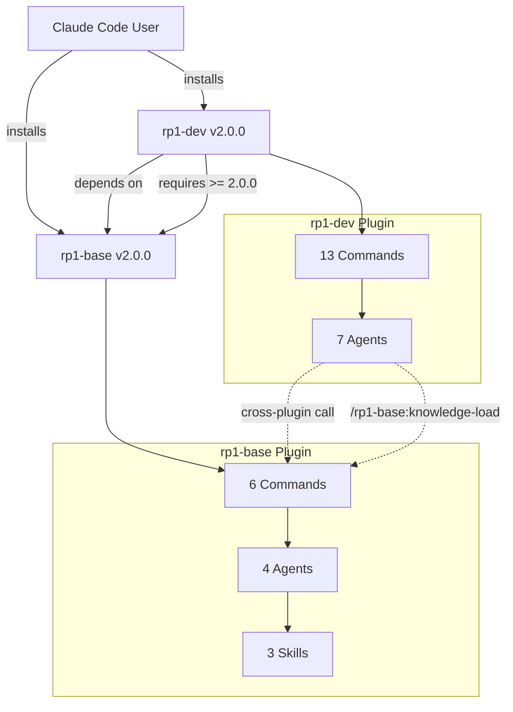

# Inter-Project Dependencies

**Repository**: rp1 Plugin Monorepo
**Last Updated**: 2025-11-08
**Projects Analyzed**: 2 (rp1-base, rp1-dev)

## Dependency Graph



## Project Matrix

| Project | Type | Version | Depends On | Used By | Commands | Agents | Skills |
|---------|------|---------|------------|---------|----------|--------|--------|
| rp1-base | Plugin | 2.0.0 | - | rp1-dev | 6 | 4 | 3 |
| rp1-dev | Plugin | 2.0.0 | rp1-base >= 2.0.0 | - | 13 | 7 | 0 |

## Shared Code Impact

### All Skills (In rp1-base)
**Purpose**: Shared capabilities used across both plugins
**Consumers**: All agents in base and dev
**Breaking Change Risk**: High - affects all consumers

**Key Exports**:
- `rp1-base:maestro` - used by: developers creating skills
- `rp1-base:mermaid` - used by: knowledge-builder, pr-visualizer, project-documenter
- `rp1-base:knowledge-base-templates` - used by: knowledge-builder

**Versioning Strategy**: Semver with base plugin

**Impact**:
- Changes to skills require base plugin version bump
- Dev plugin specifies minimum base version needed
- Breaking skill changes require major version bump

### Knowledge Base System
**Purpose**: Codebase documentation shared across plugins
**Consumers**: 7 KB-aware agents (3 in base, 4 in dev)
**Breaking Change Risk**: Medium - affects KB-aware agents

**Key Exports**:
- `/rp1-base:knowledge-build` - generates KB
- `/rp1-base:knowledge-load` - loads KB context

**Cross-Plugin Usage**:
```markdown
# In dev agents
Use SlashCommand tool: `/rp1-base:knowledge-load`
```

## Build Dependencies

### Installation Order
1. **rp1-base** (foundation, no dependencies)
2. **rp1-dev** (requires base >= 2.0.0)

### Plugin Installation Commands
```bash
# Correct order
/plugin install rp1-base@rp1-local
/plugin install rp1-dev@rp1-local

# Incorrect order (will fail)
/plugin install rp1-dev@rp1-local  # ERROR: rp1-base not installed
```

### Release Dependencies
- **Base releases**: Independent, no blockers
- **Dev releases**: Can proceed independently (dependency is runtime, not build-time)
- **Version coordination**: dev plugin.json specifies minimum base version

### Deployment Dependencies
- **Local development**: Both plugins installed from local marketplace
- **Production**: Both plugins from Claude Code marketplace
- **Dependency validation**: Claude Code checks dependency constraints

## Dependency Analysis

### Most Depended Upon
1. **rp1-base**: Required by rp1-dev
2. **Skills (in base)**: Used by agents across plugins
3. **Knowledge Base**: Used by 7 KB-aware agents

### Highest Impact Changes
Projects where changes affect the most consumers:

1. **rp1-base Skills**: Changes impact both base and dev agents
   - Affects: knowledge-builder, pr-visualizer, project-documenter
   - Risk: High (breaking skill changes break multiple agents)

2. **Knowledge Load Command**: Changes impact 7 KB-aware agents
   - Affects: 3 base agents + 4 dev agents
   - Risk: High (breaking changes affect many workflows)

3. **Plugin Namespace Convention**: Changes impact all commands
   - Affects: All 19 commands
   - Risk: Critical (requires migration guide)

### Circular Dependencies
**None found**: Clean dependency tree

## Change Impact Matrix

When making changes to a project, consider these downstream impacts:

| Changing... | Impacts... | Severity | Notes |
|-------------|-----------|----------|-------|
| rp1-base skills | All agents using skills | High | Breaking changes need major version bump |
| rp1-base knowledge-load | 7 KB-aware agents | High | Must maintain KB file format |
| rp1-base plugin.json version | dev plugin dependency | Medium | Dev must update minimum version |
| rp1-dev agents | Only dev command users | Low | No impact on base |
| Base command namespaces | dev cross-plugin calls | Critical | Breaking change requiring migration |

### Cross-Plugin Breaking Changes

**Scenario**: Change `/rp1-base:knowledge-load` format

**Impact**:
1. All 7 KB-aware agents affected
2. 4 dev agents need updates (cross-plugin)
3. Requires coordinated release

**Mitigation**:
- Major version bump for base
- Update dev plugin dependency to new base version
- Provide migration guide
- Test all 7 KB-aware agents

## Versioning Strategy

### Plugin Versioning
- **Independent Semver**: Each plugin versions independently
- **Base**: v2.0.0 (foundation, stable API)
- **Dev**: v2.0.0 (depends on base >= 2.0.0)

### Dependency Constraints
```json
// In dev/plugin.json
{
  "dependencies": {
    "rp1-base": ">=2.0.0"
  }
}
```

### Version Compatibility Matrix

| Dev Version | Requires Base | Notes |
|-------------|---------------|-------|
| 2.0.0 | >= 2.0.0 | Initial two-plugin split |
| 2.0.x | >= 2.0.0 | Patch/minor updates compatible |
| 2.1.0 | >= 2.0.0 | New features, backward compatible |
| 3.0.0 | >= 3.0.0 | Breaking changes, new base required |

## Testing Strategy

### Unit Tests
- Each plugin tested independently
- Base plugin tests don't depend on dev
- Dev plugin tests mock base commands

### Integration Tests
- Test cross-plugin calls (dev → base)
- Test KB-aware agent workflows
- Test skill invocations from both plugins

### Dependency Update Testing
**Before releasing base changes**:
1. Run all base command tests
2. Run all dev command tests (ensure compatibility)
3. Test all 7 KB-aware agents
4. Verify cross-plugin calls work

**Before releasing dev changes**:
1. Run all dev command tests
2. Verify base dependency constraint is correct
3. Test cross-plugin KB loading

### Breaking Change Protocol
1. Identify breaking change
2. Bump major version of affected plugin
3. Update dependent plugin's dependency constraint
4. Create migration guide
5. Release base first, then dev
6. Announce breaking change in CHANGELOG

## Cross-Plugin Communication Patterns

### Pattern 1: KB Loading
**Direction**: Dev → Base
**Mechanism**: SlashCommand tool
**Example**:
```markdown
# In dev/agents/bug-investigator.md
Use SlashCommand tool: `/rp1-base:knowledge-load`
```

**Error Handling**:
```markdown
**CRITICAL**: This requires rp1-base plugin.
If command fails, inform user to install:
/plugin install rp1-base
```

### Pattern 2: Skill Invocation
**Direction**: Both → Base
**Mechanism**: Skill tool
**Example**:
```markdown
# In any agent
Use Skill tool with skill: "rp1-base:mermaid"
```

**Always Use Full Namespace**:
- ✅ `rp1-base:mermaid`
- ❌ `mermaid` (missing namespace)

### Pattern 3: Agent References
**Direction**: Command → Agent
**Mechanism**: Task tool
**Example**:
```markdown
# In command
subagent_type: rp1-dev:bug-investigator
```

**Namespace Rules**:
- Base commands: `subagent_type: rp1-base:agent-name`
- Dev commands: `subagent_type: rp1-dev:agent-name`

## Upgrade Path & Compatibility

### From v1.x to v2.0.0

**Breaking Changes**:
1. Single plugin split into two
2. Namespace prefixes added to all commands
3. Plugin dependency relationships established

**Migration Steps**:
1. Uninstall old v1.x plugin
2. Install rp1-base v2.0.0
3. Install rp1-dev v2.0.0
4. Update all command invocations with namespace prefixes

**Command Mapping**:
```
v1.x                          v2.0.0
/knowledge-build          →   /rp1-base:knowledge-build
/feature-requirements     →   /rp1-dev:feature-requirements
/pr-review                →   /rp1-dev:pr-review
```

### Future Compatibility

**Adding New Plugins** (e.g., rp1-test, rp1-deploy):
- Can depend on rp1-base
- Follow namespace convention
- Declare dependencies in plugin.json
- Independent versioning

**Backward Compatibility Policy**:
- Patch (X.Y.Z+1): Bug fixes, no breaking changes
- Minor (X.Y+1.0): New features, backward compatible
- Major (X+1.0.0): Breaking changes, may require updates

