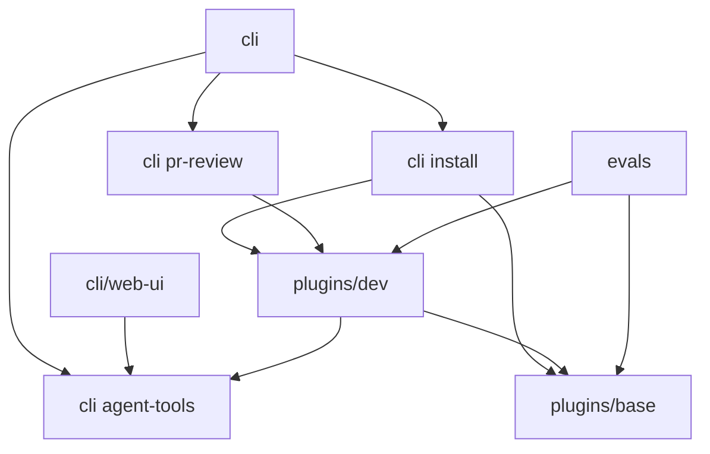

# Inter-Project Dependencies

**Repository**: rp1
**Last Updated**: 2026-04-06
**Projects Analyzed**: 6 logical areas

## Dependency Graph

```mermaid
graph TD
    CLI[cli] --> TOOLS[cli agent-tools]
    CLI --> INSTALL[cli install]
    CLI --> PR[cli pr-review]
    WEB[cli/web-ui] --> TOOLS
    INSTALL --> BASE[plugins/base]
    INSTALL --> DEV[plugins/dev]
    DEV --> BASE
    DEV --> TOOLS
    PR --> DEV
    EVALS[evals] --> DEV
    EVALS --> BASE
```

## Project Matrix

| Project | Type | Language | Depends On | Used By |
|---------|------|----------|------------|---------|
| `cli` | Application | TypeScript | `cli/src/agent-tools`, `cli/src/install`, `cli/src/pr-review` | Supported platforms |
| `cli/web-ui` | Application | TSX | `cli/src/agent-tools`, Bun server APIs | Local operators |
| `plugins/base` | Plugin content | Markdown + TS ecosystem | - | `plugins/dev`, installers, KB-aware workflows |
| `plugins/dev` | Plugin content | Markdown + TS ecosystem | `plugins/base`, agent tools | Supported platforms, evals |
| `plugins/utils` | Plugin content | Markdown + TS ecosystem | - | Prompt and utility workflows |
| `evals` | Library/tooling | TypeScript | `plugins/base`, `plugins/dev` concepts and artifacts | CI and local evaluation |
## Shared Code Impact

### `cli/src/agent-tools/`
**Purpose**: Shared workflow-tracking and integration runtime.
**Consumers**: CLI flows, Web UI routes, plugin workflows.
**Breaking Change Risk**: High

**Why it matters**:
- Changes to run, artifact, or state-machine contracts affect both execution and observability.
- The UI reads the same operational data the workflows write.

### `plugins/base`
**Purpose**: Foundational skills and agents, especially KB and documentation workflows.
**Consumers**: `plugins/dev`, installers, KB-aware workflows.
**Breaking Change Risk**: High

**Why it matters**:
- `plugins/dev` explicitly depends on shared base capabilities.
- Namespace, prompt-contract, and KB format changes ripple into downstream workflows.

## Build Dependencies

### Build Order
1. `cli`
2. `cli/web-ui`
3. Plugin artifact builds
4. `evals`

### Critical Path
`cli -> plugin builds -> evals`

### Deployment Dependencies
- Docs publish independently from runtime binaries.
- Plugin installation depends on the built artifacts produced by CLI build flows.
- Local workflow visibility depends on the Web UI reading the same runtime state written by agent tools.

## Highest Impact Changes

1. **Agent tool contracts**: affect CLI execution, dashboard rendering, and workflow tracking simultaneously.
2. **Base plugin KB conventions**: affect dev workflows and any KB-aware agent behavior.
3. **Supported platform metadata**: affect install, verify, and invocation across all host tools.

## Circular Dependencies

- **No hard package cycle is evident** in the analyzed paths.
- The most important operational loop is intentional: agent tools write state and the Web UI reads and rebroadcasts it.

## Change Impact Matrix

| Changing... | Impacts... | Severity | Notes |
|-------------|-----------|----------|-------|
| `cli/src/agent-tools` | CLI workflows, Web UI, plugin orchestration | High | Shared operational backbone |
| `plugins/base` | `plugins/dev`, KB-aware agents | High | Cross-plugin dependency surface |
| `cli/src/config/supported-tools.yaml` | install, verify, init, update | High | Platform compatibility contract |
| `cli/web-ui` route models | dashboard users, work status rendering | Medium | Usually paired with tool/runtime changes |
## Testing Strategy

- **Unit tests**: Keep command, tool, and package units independently testable.
- **Integration tests**: Verify workflow state changes still reach the dashboard correctly.
- **Cross-plugin tests**: Recheck `dev -> base` assumptions when prompt contracts or namespaces change.
- **Eval validation**: Re-run evals when workflow prompts or output contracts move.
