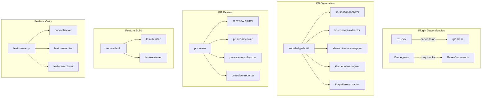

# Module & Component Breakdown

**Project**: rp1 Plugin System
**Analysis Date**: 2025-12-21
**Total Components**: 82 (28 commands, 31 agents, 5 skills, 18 CLI modules)
**Version**: 0.2.3

## Plugin Modules

### plugins/base
**Purpose**: Foundation plugin for knowledge management, documentation, strategy, and security
**Components**: 9 commands, 13 agents, 5 skills

**Commands**:
| Command | Agent | Purpose |
|---------|-------|---------|
| knowledge-build | Orchestrator (5 agents) | Parallel KB generation |
| knowledge-load | None (direct) | Load KB context (deprecated) |
| deep-research | research-explorer + reporter | Autonomous research with reports |
| strategize | strategic-advisor | Holistic system analysis |
| analyse-security | security-validator | Security validation |
| project-birds-eye-view | project-documenter | Project overview generation |
| write-content | None (interactive) | Technical document creation |
| fix-mermaid | mermaid-fixer | Diagram validation and repair |
| self-update | None (direct) | Update rp1 to latest version |

**Agents**:
| Agent | Purpose |
|-------|---------|
| kb-spatial-analyzer | File scanning and categorization (0-5 ranking) |
| kb-index-builder | Index.md generation (deprecated - orchestrator-owned) |
| kb-concept-extractor | Domain concept extraction |
| kb-architecture-mapper | Architecture pattern mapping |
| kb-module-analyzer | Module dependency analysis |
| kb-pattern-extractor | Implementation pattern extraction |
| research-explorer | Deep research exploration |
| research-reporter | Structured research report generation |
| strategic-advisor | Multi-dimensional trade-off analysis |
| security-validator | Comprehensive security auditing |
| project-documenter | 12-section project documentation |
| mermaid-fixer | Mermaid diagram validation and repair |

**Skills**:
| Skill | Purpose |
|-------|---------|
| maestro | Skill creation and updates |
| mermaid | Diagram creation and validation |
| markdown-preview | HTML preview generation |
| knowledge-base-templates | KB document templates |
| code-comments | Comment extraction and management |

### plugins/dev
**Purpose**: Development workflow automation for features, code quality, and PR management
**Components**: 19 commands, 18 agents
**Dependency**: Requires rp1-base >= 2.0.0

**Feature Workflow Commands**:
| Command | Agent | Purpose |
|---------|-------|---------|
| blueprint | blueprint-wizard | Charter and PRD creation |
| feature-requirements | None (interactive) | Requirements gathering |
| feature-design | None (direct) | Technical design generation |
| feature-tasks | feature-tasker | Task breakdown |
| feature-build | task-builder + reviewer | Implementation from tasks |
| feature-verify | code-checker + verifier | Acceptance validation |
| feature-edit | feature-editor | Mid-stream change propagation |
| feature-archive | feature-archiver | Archive completed features |
| feature-unarchive | feature-archiver | Restore archived features |
| validate-hypothesis | hypothesis-tester | Design assumption testing |

**Code Quality Commands**:
| Command | Agent | Purpose |
|---------|-------|---------|
| code-check | code-checker | Fast hygiene validation |
| code-audit | code-auditor | Pattern consistency analysis |
| code-investigate | bug-investigator | Evidence-based bug investigation |
| code-clean-comments | comment-cleaner | Comment removal |
| code-quick-build | None (direct) | Quick fixes and prototypes |

**PR Review Commands**:
| Command | Agent | Purpose |
|---------|-------|---------|
| pr-review | Orchestrator (4 agents) | Map-reduce PR review |
| pr-visual | pr-visualizer | Diff visualization |
| pr-feedback-collect | pr-feedback-collector | GitHub comment collection |
| pr-feedback-fix | None (direct) | Review comment resolution |

**Dev Agents**:
| Agent | Purpose |
|-------|---------|
| blueprint-wizard | Guided project vision capture |
| hypothesis-tester | Design hypothesis validation |
| feature-tasker | Task generation from design |
| task-builder | Task implementation with context |
| task-reviewer | Implementation verification (4 dimensions) |
| feature-verifier | Acceptance criteria verification |
| feature-editor | Mid-stream change propagation |
| feature-archiver | Feature archive/restore |
| code-checker | Code hygiene validation |
| code-auditor | Pattern and maintainability analysis |
| bug-investigator | Evidence-based bug investigation |
| comment-cleaner | Comment removal with preservation rules |
| pr-review-splitter | Segment diff into review units |
| pr-sub-reviewer | Analyze across 5 dimensions |
| pr-review-synthesizer | Produce fitness judgment |
| pr-review-reporter | Format findings into report |
| pr-visualizer | PR diff visualization |
| pr-feedback-collector | Collect GitHub PR comments |
| test-runner | Comprehensive test execution |

## CLI Modules

### cli/src/commands/
**Purpose**: Cross-platform CLI for building, installing, and viewing rp1 artifacts

| Command | File | Purpose |
|---------|------|---------|
| build | build.ts | Build OpenCode artifacts from Claude Code sources |
| install | install.ts | Install plugins to OpenCode/Claude Code |
| init | init.ts | Initialize rp1 knowledge in CLAUDE.md/AGENTS.md |
| view | view.ts | Launch web-based documentation viewer |
| self-update | self-update.ts | Update CLI to latest version |
| check-update | check-update.ts | Check for available updates |

### cli/src/install/
**Purpose**: Plugin installation logic with fp-ts functional patterns

| Module | Purpose |
|--------|---------|
| installer.ts | Copy artifacts to target directories |
| command.ts | Installation command orchestration |
| config.ts | Installation configuration management |
| manifest.ts | Plugin manifest handling |
| prerequisites.ts | Runtime prerequisite checking |
| verifier.ts | Installation verification |

### cli/src/install/claudecode/
**Purpose**: Claude Code specific installation

| Module | Purpose |
|--------|---------|
| installer.ts | Claude Code plugin installation |
| prerequisites.ts | Claude Code prerequisite checks |
| command.ts | Claude Code install command |

### cli/web-ui/
**Purpose**: React-based documentation viewer with Mermaid support

| Component | Purpose |
|-----------|---------|
| App.tsx | Main application shell |
| FileTree/ | Directory navigation |
| MarkdownViewer/ | Markdown rendering with Mermaid |
| ThemeProvider | Light/dark theme support |
| WebSocketProvider | Live reload support |

## Module Dependencies



## Module Metrics

| Module | Commands | Agents | Skills | Lines (est.) |
|--------|----------|--------|--------|--------------|
| plugins/base | 9 | 13 | 5 | ~5,000 |
| plugins/dev | 19 | 18 | 0 | ~7,000 |
| cli/src | 6 | - | - | ~8,000 |
| cli/web-ui | - | - | - | ~2,500 |

## Cross-Module Patterns

### Command-Agent Delegation
Commands are thin wrappers (~50-100 lines) that delegate to constitutional agents (~200-350 lines) via Task tool. Separation enables reusability, testability, and independent evolution.

### Map-Reduce Orchestration
Both KB generation and PR review use map-reduce pattern:
- KB: spatial analyzer → 4-5 parallel agents → orchestrator merge
- PR: splitter → N sub-reviewers → synthesizer → reporter

### Builder-Reviewer Loop
Feature build uses paired agents:
- task-builder implements changes
- task-reviewer verifies (SUCCESS/FAILURE with feedback)
- Retry on failure with feedback

### Cross-Plugin Invocation
Dev plugin agents can invoke base plugin capabilities with error handling:
```markdown
**CRITICAL**: This requires rp1-base plugin.
If command fails, inform user to install: /plugin install rp1-base
```

### Progressive KB Loading
Agents load KB selectively based on task type:
- Code review → patterns.md
- Bug investigation → architecture.md, modules.md
- Feature implementation → modules.md, patterns.md
- Strategic analysis → ALL files
