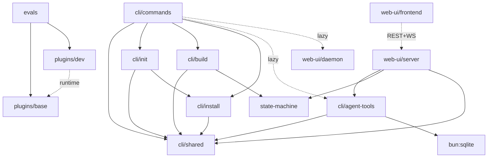

# Module & Component Breakdown

**Project**: rp1
**Analysis Date**: 2026-03-26
**Modules Analyzed**: 15

## Core Modules

### cli/commands (`cli/src/commands/`)
**Purpose**: User-facing CLI commands via Commander.js
**Key Components**: init, install (OpenCode/Claude Code/Codex), build, arcade, settings, update, verify, uninstall
**Dependencies**: cli/shared, cli/init, cli/build, cli/install, cli/agent-tools (lazy), web-ui/daemon (lazy)

### cli/agent-tools (`cli/src/agent-tools/`)
**Purpose**: Agent-tools CLI surface with tool registry and 9 subcommands
**Key Components**:
- **emit**: Unified event recording with 6 event types, state machine validation, artifact classification
- **task**: Task lifecycle management (create, pickup, complete, fail, cancel, list)
- **feedback**: Annotation processing lifecycle (read, resolve, reply, accept-edit)
- **github-pr**: Deterministic GitHub PR operations (submit-review, add-reaction, reply-comment, fetch-comments)
- **state-machine**: Mermaid stateDiagram-v2 parser and graph query engine
- **mmd-validate**: Mermaid diagram extraction and validation from markdown
- **comment-extract**: Code comment extraction from git-changed files
- **rp1-root-dir**: RP1 root directory resolution
- **codex-notify**: Codex platform notification support
**Dependencies**: cli/shared, bun:sqlite

### cli/build (`cli/src/build/`)
**Purpose**: Multi-platform artifact build pipeline via LiquidJS
**Key Components**:
- **filters**: 9 custom Liquid filters (tool_prose, allowed_tools, namespace_ref, slash_commands, tool_name, escape_toml, escape_yaml, param_transform, role_type)
- **tags**: dispatch_agent semantic tag for platform-aware agent dispatch
- **templates**: Platform-specific LiquidJS templates (claude-code, opencode, codex)
- **lint**: Two-tier validation (L1 errors, L2 warnings)
**Dependencies**: cli/shared, cli/agent-tools/state-machine, liquidjs

### cli/install (`cli/src/install/`)
**Purpose**: Install plugin artifacts into host tools with staging, backup/rollback, verification
**Key Components**:
- **OpenCode installer**: File discovery, staging, atomic install with rollback
- **Claude Code installer**: Marketplace integration for plugin installation
- **Codex installer**: Shell fence management, skill copying
**Dependencies**: cli/shared

### cli/init (`cli/src/init/`)
**Purpose**: Project initialization with context detection, tool detection, plugin installation, Ink UI
**Key Components**: context-detector (brownfield/greenfield), git-root, health-check, verification, InitWizard (Ink)
**Dependencies**: cli/shared, cli/install

### cli/shared (`cli/shared/`)
**Purpose**: Cross-cutting library (leaf module, no internal dependencies)
**Key Components**:
- **fp.ts**: fp-ts facade (Either, TaskEither, Option re-exports)
- **errors.ts**: CLIError discriminated union (14 variants) with factory functions and exit codes
- **events.ts**: Canonical event types (Status, EventType, ArtifactType, RunRecord, EventRecord)
- **config.ts**: RP1 root resolution with filesystem walk and git worktree fallback
- **logger.ts**: consola-based Logger via createLogger() factory
- **runtime.ts**: Runtime detection (Bun/Node)

### cli/pr-review (`cli/src/pr-review/`)
**Purpose**: PR review configuration loading and CI environment detection
**Key Components**: ci-detector (GitHub Actions, Buildkite, GitLab, generic, local), config loader

## Web UI Modules

### web-ui/server (`cli/web-ui/src/server/`)
**Purpose**: Bun HTTP + WebSocket server with REST APIs, file watching, event broadcast
**Key Components**:
- **http.ts**: HTTP server with route mounting and CORS
- **websocket.ts**: WebSocket hub with event broadcast, replay, heartbeat
- **project.ts**: Project registry and file tree resolution
- **v2-api.ts**: REST endpoints for runs, events, artifacts, projects
- **file-watcher.ts**: chokidar-based LRU file watcher pool (max 10 projects)
- **annotation-service.ts**: Annotation persistence and retrieval
**Dependencies**: cli/agent-tools/emit (database), cli/agent-tools/state-machine

### web-ui/daemon (`cli/web-ui/src/daemon/`)
**Purpose**: Daemon lifecycle manager (spawn, monitor, IPC, PID files)
**Key Components**: manager.ts, ipc.ts, config-dir.ts

### web-ui/frontend (`cli/web-ui/src/`)
**Purpose**: React SPA dashboard (Arcade) with 137 files
**Key Components**:
- **App shell**: Provider hierarchy (ErrorBoundary > Theme > WebSocket > Diagram > Tooltip > Router)
- **Pages**: HomePage, RunDetailPage, RunsListPage, ProjectsPage, ArtifactViewerPage, FileBrowserPage
- **Components**: EventStream, V2Sidebar, RunCard, CommandPalette, ArtifactViewerPanel, AnnotationSidebar
- **Hooks**: useRuns, useRunDetail, useProjects, useWorkflowSteps, useAnnotations, useRecentRuns
- **Providers**: WebSocketProvider, ThemeProvider, ProjectProvider, AnnotationProvider
**Dependencies**: web-ui/server (via REST + WebSocket)

## Plugin Modules

### plugins/base
**Purpose**: Foundational plugin: KB generation/loading, documentation, Mermaid, strategy, deep research, security
**Skills**: knowledge-build, knowledge-load, strategize, deep-research, write-content, fix-mermaid, analyse-security, task, self-update, project-birds-eye-view, mermaid, markdown-preview, knowledge-base-templates
**Agents**: kb-spatial-analyzer, kb-architecture-mapper, kb-concept-extractor, kb-module-analyzer, kb-pattern-extractor, research-reporter, strategic-advisor, scribe, mermaid-fixer

### plugins/dev
**Purpose**: Feature delivery plugin: build workflows, blueprint, PR review, code audit, feature lifecycle
**Skills**: build, build-fast, build-express, blueprint, blueprint-audit, blueprint-archive, pr-review, pr-visual, code-audit, code-check, code-investigate, code-clean-comments, feature-archive, feature-unarchive, feature-edit, validate-hypothesis, address-pr-feedback, bootstrap, arcade-collab
**Agents**: task-builder, task-reviewer, feature-verifier, feature-architect, feature-tasker, pr-sub-reviewer, pr-review-synthesizer, pr-comment-poster, pr-comment-deduplicator, build-artifact-detector, express-builder, bug-investigator, blueprint-wizard, charter-interviewer, bootstrap-scaffolder
**Dependency**: rp1-base (runtime)

### plugins/utils
**Purpose**: Prompt authoring plugin: prompt writing, tersification, eval assertion extraction
**Skills**: prompt-writer, tersify-prompt, prompt-eval-builder, build-prompt-evals, tester
**Agents**: prompt-tersifier, prompt-eval-extractor, prompt-assertion-specialist, dependency-chain-analyzer

## Support Modules

### evals (`evals/`)
**Purpose**: Prompt attestation system with content-addressable hashing, dependency graphs, verification
**Key Components**: attestation/index.ts, deps-graph.ts, manifest.ts, prompt-hash.ts

### packages/catppuccin-mermaid
**Purpose**: Standalone npm package: Catppuccin-flavored Mermaid theme with four flavors and WCAG contrast checks

## Module Dependencies

```mermaid
graph TD
    Commands["cli/commands"] --> Shared["cli/shared"]
    Commands --> Init["cli/init"]
    Commands --> Build["cli/build"]
    Commands --> Install["cli/install"]
    Commands -.->|lazy| AgentTools["cli/agent-tools"]
    Commands -.->|lazy| Daemon["web-ui/daemon"]
    AgentTools --> Shared
    AgentTools --> SQLite["bun:sqlite"]
    Build --> Shared
    Build --> SM["state-machine"]
    Install --> Shared
    Init --> Shared
    Init --> Install
    WebServer["web-ui/server"] --> AgentTools
    WebServer --> SM
    WebServer --> Shared
    Frontend["web-ui/frontend"] -.->|REST+WS| WebServer
    PluginsDev["plugins/dev"] -.->|runtime| PluginsBase["plugins/base"]
    Evals["evals"] --> PluginsBase
    Evals --> PluginsDev
```

## Cross-Module Patterns

| Pattern | Description | Modules |
|---------|-------------|---------|
| Skill-Agent Delegation | Skills orchestrate, agents execute via Task tool | plugins/base, plugins/dev |
| Event-Driven Dashboard | emit -> SQLite -> WebSocket -> React | agent-tools, web-ui/server, web-ui/frontend |
| Multi-Platform Build | Single source -> LiquidJS -> 3 platform artifacts | cli/build, all plugins |
| Lazy-Load Isolation | Dynamic imports for sub-100ms CLI startup | cli/commands, cli/agent-tools, web-ui/server |
| Shared fp-ts Pipeline | TaskEither<CLIError, T> throughout | cli/shared, all CLI modules |
| State Machine Validation | Mermaid definitions used by emit, build, and web-ui | state-machine, emit, build, web-ui/server |
| Tool Registry Self-Registration | Agent tools register via registerTool() at import time | cli/agent-tools |

## Cross-References
- **Architecture layers**: See [architecture.md](architecture.md)
- **Domain concepts**: See [concept_map.md](concept_map.md)
- **Code patterns**: See [patterns.md](patterns.md)
