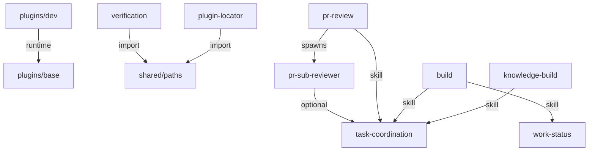

# Module & Component Breakdown

**Project**: rp1 Plugin System
**Analysis Date**: 2026-02-20
**Modules Analyzed**: 10

## Core Modules

### plugins/base
**Purpose**: Foundation plugin for knowledge management, documentation, strategy, and security
**Files**: ~27 | **Components**: 28
**Key Files**: `commands/knowledge-build.md`, `skills/task-coordination/SKILL.md`

**Commands**: knowledge-build, knowledge-load, deep-research, strategize, analyse-security, project-birds-eye-view, write-content, fix-mermaid, self-update
**Skills**: maestro, mermaid, markdown-preview, knowledge-base-templates, code-comments, work-status, task-coordination
**Contract**: Namespace `/rp1-base:*`. Skills referenced as `rp1-base:skill-name`. Task-coordination uses lazy feature detection.

### plugins/dev
**Purpose**: Development workflow automation for features, code quality, and PR management
**Files**: ~40 | **Components**: 40 | **Depends on**: plugins/base
**Key Files**: `commands/build.md`, `commands/pr-review.md`, `agents/pr-sub-reviewer.md`

**Commands**: build, build-fast, blueprint, bootstrap, feature-edit, feature-archive, code-check, code-audit, code-investigate, code-clean-comments, pr-review, pr-visual, address-pr-feedback
**Contract**: Namespace `/rp1-dev:*`. Requires rp1-base >= 2.0.0. pr-sub-reviewer accepts optional `TASK_ID` ($4) for task status reporting.

### plugins/utils
**Purpose**: Utility plugin for prompt optimization and eval generation
**Files**: ~7 | **Components**: 7
**Commands**: tersify-prompt, build-prompt-evals

### cli/src/shared
**Purpose**: Shared utilities extracted for cross-module reuse within the CLI
**Files**: 1 | **Key File**: `paths.ts`
**Exports**: `getClaudePluginDirs(home?)`, `CLAUDE_PLUGIN_DIRS`
**Consumers**: plugin-locator, verification

### cli/src/agent-tools
**Purpose**: Framework for AI agent tools with registry and plugin resolution
**Files**: ~15 | **Components**: 8 | **Depends on**: shared/paths, fp-ts, yaml
**Key File**: `transform-args/plugin-locator.ts`
**Key Functions**: `resolveFromInstalledPlugins()`, `lookupPluginCommand()`, `lookupPluginCommandWithFallback()`

### cli/src/init
**Purpose**: Project initialization with multi-step workflow and TTY-aware interactivity
**Files**: ~10 | **Components**: 6 | **Depends on**: shared/paths
**Key File**: `steps/verification.ts`

### cli/src/commands
**Purpose**: CLI entry point with Commander.js and lazy-loaded subcommands
**Files**: ~5
**Key Files**: `main.ts`, `init.ts`, `install/index.ts`

### cli/src/install
**Purpose**: Plugin installation logic with fp-ts patterns
**Files**: ~5 | **Depends on**: fp-ts
**Key Files**: `installer.ts`, `manifest.ts`, `claudecode/index.ts`

### cli/web-ui
**Purpose**: React-based documentation viewer with V2 status dashboard
**Files**: ~15
**Key Files**: `src/server.ts`, `src/pages/v2/*.tsx`

### evals
**Purpose**: Promptfoo-based evaluation system with workspace isolation
**Files**: ~10
**Key Files**: `providers/claude-with-tools.ts`, `suites/shared/extension.ts`, `src/attestation/`

## Key Components

### shared/paths
**File**: `cli/src/shared/paths.ts`
**Responsibilities**: Resolve platform-specific Claude Code plugin directories (macOS/Linux/Windows); export `getClaudePluginDirs()` with injectable home dir; export `CLAUDE_PLUGIN_DIRS` constant.
**Dependencies**: `node:os`, `node:path`

### plugin-locator
**File**: `cli/src/agent-tools/transform-args/plugin-locator.ts`
**Responsibilities**: Parse plugin-command format; resolve from `installed_plugins.json` (primary) then project-local (fallback); extract YAML frontmatter and argument-hint; provide graceful fallback via `lookupPluginCommandWithFallback`.
**Dependencies**: shared/paths, fp-ts, yaml

### task-coordination
**File**: `plugins/base/skills/task-coordination/SKILL.md`
**Responsibilities**: Create/update tasks in Claude Code native task UI; feature detection on first call; silent no-op on non-Claude-Code platforms; coexist with work-status skill.
**Dependencies**: None (platform-provided Task tools)

### pr-sub-reviewer
**File**: `plugins/dev/agents/pr-sub-reviewer.md`
**Responsibilities**: Analyze one PR review unit across 5 dimensions (correctness, security, design, completeness, performance); apply confidence gating (>=65%); generate cross-file change summary; report task status via `TaskUpdate` when `TASK_ID` provided.
**Dependencies**: KB patterns.md, architecture.md

## Module Dependencies

```mermaid
graph TD
    Dev[plugins/dev] -->|runtime| Base[plugins/base]
    PL[plugin-locator] -->|import| SP[shared/paths]
    VER[verification] -->|import| SP
    KB[knowledge-build] -->|skill| TC[task-coordination]
    BUILD[build] -->|skill| TC
    BUILD -->|skill| WS[work-status]
    PR[pr-review] -->|skill| TC
    PR -->|spawns| SUB[pr-sub-reviewer]
    SUB -->|optional| TC
```

## Cross-Module Patterns

| Pattern | Description | Modules |
|---------|-------------|---------|
| Command-Agent Delegation | Commands (50-150 lines) delegate to agents (200-350 lines) via Task tool | all plugins |
| Map-Reduce Orchestration | Split -> parallel agents -> merge results | knowledge-build, pr-review |
| Task Coordination | Load skill at step boundaries, create/update tasks, sub-agents receive TASK_ID | build, pr-review, knowledge-build |
| Shared Path Extraction | Utilities in `cli/src/shared/` for single-source-of-truth reuse | plugin-locator, verification |
| Installed Plugin Resolution | `installed_plugins.json` primary, project-local fallback via fp-ts `TE.orElse` | plugin-locator |
| Builder-Reviewer Loop | task-builder implements, task-reviewer verifies, max 3 attempts | build |
| fp-ts Error Handling | Either/TaskEither with pipe(), tagged union errors | agent-tools, install |

## Module Metrics

| Module | Files | ~Lines | Components | Dependencies |
|--------|-------|--------|------------|-------------|
| plugins/base | 27 | 5,800 | 28 | 1 internal |
| plugins/dev | 40 | 9,500 | 40 | 5 internal |
| plugins/utils | 7 | 1,200 | 7 | 0 |
| cli/src/shared | 1 | 38 | 1 | 0 |
| cli/src/agent-tools | 15 | 2,000 | 8 | 1 internal, 2 external |
| cli/src/init | 10 | 2,500 | 6 | 1 internal |
| cli/src/install | 5 | 1,200 | 3 | 1 external |
| cli/web-ui | 15 | 2,800 | 5 | 0 |
| evals | 10 | 1,500 | 3 | 0 |
