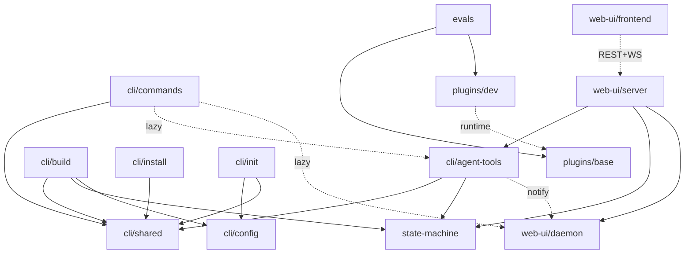

# Module & Component Breakdown

**Project**: rp1
**Analysis Date**: 2026-03-23
**Modules Analyzed**: 17

## Core Modules

### cli/commands (`cli/src/commands/`)
**Purpose**: User-facing CLI commands via Commander.js: arcade, install, init, settings, update, verify, uninstall
**Files**: 22 | **Key**: `main.ts`, `arcade.ts`, `install/index.ts`, `init.ts`, `settings.ts`
**Dependencies**: cli/shared, cli/agent-tools (lazy), web-ui/daemon (lazy)

### cli/agent-tools (`cli/src/agent-tools/`)
**Purpose**: Agent-tools CLI surface with subcommands for emit, task queue, GitHub PR, comment extraction, Mermaid validation, rp1-root resolution, state-machine loading, and feedback lifecycle
**Files**: 51 | **Key**: `command.ts`, `index.ts`, `emit/index.ts`, `state-machine/index.ts`, `github-pr/index.ts`, `task/index.ts`, `feedback/index.ts`
**Dependencies**: cli/shared, web-ui/daemon (notify)

### cli/build (`cli/src/build/`)
**Purpose**: Multi-platform artifact build pipeline via LiquidJS templates, platform registries, conditional preprocessing, linting, and bundle manifest generation
**Files**: 18 | **Key**: `command.ts`, `parser.ts`, `registry.ts`, `preprocessor.ts`, `validator.ts`, `claude-code/registry.ts`, `codex/registry.ts`
**Dependencies**: cli/shared, cli/agent-tools/state-machine, cli/config

### cli/install (`cli/src/install/`)
**Purpose**: Installs plugin artifacts into host tools with prerequisite checks, manifest discovery, staging, backup/rollback, and verification
**Files**: 8 | **Key**: `command.ts`, `installer.ts`, `manifest.ts`, `prerequisites.ts`, `verifier.ts`
**Dependencies**: cli/shared

### cli/init (`cli/src/init/`)
**Purpose**: Project initialization with context detection, git root discovery, health checks, tool-specific installation, and TTY-aware prompts
**Files**: 10 | **Key**: `index.ts`, `context-detector.ts`, `git-root.ts`, `steps/health-check.ts`
**Dependencies**: cli/config, cli/shared

### cli/shared (`cli/shared/`)
**Purpose**: Cross-cutting library: fp-ts helpers, config resolution, typed error factories, logger, prompts, spinner, runtime detection, event types
**Files**: 10 | **Key**: `index.ts`, `config.ts`, `errors.ts`, `fp.ts`, `logger.ts`, `events.ts`
**Dependencies**: None (leaf module)

### cli/pr-review (`cli/src/pr-review/`)
**Purpose**: PR review configuration loading and CI environment detection (GitHub Actions, generic CI, local)
**Files**: 4 | **Key**: `index.ts`, `ci-detector.ts`, `config.ts`

## Web UI Modules

### web-ui/server (`cli/web-ui/src/server/`)
**Purpose**: Bun HTTP + WebSocket server with REST APIs (runs, events, artifacts, annotations, projects), live broadcast, file watching, startup recovery
**Files**: 14 | **Key**: `server.ts`, `http.ts`, `websocket.ts`, `routes/v2-api.ts`
**Dependencies**: cli/agent-tools/emit, cli/agent-tools/state-machine, web-ui/daemon

### web-ui/daemon (`cli/web-ui/src/daemon/`)
**Purpose**: Daemon lifecycle manager: spawn, monitor, and communicate with background Web UI server via IPC and PID files
**Files**: 4 | **Key**: `manager.ts`, `ipc.ts`, `config-dir.ts`

### web-ui/frontend (`cli/web-ui/src/`)
**Purpose**: React SPA dashboard with icon-rail navigation, step lists, artifact viewer, Milkdown editor, annotation system, command palette, Mermaid rendering, Shiki highlighting
**Files**: 138 | **Key**: `main.tsx`, `app/App.tsx`, `app/routes.tsx`, `app/V2Layout.tsx`
**Dependencies**: web-ui/server (REST + WebSocket)

## Plugin Modules

### plugins/base
**Purpose**: Foundational plugin: KB generation/loading, documentation, Mermaid, strategy, deep research, content writing, task management, security analysis
**Skills**: knowledge-build, knowledge-load, strategize, deep-research, write-content, fix-mermaid, mermaid, generate-user-docs, analyse-security, task, self-update, project-birds-eye-view, code-comments, markdown-preview
**Agents**: 13 (kb-spatial-analyzer, kb-architecture-mapper, kb-concept-extractor, kb-module-analyzer, kb-pattern-extractor, kb-index-builder, research-reporter, research-explorer, project-documenter, mermaid-fixer, security-validator, strategic-advisor, scribe)

### plugins/dev
**Purpose**: Feature delivery: build (full, fast, express), blueprint, PR review, code audit, feature lifecycle, investigation
**Skills**: build, build-fast, build-express, blueprint, blueprint-archive, blueprint-audit, bootstrap, pr-review, pr-visual, code-audit, code-check, code-clean-comments, code-investigate, feature-archive, feature-edit, feature-unarchive, address-pr-feedback, validate-hypothesis, arcade-collab
**Agents**: 34 (task-builder, task-reviewer, feature-verifier, feature-architect, feature-tasker, pr-sub-reviewer, pr-review-synthesizer, express-builder, and more)
**Depends on**: plugins/base

### plugins/utils
**Purpose**: Prompt authoring, tersification, eval assertion extraction, eval builder, tester
**Skills**: prompt-writer, build-prompt-evals, tersify-prompt, prompt-eval-builder, tester
**Agents**: 4 (prompt-tersifier, prompt-eval-extractor, prompt-assertion-specialist, dependency-chain-analyzer)

## Other Packages

### evals (`evals/`)
**Purpose**: Prompt attestation system: dependency graphs, content hashing, attestation manifests, eval suite verification
**Files**: 12 | **Key**: `src/index.ts`, `src/attestation/commands.ts`, `src/attestation/deps-graph.ts`, `src/attestation/prompt-hash.ts`

### packages/catppuccin-mermaid
**Purpose**: Standalone npm package: Catppuccin-flavored Mermaid theme with four flavors, palette helpers, contrast utilities, WCAG checks
**Files**: 12 | **Key**: `src/index.ts`, `src/theme.ts`, `src/palette.ts`

## Module Dependencies

```mermaid
graph TD
    Commands["cli/commands"] --> Shared["cli/shared"]
    Commands -.->|lazy| AgentTools["cli/agent-tools"]
    Commands -.->|lazy| Daemon["web-ui/daemon"]
    AgentTools --> Shared
    AgentTools --> StateMachine["state-machine"]
    AgentTools -.->|notify| Daemon
    Build["cli/build"] --> Shared
    Build --> StateMachine
    Build --> Config["cli/config"]
    Install["cli/install"] --> Shared
    Init["cli/init"] --> Config
    Init --> Shared
    Server["web-ui/server"] --> AgentTools
    Server --> StateMachine
    Server --> Daemon
    Frontend["web-ui/frontend"] -.->|REST+WS| Server
    PluginsDev["plugins/dev"] -.->|runtime| PluginsBase["plugins/base"]
    Evals["evals"] --> PluginsBase
    Evals --> PluginsDev
```

## Module Metrics

| Module | Files | Key Components | Dependencies |
|--------|-------|----------------|--------------|
| cli/commands | 22 | 8 commands | 3 internal |
| cli/agent-tools | 51 | 6 tool groups | 2 internal |
| cli/build | 18 | 8 pipeline stages | 3 internal |
| cli/install | 8 | 5 services | 1 internal |
| cli/init | 10 | 3 orchestrators | 2 internal |
| cli/shared | 10 | 6 utilities | 0 (leaf) |
| web-ui/server | 14 | 4 services | 3 internal |
| web-ui/daemon | 4 | 3 services | 1 internal |
| web-ui/frontend | 138 | 50+ components | 1 runtime |
| plugins/base | 30 | 14 skills, 13 agents | 0 |
| plugins/dev | 53 | 19 skills, 34 agents | 1 runtime |
| plugins/utils | 7 | 5 skills, 4 agents | 0 |
| evals | 12 | 4 services | 2 direct |
| catppuccin-mermaid | 12 | 4 modules | 0 |

## Cross-Module Patterns

- **Skill-Agent Delegation**: Skills orchestrate, agents execute via Task tool
- **Event-Driven Dashboard**: Agent tools emit to SQLite; server queries and broadcasts via WebSocket
- **Multi-Platform Build**: Single markdown source compiles to Claude Code, OpenCode, Codex artifacts
- **Lazy-Load Isolation**: main.ts dynamically imports agent-tools and daemon to keep CLI startup fast
- **Shared fp-ts Pipeline**: All CLI modules use TaskEither<CLIError, T> via cli/shared
- **Plugin Layering**: Base provides foundations; dev extends with delivery workflows; utils is independent
- **Feedback Loop**: Agent-tools feedback submodule reads/resolves/replies to Arcade annotations and notifies daemon for real-time WebSocket broadcast

## Cross-References
- **Architecture Overview**: See [architecture.md](architecture.md)
- **Implementation Patterns**: See [patterns.md](patterns.md)
- **Domain Concepts**: See [concept_map.md](concept_map.md)
