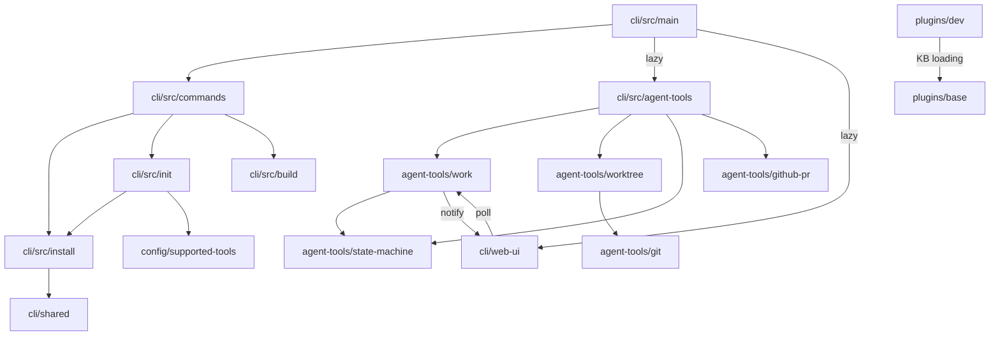

# Module & Component Breakdown

**Project**: rp1
**Analysis Date**: 2026-03-09
**Modules Analyzed**: 14

## Core Modules

### CLI Entry Point (`cli/src/main.ts`)
**Purpose**: Commander-based CLI entry point with lazy-loaded agent-tools and daemon server
**Key Files**: `main.ts`
**Dependencies**: commands, agent-tools (lazy), web-ui (lazy)

### Agent Tools (`cli/src/agent-tools/`)
**Purpose**: Runtime tools framework for AI agents with registry pattern and 7 sub-tool modules
**Files**: 43 | **LOC**: ~7,763
**Key Components**:
- **tool-registry** (`index.ts`): Map-based registration with `registerTool()`, `getTool()`, `listTools()`
- **command** (`command.ts`): Commander.js integration dispatching CLI subcommands
- **work** (`work/`): SQLite-backed workflow progress tracking with state machine validation
- **state-machine** (`state-machine/`): Mermaid stateDiagram-v2 parsing and transition validation
- **worktree** (`worktree/`): Git worktree creation, cleanup, status for isolated agent execution
- **github-pr** (`github-pr/`): GitHub PR operations (submit-review, add-reaction, reply-comment)
- **comment-extract** (`comment-extract/`): Code comment extraction with git diff support
- **mmd-validate** (`mmd-validate/`): Mermaid diagram validation via browser
- **rp1-root-dir** (`rp1-root-dir/`): RP1_ROOT resolution (env, git-common-dir, cwd)

**Contract**: All tools return `TE.TaskEither<CLIError, ToolResult<T>>`

### Commands (`cli/src/commands/`)
**Purpose**: Commander.js CLI command definitions
**Files**: 24 | **LOC**: ~4,273
**Key Commands**: install (claude-code, opencode, codex), init, build, uninstall, settings, self-update, arcade

### Installation System (`cli/src/install/`)
**Purpose**: Multi-platform plugin installation with fp-ts pipelines, backup/restore, atomic staging
**Files**: 18 | **LOC**: ~5,016
**Key Components**:
- **opencode-installer** (`installer.ts`): Transactional install with backup/restore and atomic staging
- **claudecode-installer** (`claudecode/installer.ts`): Claude Code plugin install via marketplace CLI
- **codex-installer** (`codex/installer.ts`): Codex CLI install with skill copying, agent TOML files, config.toml merging
- **manifest** (`manifest.ts`): Plugin manifest loading and verification

### Init Wizard (`cli/src/init/`)
**Purpose**: 12-step TTY-aware project initialization with reinit detection, tool detection, plugin installation
**Files**: 26 | **LOC**: ~7,229
**Key Components**: context-detector, tool-detector, comment-fence, shell-fence, progress, templates
**UI**: Ink-based React TUI components (InitWizard, StepList, ActivityLog, FinalSummary)

### Build Pipeline (`cli/src/build/`)
**Purpose**: Multi-target artifact build pipeline: parse SKILL.md, transform, validate, generate for OpenCode and Codex
**Files**: 17 | **LOC**: ~3,575
**Key Components**:
- **codex** (`codex/`): Generator for Codex SKILL.md, per-agent TOML files, openai.yaml metadata, config.toml entries

### Shared (`cli/shared/`)
**Purpose**: Cross-cutting foundation: CLIError tagged union (14 variants), fp-ts re-exports, logger, prompts
**Files**: 8 | **LOC**: ~848
**Key Exports**: errors.ts (CLIError), fp.ts (Either/TaskEither re-exports), config.ts, logger.ts

### Web UI (`cli/web-ui/`)
**Purpose**: React/Vite status dashboard with Bun HTTP server, WebSocket live-reload, file watching, annotation system
**Files**: 139 | **LOC**: ~26,446
**Key Components**:
- **Server**: Bun HTTP + WebSocket server (`server/http.ts`, `server/websocket.ts`)
- **Frontend**: React SPA with React Router, Tailwind, shadcn/ui (`app/App.tsx`, `pages/v2/`)
- **Daemon**: Background process management (`daemon/manager.ts`)
- **API**: `/api/v2/runs`, `/api/v2/projects`, `/api/v2/workflows`, `/api/v2/annotations`

## Plugin Modules

### rp1-base (`plugins/base/`)
**Purpose**: Foundation plugin: knowledge management, documentation, strategy, security
**Skills**: 17 | **Agents**: 13 | **LOC**: ~12,849
**Key Skills**: knowledge-build, knowledge-load, strategize, deep-research, analyse-security, mermaid, generate-user-docs

### rp1-dev (`plugins/dev/`)
**Purpose**: Development workflow plugin: feature lifecycle, code quality, PRs, testing
**Skills**: 21 | **Agents**: 32 | **LOC**: ~11,026
**Dependencies**: rp1-base (for KB loading)
**Key Skills**: build, build-fast, build-express, blueprint, bootstrap, pr-review, code-check, code-audit

### rp1-utils (`plugins/utils/`)
**Purpose**: Meta-tooling plugin: prompt engineering and eval generation
**Skills**: 5 | **Agents**: 4 | **LOC**: ~2,740
**Key Skills**: tersify-prompt, prompt-writer, build-prompt-evals

## Support Modules

### Evals (`evals/`)
**Purpose**: Promptfoo-based evaluation with content-addressable attestation
**Files**: 12 | **LOC**: ~2,243
**Key Components**: attestation CLI, dependency graph, manifest management, prompt hashing

### Catppuccin Mermaid (`packages/catppuccin-mermaid/`)
**Purpose**: Catppuccin theme library for Mermaid diagrams
**Key Exports**: theme generation, CSS output, MkDocs integration

## Module Dependencies

```mermaid
graph TD
    Main[cli/src/main] --> Commands[cli/src/commands]
    Main -->|lazy| AgentTools[cli/src/agent-tools]
    Main -->|lazy| WebUI[cli/web-ui]

    Commands --> Install[cli/src/install]
    Commands --> Init[cli/src/init]
    Commands --> Build[cli/src/build]

    AgentTools --> Work[agent-tools/work]
    AgentTools --> Worktree[agent-tools/worktree]
    AgentTools --> SM[agent-tools/state-machine]
    AgentTools --> GitPR[agent-tools/github-pr]

    Work --> SM
    Work -->|notify| WebUI
    Worktree --> Git[agent-tools/git]
    Install --> Shared[cli/shared]
    Init --> Install
    Init --> ToolDetect[config/supported-tools]

    WebUI -->|poll| Work

    DevPlugin[plugins/dev] -->|KB loading| BasePlugin[plugins/base]
```

## Module Metrics

| Module | Files | LOC | Components | Complexity |
|--------|-------|-----|------------|------------|
| cli/src/agent-tools | 43 | 7,763 | 6 | High |
| cli/src/commands | 24 | 4,273 | 10 | Medium |
| cli/src/install | 18 | 5,016 | 3 | High |
| cli/src/init | 26 | 7,229 | 1 | High |
| cli/src/build | 17 | 3,575 | 1 | Medium |
| cli/src/pr-review | 4 | 851 | 1 | Low |
| cli/shared | 8 | 848 | 6 | Low |
| cli/web-ui | 139 | 26,446 | 3 | High |
| plugins/base | 52 | 12,849 | 30 | Medium |
| plugins/dev | 54 | 11,026 | 53 | Medium |
| plugins/utils | 17 | 2,740 | 9 | Low |
| evals | 12 | 2,243 | 1 | Low |

## Cross-Module Patterns

- **Skill-Agent Delegation**: Skills spawn agents via Task tool; agents execute autonomously
- **Tool Registry**: Agent tools self-register via `registerTool()` at module load; `command.ts` dispatches via `getTool()`
- **fp-ts Error Pipeline**: All CLI modules use Either/TaskEither with `pipe()` composition; CLIError 14-variant tagged union
- **State Machine Integration**: Embedded Mermaid stateDiagram drives runtime validation, work tracking, and UI rendering
- **Content Fencing**: Init/uninstall use `<!-- rp1:start/end -->` (markdown) and `# rp1:start/end` (shell) for idempotent injection
- **Lazy Loading**: Main CLI lazy-loads agent-tools and daemon to avoid heavy deps (puppeteer) at startup
- **Multi-Platform Installation**: Separate installer modules for OpenCode (atomic staging), Claude Code (marketplace), Codex (TOML + config.toml)
