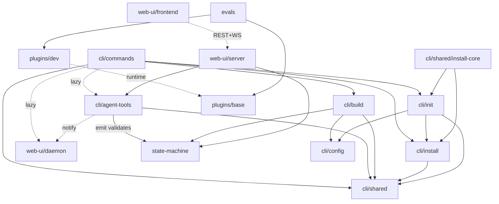

# Module & Component Breakdown

**Project**: rp1
**Analysis Date**: 2026-03-25
**Modules Analyzed**: 17

## Core Modules

### CLI Commands (`cli/src/commands/`)
**Purpose**: User-facing CLI commands via Commander.js: init, install, build, settings, self-update, verify, uninstall
**Files**: 26
**Key Components**: init.ts, install/index.ts, build.ts, settings.ts, self-update.ts, verify/index.ts, uninstall.ts, uninstall-codex.ts
**Dependencies**: cli/shared, cli/agent-tools, cli/init, cli/build, cli/install, web-ui/daemon

### Agent Tools (`cli/src/agent-tools/`)
**Purpose**: Agent-tools CLI surface with tool registry, subcommands for emit, task queue, GitHub PR, comment extraction, Mermaid validation, rp1-root resolution, state-machine loading, and feedback lifecycle
**Files**: 51
**Key Components**:
- **tool-registry** (`index.ts`): Lazily-populated Map-based registry with ToolExecutor<T> interface
- **emit** (`emit/index.ts`): Unified event recording (6 event types) with state machine validation
- **emit-database** (`emit/database.ts`): SQLite layer with schema v4, WAL mode, additive migrations
- **step-validation** (`emit/step-validation.ts`): Step validation against workflow state machines
- **state-machine** (`state-machine/index.ts`): Mermaid stateDiagram-v2 parser, graph query engine
- **task** (`task/index.ts`): Task queue lifecycle management
- **feedback** (`feedback/index.ts`): Annotation processing (read, resolve, reply, accept-edit)
- **github-pr** (`github-pr/index.ts`): Deterministic GitHub PR operations (review, react, reply, fetch)
- **comment-extract** (`comment-extract/index.ts`): Comment extraction from git-changed files
- **mmd-validate** (`mmd-validate/index.ts`): Mermaid diagram validation and error reporting
- **rp1-root-dir** (`rp1-root-dir/index.ts`): RP1_ROOT resolution with git worktree detection

**Contract**: All tools implement ToolExecutor<T> returning TaskEither<CLIError, ToolResult<T>>

### Build Pipeline (`cli/src/build/`)
**Purpose**: Multi-platform artifact build pipeline via LiquidJS templates with platform registries, conditional preprocessing, custom Liquid filters, linting, and manifest generation
**Files**: 40
**Key Components**: command.ts, parser.ts, registry.ts, preprocessor.ts, validator.ts, template-engine.ts
**Public API**: `executeBuild(BuildConfig)` supporting platforms: opencode, codex, claude-code, all

### Install System (`cli/src/install/`)
**Purpose**: Install plugin artifacts into host tools with prerequisite checks, manifest discovery, staging, backup/rollback, and verification
**Files**: 18
**Key Components**:
- **opencode-installer** (`installer.ts`): Copy artifacts to OpenCode plugin directories with backup/rollback
- **claudecode-installer** (`claudecode/installer.ts`): Claude Code marketplace integration
- **codex-installer** (`codex/installer.ts`): Full install/uninstall for Codex CLI with shell fence management

### Init System (`cli/src/init/`)
**Purpose**: Project initialization with context detection (greenfield/brownfield), git root discovery, health checks, tool-specific installation, and Ink-based UI
**Files**: 26
**Key Components**: context-detector.ts, git-root.ts, steps/health-check.ts, steps/plugin-installation.ts, steps/verification.ts

### Shared Library (`cli/shared/`)
**Purpose**: Cross-cutting library: fp-ts helpers, typed error factories, logger, prompts, spinner, runtime detection, event types
**Files**: 12
**Contract**: Leaf module with no internal dependencies. All CLI modules depend on it.
**Key Exports**: CLIError (13 variants), Logger, createSpinner, selectOption, EventType, RunRecord

### PR Review (`cli/src/pr-review/`)
**Purpose**: PR review configuration loading and CI environment detection (GitHub Actions, Buildkite, GitLab, generic)
**Files**: 4
**Key Components**: ci-detector.ts, config.ts

## Web UI Modules

### Server (`cli/web-ui/src/server/`)
**Purpose**: Bun HTTP + WebSocket server with REST APIs, annotation persistence, markdown embedding, live broadcast, file watching
**Files**: 14
**Key Components**:
- **v2-api** (`routes/v2-api.ts`): REST endpoints for runs, events, artifacts, projects with state machine step derivation
- **annotations-api** (`routes/annotations-api.ts`): Annotation CRUD endpoints
- **artifacts-api** (`routes/artifacts-api.ts`): Artifact serving and management
- **annotation-service** (`annotation-service.ts`): SQLite-backed annotation persistence with threading
- **markdown-embedder** (`markdown-embedder.ts`): Embed annotations as HTML comments in markdown
- **websocket** (`websocket.ts`): WebSocketHub for real-time event broadcast with replay

### Daemon (`cli/web-ui/src/daemon/`)
**Purpose**: Daemon lifecycle manager: spawn, monitor, communicate with background Web UI server via IPC and PID files
**Files**: 4
**Key Components**: manager.ts (spawn/health check/version-aware restart), ipc.ts, config-dir.ts

### Frontend (`cli/web-ui/src/`)
**Purpose**: React SPA dashboard with icon-rail navigation, step lists, artifact viewer, Milkdown editor, annotation system, command palette, Mermaid rendering
**Files**: 137
**Key Components**:
- **App Shell** (`app/App.tsx`, `app/V2Layout.tsx`): Provider hierarchy, icon-rail nav, command palette
- **Run Detail** (`pages/v2/RunDetailPage.tsx`): Resizable step list + artifact viewer panels
- **Artifact Viewer** (`pages/v2/ArtifactViewerPage.tsx`, `components/v2/ArtifactViewerPanel.tsx`): Markdown/code rendering with annotations
- **Annotations** (`components/v2/AnnotationPopover.tsx`, `hooks/useAnnotations.ts`): Inline comment system with optimistic updates
- **Markdown** (`components/MarkdownViewer/`, `components/MilkdownEditor/`): Rendering and editing with Mermaid/Shiki
- **Hooks** (`hooks/useRuns.ts`, `hooks/useRunDetail.ts`, `hooks/useProjects.ts`): Data fetching with WebSocket-driven refetch

## Plugin Modules

### plugins/base (30 files)
**Purpose**: Foundational: KB generation/loading, documentation, Mermaid, strategy, deep research, security analysis, task management
**Skills**: knowledge-build, knowledge-load, strategize, deep-research, write-content, fix-mermaid, analyse-security, task, self-update, project-birds-eye-view
**Agents**: kb-spatial-analyzer, kb-architecture-mapper, kb-concept-extractor, kb-module-analyzer, kb-pattern-extractor, research-reporter, strategic-advisor, scribe

### plugins/dev (53 files)
**Purpose**: Feature delivery: build (full, fast, express), blueprint, PR review, code audit, feature lifecycle, investigation
**Skills**: build, build-fast, build-express, blueprint, pr-review, pr-visual, code-audit, code-check, code-investigate, address-pr-feedback, validate-hypothesis
**Agents**: task-builder, task-reviewer, feature-verifier, feature-architect, feature-tasker, pr-sub-reviewer, pr-review-synthesizer
**Dependency**: Depends on rp1-base at runtime

### plugins/utils (7 files)
**Purpose**: Prompt authoring, tersification, eval assertion extraction
**Skills**: prompt-writer, tersify-prompt, prompt-eval-builder

## Support Packages

### evals (12 files)
**Purpose**: Prompt attestation system: dependency graphs, content hashing, attestation manifests, eval suite verification

### packages/catppuccin-mermaid (12 files)
**Purpose**: Standalone npm package: Catppuccin-flavored Mermaid theme with four flavors and WCAG contrast checks

## Module Dependencies

```mermaid
graph TD
    Commands["cli/commands"] --> Shared["cli/shared"]
    Commands --> Init["cli/init"]
    Commands --> Build["cli/build"]
    Commands --> Install["cli/install"]
    Commands -.->|lazy| AgentTools["cli/agent-tools"]
    Commands -.->|lazy| Daemon["web-ui/daemon"]
    AgentTools --> Shared
    AgentTools -->|emit validates| SM["state-machine"]
    AgentTools -.->|notify| Daemon
    Build --> Shared
    Build --> SM
    Build --> Config["cli/config"]
    Install --> Shared
    Init --> Shared
    Init --> Config
    Init --> Install
    InstallCore["cli/shared/install-core"] --> Install
    InstallCore --> Init
    Server["web-ui/server"] --> AgentTools
    Server --> SM
    Frontend["web-ui/frontend"] -.->|REST+WS| Server
    PluginsDev["plugins/dev"] -.->|runtime| PluginsBase["plugins/base"]
    Evals["evals"] --> PluginsBase
    Evals --> PluginsDev
```

## Module Metrics

| Module | Files | Components | Key Pattern |
|--------|-------|------------|-------------|
| cli/commands | 26 | 8 | Commander.js dispatch |
| cli/agent-tools | 51 | 11 | Tool registry + TE pipelines |
| cli/build | 40 | 2 | LiquidJS template pipeline |
| cli/install | 18 | 3 | Backup/rollback staging |
| cli/init | 26 | 3 | Step orchestration + Ink UI |
| cli/shared | 12 | 2 | fp-ts facade + error unions |
| cli/pr-review | 4 | 1 | Config + CI detection |
| web-ui/server | 14 | 4 | REST + WebSocket + SQLite |
| web-ui/daemon | 4 | 3 | PID lifecycle + IPC |
| web-ui/frontend | 137 | 50 | React hooks + WS refetch |
| plugins/base | 30 | 28 | Markdown skills + agents |
| plugins/dev | 53 | 53 | Delivery workflows |
| plugins/utils | 7 | 9 | Prompt tooling |
| evals | 12 | 4 | Content-addressable attestation |

## Cross-Module Patterns

- **Skill-Agent Delegation**: Skills orchestrate, agents execute via Task tool as subprocesses
- **Event-Driven Dashboard**: emit -> SQLite -> WebSocket -> React frontend
- **Multi-Platform Build**: Single markdown source -> LiquidJS -> Claude Code / OpenCode / Codex artifacts
- **Lazy-Load Isolation**: main.ts dynamically imports agent-tools and daemon for sub-100ms startup
- **Shared fp-ts Pipeline**: All CLI modules use TaskEither<CLIError, T> from cli/shared
- **Plugin Layering**: Base provides foundations; dev extends; utils is independent
- **Tool Registry Self-Registration**: Agent tools self-register via registerTool() at import time
- **Feedback Loop**: feedback agent-tools -> Arcade annotations -> WebSocket broadcast
