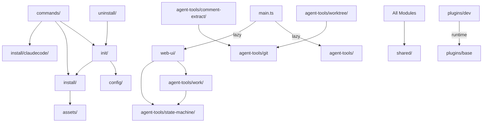

# Module & Component Breakdown

**Project**: rp1
**Analysis Date**: 2026-03-01
**Modules Analyzed**: 17

## Plugin Modules

### rp1-base (`plugins/base/`)
**Purpose**: Foundation plugin for knowledge management, documentation, strategy, security
**Skills**: knowledge-build, knowledge-load, deep-research, strategize, analyse-security, project-birds-eye-view, write-content, fix-mermaid, self-update, mermaid, markdown-preview, knowledge-base-templates, code-comments, work-status, generate-user-docs
**Agents**: kb-spatial-analyzer, kb-concept-extractor, kb-architecture-mapper, kb-module-analyzer, kb-pattern-extractor, kb-index-builder, strategic-advisor, research-explorer, research-reporter, project-documenter, security-validator, mermaid-fixer, scribe
**Dependencies**: None (independent)

### rp1-dev (`plugins/dev/`)
**Purpose**: Development workflow automation for feature lifecycle, code quality, PR management
**Skills**: build, build-fast, build-express, blueprint, bootstrap, feature-edit, feature-archive, feature-unarchive, validate-hypothesis, blueprint-archive, blueprint-audit, code-check, code-audit, code-investigate, code-clean-comments, pr-review, pr-visual, address-pr-feedback, worktree-workflow
**Agents**: 32 agents including task-builder, task-reviewer, feature-verifier, pr-review-splitter, pr-sub-reviewer, pr-review-synthesizer, build-fast-planner, feature-architect, feature-requirement-gatherer, bug-investigator
**Dependencies**: rp1-base (KB loading, shared skills)

### rp1-utils (`plugins/utils/`)
**Purpose**: Meta-tooling for prompt engineering and eval generation
**Skills**: tersify-prompt, build-prompt-evals, tester, prompt-writer, prompt-eval-builder
**Agents**: prompt-tersifier, prompt-eval-extractor, prompt-assertion-specialist, dependency-chain-analyzer
**Dependencies**: None (independent)

## CLI Modules

### Commands (`cli/src/commands/`)
**Purpose**: CLI command definitions using Commander.js with lazy loading
**Key Files**: main.ts, install/index.ts, update/index.ts, verify/index.ts, init.ts, build.ts, settings.ts
**Dependencies**: init, install, install/claudecode, shared

### Init (`cli/src/init/`)
**Purpose**: 12-step TTY-aware project initialization wizard
**Key Components**: tool-detector, context-detector, git-root, comment-fence, shell-fence, progress, templates, steps/*
**Dependencies**: config/supported-tools, install (for plugin installation)

### Install (`cli/src/install/`)
**Purpose**: OpenCode plugin installation with fp-ts pipelines, prerequisite checks, verification
**Key Components**: command.ts (orchestrator), installer.ts (copy/backup/restore/staging), verifier.ts, manifest.ts, prerequisites.ts, config.ts
**Sub-module**: `claudecode/` for Claude Code plugin installation via `claude plugin` CLI
**Dependencies**: assets (for bundled binary install)

### Agent Tools (`cli/src/agent-tools/`)
**Purpose**: Runtime tools framework for AI agents with registry pattern
**Sub-tools**: worktree, github-pr, comment-extract, mmd-validate, work (SQLite status), rp1-root-dir, transform-args, state-machine
**Pattern**: ToolExecutor returns `TE.TaskEither<CLIError, ToolResult<T>>`
**Dependencies**: shared/errors, git utilities

### State Machine (`cli/src/agent-tools/state-machine/`)
**Purpose**: Declarative workflow state management via co-located Mermaid stateDiagram-v2 definitions
**Key Components**: models.ts (SMState, SMTransition, StateMachine, TransitionValidation, OrderedStep), transform.ts (mermaid-ast AST to domain model conversion), adapter.ts (graph queries: transition validation, BFS step ordering, reachability), loader.ts (filesystem + bundled asset discovery with in-memory cache)
**Pattern**: `parseAndTransform()` pipeline: raw text -> mermaid-ast `parseStateDiagram()` -> `transformAstToStateMachine()` -> `StateMachine`. Loader returns `TE.TaskEither<CLIError, StateMachine>`. Adapter functions are pure, operating on the `StateMachine` domain model.
**Consumers**: work/ (CLI transition validation with --workflow/--run-id/--ttl flags), v2-api.ts (dynamic step derivation replacing hardcoded arrays), skills at runtime (agents read state.mmd for workflow awareness)
**Dependencies**: mermaid-ast (npm), shared/errors, assets/reader (for bundled binary)

### Build (`cli/src/build/`)
**Purpose**: OpenCode artifact build pipeline: parse → transform → validate → generate
**Key Components**: command.ts (orchestrator), parser.ts, transformations.ts, generator.ts, validator.ts, registry.ts, models.ts
**Dependencies**: shared/errors

### Assets (`cli/src/assets/`)
**Purpose**: Embedded asset bundling for release binaries
**Key Components**: embedded.ts (auto-generated), extractor.ts (legacy cleanup + extraction), reader.ts (bundled assets API)
**Dependencies**: None (self-contained)

### Shared (`cli/shared/`)
**Purpose**: Cross-cutting utilities used by all CLI modules
**Key Components**: errors.ts (CLIError tagged union), logger.ts, prompts.ts, spinner.ts, fp.ts, paths.ts, install-core.ts
**Dependencies**: None (foundation layer)

### Web UI (`cli/web-ui/`)
**Purpose**: React/Vite status dashboard with WebSocket live-reload
**Key Components**: server.ts, server/websocket.ts, server/routes/v2-api.ts, pages/v2/*.tsx, components/v2/*.tsx
**Dependencies**: agent-tools/work (SQLite polling for run status)

### Evals (`evals/`)
**Purpose**: Promptfoo-based evaluation with content-addressable attestation
**Key Components**: attestation/ (commands.ts, deps-graph.ts, manifest.ts, prompt-hash.ts), providers/claude-with-tools.ts, suites/
**Dependencies**: Plugin source files (for hash computation)

## Module Dependencies

```mermaid
graph TD
    Commands[commands/] --> Init[init/]
    Commands --> Install[install/]
    Commands --> InstallCC[install/claudecode/]
    Main[main.ts] -->|lazy| AgentTools[agent-tools/]
    Main -->|lazy| WebUI[web-ui/]
    Install --> Assets[assets/]
    Init --> Config[config/]
    Init --> Install
    Uninstall[uninstall/] --> Init
    WebUI --> Work[agent-tools/work/]
    WebUI --> StateMachine[agent-tools/state-machine/]
    Work --> StateMachine
    Worktree[agent-tools/worktree/] --> Git[agent-tools/git]
    CommentExtract[agent-tools/comment-extract/] --> Git
    All[All Modules] --> Shared[shared/]
    DevPlugin[plugins/dev] -->|runtime| BasePlugin[plugins/base]
```

## Module Metrics

| Module | Files | Lines | Components |
|--------|-------|-------|------------|
| plugins/base | 29 | ~11,900 | 28 skills+agents |
| plugins/dev | 51 | ~10,600 | 51 skills+agents |
| plugins/utils | 9 | ~2,700 | 9 skills+agents |
| cli/src/commands | 18 | ~3,200 | 10 commands |
| cli/src/init | 21 | ~7,100 | 12 steps |
| cli/src/install | 12 | ~3,700 | 7 services |
| cli/src/agent-tools | 32 | ~6,800 | 8 tools (incl. state-machine sub-module) |
| cli/src/build | 8 | ~2,200 | 6 pipeline stages |
| cli/src/assets | 5 | ~3,500 | 3 services |
| cli/shared | 8 | ~825 | 6 utilities |
| cli/web-ui | 40 | ~22,000 | 15 pages/components |
| evals | 14 | ~4,000 | 6 services |

## Cross-Module Patterns

- **Skill-Agent Delegation**: Skills (SKILL.md) spawn agents via Task tool across all plugins
- **Map-Reduce Orchestration**: KB generation, PR review, and feature build use parallel agent spawning
- **fp-ts Error Handling**: All CLI modules use `Either`/`TaskEither` with `pipe()` composition
- **Tool Registry**: Agent tools self-register via `registerTool()`, lazily loaded at runtime
- **Content-Fencing**: Init/uninstall use `<!-- rp1:start/end -->` for idempotent injection
- **Content-Addressable Attestation**: Evals track prompt integrity via SHA-256 dependency graphs
