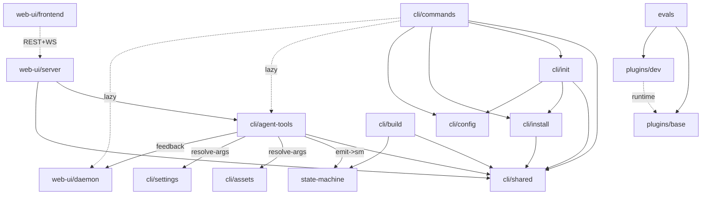

# Module & Component Breakdown

**Project**: rp1
**Analysis Date**: 2026-04-03
**Modules Analyzed**: 21

## Core Modules

### cli/commands (`cli/src/commands/`)
**Purpose**: User-facing CLI commands via Commander.js
**Files**: 20
**Key Files**: `init.ts`, `install/index.ts`, `build.ts`, `arcade.ts`, `verify/index.ts`, `update/index.ts`

### cli/agent-tools (`cli/src/agent-tools/`)
**Purpose**: Agent-tools CLI surface with tool registry and 9 subcommands for AI agent infrastructure
**Files**: 45
**Subcommands**: emit, task, feedback, github-pr, state-machine, mmd-validate, comment-extract, resolve-args, rp1-root-dir
**Key Files**: `command.ts`, `index.ts`, `emit/index.ts`, `emit/database.ts`, `state-machine/index.ts`

### cli/build (`cli/src/build/`)
**Purpose**: Multi-platform artifact build pipeline via LiquidJS templating
**Files**: 19
**Key Files**: `command.ts`, `index.ts`, `parser.ts`, `platform-definitions.ts`, `arguments.ts`, `transforms.ts`

### cli/install (`cli/src/install/`)
**Purpose**: Install plugin artifacts into host tools with staging, backup/rollback, verification
**Files**: 14
**Key Files**: `installer.ts`, `index.ts`, `claudecode/installer.ts`, `codex/installer.ts`

### cli/init (`cli/src/init/`)
**Purpose**: Project initialization with context detection, tool detection, plugin installation, Ink UI
**Files**: 18
**Key Files**: `index.ts`, `context-detector.ts`, `directory-model.ts`, `ui/InitWizard.tsx`

### cli/shared (`cli/shared/`)
**Purpose**: Cross-cutting library (leaf module, no internal dependencies)
**Files**: 12
**Key Exports**: CLIError, fp-ts facade, Logger, ResolvedDirectorySet, RuntimeInfo, canonical-name, project-id

### cli/assets (`cli/src/assets/`)
**Purpose**: Bundled asset access for release builds: manifest reading, plugin/web-ui extraction
**Files**: 4
**Key Files**: `index.ts`, `extractor.ts`, `reader.ts`

### cli/settings (`cli/src/settings/`)
**Purpose**: Settings file loading and validation for project/global rp1 configuration
**Files**: 2
**Key Files**: `loader.ts`, `validator.ts`

### cli/config (`cli/src/config/`)
**Purpose**: Supported tools registry (YAML-embedded at build time) defining host tool capabilities
**Files**: 4
**Key Files**: `supported-tools.ts`, `supported-tools.yaml`

### cli/lib (`cli/src/lib/`)
**Purpose**: Utility library: cache, colors, package-manager detection, version comparison
**Files**: 4

### cli/migrate (`cli/src/migrate/`)
**Purpose**: Migration system for upgrading rp1 project structures across versions
**Files**: 4
**Key Files**: `index.ts`, `db-backfill.ts`, `legacy-work.ts`

### cli/pr-review (`cli/src/pr-review/`)
**Purpose**: PR review configuration loading and CI environment detection
**Files**: 4
**Key Files**: `index.ts`, `ci-detector.ts`, `config.ts`

### cli/uninstall (`cli/src/uninstall/`)
**Purpose**: Uninstall executor removing rp1 injections from instruction files and gitignore
**Files**: 2

## Web UI Modules

### web-ui/server (`cli/web-ui/src/server/`)
**Purpose**: Bun HTTP + WebSocket server with REST APIs, file watching, event broadcast, annotation embedding
**Files**: 16
**Key Files**: `http.ts`, `websocket.ts`, `routes/v2-api.ts`, `file-watcher.ts`, `annotation-service.ts`, `downsampling-service.ts`

### web-ui/daemon (`cli/web-ui/src/daemon/`)
**Purpose**: Daemon lifecycle manager (spawn, monitor, IPC, PID files, config directory)
**Files**: 4
**Key Files**: `index.ts`, `manager.ts`, `ipc.ts`

### web-ui/frontend (`cli/web-ui/src/`)
**Purpose**: React SPA dashboard (Arcade) with pages, components, hooks, providers, and motion transitions
**Files**: 144
**Key Files**: `main.tsx`, `app/App.tsx`, `app/V2Layout.tsx`, `app/routes.tsx`

## Plugin Modules

### plugins/base (`plugins/base/`)
**Purpose**: Foundational plugin: KB generation/loading, documentation, Mermaid, strategy, deep research, security
**Skills**: knowledge-build, knowledge-load, strategize, deep-research, write-content, fix-mermaid, analyse-security, task, self-update, project-birds-eye-view, mermaid, markdown-preview, knowledge-base-templates, generate-user-docs, code-comments
**Agents**: kb-spatial-analyzer, kb-architecture-mapper, kb-concept-extractor, kb-module-analyzer, kb-pattern-extractor, kb-index-builder, research-reporter, research-explorer, strategic-advisor, scribe, mermaid-fixer, project-documenter, security-validator

### plugins/dev (`plugins/dev/`)
**Purpose**: Feature delivery plugin: build workflows, blueprint, PR review, code audit, feature lifecycle
**Skills**: build, build-fast, speedrun, blueprint, blueprint-audit, blueprint-archive, pr-review, pr-visual, code-audit, code-check, code-investigate, code-clean-comments, feature-archive, feature-unarchive, feature-edit, validate-hypothesis, address-pr-feedback, bootstrap, arcade-collab
**Agents**: 33 agents including task-builder, feature-architect, feature-verifier, pr-sub-reviewer, pr-review-synthesizer, speedrun-builder, bug-investigator, test-runner

### plugins/utils (`plugins/utils/`)
**Purpose**: Prompt authoring plugin: prompt writing, tersification, eval assertion extraction
**Skills**: prompt-writer, tersify-prompt, prompt-eval-builder, build-prompt-evals, tester
**Agents**: prompt-tersifier, prompt-eval-extractor, prompt-assertion-specialist, dependency-chain-analyzer

## Standalone Packages

### evals (`evals/`)
**Purpose**: Prompt attestation system with content-addressable hashing, dependency graphs, verification
**Files**: 7
**Key Files**: `src/index.ts`, `src/attestation/deps-graph.ts`, `src/attestation/manifest.ts`

### catppuccin-mermaid (`packages/catppuccin-mermaid/`)
**Purpose**: Standalone npm package: Catppuccin-flavored Mermaid theme with four flavors and WCAG contrast checks
**Files**: 3
**Key Files**: `src/index.ts`, `src/theme.ts`, `src/palette.ts`

## Key Component Details

### emit (agent-tool)
**File**: `cli/src/agent-tools/emit/index.ts`
**Pipeline**: validate -> find/create run -> insert event -> upsert artifacts -> derive status -> maybe generate notification
**Dependencies**: state-machine, bun:sqlite, cli/shared

### state-machine (agent-tool)
**File**: `cli/src/agent-tools/state-machine/index.ts`
**Purpose**: Parse Mermaid stateDiagram-v2 into queryable directed graphs with step ordering and transition validation
**Dependencies**: cli/shared

### resolve-args (agent-tool)
**File**: `cli/src/agent-tools/resolve-args/index.ts`
**Purpose**: Resolve structured arguments by merging 5 layers (schema defaults, global settings, project settings, environment, user input) with implies chains
**Dependencies**: cli/assets, cli/settings, cli/shared, cli/build

### build pipeline (cli/build)
**File**: `cli/src/build/index.ts`
**Pipeline**: parse -> preprocess -> template -> lint -> emit
**Features**: 9 custom Liquid filters, dispatch_agent tag, two-tier L1/L2 lint validation, multi-platform output

### web-ui/server
**File**: `cli/web-ui/src/server/http.ts`
**Purpose**: REST APIs and WebSocket for Arcade dashboard with reconnect replay, file watching (chokidar LRU pool, max 10), annotation embedding, downsampling

## Module Dependencies

```mermaid
graph TD
    Commands["cli/commands"] --> Shared["cli/shared"]
    Commands --> Init["cli/init"]
    Commands --> Install["cli/install"]
    Commands --> Config["cli/config"]
    Commands -.->|lazy| AgentTools["cli/agent-tools"]
    Commands -.->|lazy| Daemon["web-ui/daemon"]
    AgentTools --> Shared
    AgentTools -->|emit->sm| SM["state-machine"]
    AgentTools -->|resolve-args| Assets["cli/assets"]
    AgentTools -->|resolve-args| Settings["cli/settings"]
    AgentTools -->|feedback| Daemon
    Build["cli/build"] --> Shared
    Build --> SM
    Install --> Shared
    Init --> Shared
    Init --> Install
    Init --> Config
    Server["web-ui/server"] --> AgentTools
    Server --> Shared
    Frontend["web-ui/frontend"] -.->|REST+WS| Server
    PluginsDev["plugins/dev"] -.->|runtime| PluginsBase["plugins/base"]
    Evals["evals"] --> PluginsBase
    Evals --> PluginsDev
```

## Cross-Module Patterns

- **Skill-Agent Delegation**: Skills orchestrate, agents execute discrete tasks in single-pass autonomous mode
- **Event-Driven Dashboard**: emit -> SQLite -> daemon -> WebSocket -> React frontend (with startup recovery)
- **Multi-Platform Build**: Single markdown source -> LiquidJS -> platform-specific artifacts for 3 host tools
- **Lazy-Load Isolation**: Heavy modules (puppeteer, daemon) dynamically imported only when needed for sub-100ms startup
- **Shared fp-ts Pipeline**: TaskEither<CLIError, T> as canonical error-handling monad across all CLI modules
- **State Machine Validation**: Mermaid definitions as single source of truth validated at emit time, build time, and in web-ui
- **Tool Registry Self-Registration**: Agent tools register via registerTool() at module import time
- **Daemon IPC Notification**: Agent tools send best-effort IPC notifications for immediate WebSocket broadcast
