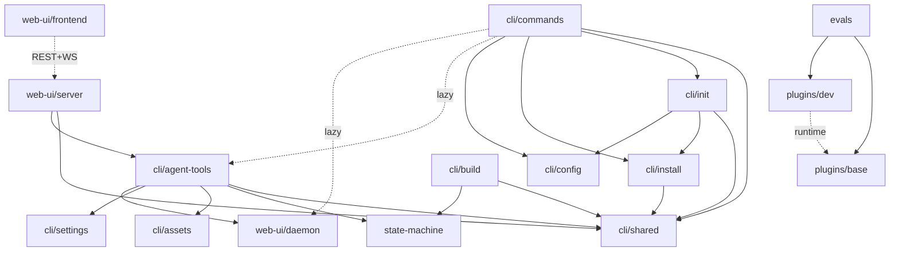

# Module & Component Breakdown

**Project**: rp1
**Analysis Date**: 2026-04-03
**Modules Analyzed**: 21

## Core Modules

### cli/commands (`cli/src/commands/`)
**Purpose**: User-facing CLI commands via Commander.js
**Files**: 27
**Key Files**: `init.ts`, `install/index.ts`, `arcade.ts`, `fake.ts`, `verify/index.ts`, `update/index.ts`
**Dependencies**: cli/shared, cli/init, cli/install, cli/config, cli/agent-tools (lazy), web-ui/daemon (lazy)

### cli/agent-tools (`cli/src/agent-tools/`)
**Purpose**: Agent-tools CLI surface with tool registry and 9 subcommands for AI agent infrastructure
**Files**: 45
**Key Components**:
- **emit** (`emit/index.ts`): Event ingestion pipeline — validate, find/create run, insert event, upsert artifacts, derive status, maybe generate notification
- **state-machine** (`state-machine/index.ts`): Parse Mermaid stateDiagram-v2 into queryable directed graphs with step ordering and transition validation
- **resolve-args** (`resolve-args/index.ts`): Resolve structured arguments by merging 5 layers with implies chains
- **task** (`task/index.ts`): Task queue management with create, list, get, pickup, complete, fail, cancel
- **feedback** (`feedback/index.ts`): Arcade annotation feedback: read, reply, resolve, accept-edit
- **github-pr** (`github-pr/index.ts`): GitHub PR interaction: fetch comments, submit reviews, reply, add reactions
- **comment-extract** (`comment-extract/index.ts`): Extract code comments from git-changed files
- **mmd-validate** (`mmd-validate/index.ts`): Mermaid diagram validation
- **rp1-root-dir** (`rp1-root-dir/index.ts`): Project directory resolution

### cli/build (`cli/src/build/`)
**Purpose**: Multi-platform artifact build pipeline via LiquidJS templating
**Files**: 48
**Key Files**: `command.ts`, `index.ts`, `parser.ts`, `platform-definitions.ts`, `arguments.ts`, `transforms.ts`
**Responsibilities**: Parse skill/agent markdown, preprocess with argument injection, template via LiquidJS with 9 custom filters, two-tier L1/L2 lint validation, multi-platform output for 3 host tools
**Dependencies**: cli/shared, state-machine

### cli/install (`cli/src/install/`)
**Purpose**: Install plugin artifacts into host tools with staging, backup/rollback, verification
**Files**: 22
**Key Files**: `installer.ts`, `index.ts`, `claudecode/installer.ts`, `codex/installer.ts`

### cli/init (`cli/src/init/`)
**Purpose**: Project initialization with context detection, tool detection, plugin installation, Ink UI
**Files**: 29
**Key Files**: `index.ts`, `context-detector.ts`, `directory-model.ts`, `ui/InitWizard.tsx`
**Dependencies**: cli/shared, cli/install, cli/config

### cli/shared (`cli/shared/`)
**Purpose**: Cross-cutting library (leaf module, no internal dependencies)
**Files**: 15
**Key Exports**:
- **errors.ts**: CLIError tagged union with _tag discriminant, 14 factory functions, ExitCode mapping
- **fp.ts**: fp-ts facade with suffix convention (mapTE, chainTE, foldO, mapA)
- **events.ts**: Canonical event system types (Status enum, EventType enum, payload interfaces) — single source of truth for CLI and web-ui
- **directory-resolution.ts**: Worktree-aware project root discovery returning ResolvedDirectorySet
- **logger.ts**: consola-based Logger via createLogger() factory
- **canonical-name.ts**: CanonicalName parse/format for cross-platform namespace translation
- **prompts.ts**: TTY-aware interactive prompts with non-TTY defaults
- **project-id.ts**: Project UUID management

### cli/assets (`cli/src/assets/`)
**Purpose**: Bundled asset access for release builds: manifest reading, plugin/web-ui extraction
**Files**: 4

### cli/settings (`cli/src/settings/`)
**Purpose**: Settings file loading and validation for project/global rp1 configuration
**Files**: 2

### cli/config (`cli/src/config/`)
**Purpose**: Supported tools registry (YAML-embedded at build time) defining host tool capabilities
**Files**: 4

### cli/lib (`cli/src/lib/`)
**Purpose**: Utility library: cache, colors, package-manager detection, version comparison
**Files**: 4

### cli/migrate (`cli/src/migrate/`)
**Purpose**: Migration system for upgrading rp1 project structures across versions
**Files**: 4

### cli/pr-review (`cli/src/pr-review/`)
**Purpose**: PR review configuration loading and CI environment detection
**Files**: 4

## Web UI Modules

### web-ui/server (`cli/web-ui/src/server/`)
**Purpose**: Bun HTTP + WebSocket server with REST APIs, file watching, event broadcast, annotation embedding
**Files**: 16
**Key Components**: `http.ts` (regex-based routing), `websocket.ts` (reconnect replay), `routes/v2-api.ts`, `routes/artifacts-api.ts`, `routes/annotations-api.ts`, `file-watcher.ts` (chokidar LRU pool, max 10)

### web-ui/daemon (`cli/web-ui/src/daemon/`)
**Purpose**: Daemon lifecycle manager (spawn, monitor, IPC, PID files, config directory)
**Files**: 4

### web-ui/frontend (`cli/web-ui/src/`)
**Purpose**: React SPA dashboard (Arcade) with pages, components, hooks, providers, and motion transitions
**Files**: 175
**Key Files**: `main.tsx`, `app/App.tsx`, `app/V2Layout.tsx`, `app/routes.tsx`

## Plugin Modules

### plugins/base
**Purpose**: Foundational plugin: KB generation/loading, documentation, Mermaid, strategy, deep research, security
**Files**: 47
**Skills**: knowledge-build, knowledge-load, strategize, deep-research, write-content, fix-mermaid, analyse-security, task, self-update, project-birds-eye-view, mermaid, markdown-preview, knowledge-base-templates, generate-user-docs, code-comments
**Agents**: kb-spatial-analyzer, kb-architecture-mapper, kb-concept-extractor, kb-interaction-mapper, kb-module-analyzer, kb-pattern-extractor, kb-index-builder, research-reporter, research-explorer, strategic-advisor, scribe, mermaid-fixer, project-documenter, security-validator

### plugins/dev
**Purpose**: Feature delivery plugin: build workflows, blueprint, PR review, code audit, feature lifecycle
**Files**: 56
**Skills**: build, build-fast, speedrun, blueprint, blueprint-audit, blueprint-archive, pr-review, pr-visual, code-audit, code-check, code-investigate, code-clean-comments, feature-archive, feature-unarchive, feature-edit, validate-hypothesis, address-pr-feedback, bootstrap, arcade-collab
**Agents**: 33 agents including task-builder, feature-architect, feature-verifier, pr-sub-reviewer, pr-review-synthesizer, speedrun-builder, build-fast-planner, code-auditor, bug-investigator

### plugins/utils
**Purpose**: Prompt authoring plugin: prompt writing, tersification, eval assertion extraction
**Files**: 9
**Skills**: prompt-writer, tersify-prompt, prompt-eval-builder, build-prompt-evals, tester
**Agents**: prompt-tersifier, prompt-eval-extractor, prompt-assertion-specialist, dependency-chain-analyzer

## Supporting Packages

### evals (`evals/`)
**Purpose**: Prompt attestation system with content-addressable hashing, dependency graphs, verification
**Files**: 7

### catppuccin-mermaid (`packages/catppuccin-mermaid/`)
**Purpose**: Standalone npm package: Catppuccin-flavored Mermaid theme with four flavors and WCAG contrast checks
**Files**: 3

## Module Dependencies

```mermaid
graph TD
    Commands[cli/commands] --> Shared[cli/shared]
    Commands --> Init[cli/init]
    Commands --> Install[cli/install]
    Commands --> Config[cli/config]
    Commands -.->|lazy| AgentTools[cli/agent-tools]
    Commands -.->|lazy| Daemon[web-ui/daemon]
    AgentTools --> Shared
    AgentTools --> SM[state-machine]
    AgentTools --> Assets[cli/assets]
    AgentTools --> Settings[cli/settings]
    AgentTools --> Daemon
    Build[cli/build] --> Shared
    Build --> SM
    Init --> Shared
    Init --> Install
    Init --> Config
    Install --> Shared
    Server[web-ui/server] --> Shared
    Server --> AgentTools
    Frontend[web-ui/frontend] -.->|REST+WS| Server
    DevPlugin[plugins/dev] -.->|runtime| BasePlugin[plugins/base]
    Evals[evals] --> BasePlugin
    Evals --> DevPlugin
```

## Cross-Module Patterns

- **Skill-Agent Delegation**: Skills orchestrate; agents execute discrete tasks in single-pass autonomous mode
- **Event-Driven Dashboard**: emit -> SQLite -> daemon IPC -> WebSocket -> React frontend; shared events.ts as single source of truth
- **Multi-Platform Build**: Single markdown source -> LiquidJS -> platform-specific artifacts for CC/OpenCode/Codex
- **Lazy-Load Isolation**: Heavy modules (puppeteer, daemon, web-ui server) dynamically imported for sub-100ms startup
- **Shared fp-ts Pipeline**: TaskEither<CLIError, T> as canonical error-handling monad across all CLI modules
- **State Machine Validation**: Mermaid definitions as single source of truth validated at emit time, build time, and in web-ui
- **Tool Registry Self-Registration**: Agent tools register via registerTool() at module import time
- **Daemon IPC Notification**: Agent tools send best-effort IPC for immediate WebSocket broadcast alongside SQLite persistence

## Cross-References
- **System topology**: See [architecture.md](architecture.md)
- **Surface behavior**: See [interaction-model.md](interaction-model.md)
- **Code conventions**: See [patterns.md](patterns.md)
- **Domain terminology**: See [concept_map.md](concept_map.md)
