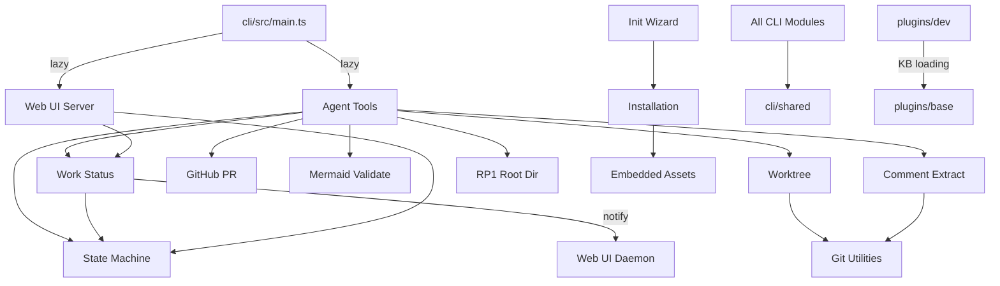

# Module & Component Breakdown

**Project**: rp1
**Analysis Date**: 2026-03-08
**Modules Analyzed**: 19

## Core Modules

### CLI Entry (`cli/src/main.ts`)
**Purpose**: Commander-based CLI with lazy-loaded agent-tools and daemon server
**Responsibilities**: Register CLI commands, lazy-load agent-tools (avoid puppeteer at startup), handle daemon server, error formatting and exit code mapping
**Dependencies**: commands/*, agent-tools/command, web-ui/server, shared/errors

### Agent Tools Framework (`cli/src/agent-tools/`)
**Purpose**: Runtime tools framework for AI agents with registry pattern
**Key Files**: `index.ts` (registry), `command.ts` (Commander integration), `git.ts` (git utilities)
**Components**: 7 sub-tool modules (work, worktree, state-machine, github-pr, mmd-validate, comment-extract, rp1-root-dir)
**Public API**: `registerTool()`, `getTool()`, `listTools()` returning `TE.TaskEither<CLIError, ToolResult<T>>`

### Work Status (`cli/src/agent-tools/work/`)
**Purpose**: SQLite-backed workflow progress tracking with state machine validation and daemon notifications
**Key Files**: `database.ts` (singleton WAL-mode connection, migrations v1-v7), `update.ts` (validation + state machine), `models.ts` (StatusUpdateRecord, ArtifactRecord)
**Behavior**: Insert status updates, query by project/feature, notify daemon for WebSocket broadcast, cleanup expired runs

### State Machine (`cli/src/agent-tools/state-machine/`)
**Purpose**: Declarative workflow state management via embedded Mermaid stateDiagram-v2
**Pipeline**: extract (from markdown) -> parse (mermaid-ast) -> transform (domain model) -> query (BFS)
**Key Files**: `adapter.ts`, `extractor.ts`, `loader.ts`, `transform.ts`

### Worktree Management (`cli/src/agent-tools/worktree/`)
**Purpose**: Git worktree creation, cleanup, and status for isolated agent execution
**Key Files**: `create.ts`, `cleanup.ts`, `status.ts`, `slug.ts`
**Dependencies**: agent-tools/git

### GitHub PR (`cli/src/agent-tools/github-pr/`)
**Purpose**: GitHub PR operations for AI agents via GitHub API
**Operations**: submit-review, add-reaction, reply-comment, fetch-comments
**Key Files**: `client.ts`, `submit-review.ts`, `fetch-comments.ts`

### Installation System (`cli/src/install/`)
**Purpose**: Plugin installation with fp-ts pipelines, backup/restore, atomic staging
**Key Files**: `installer.ts` (OpenCode), `manifest.ts`, `command.ts`, `claudecode/installer.ts`
**Behavior**: Transactional: backup -> stage -> commit (or backup -> stage -> fail -> restore)

### Init Wizard (`cli/src/init/`)
**Purpose**: 12-step TTY-aware project initialization with reinit detection
**Key Files**: `index.ts`, `context-detector.ts` (greenfield/brownfield), `tool-detector.ts`
**Dependencies**: config/supported-tools, install, shared

### Build Pipeline (`cli/src/build/`)
**Purpose**: OpenCode artifact generation: parse, transform, validate, generate
**Key Files**: `command.ts`, `parser.ts`, `transformations.ts`, `generator.ts`

### Shared Utilities (`cli/shared/`)
**Purpose**: Cross-cutting: error types, fp-ts re-exports, logger, prompts, runtime detection
**Key Files**: `errors.ts` (CLIError 14-variant tagged union), `fp.ts` (fp-ts re-exports), `config.ts`, `logger.ts`
**Boundary**: Foundation layer with zero internal dependencies

## Plugin Modules

### rp1-base (`plugins/base/`)
**Purpose**: Foundation plugin for knowledge management, documentation, strategy, security
**Skills**: 17 (knowledge-build, knowledge-load, strategize, deep-research, analyse-security, project-birds-eye-view, mermaid, markdown-preview, etc.)
**Agents**: 13 (kb-spatial-analyzer, kb-concept-extractor, kb-architecture-mapper, kb-module-analyzer, kb-pattern-extractor, etc.)
**Boundary**: Independent, no cross-plugin dependencies

### rp1-dev (`plugins/dev/`)
**Purpose**: Development workflow automation for feature lifecycle, code quality, PR management
**Skills**: 21 (build, build-fast, build-express, blueprint, bootstrap, pr-review, code-check, code-audit, worktree-workflow, etc.)
**Agents**: 32 (task-builder, task-reviewer, feature-architect, build-fast-planner, pr-review-splitter, pr-sub-reviewer, etc.)
**Boundary**: Depends on rp1-base for KB loading

### rp1-utils (`plugins/utils/`)
**Purpose**: Meta-tooling for prompt engineering and eval generation
**Skills**: 5 (tersify-prompt, build-prompt-evals, prompt-eval-builder, prompt-writer, tester)
**Agents**: 4 (prompt-tersifier, prompt-eval-extractor, prompt-assertion-specialist, dependency-chain-analyzer)

## Web UI Module

### Web UI (`cli/web-ui/`)
**Purpose**: React/Vite status dashboard with Bun HTTP server, WebSocket live-reload, and file watching
**Server**: `src/server.ts`, `src/server/http.ts` (Bun.serve), `src/server/websocket.ts` (WebSocketHub)
**API Routes**: `src/server/routes/v2-api.ts` (runs, projects, artifacts), `src/server/routes/api.ts` (legacy)
**Frontend**: `src/app/App.tsx` (React Router), `src/app/V2Layout.tsx`, pages in `src/pages/v2/`
**Components**: EventStream, CommandPalette, WorkflowDiagram, ArtifactList, FilterBar, StatusBadge, AnnotationSidebar
**Providers**: WebSocketProvider, ProjectProvider, ThemeProvider, AnnotationProvider

## Evaluation Module

### Evals (`evals/`)
**Purpose**: Promptfoo-based evaluation with content-addressable attestation
**Key Files**: `src/attestation/commands.ts`, `src/attestation/deps-graph.ts`, `providers/claude-with-tools.ts`
**Attestation**: SHA-256 hashes of prompt content + dependency chain -> verified in CI

## Module Dependencies

```mermaid
graph TD
    Main[cli/src/main.ts] -->|lazy| AT[Agent Tools]
    Main -->|lazy| WebUI[Web UI Server]
    AT --> Work[Work Status]
    AT --> WT[Worktree]
    AT --> SM[State Machine]
    AT --> PR[GitHub PR]
    AT --> MMD[Mermaid Validate]
    AT --> CE[Comment Extract]
    AT --> RD[RP1 Root Dir]
    Work --> SM
    Work -->|notify| Daemon[Web UI Daemon]
    WebUI --> Work
    WebUI --> SM
    WT --> Git[Git Utilities]
    CE --> Git
    Init[Init Wizard] --> Install[Installation]
    Install --> Assets[Embedded Assets]
    All[All CLI Modules] --> Shared[cli/shared]
    DevPlugin[plugins/dev] -->|KB loading| BasePlugin[plugins/base]
```

## Module Metrics

| Module | Files | Est. Lines | Components |
|--------|-------|-----------|------------|
| plugins/base | 46 | ~12,775 | 28 |
| plugins/dev | 53 | ~10,925 | 51 |
| plugins/utils | 15 | ~2,660 | 9 |
| cli/src/commands | 22 | ~4,084 | 10 |
| cli/src/init | 19 | ~5,480 | 12 |
| cli/src/install | 13 | ~3,739 | 7 |
| cli/src/agent-tools | 43 | ~7,790 | 10 |
| cli/src/build | 8 | ~2,225 | 6 |
| cli/src/assets | 5 | ~3,581 | 3 |
| cli/shared | 8 | ~825 | 6 |
| cli/web-ui | 138 | ~13,523 | 15 |
| evals | 12 | ~2,243 | 6 |

## Cross-Module Patterns

- **Skill-Agent Delegation**: Skills spawn agents via Task tool; agents execute autonomously without iteration
- **Tool Registry**: Agent tools self-register via `registerTool()` at module load; command.ts dispatches via `getTool()`
- **fp-ts Error Handling**: All CLI modules use Either/TaskEither with pipe() composition; CLIError tagged union with factories
- **State Machine Integration**: Embedded Mermaid stateDiagram-v2 drives runtime transition validation and web UI step rendering
- **Content Fencing**: Init/uninstall use `<!-- rp1:start/end -->` (markdown) and `# rp1:start/end` (shell) for idempotent injection
- **Lazy Loading**: Main CLI lazy-loads agent-tools and daemon server to avoid heavy dependencies at startup
