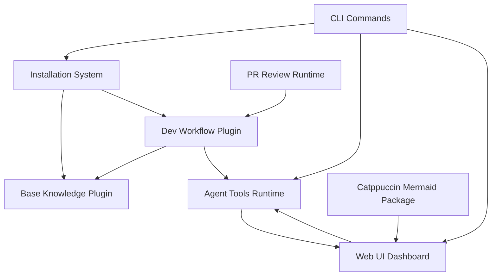

# Module & Component Breakdown

**Project**: rp1
**Analysis Date**: 2026-03-09
**Modules Analyzed**: 9

## Core Modules

### CLI Commands (`cli/src/commands/`)
**Purpose**: User-facing Commander entry points for build, init, install, update, and related command surfaces.
**Complexity**: Medium
**Key Files**:
- `cli/src/commands/build.ts`
- `cli/src/commands/init.ts`
- `cli/src/commands/install/index.ts`
- `cli/src/commands/update/index.ts`

**Representative Components**:
- **`buildCommand`**: Adapts CLI flags into build-pipeline arguments.
- **`initCommand`**: Chooses between legacy and UI-driven initialization flows.
- **`installParentCommand`**: Groups per-platform installers under one stable command.
- **`updateCommand`**: Coordinates binary and plugin updates.

### Installation System (`cli/src/install/`)
**Purpose**: Install rp1 artifacts into supported tools with backup, verification, and restore safety.
**Complexity**: High
**Key Files**:
- `cli/src/install/installer.ts`

**Representative Components**:
- **`OpenCodeInstaller`**: Copies namespaced artifacts, stages updates, and supports rollback semantics.

### Agent Tools Runtime (`cli/src/agent-tools/`)
**Purpose**: Deterministic runtime tools for workflow status, worktrees, GitHub PR operations, state machines, and other agent-facing primitives.
**Complexity**: High
**Key Files**:
- `cli/src/agent-tools/work/index.ts`
- `cli/src/agent-tools/worktree/index.ts`
- `cli/src/agent-tools/github-pr/index.ts`

**Representative Components**:
- **`WorkTool`**: Stores run state and artifacts, then notifies the UI daemon.
- **`WorktreeTool`**: Creates and inspects isolated git worktrees.
- **`GitHubPRTool`**: Wraps PR comments, reactions, and review submission in stable commands.

### Web UI Dashboard (`cli/web-ui/`)
**Purpose**: React application plus Bun server for project, run, workflow, and artifact visibility.
**Complexity**: High
**Key Files**:
- `cli/web-ui/src/app/App.tsx`
- `cli/web-ui/src/server/routes/v2-api.ts`
- `cli/web-ui/src/pages/v2/HomePage.tsx`

**Representative Components**:
- **`App`**: Composes providers and routes for the dashboard shell.
- **`V2ApiRoutes`**: Serves runs, workflows, projects, health, and file content.
- **`HomePage`**: Keyboard-navigable dashboard landing view.

### Base Knowledge Plugin (`plugins/base/`)
**Purpose**: Shared skills and agents for KB generation, documentation, mermaid handling, and other foundational workflows.
**Complexity**: Medium
**Key Files**:
- `plugins/base/skills/knowledge-build/SKILL.md`
- `plugins/base/skills/knowledge-load/SKILL.md`

**Representative Components**:
- **`knowledge-build`**: Map-reduce KB orchestrator.
- **`knowledge-load`**: Progressive KB loading contract for downstream agents.

### Dev Workflow Plugin (`plugins/dev/`)
**Purpose**: Higher-level feature, review, and implementation workflows built on top of base knowledge primitives and agent tools.
**Complexity**: High
**Key Files**:
- `plugins/dev/skills/build/SKILL.md`
- `plugins/dev/skills/build-fast/SKILL.md`
- `plugins/dev/skills/pr-review/SKILL.md`

**Representative Components**:
- **`build`**: End-to-end feature lifecycle orchestrator.
- **`build-fast`**: Faster-path implementation workflow with plan and review stages.
- **`pr-review`**: Map-reduce PR review orchestration.

### PR Review Runtime (`cli/src/pr-review/`)
**Purpose**: Shared CI detection, config loading, and model exports for PR review workflows.
**Complexity**: Medium
**Key Files**:
- `cli/src/pr-review/index.ts`

### Catppuccin Mermaid Package (`packages/catppuccin-mermaid/`)
**Purpose**: Mermaid theming utilities and palettes exported as a reusable package.
**Complexity**: Low
**Key Files**:
- `packages/catppuccin-mermaid/src/index.ts`

### Evaluation Attestation (`evals/`)
**Purpose**: Prompt and artifact attestation support used by the evaluation system.
**Complexity**: Medium
**Key Files**:
- `evals/src/index.ts`

## Module Dependencies

```mermaid
graph TD
    CLI[CLI Commands] --> INSTALL[Installation System]
    CLI --> TOOLS[Agent Tools Runtime]
    CLI --> WEB[Web UI Dashboard]
    INSTALL --> BASE[Base Knowledge Plugin]
    INSTALL --> DEV[Dev Workflow Plugin]
    DEV --> BASE
    DEV --> TOOLS
    PR[PR Review Runtime] --> DEV
    TOOLS --> WEB
    WEB --> TOOLS
    PKG[Catppuccin Mermaid Package] --> WEB
```

## Import and Runtime Analysis

- **Most central runtime**: `cli/src/agent-tools/` because both workflows and UI depend on it.
- **Most visible boundary**: `cli/src/commands/` because it fronts the install, init, update, and build flows.
- **Key cross-plugin dependency**: `plugins/dev` depends on `plugins/base` for shared KB and foundational capabilities.
- **UI/runtime loop**: Agent tools write workflow state; the Web UI reads and broadcasts it.

## Metrics

| Module | Type | Key Files | Notes |
|--------|------|-----------|-------|
| CLI Commands | Application CLI | 4 | Thin command adapters over deeper services |
| Installation System | Runtime service | 1 | Transactional install and restore behavior |
| Agent Tools Runtime | Tool runtime | 3 | Shared operational backbone |
| Web UI Dashboard | Full-stack UI | 3 | Live monitoring over the same workflow state |
| Base Knowledge Plugin | Plugin | 2 | KB and foundational workflows |
| Dev Workflow Plugin | Plugin | 3 | Feature and review orchestration |
| PR Review Runtime | Shared runtime | 1 | CI and config support |
| Catppuccin Mermaid Package | Library | 1 | Diagram theming |
| Evaluation Attestation | Library | 1 | Eval integrity and verification |

## Code Quality Insights

- **Well-structured**: The CLI surface stays comparatively thin, which keeps orchestration concerns separate from command registration.
- **Well-structured**: Agent tools form a reusable runtime seam consumed by both workflows and the dashboard.
- **Watch area**: Plugin workflows are powerful but prompt-heavy, so behavioral drift needs documentation and tests to stay aligned.
- **Watch area**: The tight tool/UI loop means changes to run or artifact models can affect both backend and frontend behavior quickly.
