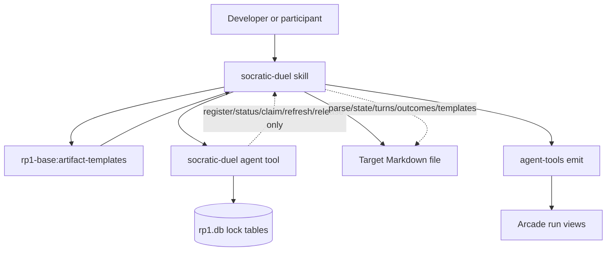
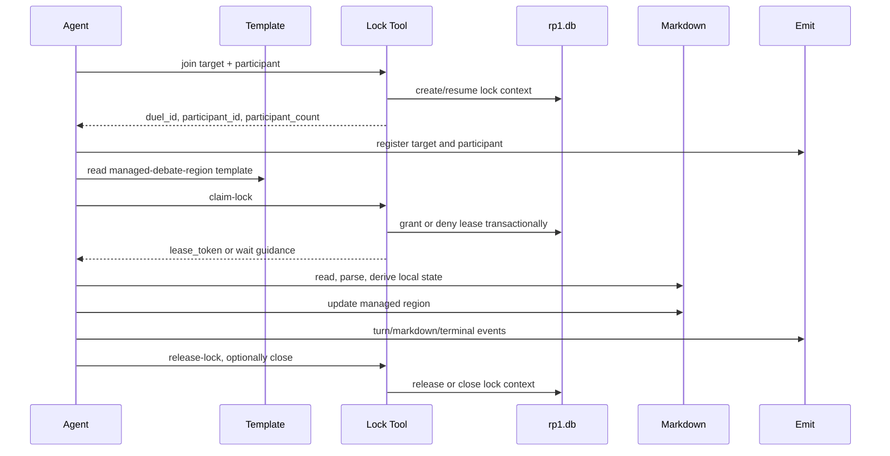
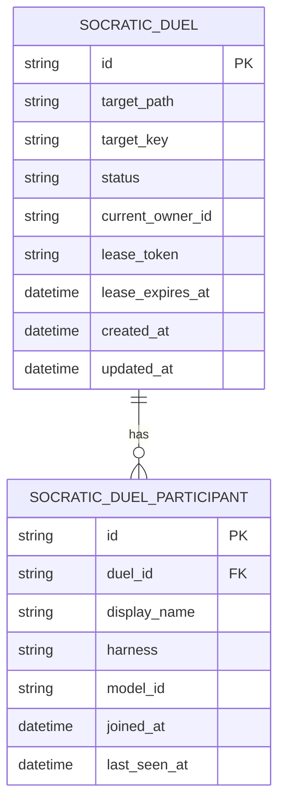
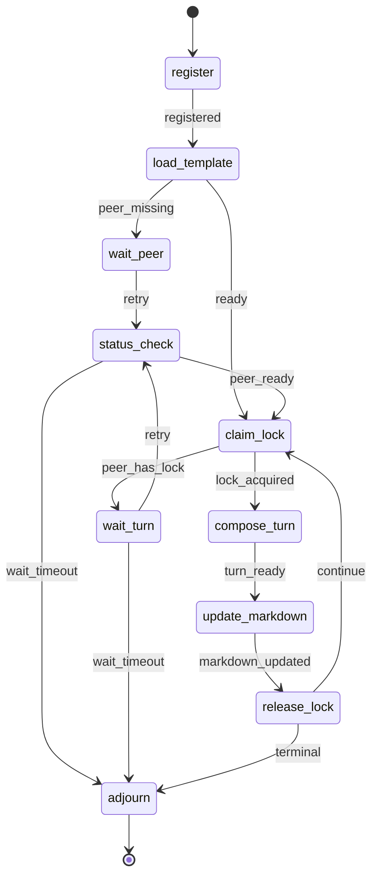

# Design: Socratic Duel

**Feature ID**: socratic-duel
**Version**: 1.0.0
**Status**: Implemented
**Created**: 2026-04-24
**Updated**: 2026-04-25

## 1. Design Overview
Socratic Duel is a tracked `rp1-base` strategy workflow for running a bounded, evidence-driven debate between two agents inside a local Markdown document.

The implemented design uses a deliberately thin backend. `rp1 agent-tools socratic-duel` owns only participant registration and cross-process lock lease lifecycle. Agents own the debate record itself: parsing the target Markdown, deriving local state, selecting templates, enforcing turn rules, updating the managed region, and deciding terminal outcomes.

The target Markdown file is the debate source of truth. SQLite is only the lock service used to prevent simultaneous writes.

## 2. Architecture
The feature has four responsibilities with a strict ownership boundary:

- **Workflow prompt**: `plugins/base/skills/socratic-duel/SKILL.md` defines the tracked workflow, participant behavior, state machine, local Markdown stewardship, turn rules, terminal outcomes, and event emission protocol.
- **Lock backend**: `cli/src/agent-tools/socratic-duel/` exposes `join`, `status`, `claim-lock`, `refresh-lock`, and `release-lock`. It validates path and participant inputs, records participants, grants one active lease, clears expired leases, and closes the lock context.
- **Template source**: `plugins/base/skills/artifact-templates/templates/socratic-duel/managed-debate-region.md` provides the managed-region shape. The agent reads and applies the template; TypeScript does not render it.
- **Markdown record**: The target Markdown document contains the bounded debate region. Agents preserve surrounding content, append accepted turns, update participant/conclusion metadata, and detect local invalidation.

## 3. Detailed Design
### 3.1 User-Facing Skill
`plugins/base/skills/socratic-duel/SKILL.md` is the behavioral authority for the debate.

Frontmatter:
- `metadata.category: strategy`
- `metadata.is_workflow: true`
- `metadata.workflow.run_policy: resumable`
- `metadata.workflow.identity_args: ["TARGET_PATH"]`
- Arguments:
  - `TARGET_PATH` required string, absolute Markdown path.
  - `PARTICIPANT_NAME` optional string, defaults to host identity.
  - `MODEL_ID` optional string, defaults to `unknown-model`.
  - `AFK` optional boolean for bounded non-interactive waiting.

The skill state machine:

The skill emits:
- `status_change` for `register`, `load_template`, `wait_peer`, `status_check`, `claim_lock`, `wait_turn`, `compose_turn`, `update_markdown`, `release_lock`, and `adjourn`.
- `artifact_registered` for the absolute target Markdown path.
- Participant units using `--unit participant:{participant_id}`.
- Turn units using `--unit turn:{turn_number}`.
- `btw_update` when candidate convergence is detected locally.

### 3.2 Lock Agent Tool
The TypeScript backend is intentionally narrow:

| Command | Responsibility |
|---------|----------------|
| `join` | Validate absolute Markdown target, create or resume an active lock context, and register one of two participants. |
| `status` | Return participant count, active/closed status, current lock owner, lease token, and lease expiry. |
| `claim-lock` | Atomically acquire the lock when two participants exist and no unexpired peer lock is active. |
| `refresh-lock` | Extend the current participant's unexpired lease when the token matches. |
| `release-lock` | Release the current participant's lock and optionally close the context. |

The backend does not parse Markdown, render templates, persist turn content, track turn numbers, derive candidate convergence, validate debate semantics, or decide terminal outcomes.

### 3.3 Agent-Owned Markdown Workflow
After acquiring the lock, the agent:

1. Reads `plugins/base/skills/artifact-templates/SKILL.md`.
2. Locates the `socratic-duel` / `managed-debate-region` template row.
3. Reads `plugins/base/skills/artifact-templates/templates/socratic-duel/managed-debate-region.md`.
4. Reads the target Markdown.
5. Creates or updates exactly one managed region.
6. Derives local state from Markdown only: participants, accepted turns, next turn number, latest stance, candidate convergence, and terminal readiness.
7. Appends at most one accepted turn while preserving all surrounding content.
8. Releases or closes the lock after the write.

The managed region is bounded by `rp1:socratic-duel` HTML comments. Accepted prior turns are append-only by prompt contract. Duplicate regions, malformed markers, duplicate or skipped turn numbers, prior-turn edits, unexpected concurrent changes, or lock ownership failures result in `INVALIDATED`.

### 3.4 Turn and Outcome Rules
The skill enforces the debate protocol locally:

- Exactly two active participants in v1.
- At most 3 turn pairs, or 6 accepted turns total.
- One participant owns the document lock at a time.
- Candidate convergence is advisory and never closes the duel by itself.
- Every accepted turn includes position, counterpoints, agreements, novel argument, unresolved items, and stance revision support when applicable.
- Support entries are URLs, file references, or named principles such as `Principle: parsimony`.
- Consensus requires explicit supported acceptance from both participants and no blocking unresolved items.

Terminal outcomes:

| Outcome | Trigger |
|---------|---------|
| `ACCEPTED_CONSENSUS` | Latest turns from both participants explicitly accept consensus with adequate support and no blocking unresolved items. |
| `DISSENT` | Material disagreement or blocking unresolved items remain after both participants contributed. |
| `MAX_TURNS` | Turn 6 is accepted without consensus or dissent. |
| `TIMEOUT` | Bounded waiting expires without a valid continuation. |
| `INVALIDATED` | Target path, managed region, local turn sequence, lock ownership, or prior-turn immutability fails validation. |

### 3.5 Workflow Visibility
The workflow uses existing emit event types:

- Target Markdown artifact registration with `storageRoot: "absolute"`.
- Participant registration, waiting, lock acquisition, and lock release status.
- Turn composition and Markdown update status.
- Candidate convergence as `btw_update`.
- Terminal `adjourn` status with the exact outcome.

No custom event types are required for v1.

## 4. Technology Stack

| Layer | Technology | Rationale |
|-------|------------|-----------|
| Workflow | rp1 `SKILL.md` tracked workflow | Keeps debate behavior portable across supported hosts and visible in Arcade. |
| Lock backend | Bun/TypeScript agent-tool module | Reuses existing agent-tools command patterns while keeping the backend narrow and testable. |
| Persistence | SQLite in `~/.rp1/rp1.db` | Provides transactional cross-process lock leases without storing debate content. |
| Debate record | Markdown target document | Keeps the debate readable and colocated with the document under discussion. |
| Templates | `rp1-base:artifact-templates` | Centralizes the managed-region shape and keeps template rendering agent-owned. |
| Visibility | `rp1 agent-tools emit` events | Uses the existing workflow event pipeline for Arcade tracking. |

## 5. Implementation Plan

| # | Component | Description | Files Changed |
|---|-----------|-------------|---------------|
| T1 | Skill workflow | Add `socratic-duel` tracked skill with lock-only backend boundary, agent-owned Markdown workflow, turn rules, and event protocol. | `plugins/base/skills/socratic-duel/SKILL.md` |
| T2 | Lock schema | Add minimal duel and participant tables plus migration from superseded content schema to lock-only schema. | `cli/src/agent-tools/emit/database.ts` |
| T3 | Lock tool | Implement `join`, `status`, `claim-lock`, `refresh-lock`, and `release-lock`. | `cli/src/agent-tools/socratic-duel/*`, `cli/src/agent-tools/command.ts` |
| T4 | Artifact template | Add the managed debate region template for agents to read and apply. | `plugins/base/skills/artifact-templates/templates/socratic-duel/managed-debate-region.md` |
| T5 | Tests | Cover lock lifecycle, participant ordering, schema migration, and prompt/template boundary contracts. | `cli/src/__tests__/agent-tools/socratic-duel/*`, `cli/src/__tests__/agent-tools/emit/*` |
| T6 | Documentation and catalog | Document the lock-only backend boundary and regenerate catalog/reference outputs. | `docs/reference/base/socratic-duel.md`, `docs/reference/base/index.md`, `docs/reference/index.md`, `plugins/base/README.md`, generated catalog files |

## 6. Implementation DAG

**Parallel Groups**:

1. [T1, T2, T4] - The prompt contract, lock schema, and artifact template can be defined independently once the ownership boundary is fixed.
2. [T3, T6] - The lock tool and documentation depend on the prompt/schema/template interface.
3. [T5] - Tests depend on the implemented lock tool, schema, prompt, and template.

**Dependencies**:

- T3 -> [T1, T2] (tool operations must match the lock-only prompt contract and schema)
- T6 -> [T1, T3, T4] (documentation needs final invocation, command behavior, and template usage)
- T5 -> [T1, T2, T3, T4] (tests cover the implemented contracts)

**Critical Path**: T2 -> T3 -> T5

## 7. Testing Strategy

### Test Value Assessment

| Valuable (design for) | Avoid (do NOT design for) |
|-----------------------|--------------------------|
| Participant registration and two-participant cap | Semantic judging of agent arguments |
| Exclusive lock claim, refresh, expiry, and release behavior | Markdown parsing/rendering in TypeScript |
| Schema creation and migration from old content tables | Template rendering in TypeScript |
| Prompt contract forbidding backend content/state ownership | Arcade UI rendering of existing event types |
| Artifact-template index and managed-region template availability | Generic SQLite transaction behavior |

### Test Plan

| Test | Type | What it verifies |
|------|------|------------------|
| `join` creates/resumes active context | Integration | Participants register against a canonical target without storing debate content. |
| `join` rejects invalid targets or third participant | Integration | V1 target and participant boundaries are enforced. |
| `claim-lock` grants one active lease | Integration | Only one participant owns the lock at a time. |
| `refresh-lock` requires owner and token | Integration | A peer cannot extend another participant's lease. |
| `release-lock` requires owner/token and can close | Integration | Lock contexts clear safely and terminal close is represented. |
| Participant ordering is deterministic | Unit/integration | Tied timestamps still produce stable participant ordering. |
| Schema migration removes content state | Unit | Superseded turn/content tables are not required for the lock-only backend. |
| Skill contract forbids backend content parsing | Unit | Prompt text preserves the agent-owned Markdown/template boundary. |
| Template index contains `managed-debate-region` | Unit | Agents can discover the template through artifact-templates. |
| `just check-cli` succeeds | Build validation | Lint, formatting, tests, and coverage pass for the CLI package. |

## 8. Deployment Design
No external service deployment is required. The change ships with the CLI and base plugin.

Deployment steps:
- Add the lock-only agent-tool and schema migration.
- Add or update the Socratic Duel base skill.
- Add the managed debate region artifact template.
- Regenerate catalog/reference outputs.
- Run `just check-cli`, targeted Socratic Duel tests, `just catalog-check`, and `just build-plugins-check`.

Migration path:
- Fresh databases create only the lock-context and participant tables.
- Existing databases migrate from superseded content-state tables to the lock-only schema.
- Existing target Markdown files remain untouched until the skill is invoked.

Rollback:
- Removing the skill stops new duels.
- Existing managed regions remain readable Markdown.
- Lock tables contain no debate content and can be ignored by older clients.

## 9. Documentation Impact

| Type | Target | Section | KB Source | Rationale |
|------|--------|---------|-----------|-----------|
| add | `docs/reference/base/socratic-duel.md` | Full skill reference | `modules.md:plugins/base`, `patterns.md:Workflow event transport` | New user-facing workflow needs invocation, lock boundary, turn protocol, and outcomes documented. |
| edit | `docs/reference/base/index.md` | Strategy skills | `modules.md:plugins/base` | Surface the new base strategy workflow. |
| edit | `docs/reference/index.md` | Base Plugin Skills | `patterns.md:Catalog Registry` | Include the new skill in the user-facing reference index. |
| edit | `plugins/base/README.md` | Skills list | `modules.md:plugins/base` | Keep plugin README aligned with available skills. |
| generated | `plugins/base/skills/guide/CATALOG.md` | Catalog entry | `patterns.md:Catalog Registry` | Catalog generation should include the new skill after build/generate. |
| add | `plugins/base/skills/artifact-templates/templates/socratic-duel/managed-debate-region.md` | Managed region template | `patterns.md:Progressive-Disclosure Pipeline` | Agents need a central template source for target-document updates. |

## 10. Design Decisions Log

| ID | Decision | Choice | Rationale | Alternatives Considered |
|----|----------|--------|-----------|-------------------------|
| D1 | Plugin placement | Add `socratic-duel` to `rp1-base` with category `strategy` | The workflow is a general local reasoning and design-validation capability, not a dev-only implementation workflow. | `rp1-dev` review skill; rejected because it would make a foundation reasoning workflow depend on the dev plugin. |
| D2 | Backend boundary | Backend owns locks and participant registration only | Agents are better suited to parsing debate text and managing document-local state; code should only serialize concurrent writes. | Heavy TypeScript coordinator; rejected because it duplicated agent strengths and created brittle text parsing. |
| D3 | Durable state split | SQLite stores lock context; Markdown stores debate record | Cross-process leases need transactions, while debate content should remain readable and agent-owned. | Persist turns/candidates/outcomes in SQLite; rejected because it moves local debate state into backend code. |
| D4 | Template source | Agents load `managed-debate-region` from `rp1-base:artifact-templates` | Keeps templates centralized without adding TypeScript template management. | Hardcode region text in the skill or backend; rejected because it fragments template ownership. |
| D5 | Turn format | Prompt-enforced Markdown sections | Lets agents apply semantic judgment while preserving readable output. | Structured JSON submitted to backend; rejected because it encourages backend validation and content persistence. |
| D6 | Consensus policy | Explicit participant stances, no judge | Requirements reject third-party judge dependency and require evidence-backed participant acceptance. | LLM judge or similarity threshold; rejected because it risks false consensus and adds a cloud/model dependency. |
| D7 | Debate budget | Hard v1 ceiling of 6 turns | Direct requirement and anti-sycophancy constraint. | Configurable turn budget; rejected for v1 because higher limits are explicitly out of bounds. |
| D8 | Visibility | Existing `emit` event types with participant/turn units | Uses the current Arcade event model without adding custom event types. | New event type for duel turns; rejected because status/unit plus artifact registration covers v1 visibility. |
