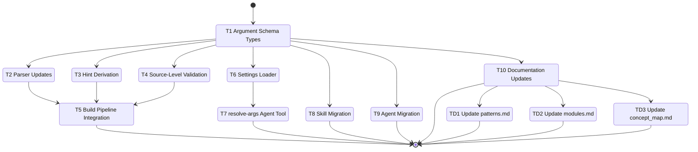

# Development Tasks: Structured Arguments for Skills and Agents

**Feature ID**: args-templates
**Status**: Not Started
**Progress**: 79% (11 of 14 tasks)
**Estimated Effort**: 7 days
**Started**: 2026-03-27

## Overview

Replace the fragmented parameter definition system (manual `argument-hint` strings, hand-written `## Parameters` tables, ad-hoc prose parsing) with a single structured `arguments` schema in YAML frontmatter. A new `rp1 agent-tools resolve-args` CLI subcommand resolves arguments programmatically at invocation time by merging user input with settings files and schema defaults.

## Implementation DAG

**Parallel Groups** (tasks with no inter-dependencies):

1. [T1] - Foundation types; all other tasks depend on these
2. [T2, T3, T4, T6, T8, T9, T10] - All depend only on T1; independent of each other
3. [T5, T7] - T5 depends on T2+T3+T4; T7 depends on T1+T6

**Dependencies**:

- T2 -> T1 (parser needs ArgumentDefinition types)
- T3 -> T1 (hint deriver uses ArgumentDefinition)
- T4 -> T1 (validation references ArgumentDefinition)
- T5 -> [T2, T3, T4] (build integration wires parser + deriver + validation)
- T6 -> T1 (settings loader returns typed defaults)
- T7 -> [T1, T6] (resolve-args uses types and settings loader)
- T8 -> T1 (migration targets the new schema)
- T9 -> T1 (migration targets the new schema)
- T10 -> T1 (docs reference the new schema)

**Critical Path**: T1 -> T2 -> T5 (build pipeline end-to-end)

## Task Subflow



## Task Breakdown

### Foundation

- [x] **T1**: Add ArgumentDefinition, EnvironmentDefinition, and ArgumentType types to build models `[complexity:simple]`

    **Reference**: [design.md#31-argument-schema-frontmatter](design.md#31-argument-schema-frontmatter)

    **Effort**: 2 hours

    **Acceptance Criteria**:

    - [x] `ArgumentType` union type supports `"string" | "boolean" | "enum"`
    - [x] `ArgumentDefinition` interface includes all fields: name, type, required, default, description, aliases, implies, enum_values, variadic, source
    - [x] `EnvironmentDefinition` interface includes name, source, description
    - [x] `SkillMetadata` extended with optional `arguments` and `environment` fields
    - [x] `ClaudeCodeAgent` extended with optional `arguments` and `environment` fields
    - [x] All fields use `readonly` modifiers per existing codebase conventions

    **Implementation Summary**:

    - **Files**: `cli/src/build/models.ts`, `cli/src/build/template-context.ts`
    - **Approach**: Added ArgumentType union, ArgumentDefinition and EnvironmentDefinition interfaces to models.ts; extended SkillMetadata, ClaudeCodeAgent, and AgentArtifactData with optional arguments/environment fields
    - **Deviations**: None
    - **Tests**: 1933/1933 passing

    **Validation Summary**:

    | Dimension | Status |
    |-----------|--------|
    | Discipline | ✅ PASS |
    | Accuracy | ✅ PASS |
    | Completeness | ✅ PASS |
    | Quality | ✅ PASS |
    | Testing | ⏭️ N/A |
    | Commit | ✅ PASS |
    | Comments | ✅ PASS |

    **Execution Flow**:

    ```mermaid
    stateDiagram-v2
        [*] --> T1_ArgumentSchemaTypes
        T1_ArgumentSchemaTypes --> [*]
    ```

### Build Pipeline Components

- [x] **T2**: Extend parser to extract and validate arguments and environment from frontmatter `[complexity:medium]`

    **Reference**: [design.md#32-data-model](design.md#32-data-model)

    **Effort**: 4 hours

    **Acceptance Criteria**:

    - [x] `extractSkillMetadata()` parses `arguments` and `environment` arrays from the `metadata` map
    - [x] `parseAgent()` extracts `arguments` and `environment` from top-level frontmatter
    - [x] Schema shape validation: required fields per argument, type string membership, UPPER_SNAKE_CASE name check
    - [x] Malformed argument definitions produce `ParseError`
    - [x] Unit tests added to existing `parser.test.ts` covering skill and agent argument parsing

    **Implementation Summary**:

    - **Files**: `cli/src/build/parser.ts`, `cli/src/__tests__/build/parser.test.ts`
    - **Approach**: Added parseArgumentDefinition, parseArgumentDefinitions, and parseEnvironmentDefinitions validation functions; extended extractSkillMetadata to return Either for error propagation; extended parseAgent to extract arguments/environment from top-level frontmatter
    - **Deviations**: None
    - **Tests**: 1940/1940 passing

    **Validation Summary**:

    | Dimension | Status |
    |-----------|--------|
    | Discipline | ✅ PASS |
    | Accuracy | ✅ PASS |
    | Completeness | ✅ PASS |
    | Quality | ✅ PASS |
    | Testing | ✅ PASS |
    | Commit | ✅ PASS |
    | Comments | ✅ PASS |

    **Execution Flow**:

    ```mermaid
    stateDiagram-v2
        [*] --> T2_ParserUpdates
        T2_ParserUpdates --> [*]
    ```

- [x] **T3**: Create argument hint derivation and implies chain validation module `[complexity:medium]`

    **Reference**: [design.md#33-argument-hint-derivation](design.md#33-argument-hint-derivation)

    **Effort**: 4 hours

    **Acceptance Criteria**:

    - [x] `deriveArgumentHint()` pure function created in `cli/src/build/arguments.ts`
    - [x] Required string args render as `<lower-kebab-case>`
    - [x] Optional string args render as `[lower-kebab-case]`
    - [x] Optional boolean args render as `[--lower-kebab-case]`
    - [x] Variadic args render as `[name...]`
    - [x] UPPER_SNAKE_CASE names transformed to lower-kebab-case
    - [x] `validateImpliesChains()` detects circular implies chains via DFS
    - [x] `validateImpliesChains()` detects dangling references to non-existent arguments
    - [x] Unit tests in `cli/src/__tests__/build/arguments.test.ts` cover all type/required/variadic combinations and validation cases

    **Implementation Summary**:

    - **Files**: `cli/src/build/arguments.ts`, `cli/src/__tests__/build/arguments.test.ts`
    - **Approach**: Created new module with two exported pure functions; deriveArgumentHint maps each ArgumentDefinition to a hint token via type/required/variadic rules with UPPER_SNAKE_CASE to lower-kebab-case transform; validateImpliesChains builds adjacency list for dangling reference checks and uses DFS with recursion stack for cycle detection
    - **Deviations**: None
    - **Tests**: 1961/1961 passing (21 new tests)

    **Validation Summary**:

    | Dimension | Status |
    |-----------|--------|
    | Discipline | ✅ PASS |
    | Accuracy | ✅ PASS |
    | Completeness | ✅ PASS |
    | Quality | ✅ PASS |
    | Testing | ✅ PASS |
    | Commit | ✅ PASS |
    | Comments | ✅ PASS |

    **Execution Flow**:

    ```mermaid
    stateDiagram-v2
        [*] --> T3_HintDerivationAndImpliesValidation
        T3_HintDerivationAndImpliesValidation --> [*]
    ```

- [x] **T4**: Create source-level validation rules L007-L012 for legacy argument detection `[complexity:medium]`

    **Reference**: [design.md#37-source-level-validation-l1](design.md#37-source-level-validation-l1)

    **Effort**: 4 hours

    **Acceptance Criteria**:

    - [x] L007: Error when both `argument-hint` and `arguments` are present in same skill
    - [x] L008: Error when `## Parameters` or `## 0. Parameters` heading found alongside `arguments`
    - [x] L009: Error when `argument-hint` present without `arguments` (legacy-only)
    - [x] L010: Error when `type: enum` without `enum_values`
    - [x] L011: Error when `implies` references non-existent argument
    - [x] L012: Error when circular `implies` chain detected
    - [x] All rules produce actionable messages with file path and remediation guidance
    - [x] Rules implemented in `cli/src/build/lint/rules/legacy-arguments.ts`
    - [x] Unit tests in `cli/src/__tests__/build/lint/legacy-arguments.test.ts`

    **Implementation Summary**:

    - **Files**: `cli/src/build/lint/rules/legacy-arguments.ts`, `cli/src/__tests__/build/lint/legacy-arguments.test.ts`
    - **Approach**: Created source-level validation functions lintSkillArguments and lintAgentArguments that operate on parsed data (pre-render); reuses validateImpliesChains from arguments.ts for L011/L012; separate from rendered-output lint rules (L001-L006)
    - **Deviations**: None
    - **Tests**: 28/28 passing

    **Validation Summary**:

    | Dimension | Status |
    |-----------|--------|
    | Discipline | ✅ PASS |
    | Accuracy | ✅ PASS |
    | Completeness | ✅ PASS |
    | Quality | ✅ PASS |
    | Testing | ✅ PASS |
    | Commit | ✅ PASS |
    | Comments | ✅ PASS |

    **Execution Flow**:

    ```mermaid
    stateDiagram-v2
        [*] --> T4_SourceLevelValidation
        T4_SourceLevelValidation --> [*]
    ```

- [x] **T5**: Wire parser, hint deriver, and validation into the build pipeline `[complexity:medium]`

    **Reference**: [design.md#38-build-pipeline-integration](design.md#38-build-pipeline-integration)

    **Effort**: 4 hours

    **Acceptance Criteria**:

    - [x] `template-context.ts` auto-derives `argumentHint` using `deriveArgumentHint()` when `arguments` is present
    - [x] `SkillArtifactData` and `AgentArtifactData` carry parsed arguments and environment
    - [x] Source-level validation (L007-L012) runs after parsing and before template rendering
    - [x] Build fails with L1 errors when validation rules trigger
    - [x] Existing templates (`skill.liquid`, `agent.liquid`) continue to emit hint correctly with derived value

    **Implementation Summary**:

    - **Files**: `cli/src/build/template-context.ts`, `cli/src/build/command.ts`
    - **Approach**: Added withDerivedArgumentHint() helper in template-context.ts that auto-derives argumentHint from structured arguments; wired lintSkillArguments/lintAgentArguments source-level validation at all 6 build points (3 platforms x 2 artifact types) to run after parsing and before rendering; passed agent arguments/environment through to AgentArtifactData at all platform build points
    - **Deviations**: None
    - **Tests**: 1985/1989 passing (4 codex integration failures expected -- existing plugins use legacy argument-hint without structured arguments; resolved by T8/T9 migration)

    **Validation Summary**:

    | Dimension | Status |
    |-----------|--------|
    | Discipline | ✅ PASS |
    | Accuracy | ✅ PASS |
    | Completeness | ✅ PASS |
    | Quality | ✅ PASS |
    | Testing | ⏭️ N/A |
    | Commit | ✅ PASS |
    | Comments | ✅ PASS |

    **Execution Flow**:

    ```mermaid
    stateDiagram-v2
        [*] --> T5_BuildPipelineIntegration
        T5_BuildPipelineIntegration --> [*]
    ```

### Settings and Runtime

- [x] **T6**: Create settings loader for argument defaults from TOML files `[complexity:medium]`

    **Reference**: [design.md#36-settings-schema-toml](design.md#36-settings-schema-toml)

    **Effort**: 4 hours

    **Acceptance Criteria**:

    - [x] `cli/src/settings/loader.ts` created with functions to load project and user TOML settings
    - [x] Reads `.rp1/settings.toml` for project-level argument defaults
    - [x] Reads `~/.config/rp1/settings.toml` for user-level argument defaults
    - [x] Parses `[arguments.<skill-name>]` tables from TOML
    - [x] Uses `Bun.TOML.parse()` consistent with existing `validator.ts`
    - [x] Returns merged defaults per skill with project settings taking precedence over user settings
    - [x] Handles missing files gracefully (returns empty defaults)

    **Implementation Summary**:

    - **Files**: `cli/src/settings/loader.ts`, `cli/src/__tests__/settings/loader.test.ts`
    - **Approach**: Created loader module with loadArgumentDefaultsForSkill and loadAllArgumentDefaults functions; reuses resolveGlobalSettingsPath/resolveLocalSettingsPath from validator.ts; parses TOML via Bun.TOML.parse() and extracts [arguments.*] tables; merges with spread operator giving project precedence over user
    - **Deviations**: None
    - **Tests**: 9/9 passing

    **Validation Summary**:

    | Dimension | Status |
    |-----------|--------|
    | Discipline | ✅ PASS |
    | Accuracy | ✅ PASS |
    | Completeness | ✅ PASS |
    | Quality | ✅ PASS |
    | Testing | ✅ PASS |
    | Commit | ✅ PASS |
    | Comments | ✅ PASS |

    **Execution Flow**:

    ```mermaid
    stateDiagram-v2
        [*] --> T6_SettingsLoader
        T6_SettingsLoader --> [*]
    ```

- [x] **T7**: Create resolve-args agent tool subcommand `[complexity:complex]`

    **Reference**: [design.md#35-cli-argument-resolution-resolve-args](design.md#35-cli-argument-resolution-resolve-args)

    **Effort**: 8 hours

    **Acceptance Criteria**:

    - [x] `cli/src/agent-tools/resolve-args/index.ts` created following `registerTool` pattern
    - [x] `cli/src/agent-tools/resolve-args/models.ts` created with input/output types
    - [x] `cli/src/agent-tools/resolve-args/resolver.ts` created with resolution logic
    - [x] Accepts JSON input with `schema_path`, `raw_args`, and `project_root`
    - [x] Reads and parses frontmatter from the schema file to extract arguments
    - [x] Implements 5-layer merge: user input > project settings > user settings > env var > schema default
    - [x] Resolves implies chains transitively (fixed-point algorithm)
    - [x] Boolean arguments default to `false` when not specified
    - [x] Required arguments not resolved from any layer appear in `unresolved` array
    - [x] Returns `ToolResult<ResolvedArgs>` envelope with `arguments`, `environment`, and `unresolved`
    - [x] Empty schema returns empty object (no-op)
    - [x] Unit tests in `cli/src/__tests__/agent-tools/resolve-args/resolve-args.test.ts` cover merge precedence, implies chains, and unresolved handling

    **Implementation Summary**:

    - **Files**: `cli/src/agent-tools/resolve-args/index.ts`, `cli/src/agent-tools/resolve-args/models.ts`, `cli/src/agent-tools/resolve-args/resolver.ts`, `cli/src/agent-tools/command.ts`, `cli/src/__tests__/agent-tools/resolve-args/resolve-args.test.ts`
    - **Approach**: Created resolve-args agent tool following registerTool pattern; resolver reads frontmatter from schema file, parses arguments/environment, merges 5 layers (user input > project settings > user settings > env var > schema default), resolves implies chains via fixed-point algorithm, detects unresolved required args; wired subcommand into command.ts with stdin/file input support
    - **Deviations**: None
    - **Tests**: 20/20 passing

    **Validation Summary**:

    | Dimension | Status |
    |-----------|--------|
    | Discipline | ✅ PASS |
    | Accuracy | ✅ PASS |
    | Completeness | ✅ PASS |
    | Quality | ✅ PASS |
    | Testing | ✅ PASS |
    | Commit | ✅ PASS |
    | Comments | ✅ PASS |

    **Execution Flow**:

    ```mermaid
    stateDiagram-v2
        [*] --> T7_ResolveArgsAgentTool
        T7_ResolveArgsAgentTool --> [*]
    ```

### Migration

- [x] **T8**: Migrate all skills with argument-hint to structured arguments schema `[complexity:complex]`

    **Reference**: [design.md#5-implementation-plan](design.md#5-implementation-plan)

    **Effort**: 8 hours

    **Acceptance Criteria**:

    - [x] All ~28 skill SKILL.md files across `plugins/base/`, `plugins/dev/`, `plugins/utils/` migrated
    - [x] Each skill's `argument-hint` replaced with `metadata.arguments` array
    - [x] Hand-written `## Parameters` tables removed from skill bodies
    - [x] `environment` section added where applicable (skills resolving `RP1_ROOT`)
    - [x] No skill triggers L1 build validation errors after migration
    - [x] Argument names use UPPER_SNAKE_CASE convention

    **Implementation Summary**:

    - **Files**: 24 SKILL.md files across `plugins/base/skills/`, `plugins/dev/skills/`, `plugins/utils/skills/`
    - **Approach**: Replaced `argument-hint` with structured `metadata.arguments` arrays in frontmatter; removed hand-written `## Parameters` tables and `**Environment values**` sections from skill bodies; added `metadata.environment` sections for skills resolving RP1_ROOT; preserved `aliases` and `implies` chains for boolean flags (e.g., build skill's GIT_PR implies GIT_PUSH implies GIT_COMMIT); used `type: enum` with `enum_values` where applicable (pr-visual REVIEW_DEPTH, knowledge-load LOAD_MODE, task OPERATION)
    - **Deviations**: None
    - **Tests**: 2018/2018 passing

    **Validation Summary**:

    | Dimension | Status |
    |-----------|--------|
    | Discipline | ✅ PASS |
    | Accuracy | ✅ PASS |
    | Completeness | ✅ PASS |
    | Quality | ✅ PASS |
    | Testing | ⏭️ N/A |
    | Commit | ✅ PASS |
    | Comments | ⏭️ N/A |

    **Execution Flow**:

    ```mermaid
    stateDiagram-v2
        [*] --> T8_SkillMigration
        T8_SkillMigration --> [*]
    ```

- [x] **T9**: Migrate all agents with parameter tables to structured arguments in frontmatter `[complexity:complex]`

    **Reference**: [design.md#5-implementation-plan](design.md#5-implementation-plan)

    **Effort**: 8 hours

    **Acceptance Criteria**:

    - [x] All ~37 agent .md files across `plugins/base/`, `plugins/dev/`, `plugins/utils/` migrated
    - [x] Each agent's `## 0. Parameters` table replaced with `arguments` in frontmatter
    - [x] `environment` section added where applicable (agents resolving `RP1_ROOT`)
    - [x] No agent triggers L1 build validation errors after migration
    - [x] Argument names use UPPER_SNAKE_CASE convention

    **Implementation Summary**:

    - **Files**: 49 agent .md files across `plugins/base/agents/`, `plugins/dev/agents/`, `plugins/utils/agents/`
    - **Approach**: Replaced all parameter tables (## 0. Parameters, ## §PARAMS, ## §IN, ## S0 Parameters, ## §0 Parameters, §IN) with structured `arguments` arrays in frontmatter; removed hand-written parameter tables from agent bodies; added `environment` sections for agents resolving RP1_ROOT (35 agents); used `type: enum` with `enum_values` where applicable (comment-cleaner MODE, pr-visualizer REVIEW_DEPTH, pr-feedback-collector GROUP_BY, charter-interviewer MODE, bug-investigator INVESTIGATION_DEPTH, code-auditor PATTERN_STRICTNESS, strategic-advisor RISK_TOLERANCE, research-explorer EXPLORATION_TYPE, research-reporter REPORT_TYPE, scribe MODE, kb-* agents MODE, mermaid-fixer OUTPUT_MODE, feature-archiver MODE, prd-archiver MODE/CLOSURE_STATUS, blueprint-auditor MODE)
    - **Deviations**: None
    - **Tests**: 2018/2018 passing

    **Execution Flow**:

    ```mermaid
    stateDiagram-v2
        [*] --> T9_AgentMigration
        T9_AgentMigration --> [*]
    ```

### Documentation

- [ ] **T10**: Update documentation for structured arguments schema `[complexity:medium]`

    **Reference**: [design.md#5-implementation-plan](design.md#5-implementation-plan)

    **Effort**: 4 hours

    **Acceptance Criteria**:

    - [ ] `docs/concepts/skill-format.md` updated: frontmatter schema section documents `arguments` and `environment`
    - [ ] `docs/concepts/skill-format.md` updated: argument-hint notation documents auto-derivation
    - [ ] `docs/concepts/skill-format.md` updated: new Environment Parameters section added
    - [ ] `AGENTS.md` updated: argument style section references structured arguments instead of `$1/$2`
    - [ ] `AGENTS.md` updated: canonical variable assignment references `environment` schema
    - [ ] `DEVELOPMENT.md` updated if parameter conventions are mentioned

### User Docs

- [ ] **TD1**: Update patterns.md - Extension Mechanisms `[complexity:simple]`

    **Reference**: [design.md#documentation-impact](design.md#documentation-impact)

    **Type**: edit

    **Target**: .rp1/context/patterns.md

    **Section**: Extension Mechanisms

    **KB Source**: -

    **Effort**: 30 minutes

    **Acceptance Criteria**:

    - [ ] Extension Mechanisms section reflects structured arguments as a build pipeline pattern

- [ ] **TD2**: Update modules.md - cli/build and cli/agent-tools `[complexity:simple]`

    **Reference**: [design.md#documentation-impact](design.md#documentation-impact)

    **Type**: edit

    **Target**: .rp1/context/modules.md

    **Section**: cli/build, cli/agent-tools

    **KB Source**: -

    **Effort**: 30 minutes

    **Acceptance Criteria**:

    - [ ] cli/build section documents `arguments.ts` module
    - [ ] cli/agent-tools section documents `resolve-args` subcommand

- [ ] **TD3**: Update concept_map.md - Add new concepts `[complexity:simple]`

    **Reference**: [design.md#documentation-impact](design.md#documentation-impact)

    **Type**: edit

    **Target**: .rp1/context/concept_map.md

    **Section**: (new entries)

    **KB Source**: -

    **Effort**: 30 minutes

    **Acceptance Criteria**:

    - [ ] `ArgumentDefinition` and `EnvironmentDefinition` concepts added to concept map
    - [ ] Relationships to existing concepts (SkillMetadata, ClaudeCodeAgent, build pipeline) documented

## Acceptance Criteria Checklist

- [ ] AC-01.1: `arguments` field accepts array of argument objects in skill frontmatter (`metadata.arguments`)
- [ ] AC-01.2: `arguments` field accepts array of argument objects in agent frontmatter
- [ ] AC-01.3: Each argument object supports all specified fields (name, type, required, default, description, aliases, implies, enum_values)
- [ ] AC-01.4: Argument names use UPPER_SNAKE_CASE convention
- [ ] AC-01.5: Boolean arguments default to `false` unless explicit `default` is provided
- [ ] AC-01.6: Optional `source` field with `{ env: "VAR_NAME" }` structure for ENV var fallback
- [ ] AC-01.7: Resolution order: explicit user input > source env var > default > prompt user
- [ ] AC-02.1: Separate `environment` field in frontmatter accepts array of environment parameter definitions
- [ ] AC-02.2: Each environment parameter supports name, source, and description
- [ ] AC-02.3: Environment parameters not included in argument hints
- [ ] AC-02.4: Environment parameters resolved separately and returned as distinct section
- [ ] AC-03.1: CLI subcommand accepts skill/agent name (namespace convention) and raw args, resolves schema path internally, returns resolved argument object
- [ ] AC-03.2: Resolution merges 5 layers in precedence order
- [ ] AC-03.3: Returned structure is well-typed JSON
- [ ] AC-03.4: Boolean arguments default to `false` unless overridden
- [ ] AC-03.5: CLI resolves flag implication chains before returning
- [ ] AC-03.6: Required arguments without value reported as unresolved
- [ ] AC-03.7: Empty schema returns empty object
- [ ] AC-03.9: `--schema-path` override flag supported for development/testing
- [ ] AC-03.10: Plugin directory lookup uses standard conventions (installed paths for production, `cli/dist/` for development)
- [ ] AC-04.1: Required string args render as `<name>` (angle brackets, lowercase-kebab)
- [ ] AC-04.2: Optional string args render as `[name]` (square brackets, lowercase-kebab)
- [ ] AC-04.3: Optional boolean args render as `[--name]` (flag style, lowercase-kebab)
- [ ] AC-04.4: Variadic args render as `[name...]`
- [ ] AC-04.5: Derived hint replaces manually specified `argument-hint` in built output
- [ ] AC-05.1: L1 error if both `arguments` and `argument-hint` present
- [ ] AC-05.2: L1 error if `## Parameters` table found alongside `arguments`
- [ ] AC-05.3: L1 error if `argument-hint` used without `arguments`
- [ ] AC-05.4: L1 errors include actionable messages
- [ ] AC-05.5: Build does not proceed when L1 errors present
- [ ] AC-06.1: Enum type requires `enum_values` array
- [ ] AC-06.2: Auto-generated rules list valid enum values
- [ ] AC-06.3: L1 error if `type: enum` without `enum_values`
- [ ] AC-07.1: `implies` field accepts array of boolean argument names
- [ ] AC-07.2: Implication chains documented in rules
- [ ] AC-07.3: Circular implications detected as L1 errors
- [ ] AC-07.4: Implied params must exist; referencing non-existent param is L1 error
- [ ] AC-08.1: All skills with `argument-hint` now use `metadata.arguments`
- [ ] AC-08.2: All 35+ agents use structured `arguments` in frontmatter
- [ ] AC-08.3: No L1 build validation errors after migration
- [ ] AC-08.4: Build pipeline passes cleanly with all migrations

### Tasks from EDIT-003

- [x] **T1-addendum**: Extend `AgentArtifactData` in `cli/src/build/template-context.ts` with optional `arguments` and `environment` fields (imported from shared `models.ts`) `[complexity:simple]`

    **Reference**: [design.md EDIT-003](#edit-003-arguments-schema-must-be-platform-agnostic-across-all-harnesses)

    **Effort**: 30 minutes

    **Acceptance Criteria**:

    - [x] `AgentArtifactData` interface includes optional `arguments?: readonly ArgumentDefinition[]`
    - [x] `AgentArtifactData` interface includes optional `environment?: readonly EnvironmentDefinition[]`
    - [x] Types imported from `./models.js` (shared location)
    - [x] `buildTemplateContext()` continues to work with the extended interface

- [x] **T5-addendum**: Wire parsed agent arguments through `AgentArtifactData` in the build pipeline so all platform templates can access them `[complexity:simple]`

    **Reference**: [design.md EDIT-003](#edit-003-arguments-schema-must-be-platform-agnostic-across-all-harnesses)

    **Effort**: 1 hour

    **Acceptance Criteria**:

    - [x] When building agents, parsed `arguments` and `environment` from `ClaudeCodeAgent` are populated into `AgentArtifactData`
    - [x] Claude Code, OpenCode, and Codex agent templates all receive the same argument data via the `artifact` context variable
    - [x] The auto-derived `argumentHint` is available to all platform templates through the artifact context

### Tasks from EDIT-004

- [ ] **T7-addendum**: Implement name-based schema lookup in resolve-args instead of raw file path input `[complexity:medium]`

    **Reference**: [design.md EDIT-004](#edit-004-resolve-args-should-accept-skillagent-name-not-raw-file-path)

    **Effort**: 3 hours

    **Acceptance Criteria**:

    - [ ] `resolve-args` accepts a `--name` argument using `<plugin>:<skill-or-agent-name>` namespace convention (e.g., `rp1-dev:build`)
    - [ ] The tool parses the namespace to extract plugin name and skill/agent name
    - [ ] The tool resolves the schema file path internally by looking up the installed plugin directory
    - [ ] Plugin path lookup works in both development mode (`cli/dist/`) and production mode (installed plugin paths)
    - [ ] A `--schema-path` override flag is supported for development/testing to bypass name-based lookup
    - [ ] When `--schema-path` is provided, it takes precedence over `--name`
    - [ ] Unit tests cover name-based lookup, schema-path override, and error cases (unknown plugin, unknown skill)

## Definition of Done

- [ ] All tasks completed
- [ ] All AC verified
- [ ] Code reviewed
- [ ] Docs updated
