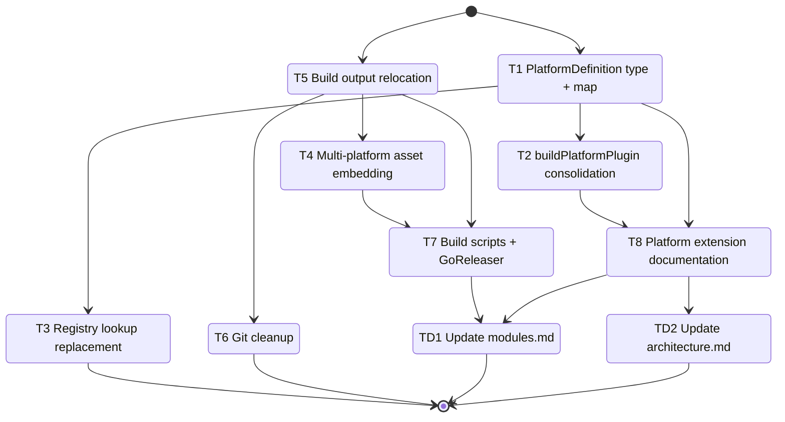

# Development Tasks: Unified Build Pipeline

**Feature ID**: distribution-1
**Status**: Not Started
**Progress**: 60% (6 of 10 tasks)
**Estimated Effort**: 3 days
**Started**: 2026-03-28

## Overview

Consolidate three per-platform build functions into a single data-driven `buildPlatformPlugin()` function backed by a `PlatformDefinition` configuration abstraction. Relocate build output to top-level `dist/`, extend asset embedding to all platforms, remove checked-in Claude Code artifacts from git, and document the platform extension process.

## Implementation DAG

**Parallel Groups** (tasks with no inter-dependencies):

1. [T1, T5] - PlatformDefinition type is independent of path relocation
2. [T2, T3, T6] - All depend on group 1 outputs (T2/T3 need T1, T6 needs T5)
3. [T4] - Multi-platform embedding depends on T5 for new dist/ layout
4. [T7, T8] - Scripts depend on T4+T5; docs depend on T1+T2

**Dependencies**:

- T2 -> T1 (interface: buildPlatformPlugin uses PlatformDefinition type)
- T3 -> T1 (interface: registry lookup uses PLATFORM_DEFINITIONS map)
- T6 -> T5 (sequential: gitignore must be updated before git rm)
- T4 -> T5 (data: asset embedding reads from new dist/ location)
- T7 -> [T4, T5] (build: scripts reference dist/ paths and multi-platform embedding)
- T8 -> [T1, T2] (interface: documents PlatformDefinition and buildPlatformPlugin)

**Critical Path**: T1 -> T2 -> T8

## Task Subflow



## Task Breakdown

### Foundation (Parallel Group 1)

- [x] **T1**: Define PlatformDefinition interface and populate platform map for all three platforms `[complexity:medium]`

    **Reference**: [design.md#31-platformdefinition-interface](design.md#31-platformdefinition-interface)

    **Effort**: 4 hours

    **Acceptance Criteria**:

    - [x] `PlatformDefinition` interface defined in new `cli/src/build/platform-definitions.ts` with fields for id, registry, config, templates, naming, hooks, copyDirs, and producesBundleAssets
    - [x] `PlatformNaming`, `PlatformTemplates`, `PlatformHooks`, `PlatformBuildState`, and `PostBuildResult` types defined
    - [x] `PLATFORM_DEFINITIONS` ReadonlyMap populated with entries for `opencode`, `claude-code`, and `codex`
    - [x] Each entry matches the platform map table in design.md section 3.2 (correct registry, templates, naming conventions, hooks, copyDirs, producesBundleAssets)
    - [x] Module exports added to `cli/src/build/index.ts`
    - [x] TypeScript compiles without errors

    **Implementation Summary**:

    - **Files**: `cli/src/build/platform-definitions.ts` (new), `cli/src/build/index.ts`
    - **Approach**: Created PlatformDefinition interface with PlatformNaming, PlatformTemplates, PlatformHooks, HookContext, PlatformBuildState, and PostBuildResult types. Populated PLATFORM_DEFINITIONS ReadonlyMap with entries for opencode, claude-code, and codex matching the design spec. Hook signatures reference existing ClaudeCodeAgent and ClaudeCodeSkill types from models.ts. Added getPlatformConfig helper for stub SupportedTool lookup. Exported all types and values from index.ts.
    - **Deviations**: None
    - **Tests**: 547/547 passing (existing build tests unaffected)

    **Validation Summary**:

    | Dimension | Status |
    |-----------|--------|
    | Discipline | ✅ PASS |
    | Accuracy | ✅ PASS |
    | Completeness | ✅ PASS |
    | Quality | ✅ PASS |
    | Testing | ⏭️ N/A |
    | Commit | ✅ PASS |
    | Comments | ✅ PASS |

    **Execution Flow**:

    ```mermaid
    stateDiagram-v2
        [*] --> T1_PlatformDefinition_type_and_map
        T1_PlatformDefinition_type_and_map --> [*]
    ```

- [x] **T5**: Relocate build output from cli/dist/ to top-level dist/ `[complexity:simple]`

    **Reference**: [design.md#36-build-output-relocation](design.md#36-build-output-relocation)

    **Effort**: 2 hours

    **Acceptance Criteria**:

    - [x] `parseBuildArgs()` default output directory resolves to project-root-relative `dist/` instead of `cli/dist/`
    - [x] `deriveCCOutputDir()` and `deriveCodexOutputDir()` produce paths under top-level `dist/`
    - [x] `generate-asset-imports.ts` path constants updated from `cli/dist/` to `dist/`
    - [x] Running `bun run build` writes output to `dist/opencode/`, `dist/claude-code/`, `dist/codex/` at the project root
    - [x] No build output is written to `cli/dist/`

    **Implementation Summary**:

    - **Files**: `cli/src/build/command.ts`, `cli/scripts/generate-asset-imports.ts`
    - **Approach**: Changed `executeBuild` to resolve `config.outputDir` against `projectRoot` instead of `process.cwd()`, so the default `dist/opencode` path resolves to `<repo>/dist/opencode`. Updated `generate-asset-imports.ts` to use `ROOT_DIR` instead of `CLI_DIR` for the `OPENCODE_DIST` constant. `deriveCCOutputDir` and `deriveCodexOutputDir` required no changes since they derive sibling paths from the (now correct) OpenCode output directory.
    - **Deviations**: None
    - **Tests**: 547/547 passing

    **Validation Summary**:

    | Dimension | Status |
    |-----------|--------|
    | Discipline | ✅ PASS |
    | Accuracy | ✅ PASS |
    | Completeness | ✅ PASS |
    | Quality | ✅ PASS |
    | Testing | ⏭️ N/A |
    | Commit | ✅ PASS |
    | Comments | ✅ PASS |

    **Execution Flow**:

    ```mermaid
    stateDiagram-v2
        [*] --> T5_Build_output_relocation
        T5_Build_output_relocation --> [*]
    ```

### Core Build (Parallel Group 2)

- [x] **T2**: Consolidate three build functions into a single buildPlatformPlugin() with hook dispatch `[complexity:complex]`

    **Reference**: [design.md#33-buildplatformplugin-generic-loop](design.md#33-buildplatformplugin-generic-loop)

    **Effort**: 8 hours

    **Acceptance Criteria**:

    - [x] Single `buildPlatformPlugin()` function defined in `command.ts` accepting pluginName, projectRoot, outputPath, PlatformDefinition, logger, jsonOutput, and lintOnly parameters
    - [x] Function implements the generic parse-preprocess-render-lint-write loop with hook dispatch at each lifecycle point (preparePlugin, enrichSkillContext, enrichAgentContext, postSkillWrite, postPluginBuild)
    - [x] Previous `buildPlugin`, `buildCCPlugin`, and `buildCodexPlugin` functions removed
    - [x] `executeBuild` dispatches to `buildPlatformPlugin()` with the appropriate `PlatformDefinition`
    - [x] Unified `PlatformBuildResult` return type used for all platforms; platforms without bundle assets return empty arrays
    - [x] Build output for each platform is identical to what the previous per-platform functions produced (same files, same content)
    - [x] All existing build tests pass (`command.test.ts`, `agent-name-parity.test.ts`, `codex/integration.test.ts`)

    **Implementation Summary**:

    - **Files**: `cli/src/build/command.ts`, `cli/src/build/platform-definitions.ts`, `cli/src/build/index.ts`, `cli/src/__tests__/build/command.test.ts`, `cli/src/__tests__/build/codex/integration.test.ts`
    - **Approach**: Replaced three per-platform build functions (buildPlugin, buildCCPlugin, buildCodexPlugin) and their three wrapper functions (buildOpenCodeArtifacts, buildClaudeCodeArtifacts, buildCodexArtifacts) with a single buildPlatformPlugin() that accepts a PlatformDefinition and dispatches to lifecycle hooks. Extended HookContext with engine, registry, versions, and platform info so hooks can render templates autonomously. Implemented Codex hooks (preparePlugin, enrichSkillContext, enrichAgentContext, postSkillWrite, postPluginBuild) in platform-definitions.ts. Updated executeBuild to iterate PLATFORM_DEFINITIONS with a unified buildPlatformArtifacts dispatcher. Updated tests to use the new function signature with explicit PlatformDefinition parameter.
    - **Deviations**: None
    - **Tests**: 547/547 passing

    **Validation Summary**:

    | Dimension | Status |
    |-----------|--------|
    | Discipline | ✅ PASS |
    | Accuracy | ✅ PASS |
    | Completeness | ✅ PASS |
    | Quality | ✅ PASS |
    | Testing | ⏭️ N/A |
    | Commit | ✅ PASS |
    | Comments | ✅ PASS |

    **Execution Flow**:

    ```mermaid
    stateDiagram-v2
        [*] --> T2_buildPlatformPlugin_consolidation
        T2_buildPlatformPlugin_consolidation --> [*]
    ```

- [x] **T3**: Replace registry lookup switch with PlatformDefinition map lookup `[complexity:simple]`

    **Reference**: [design.md#34-registry-lookup-replacement](design.md#34-registry-lookup-replacement)

    **Effort**: 1 hour

    **Acceptance Criteria**:

    - [x] `getRegistryForPlatform()` switch in `command.ts` replaced with `PLATFORM_DEFINITIONS.get(platform)` lookup
    - [x] `getRegistryForPlatform()` in `cli/src/build/lint/rules/null-tool-refs.ts` updated to import from `platform-definitions.ts`
    - [x] Both callsites return the correct registry for each platform

    **Implementation Summary**:

    - **Files**: `cli/src/build/lint/rules/null-tool-refs.ts`
    - **Approach**: Replaced the hardcoded switch statement with a PLATFORM_DEFINITIONS map lookup. Removed direct imports of codexRegistry and defaultRegistry, replacing them with a single import of PLATFORM_DEFINITIONS from platform-definitions.ts. The getRegistryForPlatform in command.ts was already removed during T2 consolidation.
    - **Deviations**: None. The command.ts switch was already eliminated as part of T2's consolidation; only the lint rule duplicate remained.
    - **Tests**: 547/547 passing

    **Review Feedback** (Attempt 1):
    - **Status**: FAILURE
    - **Issues**:
      - [commit] T3 commit (95e16568) includes 106 deleted `cli/dist/claude-code/` files that belong to T6, not T3. The implementation summary claims only `cli/src/build/lint/rules/null-tool-refs.ts` was modified, but the commit contains 107 files total.
    - **Guidance**: Reset the T3 and T6 commits (`git reset HEAD~2`), then re-commit T3 with only `cli/src/build/lint/rules/null-tool-refs.ts` staged. Then commit T6 with both the `.gitignore` changes and the `git rm -r cli/dist/claude-code/` deletions staged together.

    **Review Feedback** (Attempt 2 - Fix):
    - **Status**: RESOLVED
    - **Fix**: Reset both commits via `git reset HEAD~2`, then re-staged T3 with only `cli/src/build/lint/rules/null-tool-refs.ts` (1 file changed), and T6 with `.gitignore` + `git rm -r cli/dist/claude-code/` (107 files: 1 .gitignore + 106 deleted artifacts).

    **Validation Summary**:

    | Dimension | Status |
    |-----------|--------|
    | Discipline | ✅ PASS |
    | Accuracy | ✅ PASS |
    | Completeness | ✅ PASS |
    | Quality | ✅ PASS |
    | Testing | ⏭️ N/A |
    | Commit | ✅ PASS |
    | Comments | ✅ PASS |

- [x] **T6**: Update .gitignore and remove checked-in Claude Code artifacts from git `[complexity:simple]`

    **Reference**: [design.md#37-gitignore-updates](design.md#37-gitignore-updates)

    **Effort**: 1 hour

    **Acceptance Criteria**:

    - [x] `.gitignore` carve-outs for `cli/dist/claude-code/` removed (`!cli/dist/`, `cli/dist/*`, `!cli/dist/claude-code/`, `cli/dist/claude-code/utils/`)
    - [x] Top-level `dist/` is gitignored (already present, verify)
    - [x] `cli/web-ui/dist/` added to `.gitignore` if not already present
    - [x] `git rm -r cli/dist/claude-code/` executed to untrack build artifacts
    - [x] `git ls-files cli/dist/claude-code/` returns no results after cleanup
    - [x] No `git filter-branch` or history rewriting performed

    **Implementation Summary**:

    - **Files**: `.gitignore`
    - **Approach**: Removed the four .gitignore carve-out lines that kept cli/dist/claude-code/ tracked (!cli/dist/, cli/dist/*, !cli/dist/claude-code/, cli/dist/claude-code/utils/). Verified top-level dist/ was already gitignored. Verified cli/web-ui/dist/ was already in .gitignore. Executed git rm -r cli/dist/claude-code/ to untrack all 106 build artifact files. Updated stale comment referencing tracked claude-code dist.
    - **Deviations**: None
    - **Tests**: 547/547 passing

    **Validation Summary**:

    | Dimension | Status |
    |-----------|--------|
    | Discipline | ✅ PASS |
    | Accuracy | ✅ PASS |
    | Completeness | ✅ PASS |
    | Quality | ✅ PASS |
    | Testing | ⏭️ N/A |
    | Commit | ✅ PASS |
    | Comments | ⏭️ N/A |

    **Execution Flow**:

    ```mermaid
    stateDiagram-v2
        [*] --> T3_Registry_lookup_replacement
        T3_Registry_lookup_replacement --> T6_Git_cleanup
        T6_Git_cleanup --> [*]
    ```

### Asset Embedding (Parallel Group 3)

- [x] **T4**: Extend generate-asset-imports.ts for multi-platform discovery and embedding `[complexity:medium]`

    **Reference**: [design.md#35-multi-platform-asset-embedding](design.md#35-multi-platform-asset-embedding)

    **Effort**: 4 hours

    **Acceptance Criteria**:

    - [x] `generate-asset-imports.ts` scans `dist/` subdirectories dynamically instead of hardcoding `dist/opencode`
    - [x] Each subdirectory containing a `bundle-manifest.json` is treated as a platform with manifest-driven asset discovery
    - [x] `EMBEDDED_MANIFEST` restructured with a `platforms` key containing per-platform entries (opencode, claude-code, codex)
    - [x] New `EmbeddedManifest` type defined wrapping per-platform `BundleManifest` entries
    - [x] Downstream consumers of `EMBEDDED_MANIFEST.plugins` updated to access `EMBEDDED_MANIFEST.platforms.<platform>.plugins`
    - [x] Each platform entry includes agents, skills, state machines, and platform-specific files

    **Implementation Summary**:

    - **Files**: `cli/scripts/generate-asset-imports.ts`, `cli/src/build/models.ts`, `cli/src/build/index.ts`, `cli/src/assets/reader.ts`, `cli/src/assets/extractor.ts`, `cli/src/assets/index.ts`, `cli/src/install/command.ts`, `cli/src/agent-tools/state-machine/loader.ts`, `cli/src/__tests__/assets/extractor.test.ts`
    - **Approach**: Replaced hardcoded OpenCode-only asset discovery with dynamic platform scanning via `discoverPlatforms()` that reads `dist/` subdirectories for `bundle-manifest.json`. Restructured `EMBEDDED_MANIFEST` from flat `plugins` to `platforms.<platform>.plugins`. Added `EmbeddedManifest` type to `models.ts`, `BundledPlatform` type to `reader.ts`. Updated all downstream consumers: extractor resolves `platforms.opencode`, install command resolves `platforms.opencode` with error handling, state-machine loader iterates across all platforms for cross-platform state machine discovery. Updated all test fixtures to use new `platforms` structure.
    - **Deviations**: None
    - **Tests**: 2037/2040 passing (3 pre-existing failures from T6 git rm of cli/dist/claude-code/)

    **Execution Flow**:

    ```mermaid
    stateDiagram-v2
        [*] --> T4_Multi_platform_asset_embedding
        T4_Multi_platform_asset_embedding --> [*]
    ```

### Integration (Parallel Group 4)

- [ ] **T7**: Update package.json build scripts and GoReleaser configuration for multi-platform builds `[complexity:simple]`

    **Reference**: [design.md#implementation-plan](design.md#implementation-plan)

    **Effort**: 2 hours

    **Acceptance Criteria**:

    - [ ] `build:release` in `package.json` builds all three platforms before generating assets
    - [ ] All `cli/dist` path references in build scripts updated to `dist/`
    - [ ] GoReleaser prebuild runs `generate-asset-imports.ts` after all platforms are built
    - [ ] A build failure for any single platform causes the entire release build to fail
    - [ ] `bun run build:release` completes successfully producing a binary with all platform assets

- [ ] **T8**: Add "Adding a New Platform" section to DEVELOPMENT.md `[complexity:simple]`

    **Reference**: [design.md#implementation-plan](design.md#implementation-plan)

    **Effort**: 2 hours

    **Acceptance Criteria**:

    - [ ] DEVELOPMENT.md contains a new "Adding a New Platform" section
    - [ ] Section references the `PlatformDefinition` interface and lists files to create (definition entry, registry, templates)
    - [ ] Section describes the end-to-end process from definition to verified build output
    - [ ] A maintainer can follow the documentation to add a hypothetical new platform without modifying `buildPlatformPlugin()` or `generate-asset-imports.ts`

### User Docs

- [ ] **TD1**: Update modules.md - cli/build module description `[complexity:simple]`

    **Reference**: [design.md#documentation-impact](design.md#documentation-impact)

    **Type**: edit

    **Target**: .rp1/context/modules.md

    **Section**: cli/build

    **KB Source**: modules.md:cli/build

    **Effort**: 30 minutes

    **Acceptance Criteria**:

    - [ ] Section reflects consolidated `buildPlatformPlugin()` function replacing three per-platform build functions
    - [ ] `PlatformDefinition` abstraction and `PLATFORM_DEFINITIONS` map documented
    - [ ] Hook-based extensibility pattern described

- [ ] **TD2**: Update architecture.md - Build & Distribution layer `[complexity:simple]`

    **Reference**: [design.md#documentation-impact](design.md#documentation-impact)

    **Type**: edit

    **Target**: .rp1/context/architecture.md

    **Section**: Build & Distribution layer

    **KB Source**: architecture.md:Architecture Layers

    **Effort**: 30 minutes

    **Acceptance Criteria**:

    - [ ] Section reflects the `PlatformDefinition` configuration-driven build pattern
    - [ ] Multi-platform asset embedding under top-level `dist/` described
    - [ ] Data-driven extensibility via hooks and configuration noted

## Acceptance Criteria Checklist

- [ ] Running `bun run build` produces output under `dist/` at the project root for all three platforms (REQ-001)
- [ ] No build output is written to `cli/dist/` (REQ-001)
- [ ] The `dist/` directory is gitignored at the project root (REQ-001)
- [ ] Each of the three platforms has a `PlatformDefinition` entry capturing all platform-varying behavior (REQ-002)
- [ ] Adding a new platform requires only creating a `PlatformDefinition` entry, registry, and templates (REQ-002)
- [ ] A single `buildPlatformPlugin()` function handles building for all three platforms (REQ-003)
- [ ] Previous `buildPlugin`, `buildCCPlugin`, and `buildCodexPlugin` functions are removed (REQ-003)
- [ ] Build output for each platform is identical to previous per-platform functions (REQ-003)
- [ ] Registry resolution uses `PlatformDefinition` map instead of switch statement (REQ-004)
- [ ] `EMBEDDED_MANIFEST` contains entries for Claude Code, OpenCode, and Codex (REQ-005)
- [ ] Asset discovery is dynamic from `dist/` subdirectories (REQ-005)
- [ ] GoReleaser prebuild builds all three platforms and fails entirely if any platform fails (REQ-006)
- [ ] `git ls-files cli/dist/claude-code/` returns no results (REQ-007)
- [ ] No git history rewriting performed (REQ-007)
- [ ] DEVELOPMENT.md contains an "Adding a New Platform" section (REQ-008)

---

## EDIT-001: Utils plugins excluded from all platform distribution

**Date**: 2026-03-28
**Type**: DISCOVERY
**Status**: Applied

### Context
All platforms (OpenCode, Claude Code, Codex) distribute only base and dev plugins. Utils plugins are for local development builds only, not included in the embedded manifest.

### Impact Analysis
- **Completed Tasks Affected**: None
- **In-Progress Tasks Affected**: None
- **Pending Tasks Affected**:
  - **T4** (Multi-platform asset embedding): The EMBEDDED_MANIFEST example it references has been corrected. Implementers should ensure `generate-asset-imports.ts` excludes utils plugins from the embedded manifest for all platforms.
  - **T1** (PlatformDefinition): No structural change needed, but implementers should be aware that plugin distribution scope is base+dev only across all platforms.

### Tasks from EDIT-001

No new tasks required. This is a correction to existing design documentation. The existing T4 acceptance criteria ("Each platform entry includes agents, skills, state machines, and platform-specific files") remains valid -- utils is not a platform-distributed plugin.

---

## Definition of Done

- [ ] All tasks completed
- [ ] All acceptance criteria verified
- [ ] Code reviewed
- [ ] Docs updated
