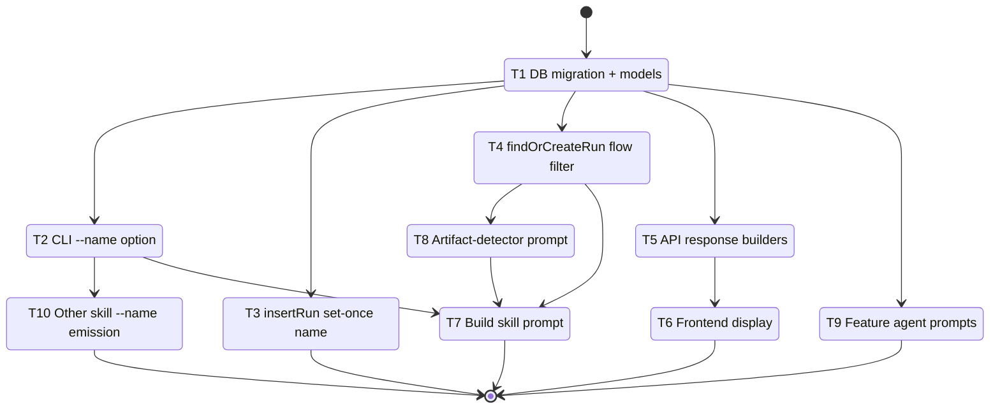

# Development Tasks: Run Names and Resume IDs

**Feature ID**: fix-run-names-and-resume-ids
**Status**: In Progress
**Progress**: 69% (9 of 13 tasks)
**Estimated Effort**: 4 days
**Started**: 2026-03-26

## Overview

Add human-readable run names that propagate from the emit CLI through the database to the Arcade dashboard, and implement run-ID resumability so that restarting a build for an existing feature reuses the original run record instead of creating orphaned duplicates.

## Implementation DAG

**Parallel Groups** (tasks with no inter-dependencies):

1. [T1] - Foundation: DB schema and model changes must land first
2. [T2, T3, T4, T5, T9] - All depend only on T1; no inter-dependencies
3. [T6, T8, T10] - T6 needs T5 (API must serve name); T8 needs T4 (flow filter for fallback); T10 needs T2 (--name flag exists)
4. [T7] - Build skill depends on T2 (--name), T4 (flow filter), T8 (artifact-detector)

**Dependencies**:

- T2 -> T1 (interface: CLI option needs name in EmitInput model)
- T3 -> T1 (data: insertRun needs name column in DB)
- T4 -> T1 (data: findOrCreateRun queries runs table)
- T5 -> T1 (data: API reads name from RunRecord)
- T6 -> T5 (interface: frontend needs API to include name field)
- T8 -> T4 (interface: artifact-detector uses resume-run which needs flow filter)
- T10 -> T2 (interface: skills use --name flag on emit)
- T7 -> [T2, T4, T8] (interface: build skill uses all three)

**Critical Path**: T1 -> T4 -> T8 -> T7

## Task Subflow



## Task Breakdown

### Foundation

- [x] **T1**: Add `name` column to runs table and extend data models `[complexity:medium]`

    **Reference**: [design.md#31-database-schema-migration-v4-to-v5](design.md#31-database-schema-migration-v4-to-v5), [design.md#32-model-extensions](design.md#32-model-extensions)

    **Effort**: 4 hours

    **Acceptance Criteria**:

    - [x] Schema migration v4->v5 adds nullable `name TEXT` column to `runs` table
    - [x] Migration is idempotent (checks for column existence before ALTER)
    - [x] `RunRow` interface includes `name: string | null`
    - [x] `RunRecord` interface includes `readonly name: string | null`
    - [x] `RunInput` interface includes `readonly name?: string`
    - [x] `EmitInput` interface includes `readonly name?: string`
    - [x] `runRowToRecord` mapper includes `name: row.name ?? null`
    - [x] Existing runs with no name continue to function (null is valid)

    **Implementation Summary**:

    - **Files**: `cli/src/agent-tools/emit/database.ts`, `cli/shared/events.ts`, `cli/src/agent-tools/emit/models.ts`, `cli/src/__tests__/agent-tools/emit/database.test.ts`, `cli/src/__tests__/agent-tools/emit/step-validation.test.ts`
    - **Approach**: Added nullable `name TEXT` column to runs table DDL (schema v5), added idempotent v4-to-v5 migration in applyMigrations(), extended RunRow/RunRecord/RunInput/EmitInput interfaces, updated runRowToRecord mapper. Fixed test expectations for new schema version.
    - **Deviations**: None
    - **Tests**: 177/177 passing

    **Execution Flow**:

    ```mermaid
    stateDiagram-v2
        [*] --> T1_DB_migration_and_models
        T1_DB_migration_and_models --> [*]
    ```

    **Validation Summary**:

    | Dimension | Status |
    |-----------|--------|
    | Discipline | ✅ PASS |
    | Accuracy | ✅ PASS |
    | Completeness | ✅ PASS |
    | Quality | ✅ PASS |
    | Testing | ✅ PASS |
    | Commit | ✅ PASS |
    | Comments | ✅ PASS |

### Parallel Group 2 (depends on T1)

- [x] **T2**: Add `--name` CLI option to the emit command `[complexity:simple]`

    **Reference**: [design.md#33-cli-option-addition](design.md#33-cli-option-addition)

    **Effort**: 1 hour

    **Acceptance Criteria**:

    - [x] `--name <name>` option added to the emit command in `command.ts`
    - [x] `EmitCommandOptions` includes `name` field
    - [x] Name value is passed through the validation pipeline to `EmitInput`
    - [x] Omitting `--name` does not affect existing behavior

    **Implementation Summary**:

    - **Files**: `cli/src/agent-tools/command.ts`, `cli/src/agent-tools/emit/validate.ts`, `cli/src/agent-tools/emit/index.ts`
    - **Approach**: Added `--name <name>` option to emit command, extended EmitCommandOptions with name field, threaded name through validateEmitOptions into EmitInput, passed name to insertRun call in executeEmit
    - **Deviations**: None
    - **Tests**: 1688/1688 passing

    **Validation Summary**:

    | Dimension | Status |
    |-----------|--------|
    | Discipline | ✅ PASS |
    | Accuracy | ✅ PASS |
    | Completeness | ✅ PASS |
    | Quality | ✅ PASS |
    | Testing | ⏭️ N/A |
    | Commit | ✅ PASS |
    | Comments | ✅ PASS |

- [x] **T3**: Implement set-once name logic in insertRun() `[complexity:simple]`

    **Reference**: [design.md#34-set-once-name-logic-in-insertrun](design.md#34-set-once-name-logic-in-insertrun)

    **Effort**: 2 hours

    **Acceptance Criteria**:

    - [x] New run creation inserts name value from input (may be null)
    - [x] Existing run with NULL name gets updated when input provides a name
    - [x] Existing run with a name keeps its name regardless of input
    - [x] Emit without `--name` never clears an existing name

    **Implementation Summary**:

    - **Files**: `cli/src/agent-tools/emit/database.ts`, `cli/src/__tests__/agent-tools/emit/database.test.ts`
    - **Approach**: Extended INSERT to include name column, added conditional UPDATE for name following existing feature_id backfill pattern (update only when current is NULL and input provides a value). Added 5 unit tests covering creation with/without name, backfill, no-overwrite, and no-clear semantics.
    - **Deviations**: None
    - **Tests**: 1688/1688 passing

    **Validation Summary**:

    | Dimension | Status |
    |-----------|--------|
    | Discipline | ✅ PASS |
    | Accuracy | ✅ PASS |
    | Completeness | ✅ PASS |
    | Quality | ✅ PASS |
    | Testing | ✅ PASS |
    | Commit | ✅ PASS |
    | Comments | ✅ PASS |

- [x] **T4**: Add flow filter to findOrCreateRun() `[complexity:simple]`

    **Reference**: [design.md#35-findorcreaterun-flow-filter](design.md#35-findorcreaterun-flow-filter)

    **Effort**: 1 hour

    **Acceptance Criteria**:

    - [x] `flow` is included in the WHERE clause of the resume lookup query
    - [x] Resume only matches runs of the same workflow type (build won't match pr-review)
    - [x] Only non-terminal status runs (not completed, failed, skipped) are matched
    - [x] Results ordered by `created_at DESC` with LIMIT 1

    **Implementation Summary**:

    - **Files**: `cli/src/agent-tools/emit/database.ts`, `cli/src/__tests__/agent-tools/emit/database.test.ts`
    - **Approach**: Added `AND flow = ?` to the WHERE clause in findOrCreateRun so resume only matches runs of the same workflow type. Added 2 unit tests: one verifying cross-workflow isolation, one verifying same-flow resume with multiple workflow types.
    - **Deviations**: None
    - **Tests**: 1688/1688 passing

    **Validation Summary**:

    | Dimension | Status |
    |-----------|--------|
    | Discipline | ✅ PASS |
    | Accuracy | ✅ PASS |
    | Completeness | ✅ PASS |
    | Quality | ✅ PASS |
    | Testing | ✅ PASS |
    | Commit | ✅ PASS |
    | Comments | ✅ PASS |

    **Execution Flow**:

    ```mermaid
    stateDiagram-v2
        [*] --> T2_CLI_name_option
        T2_CLI_name_option --> T3_insertRun_set_once_name
        T3_insertRun_set_once_name --> T4_findOrCreateRun_flow_filter
        T4_findOrCreateRun_flow_filter --> [*]
    ```

- [x] **T5**: Add name field to API response builders `[complexity:simple]`

    **Reference**: [design.md#36-api-response-builders](design.md#36-api-response-builders)

    **Effort**: 1 hour

    **Acceptance Criteria**:

    - [x] `runRecordToListRun()` includes `name` from `record.name`
    - [x] `buildDetailedRun()` includes `name` from `record.name`
    - [x] Run list endpoint returns `name` field (string or null) for each run
    - [x] Run detail endpoint returns `name` field

    **Implementation Summary**:

    - **Files**: `cli/web-ui/src/server/routes/v2-api.ts`, `cli/web-ui/src/types/runs.ts`, `cli/web-ui/src/__tests__/hooks/useRunDetail.test.ts`
    - **Approach**: Added `name: record.name ?? null` to both runRecordToListRun() and buildDetailedRun() return objects. Extended the frontend Run interface with `readonly name: string | null` so the type system accepts the new field. Fixed test fixture to include name field.
    - **Deviations**: Also updated Run interface in types/runs.ts (T6 scope overlap) because the server return type is typed as Run; without the field the build fails.
    - **Tests**: 1837/1837 passing

    **Execution Flow**:

    ```mermaid
    stateDiagram-v2
        [*] --> T5_API_response_builders
        T5_API_response_builders --> T9_Feature_agent_frontmatter
        T9_Feature_agent_frontmatter --> [*]
    ```

    **Validation Summary**:

    | Dimension | Status |
    |-----------|--------|
    | Discipline | ✅ PASS |
    | Accuracy | ✅ PASS |
    | Completeness | ✅ PASS |
    | Quality | ✅ PASS |
    | Testing | ⏭️ N/A |
    | Commit | ✅ PASS |
    | Comments | ✅ PASS |

- [x] **T9**: Update feature agent prompts to embed rp1_run_id in frontmatter `[complexity:simple]`

    **Reference**: [design.md#310-frontmatter-embedding-in-feature-artifacts](design.md#310-frontmatter-embedding-in-feature-artifacts)

    **Effort**: 2 hours

    **Acceptance Criteria**:

    - [x] `feature-requirement-gatherer.md` instructs embedding `rp1_run_id` in frontmatter
    - [x] `feature-architect.md` instructs embedding `rp1_run_id` in frontmatter
    - [x] `feature-tasker.md` instructs embedding `rp1_run_id` in frontmatter
    - [x] Field uses `rp1_` prefix consistent with existing `rp1_doc_id` convention
    - [x] Agents receive `RUN_ID` as a parameter for frontmatter inclusion

    **Implementation Summary**:

    - **Files**: `plugins/dev/agents/feature-requirement-gatherer.md`, `plugins/dev/agents/feature-architect.md`, `plugins/dev/agents/feature-tasker.md`
    - **Approach**: Added frontmatter instructions to each agent's output template section, directing inclusion of `rp1_run_id: {RUN_ID}` in YAML frontmatter when RUN_ID is non-empty. Updated output template examples to show the frontmatter block. All three agents already receive RUN_ID as a parameter.
    - **Deviations**: None
    - **Tests**: N/A (prompt-only changes)

    **Validation Summary**:

    | Dimension | Status |
    |-----------|--------|
    | Discipline | ✅ PASS |
    | Accuracy | ✅ PASS |
    | Completeness | ✅ PASS |
    | Quality | ✅ PASS |
    | Testing | ⏭️ N/A |
    | Commit | ✅ PASS |
    | Comments | ⏭️ N/A |

### Parallel Group 3

- [x] **T6**: Update frontend to display run names with fallback chain `[complexity:medium]`

    **Reference**: [design.md#37-frontend-run-type](design.md#37-frontend-run-type), [design.md#38-frontend-display-updates](design.md#38-frontend-display-updates)

    **Effort**: 5 hours

    **Acceptance Criteria**:

    - [x] `Run` interface in `types/runs.ts` includes `readonly name: string | null`
    - [x] `resolveRunDisplayName()` helper implements fallback chain: name > featureName > featureId > ""
    - [x] HomePage.tsx FeedEntry uses resolved name as primary text
    - [x] RunCard.tsx title area uses resolved name
    - [x] V2Sidebar.tsx and ArtifactViewerPage.tsx use resolved name where applicable
    - [x] No "null", "undefined", or placeholder text is ever rendered

    **Implementation Summary**:

    - **Files**: `cli/web-ui/src/lib/run-display.ts`, `cli/web-ui/src/pages/v2/HomePage.tsx`, `cli/web-ui/src/components/v2/RunCard.tsx`, `cli/web-ui/src/components/v2/V2Sidebar.tsx`, `cli/web-ui/src/pages/v2/ArtifactViewerPage.tsx`
    - **Approach**: Created `resolveRunDisplayName()` helper in new `lib/run-display.ts` implementing the fallback chain (name > featureName > featureId > ""). Updated FeedEntry to use resolved name as primary text with command as fallback. Updated RunCard to show resolved name conditionally (hides separator when empty). Updated V2Sidebar running items and ArtifactViewerPage breadcrumbs to use resolved name with graceful omission when empty.
    - **Deviations**: V2Sidebar recent runs section kept using `run.featureName || run.projectName` because `RecentRun` type does not conform to `Run` interface (lacks `name` and `featureId` fields).
    - **Tests**: N/A (design explicitly excludes testing React renders of string props)

    **Execution Flow**:

    ```mermaid
    stateDiagram-v2
        [*] --> T6_Frontend_display
        T6_Frontend_display --> [*]
    ```

    **Validation Summary**:

    | Dimension | Status |
    |-----------|--------|
    | Discipline | ✅ PASS |
    | Accuracy | ✅ PASS |
    | Completeness | ✅ PASS |
    | Quality | ✅ PASS |
    | Testing | ⏭️ N/A |
    | Commit | ✅ PASS |
    | Comments | ✅ PASS |

- [x] **T8**: Update artifact-detector agent for run_id extraction and resume logic `[complexity:medium]`

    **Reference**: [design.md#39-artifact-detector-agent-updates](design.md#39-artifact-detector-agent-updates)

    **Effort**: 4 hours

    **Acceptance Criteria**:

    - [x] Artifact-detector extracts `rp1_run_id` from YAML frontmatter of existing artifacts
    - [x] Extracted run_id is verified against DB for resumable state (running/waiting)
    - [x] Terminal-state runs (completed/failed/skipped) cause a new run ID to be generated
    - [x] Falls back to `resume-run` subcommand when no frontmatter run_id exists
    - [x] Extended output includes `run_id`, `resumed`, and `artifacts` fields
    - [x] Artifact reconciliation scans for unregistered files on resume (best-effort)

    **Implementation Summary**:

    - **Files**: `plugins/dev/agents/build-artifact-detector.md`
    - **Approach**: Added Section 2 (Run ID Resolution) with three-part strategy: (2.1) extract `rp1_run_id` from YAML frontmatter of artifacts read during step detection, (2.2) verify resumable state via `resume-run` CLI subcommand comparing frontmatter run_id against DB state, (2.3) fall back to `resume-run` when no frontmatter exists. Added Section 2.4 for best-effort artifact reconciliation on resume. Extended output contract with `run_id`, `resumed`, and `unregistered_artifacts` fields. Added `WORKFLOW_TYPE` parameter (default: `build`) and `Bash(rp1 *)` tool permission for DB queries.
    - **Deviations**: None
    - **Tests**: N/A (prompt-only changes)

    **Validation Summary**:

    | Dimension | Status |
    |-----------|--------|
    | Discipline | ✅ PASS |
    | Accuracy | ✅ PASS |
    | Completeness | ✅ PASS |
    | Quality | ✅ PASS |
    | Testing | ⏭️ N/A |
    | Commit | ✅ PASS |
    | Comments | ⏭️ N/A |

- [x] **T10**: Add --name emission to other workflow skills `[complexity:simple]`

    **Reference**: [design.md#312-other-workflow-skill-updates](design.md#312-other-workflow-skill-updates)

    **Effort**: 2 hours

    **Acceptance Criteria**:

    - [x] build-fast skill passes `--name "Feature: {FEATURE_ID}"` on first emit
    - [x] build-express skill passes `--name "Feature: {FEATURE_ID}"` on first emit
    - [x] pr-review skill passes `--name "PR #{PR_NUMBER}"` or `--name "PR: {title}"` on first emit
    - [x] blueprint skill passes `--name "Blueprint: {PRD_NAME}"` on first emit

    **Implementation Summary**:

    - **Files**: `plugins/dev/skills/build-fast/SKILL.md`, `plugins/dev/skills/build-express/SKILL.md`, `plugins/dev/skills/pr-review/SKILL.md`, `plugins/dev/skills/blueprint/SKILL.md`
    - **Approach**: Added RUN_NAME derivation instructions and `--name` flag to the first emit call in each skill's STATE-MACHINE section. build-fast and build-express derive name from request context with "Feature: " prefix; pr-review uses "PR #{pr_number}" with branch fallback; blueprint uses "Blueprint: {PRD_NAME}" with "main" default. Updated example sequences to show --name on first emit.
    - **Deviations**: build-fast and build-express do not have a FEATURE_ID parameter, so the name is derived from the development request summary instead (matching the "Feature: " prefix pattern from the design).
    - **Tests**: N/A (prompt-only changes)

    **Execution Flow**:

    ```mermaid
    stateDiagram-v2
        [*] --> T10_name_emission_in_workflow_skills
        T10_name_emission_in_workflow_skills --> [*]
    ```

### Critical Path Completion

- [ ] **T7**: Update build skill for resume logic, name emission, and terminal states `[complexity:medium]`

    **Reference**: [design.md#311-build-skill-resume-integration](design.md#311-build-skill-resume-integration)

    **Effort**: 5 hours

    **Acceptance Criteria**:

    - [ ] Build skill uses `run_id` from artifact-detector when `resumed: true`
    - [ ] Build skill generates new UUID when not resuming
    - [ ] First emit includes `--name "Feature: {FEATURE_ID}"`
    - [ ] Normal completion emits "completed" status
    - [ ] Error exits emit "failed" status
    - [ ] Workflows paused for user input emit "waiting" status
    - [ ] No run remains in "running" status after the build skill finishes execution

### User Docs

- [ ] **TD1**: Update modules.md - Agent Tools `[complexity:simple]`

    **Reference**: [design.md#documentation-impact](design.md#documentation-impact)

    **Type**: edit

    **Target**: .rp1/context/modules.md

    **Section**: Agent Tools

    **KB Source**: modules.md:agent-tools

    **Effort**: 30 minutes

    **Acceptance Criteria**:

    - [ ] Section reflects --name flag and resume-run flow filter

- [ ] **TD2**: Update architecture.md - Workflow Event Pipeline `[complexity:simple]`

    **Reference**: [design.md#documentation-impact](design.md#documentation-impact)

    **Type**: edit

    **Target**: .rp1/context/architecture.md

    **Section**: Workflow Event Pipeline

    **KB Source**: architecture.md:event-pipeline

    **Effort**: 30 minutes

    **Acceptance Criteria**:

    - [ ] Section reflects name field in data flow description

- [ ] **TD3**: Update patterns.md - I/O & Integration `[complexity:simple]`

    **Reference**: [design.md#documentation-impact](design.md#documentation-impact)

    **Type**: edit

    **Target**: .rp1/context/patterns.md

    **Section**: I/O & Integration

    **KB Source**: patterns.md:io-integration

    **Effort**: 30 minutes

    **Acceptance Criteria**:

    - [ ] Section documents schema v5 migration

## Acceptance Criteria Checklist

- [ ] A `name` column exists on the runs table, nullable, text type (REQ-01)
- [ ] Database schema version is incremented to reflect the migration (REQ-01)
- [ ] Existing runs without a name continue to function (REQ-01)
- [ ] `rp1 agent-tools emit --name "Feature: Hook Support" ...` accepts the flag and stores the value (REQ-02)
- [ ] The flag is optional; omitting it does not affect existing behavior (REQ-02)
- [ ] The name is passed through the emit pipeline and written to the run record on creation (REQ-02)
- [ ] An emit with `--name` on a run that has no name sets the name (REQ-03)
- [ ] An emit with `--name` on a run that already has a name does not change it (REQ-03)
- [ ] An emit without `--name` never clears an existing name (REQ-03)
- [ ] The run list endpoint includes a `name` field for each run (REQ-04)
- [ ] The run detail endpoint includes a `name` field (REQ-04)
- [ ] Activity feed entries show the resolved name alongside command and project (REQ-05)
- [ ] Run cards display the resolved name (REQ-05)
- [ ] No "null", "undefined", or placeholder text is ever rendered (REQ-05)
- [ ] All workflow skills pass `--name` on their first emit (REQ-06)
- [ ] Feature artifacts include `rp1_run_id` in YAML frontmatter (REQ-07)
- [ ] Artifact-detector extracts `run_id` from frontmatter and verifies resumable state (REQ-07)
- [ ] DB fallback query matches on feature_id and workflow type (REQ-07)
- [ ] Resumed builds reuse the existing run ID for all subsequent emits (REQ-07)
- [ ] Normal completion emits "completed" status (REQ-08)
- [ ] Error exits emit "failed" status (REQ-08)
- [ ] No run remains in "running" status after build finishes (REQ-08)
- [ ] On resume, unregistered artifacts are backfilled under the resumed run ID (REQ-09)

---

## EDIT-002: Workflow-Agnostic Resume ID Flow

**Date**: 2026-03-26
**Type**: REQUIREMENT_CHANGE
**Status**: Applied

### Context
Resume logic generalized from build-only to workflow-agnostic. The emit/DB layer (T4 findOrCreateRun, T8 artifact-detector) is already generic by design. This edit is a requirements/design clarification, not new implementation work.

### Change Summary
No new tasks required. Existing tasks T4, T7, T8 already implement the resume logic generically. The following tasks may benefit from awareness of the broadened scope:
- **T4** (findOrCreateRun flow filter): Already accepts any workflow type via the `flow` parameter.
- **T7** (Build skill prompt): Serves as the reference implementation for resume; other workflow skills can follow the same pattern.
- **T8** (Artifact-detector prompt): Uses `--flow {WORKFLOW_TYPE}` parameter, not hardcoded to build.

### Impact Analysis
- **Completed Tasks Affected**: None
- **In-Progress Tasks Affected**: None
- **New Tasks Required**: None

---

## Definition of Done

- [ ] All tasks completed
- [ ] All acceptance criteria verified
- [ ] Code reviewed
- [ ] Docs updated
