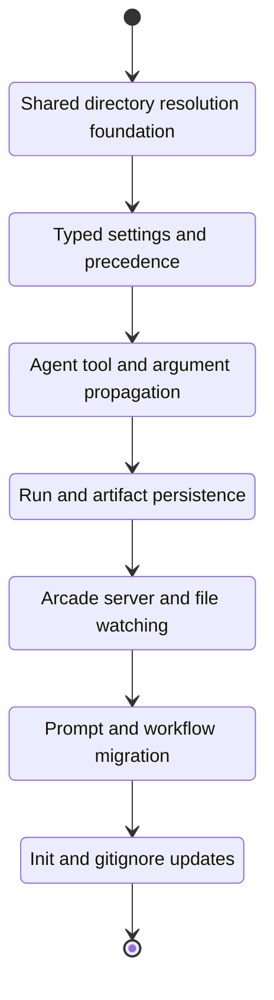

# Development Tasks: Directory Resolution Overhaul

**Feature ID**: rp1-dir-fix
**Status**: Completed
**Progress**: 100% (7 of 7 tasks)
**Estimated Effort**: 3 days
**Started**: 2026-03-29

## Overview

Implement a shared three-directory resolution model across CLI, agent tools, persistence, and Arcade so rp1 consistently resolves project, KB, and work directories in single-repo, monorepo, and external-storage setups.

## Task Subflow



## Task Breakdown

### Core Resolution

- [x] **T1**: Build the shared directory resolution module and adopt it in existing root/config entry points `[complexity:medium]`

    **Reference**: [design.md#21-shared-resolution-model](design.md#21-shared-resolution-model)

    **Effort**: 6 hours

    **Acceptance Criteria**:

    - [x] A shared resolver returns `projectRoot`, `rp1Root`, `kbDir`, `workDir`, worktree metadata, and source metadata in a typed result.
    - [x] Project-root precedence matches the design order, including `.rp1` walk-up, git fallback, and cwd fallback behavior.
    - [x] Existing `rp1-root-dir` and shared config resolution paths use the shared resolver instead of separate root-finding logic.

    **Implementation Summary**:

    - **Files**: `cli/shared/directory-resolution.ts`, `cli/shared/config.ts`, `cli/shared/index.ts`, `cli/src/agent-tools/rp1-root-dir/resolver.ts`, `cli/src/__tests__/shared/directory-resolution.test.ts`, `cli/src/__tests__/agent-tools/rp1-root-dir/resolver.test.ts`
    - **Approach**: Added a shared three-directory resolver with env, `.rp1` walk-up, worktree/main-repo fallback, git-root fallback, and cwd fallback resolution, then rewired the existing config and rp1-root-dir entry points onto that single implementation.
    - **Deviations**: None
    - **Tests**: 15/15 passing (`bun test src/__tests__/agent-tools/rp1-root-dir/resolver.test.ts src/__tests__/shared/directory-resolution.test.ts`)

    **Validation Summary**:

    | Dimension | Status |
    |-----------|--------|
    | Discipline | ✅ PASS |
    | Accuracy | ✅ PASS |
    | Completeness | ✅ PASS |
    | Quality | ✅ PASS |
    | Testing | ✅ PASS |
    | Commit | ✅ PASS |
    | Comments | ✅ PASS |

    **Execution Flow**:

    ```mermaid
    stateDiagram-v2
        [*] --> T1
        T1: Shared directory resolution foundation
        T1 --> [*]
    ```

- [x] **T2**: Add typed directory settings loading, path normalization, and precedence validation `[complexity:medium]`

    **Reference**: [design.md#32-settings-model](design.md#32-settings-model)

    **Effort**: 4 hours

    **Acceptance Criteria**:

    - [x] Project and user settings support a `[directories]` table with `project_root`, `kb_dir`, and `work_dir`.
    - [x] Relative-path handling is normalized against the correct base for project and user settings.
    - [x] Invalid directory settings fail with a validation error, and environment-variable overrides still take precedence.

    **Implementation Summary**:

    - **Files**: `cli/shared/settings.ts`, `cli/src/settings/loader.ts`, `cli/src/settings/validator.ts`, `cli/shared/directory-resolution.ts`, `cli/src/__tests__/settings/loader.test.ts`, `cli/src/__tests__/shared/directory-resolution.test.ts`
    - **Approach**: Added a shared typed `[directories]` loader with base-aware path normalization, then reworked precedence into a two-phase effective-project load so redirected project-local settings can override user-level `kb_dir` and `work_dir` while env overrides still win.
    - **Deviations**: None
    - **Tests**: 26/26 passing (`bun test cli/src/__tests__/settings/loader.test.ts cli/src/__tests__/shared/directory-resolution.test.ts`)

    **Review Feedback** (Attempt 1):
    - **Status**: FAILURE
    - **Issues**:
      - [accuracy] `project_root` is parsed but not applied by runtime directory resolution. `resolveDirectorySet()` still returns the discovered/walked project root and only uses the configured `project_root` as a base for `kb_dir` and `work_dir`, so `[directories].project_root` is not actually supported as required.
      - [completeness] There is no test covering `resolveDirectorySet()` with `[directories].project_root`; the current test suite therefore misses the required effective behavior for project-level and user-level `project_root` overrides.
    - **Guidance**: Update the shared resolver so settings-based `project_root` participates in effective runtime resolution with the documented precedence (`env` still wins, then project settings, then user settings, then defaults/discovery). Add coverage that proves both project-level and user-level `project_root` override the discovered root, and that `kb_dir`/`work_dir` resolve relative to the effective project root after precedence is applied.

    **Review Resolution** (Attempt 2):
    - **Status**: PASS
    - **Changes**:
      - Applied `[directories].project_root` to the effective `ResolvedDirectorySet.projectRoot` and source metadata unless an env root override is present.
      - Added runtime regressions for both project-level and user-level `project_root` overrides, including relative `kb_dir` and `work_dir` resolution from the effective root.

    **Review Feedback** (Attempt 3):
    - **Status**: FAILURE
    - **Issues**:
      - [commit] `GIT_COMMIT=true` requires a single atomic task commit, but `T2` currently spans two commits: `f6e75265` (`feat(rp1-dir-fix): implement T2 - typed directory settings precedence`) and `cbd55da3` (`feat(rp1-dir-fix): implement T2 - apply project root precedence`).
    - **Guidance**: Collapse the `T2` work into one atomic conventional commit for this task, then rerun review. The code changes themselves are acceptable; the retry only needs to satisfy the commit-discipline requirement.

    **Review Feedback** (Attempt 4):
    - **Status**: FAILURE
    - **Issues**:
      - [accuracy] User-level `project_root` does not cause project-level settings from the effective project root to participate in precedence. `loadDirectorySettings()` always resolves `localSettingsPath` from the initially discovered root (`cli/shared/settings.ts`), and `resolveDirectorySet()` applies the returned `settings.projectRoot` afterward (`cli/shared/directory-resolution.ts`), so a user-configured effective root cannot contribute its own project-level `kb_dir`/`work_dir` overrides.
      - [completeness] There is no regression test covering the case where user settings redirect `project_root` to another project that has its own `.rp1/settings.toml`; current tests therefore miss the required project-over-user precedence on the effective root.
    - **Guidance**: Rework directory-settings loading so once `project_root` resolves to an effective project root, project-local settings from `{effectiveProjectRoot}/.rp1/settings.toml` participate with higher precedence than user settings. Add a regression test where user settings point `project_root` at another project containing project-local directory overrides, and verify the effective root's `kb_dir`/`work_dir` win over the user-level values.

    **Review Resolution** (Attempt 5):
    - **Status**: PASS
    - **Changes**:
      - Reworked `loadDirectorySettings()` so it resolves the effective project root first, then reloads project-local settings from that effective root before final precedence is applied.
      - Added regressions at both the loader and runtime resolver layers for a user-level `project_root` redirect into a project with its own `.rp1/settings.toml`, verifying effective-project `kb_dir` and `work_dir` override user-level values.

    **Validation Summary**:

    | Dimension | Status |
    |-----------|--------|
    | Discipline | ✅ PASS |
    | Accuracy | ✅ PASS |
    | Completeness | ✅ PASS |
    | Quality | ✅ PASS |
    | Testing | ✅ PASS |
    | Commit | ✅ PASS |
    | Comments | ✅ PASS |

    **Execution Flow**:

    ```mermaid
    stateDiagram-v2
        [*] --> T2
        T2: Typed settings and precedence
        T2 --> [*]
    ```

- [x] **T3**: Extend agent tool and argument-resolution outputs with the resolved directory set `[complexity:medium]`

    **Reference**: [design.md#22-integration-points](design.md#22-integration-points)

    **Effort**: 4 hours

    **Acceptance Criteria**:

    - [x] `rp1 agent-tools rp1-root-dir` returns backward-compatible `root` plus `projectRoot`, `kbDir`, `workDir`, and source metadata.
    - [x] `resolve-args` exposes `RP1_PROJECT_ROOT`, `RP1_KB_DIR`, and `RP1_WORK_DIR` in addition to `RP1_ROOT`.
    - [x] Repeated resolution in a workflow chain surfaces stable directory values when overrides do not change.

    **Implementation Summary**:

    - **Files**: `cli/src/agent-tools/rp1-root-dir/models.ts`, `cli/src/agent-tools/rp1-root-dir/resolver.ts`, `cli/src/agent-tools/resolve-args/resolver.ts`, `cli/src/__tests__/agent-tools/rp1-root-dir/resolver.test.ts`, `cli/src/__tests__/agent-tools/resolve-args/resolve-args.test.ts`
    - **Approach**: Extended `rp1-root-dir` to return the full resolved directory set and per-field sources while preserving the legacy `root` and `source` fields, then taught `resolve-args` to populate all four RP1 directory environment variables from a single shared directory-resolution pass.
    - **Deviations**: None
    - **Tests**: 47/47 passing (`bun test cli/src/__tests__/agent-tools/rp1-root-dir/resolver.test.ts cli/src/__tests__/agent-tools/resolve-args/resolve-args.test.ts`)

    **Validation Summary**:

    | Dimension | Status |
    |-----------|--------|
    | Discipline | ✅ PASS |
    | Accuracy | ✅ PASS |
    | Completeness | ✅ PASS |
    | Quality | ✅ PASS |
    | Testing | ✅ PASS |
    | Commit | ✅ PASS |
    | Comments | ✅ PASS |

    **Execution Flow**:

    ```mermaid
    stateDiagram-v2
        [*] --> T3
        T3: Agent tool and argument propagation
        T3 --> [*]
    ```

### Persistence And UI

- [x] **T4**: Persist resolved run-directory metadata and normalize artifact storage behavior `[complexity:complex]`

    **Reference**: [design.md#31-data-model](design.md#31-data-model)

    **Effort**: 8 hours

    **Acceptance Criteria**:

    - [x] Database migrations add run columns for `rp1_project_root`, `rp1_kb_dir`, and `rp1_work_dir`.
    - [x] Artifact persistence distinguishes work-dir-relative storage from project-relative or absolute legacy paths.
    - [x] Artifact reads resolve paths using the documented compatibility order without regressing legacy lookup behavior.

    **Implementation Summary**:

    - **Files**: `cli/shared/events.ts`, `cli/src/agent-tools/emit/database.ts`, `cli/src/agent-tools/emit/index.ts`, `cli/src/__tests__/agent-tools/emit/database.test.ts`, `cli/src/__tests__/agent-tools/emit/emit.test.ts`, `cli/src/__tests__/agent-tools/emit/step-validation.test.ts`
    - **Approach**: Added schema v7 run-directory columns and artifact `storage_root`, persisted resolved directory values during emit, normalized new artifact writes against `rp1_work_dir`, and added compatibility helpers/tests for absolute, project-relative, and work-dir-relative artifact reads.
    - **Deviations**: None
    - **Tests**: 103/103 passing (`bun test cli/src/__tests__/agent-tools/emit/database.test.ts cli/src/__tests__/agent-tools/emit/emit.test.ts`), `cd cli && bun run typecheck` passing; `just check-cli` still reports pre-existing unrelated lint findings outside T4 scope

    **Validation Summary**:

    | Dimension | Status |
    |-----------|--------|
    | Discipline | ✅ PASS |
    | Accuracy | ✅ PASS |
    | Completeness | ✅ PASS |
    | Quality | ✅ PASS |
    | Testing | ✅ PASS |
    | Commit | ✅ PASS |
    | Comments | ✅ PASS |

    **Execution Flow**:

    ```mermaid
    stateDiagram-v2
        [*] --> T4
        T4: Run and artifact persistence
        T4 --> [*]
    ```

- [x] **T5**: Update Arcade server project lookup, artifact access, and file watchers to use resolved directory metadata `[complexity:complex]`

    **Reference**: [design.md#33-command-and-api-behavior](design.md#33-command-and-api-behavior)

    **Effort**: 6 hours

    **Acceptance Criteria**:

    - [x] Arcade routes use stored run/project directory metadata rather than hardcoded `.rp1/work` assumptions.
    - [x] File watching targets the resolved work and KB directories for the active project context.
    - [x] Run inspection and artifact viewing continue to work for both new runs and legacy records.

    **Implementation Summary**:

    - **Files**: `cli/web-ui/src/server/project-paths.ts`, `cli/web-ui/src/server/project.ts`, `cli/web-ui/src/server/file-watcher.ts`, `cli/web-ui/src/server/routes/v2-api.ts`, `cli/web-ui/src/server/routes/artifacts-api.ts`, `cli/web-ui/src/__tests__/server/artifacts-api.test.ts`, `cli/web-ui/src/__tests__/server/project-paths.test.ts`
    - **Approach**: Added a shared Arcade path helper so project browsing and watchers resolve current `kbDir`/`workDir`, while run artifact routes derive display paths and disk reads from stored run directory metadata with legacy `.rp1/work` reconciliation fallback.
    - **Deviations**: None
    - **Tests**: 31/31 passing (`cd cli/web-ui && bun test src/__tests__/server/artifacts-api.test.ts src/__tests__/server/project-paths.test.ts`), `cd cli/web-ui && bun x tsc --noEmit` passing, `just check-web-ui` passing

    **Validation Summary**:

    | Dimension | Status |
    |-----------|--------|
    | Discipline | ✅ PASS |
    | Accuracy | ✅ PASS |
    | Completeness | ✅ PASS |
    | Quality | ✅ PASS |
    | Testing | ✅ PASS |
    | Commit | ✅ PASS |
    | Comments | ✅ PASS |

    **Execution Flow**:

    ```mermaid
    stateDiagram-v2
        [*] --> T5
        T5: Arcade server and file watching
        T5 --> [*]
    ```

### Workflow Migration And Repo Hygiene

- [x] **T6**: Migrate rp1-authored prompts and artifact registration to the resolved work-directory model `[complexity:medium]`

    **Reference**: [design.md#35-migration-strategy](design.md#35-migration-strategy)

    **Effort**: 4 hours

    **Acceptance Criteria**:

    - [x] Prompt artifacts keep `RP1_ROOT` for config/context paths and switch work-artifact paths to `RP1_WORK_DIR` where appropriate.
    - [x] Artifact registration helpers emit paths relative to the resolved work directory for rp1-managed work outputs.
    - [x] Updated prompts remain compatible with existing build/runtime conventions.

    **Implementation Summary**:

    - **Files**: `plugins/dev/skills/build/SKILL.md`, `plugins/dev/skills/build-fast/SKILL.md`, `plugins/dev/skills/pr-review/SKILL.md`, `plugins/dev/skills/address-pr-feedback/SKILL.md`, `plugins/dev/skills/blueprint/SKILL.md`, `plugins/dev/skills/blueprint-archive/SKILL.md`, `plugins/dev/skills/feature-archive/SKILL.md`, `plugins/dev/skills/feature-unarchive/SKILL.md`, `plugins/dev/skills/validate-hypothesis/SKILL.md`, `plugins/dev/agents/build-artifact-detector.md`, `plugins/dev/agents/build-fast-planner.md`, `plugins/dev/agents/feature-requirement-gatherer.md`, `plugins/dev/agents/feature-architect.md`, `plugins/dev/agents/feature-tasker.md`, `plugins/dev/agents/task-builder.md`, `plugins/dev/agents/task-reviewer.md`, `plugins/dev/agents/pr-visualizer.md`, `plugins/dev/agents/pr-review-reporter.md`, `plugins/dev/agents/feature-editor.md`, `plugins/dev/agents/feature-archiver.md`, `plugins/dev/agents/blueprint-wizard.md`, `plugins/dev/agents/blueprint-auditor.md`, `plugins/dev/agents/prd-archiver.md`, `plugins/dev/agents/code-checker.md`, `plugins/dev/agents/hypothesis-tester.md`, `plugins/dev/agents/bug-investigator.md`, `plugins/base/agents/research-reporter.md`, `plugins/base/agents/security-validator.md`, `plugins/base/skills/knowledge-build/SKILL.md`, `plugins/base/skills/generate-user-docs/SKILL.md`, `plugins/base/skills/markdown-preview/SKILL.md`, `plugins/base/skills/markdown-preview/EXAMPLES.md`, `plugins/base/skills/write-content/SKILL.md`
    - **Approach**: Switched rp1-authored prompt file paths from `RP1_ROOT/work/...` to `RP1_WORK_DIR/...`, added `RP1_WORK_DIR` prompt env wiring where needed, and updated artifact-registration examples/contracts to use work-dir-relative paths for rp1-managed outputs.
    - **Deviations**: None
    - **Tests**: `just build` passing

    **Execution Flow**:

    ```mermaid
    stateDiagram-v2
        [*] --> T6
        T6: Prompt and workflow migration
        T6 --> [*]
    ```

- [x] **T7**: Make init and managed `.gitignore` updates reflect the resolved directory model `[complexity:simple]`

    **Reference**: [design.md#34-gitignore-handling](design.md#34-gitignore-handling)

    **Effort**: 2 hours

    **Acceptance Criteria**:

    - [x] Init computes ignore entries from the resolved directory configuration rather than assuming project-local `.rp1/work`.
    - [x] The managed `# rp1:start` / `# rp1:end` section remains idempotent across repeated updates.
    - [x] Externalized work directories do not cause misleading project-local ignore entries to be written.

    **Implementation Summary**:

    - **Files**: `cli/src/init/gitignore.ts`, `cli/src/init/steps/project-setup.ts`, `cli/src/init/ui/hooks/useStepExecution.ts`, `cli/src/__tests__/init/gitignore.test.ts`
    - **Approach**: Added a shared init gitignore generator backed by the resolved directory model, wired both the CLI init flow and the wizard flow onto it, and covered default external work storage, custom local work dirs, and idempotent fenced rewrites.
    - **Deviations**: None
    - **Tests**: 18/18 passing (`bun test cli/src/__tests__/init/gitignore.test.ts cli/src/__tests__/init/init.integration.test.ts`), `cd cli && bun x tsc --noEmit` passing

    **Execution Flow**:

    ```mermaid
    stateDiagram-v2
        [*] --> T7
        T7: Init and gitignore updates
        T7 --> [*]
    ```

## Acceptance Criteria Checklist

- [ ] REQ-001: rp1 resolves a single `rp1_project_root` consistently for nested project execution and later inspection.
- [ ] REQ-002: rp1 resolves `rp1_kb_dir` with the documented default and supports configured overrides for downstream workflows.
- [ ] REQ-003: rp1 resolves `rp1_work_dir` with the documented default and associates artifact writes and reads with that directory.
- [ ] REQ-004: environment variables override config values, config scopes cascade correctly, and documented defaults apply when unset.
- [ ] REQ-005: parent and child workflows can consume the same resolved directory values through argument resolution.
- [ ] REQ-006: run records persist `rp1_project_root`, `rp1_kb_dir`, and `rp1_work_dir` for later inspection.
- [x] REQ-007: `.gitignore` management stays predictable, single-section, and aligned to actual managed directories.
- [ ] REQ-008: resolved directory values and their effective sources are visible for troubleshooting.

## Definition of Done

- [x] All tasks completed
- [ ] All AC verified
- [ ] Code reviewed
- [ ] Docs updated

---

## EDIT-001: Artifact Storage Anchored To Work Directory

**Date**: 2026-03-29
**Type**: DISCOVERY
**Status**: Applied

### Context
Managed artifact storage was clarified to always resolve under `rp1_work_dir`. Task execution should preserve that invariant and treat non-work-rooted artifact paths as legacy compatibility only.

### Change Summary
Existing persistence, Arcade, and prompt-migration tasks remain relevant but need to be interpreted with a stricter artifact-root invariant.

### Impact Analysis
- **Completed Tasks Affected**: None
- **In-Progress Tasks Affected**: None
- **New Tasks Required**: 1

### Related Sections
- T4
- T5
- T6

---

### Tasks from EDIT-001

- [ ] Add an implementation check that new rp1-managed artifact writes and registrations are always rooted in `rp1_work_dir`, while legacy non-work-rooted paths remain read-only compatibility cases.

---

## EDIT-002: Gitignore The Project Settings File

**Date**: 2026-03-29
**Type**: REQUIREMENT_CHANGE
**Status**: Applied

### Context
The feature now explicitly requires the project-local settings file to be covered by the managed rp1 gitignore stanza when rp1 maintains project-local configuration.

### Change Summary
Existing gitignore work stays in T7, but it now includes fenced handling for `.rp1/settings.toml` in addition to directory entries.

### Impact Analysis
- **Completed Tasks Affected**: None
- **In-Progress Tasks Affected**: None
- **New Tasks Required**: 1

### Related Sections
- T7
- REQ-007

---

### Tasks from EDIT-002

- [ ] Ensure the managed rp1 gitignore section includes `.rp1/settings.toml` when project-local settings are used, and keeps the fenced stanza idempotent across rewrites.

---

## EDIT-003: Remove Superseded Directory-Resolution Code

**Date**: 2026-03-29
**Type**: REQUIREMENT_CHANGE
**Status**: Applied

### Context
This feature now explicitly includes cleanup of dead code introduced by the directory-resolution overhaul. The implementation should converge on the new runtime model rather than preserving redundant legacy helpers and assumptions after they are no longer needed.

### Change Summary
Existing implementation tasks remain valid, but they now carry an explicit cleanup expectation across the resolver, persistence, Arcade, prompt migration, and gitignore surfaces.

### Impact Analysis
- **Completed Tasks Affected**: None
- **In-Progress Tasks Affected**: None
- **New Tasks Required**: 2

### Related Sections
- T1
- T4
- T5
- T6
- T7

---

### Tasks from EDIT-003

- [ ] Audit the new directory-resolution rollout for superseded helpers, duplicate resolver entry points, and stale single-root assumptions, then remove code that is no longer reachable or no longer needed for documented compatibility.
- [ ] Remove obsolete rp1-managed write-path and gitignore branches once `rp1_work_dir` and the new managed-directory model fully cover the supported behavior, keeping only the minimum legacy read compatibility paths.
