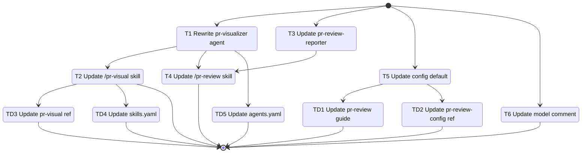

# Development Tasks: PR Visual Markdown Rewrite

**Feature ID**: visual-pr
**Status**: In Progress
**Progress**: 54% (6 of 11 tasks)
**Estimated Effort**: 3 days
**Started**: 2026-03-24

## Overview

Rewrite the PR visualization workflow to produce pure markdown with embedded Mermaid diagrams. Remove all HTML rendering and `markdown-preview` dependencies, make visual generation default-on in PR reviews, and embed diagrams directly in the review report.

## Implementation DAG

**Parallel Groups** (tasks with no inter-dependencies):

1. [T1, T3, T5, T6] - Independent files, no data/interface dependencies between them
2. [T2, T4] - Depend on T1 (new STANDALONE param) and T3 (new VISUAL_CONTENT param)

**Dependencies**:

- T2 -> T1 (interface: skill dispatches agent with STANDALONE param defined in T1)
- T4 -> T1 (interface: skill dispatches agent with STANDALONE=false)
- T4 -> T3 (interface: skill passes VISUAL_CONTENT to reporter's new param)

**Critical Path**: T1 -> T4

## Task Subflow



## Task Breakdown

### Independent Components (Parallel Group 1)

- [x] **T1**: Rewrite pr-visualizer agent -- remove OUTPUT_MODE, add STANDALONE param, remove HTML/markdown-preview logic, apply prompt best practices `[complexity:complex]`

    **Reference**: [design.md#31-pr-visualizer-agent-rewrite](design.md#31-pr-visualizer-agent-rewrite)

    **Effort**: 8 hours

    **Acceptance Criteria**:

    - [x] Parameter table replaces OUTPUT_MODE ($5) with STANDALONE ($5, default: true)
    - [x] All HTML rendering logic and conditional branching on OUTPUT_MODE removed
    - [x] No reference to `rp1-base:markdown-preview` remains in the agent prompt
    - [x] STANDALONE=true path: saves markdown to `.rp1/work/pr-reviews/{ID}-visual-{NNN}.md`, registers artifact via `rp1 agent-tools emit --type artifact_registered`, outputs file path
    - [x] STANDALONE=false path: outputs raw markdown with Mermaid to stdout, no file write, no artifact registration
    - [x] Agent prompt includes constitutional rules in DONT section
    - [x] Agent prompt includes anti-loop directives and output discipline constraints
    - [x] Agent prompt demonstrates tersification principles (minimal token usage)
    - [x] Positional parameter table with defaults is present

    **Implementation Summary**:

    - **Files**: `plugins/dev/agents/pr-visualizer.md`
    - **Approach**: Full rewrite of agent prompt. Replaced OUTPUT_MODE with STANDALONE param, removed all HTML/markdown-preview logic, restructured into numbered procedural steps with DO/DONT constitutional rules, anti-loop directives, and output discipline section. Changed tools from Skill to Glob (markdown-preview no longer invoked).
    - **Deviations**: None
    - **Tests**: N/A (markdown prompt file, no unit tests applicable)

    **Validation Summary**:

    | Dimension | Status |
    |-----------|--------|
    | Discipline | ✅ PASS |
    | Accuracy | ✅ PASS |
    | Completeness | ✅ PASS |
    | Quality | ✅ PASS |
    | Testing | ⏭️ N/A |
    | Commit | ✅ PASS |
    | Comments | ⏭️ N/A |

    **Execution Flow**:

    ```mermaid
    stateDiagram-v2
        [*] --> T1_rewrite_pr_visualizer
        T1_rewrite_pr_visualizer --> [*]
    ```

- [x] **T3**: Update pr-review-reporter agent -- add VISUAL_CONTENT parameter and Visual Overview report section `[complexity:medium]`

    **Reference**: [design.md#34-pr-review-reporter-agent-update](design.md#34-pr-review-reporter-agent-update)

    **Effort**: 4 hours

    **Acceptance Criteria**:

    - [x] New VISUAL_CONTENT parameter added at position $9 with default `""`
    - [x] XML block `<visual_content>$9</visual_content>` added to parameter section
    - [x] Report template includes "Visual Overview" section between Header and Verdict sections
    - [x] Visual Overview section conditionally included only when VISUAL_CONTENT is non-empty
    - [x] When VISUAL_CONTENT is empty or missing, the section is omitted entirely

    **Implementation Summary**:

    - **Files**: `plugins/dev/agents/pr-review-reporter.md`
    - **Approach**: Added VISUAL_CONTENT as $9 parameter with empty default to the parameter table and XML block section. Inserted conditional Visual Overview report section between Header and Verdict sections in the report template.
    - **Deviations**: None
    - **Tests**: N/A (markdown prompt file, no unit tests applicable)

    **Validation Summary**:

    | Dimension | Status |
    |-----------|--------|
    | Discipline | ✅ PASS |
    | Accuracy | ✅ PASS |
    | Completeness | ✅ PASS |
    | Quality | ✅ PASS |
    | Testing | ⏭️ N/A |
    | Commit | ✅ PASS |
    | Comments | ⏭️ N/A |

    **Execution Flow**:

    ```mermaid
    stateDiagram-v2
        [*] --> T3_update_pr_review_reporter
        T3_update_pr_review_reporter --> [*]
    ```

- [x] **T5**: Update config default -- change `visualize` from `false` to `true` in DEFAULT_CONFIG `[complexity:simple]`

    **Reference**: [design.md#35-config-default-change](design.md#35-config-default-change)

    **Effort**: 1 hour

    **Acceptance Criteria**:

    - [x] `cli/src/pr-review/config.ts` line 77: `visualize: false` changed to `visualize: true`
    - [x] Existing test in `cli/src/__tests__/pr-review/config.test.ts` updated to assert `visualize` defaults to `true`
    - [x] No other config defaults are modified

    **Implementation Summary**:

    - **Files**: `cli/src/pr-review/config.ts`, `cli/src/__tests__/pr-review/config.test.ts`
    - **Approach**: Changed DEFAULT_CONFIG.visualize from false to true; updated test assertion to match
    - **Deviations**: None
    - **Tests**: 27/27 passing

    **Validation Summary**:

    | Dimension | Status |
    |-----------|--------|
    | Discipline | ✅ PASS |
    | Accuracy | ✅ PASS |
    | Completeness | ✅ PASS |
    | Quality | ✅ PASS |
    | Testing | ✅ PASS |
    | Commit | ✅ PASS |
    | Comments | ⏭️ N/A |

- [x] **T6**: Update model comment -- change JSDoc for visualize field to reflect new default `[complexity:simple]`

    **Reference**: [design.md#36-model-comment-update](design.md#36-model-comment-update)

    **Effort**: 30 minutes

    **Acceptance Criteria**:

    - [x] `cli/src/pr-review/models.ts` line 49 comment updated from `default: false` to `default: true`
    - [x] No other model definitions are modified

    **Implementation Summary**:

    - **Files**: `cli/src/pr-review/models.ts`
    - **Approach**: Changed JSDoc comment from "default: false" to "default: true"
    - **Deviations**: None
    - **Tests**: N/A (comment-only change)

    **Validation Summary**:

    | Dimension | Status |
    |-----------|--------|
    | Discipline | ✅ PASS |
    | Accuracy | ✅ PASS |
    | Completeness | ✅ PASS |
    | Quality | ✅ PASS |
    | Testing | ⏭️ N/A |
    | Commit | ✅ PASS |
    | Comments | ⏭️ N/A |

### Dependent Components (Parallel Group 2)

- [x] **T2**: Update /pr-visual skill -- update dispatch and description for markdown-only output `[complexity:simple]`

    **Reference**: [design.md#32-pr-visual-skill-update](design.md#32-pr-visual-skill-update)

    **Effort**: 2 hours

    **Acceptance Criteria**:

    - [x] All residual `markdown-preview` references removed from skill
    - [x] Dispatch to pr-visualizer uses implicit STANDALONE=true (agent default)
    - [x] Description text updated to reflect markdown-only output
    - [x] Sentence about "skip trivial changes" removed per REQ-005
    - [x] `sub_agents` frontmatter does not include any markdown-preview reference

    **Implementation Summary**:

    - **Files**: `plugins/dev/skills/pr-visual/SKILL.md`
    - **Approach**: Rewrote skill description to "Mermaid diagrams" (removed "comprehensive"), removed "skip trivial changes" sentence, updated agent bullet to mention "markdown with embedded Mermaid", removed "comprehensive" from description frontmatter, bumped version to 3.0.0, sub_agents only lists pr-visualizer
    - **Deviations**: None (Attempt 2: restored catalog files damaged by Attempt 1, committed only SKILL.md)
    - **Tests**: N/A (markdown prompt file)

    **Execution Flow**:

    ```mermaid
    stateDiagram-v2
        [*] --> T2_update_pr_visual_skill
        T2_update_pr_visual_skill --> [*]
    ```

- [ ] **T4**: Update /pr-review skill -- default-on visuals, remove trivial threshold, pass STANDALONE=false, pass VISUAL_CONTENT to reporter `[complexity:medium]`

    **Reference**: [design.md#33-pr-review-skill-update](design.md#33-pr-review-skill-update)

    **Effort**: 6 hours

    **Acceptance Criteria**:

    - [ ] P-1 Config: `visualize` default changed from `false` to `true` in skill config documentation
    - [ ] P0.5: Skip conditions simplified to only `SKIP_VISUAL=true OR config.visualize=false`
    - [ ] P0.5: Trivial threshold logic (<=3 files, same dir, <100 lines) completely removed
    - [ ] P0.5: VISUAL_WARRANTED check removed (always generate when not skipped)
    - [ ] P0.5: OUTPUT_MODE parameter removed from visualizer dispatch
    - [ ] P0.5: Dispatch params are PR_BRANCH, BASE_BRANCH, REVIEW_DEPTH, STANDALONE=false
    - [ ] P4: VISUAL_PATH replaced with VISUAL_CONTENT in reporter dispatch
    - [ ] P4: VISUAL_PATH artifact registration removed
    - [ ] P4: "If VISUAL_TASK_ID: check completion" logic removed
    - [ ] Final output: `{{IF VISUAL_PATH != "none"}}` line removed

### User Docs

- [ ] **TD1**: Update pr-review guide - Configuration table `[complexity:simple]`

    **Reference**: [design.md#documentation-impact](design.md#documentation-impact)

    **Type**: edit

    **Target**: `docs/guides/pr-review.md`

    **Section**: Configuration table

    **KB Source**: `patterns.md:I/O & Integration`

    **Effort**: 30 minutes

    **Acceptance Criteria**:

    - [ ] `visualize` default updated from `false` to `true` in the configuration table

- [ ] **TD2**: Update pr-review-config reference - Config schema `[complexity:simple]`

    **Reference**: [design.md#documentation-impact](design.md#documentation-impact)

    **Type**: edit

    **Target**: `docs/reference/pr-review-config.md`

    **Section**: Config schema

    **KB Source**: `architecture.md:Integration Points`

    **Effort**: 30 minutes

    **Acceptance Criteria**:

    - [ ] `visualize` field default and description updated to reflect `true` default

- [ ] **TD3**: Update pr-visual reference - Usage `[complexity:simple]`

    **Reference**: [design.md#documentation-impact](design.md#documentation-impact)

    **Type**: edit

    **Target**: `docs/reference/dev/pr-visual.md`

    **Section**: Usage

    **KB Source**: `modules.md`

    **Effort**: 30 minutes

    **Acceptance Criteria**:

    - [ ] All HTML mode references removed, document reflects markdown-only output

- [ ] **TD4**: Update skills.yaml catalog - pr-visual entry `[complexity:simple]`

    **Reference**: [design.md#documentation-impact](design.md#documentation-impact)

    **Type**: edit

    **Target**: `catalog/skills.yaml`

    **Section**: pr-visual entry

    **KB Source**: -

    **Effort**: 30 minutes

    **Acceptance Criteria**:

    - [ ] pr-visual description updated if it mentions HTML

- [ ] **TD5**: Update agents.yaml catalog - pr-visualizer entry `[complexity:simple]`

    **Reference**: [design.md#documentation-impact](design.md#documentation-impact)

    **Type**: edit

    **Target**: `catalog/agents.yaml`

    **Section**: pr-visualizer entry

    **KB Source**: -

    **Effort**: 30 minutes

    **Acceptance Criteria**:

    - [ ] pr-visualizer description updated to reflect markdown-only output

## Acceptance Criteria Checklist

### REQ-001: Pure Markdown Output from /pr-visual
- [ ] AC-1: Running `/pr-visual` produces a markdown file containing one or more fenced Mermaid code blocks
- [ ] AC-2: The output file contains zero HTML tags, zero `<script>` blocks, and zero `<style>` blocks
- [ ] AC-3: The Mermaid diagrams in the output are syntactically valid

### REQ-002: Remove OUTPUT_MODE Parameter from pr-visualizer Agent
- [ ] AC-1: The `pr-visualizer` agent's parameter table does not include `OUTPUT_MODE`
- [ ] AC-2: The agent's finalization step does not reference `html mode` or `markdown mode` branching
- [ ] AC-3: The agent does not invoke `rp1-base:markdown-preview` under any condition

### REQ-003: Standalone Artifact File for /pr-visual
- [ ] AC-1: The output file is written to `.rp1/work/pr-reviews/` with the existing naming convention
- [ ] AC-2: The artifact is registered via `rp1 agent-tools emit --type artifact_registered`
- [ ] AC-3: The file content is self-contained markdown with embedded Mermaid

### REQ-004: Remove markdown-preview Dependency
- [ ] AC-1: The `pr-visualizer` agent prompt contains no reference to `rp1-base:markdown-preview`
- [ ] AC-2: The `/pr-visual` skill frontmatter `sub_agents` list does not include any markdown-preview reference
- [ ] AC-3: No code path in the PR visualization workflow dispatches or invokes `markdown-preview`

### REQ-005: Remove Trivial-PR Visual Skip Threshold
- [ ] AC-1: The `/pr-review` skill does not contain file-count, directory-count, or line-count thresholds for deciding whether to generate visuals
- [ ] AC-2: A PR with 1 changed file and 5 changed lines still triggers visual generation (unless `SKIP_VISUAL` is explicitly set to `true`)

### REQ-006: Default-On Visual Generation in /pr-review
- [ ] AC-1: Running `/pr-review` without any visual-related flags or config produces a review report that includes Mermaid diagrams
- [ ] AC-2: The config schema documentation shows `visualize: boolean # default: true`
- [ ] AC-3: Setting `SKIP_VISUAL=true` or saying "skip-visual" / "no visual" suppresses visual generation
- [ ] AC-4: Setting `visualize: false` in `pr-review.yaml` suppresses visual generation

### REQ-007: Embed Visual Diagrams in PR Review Report
- [ ] AC-1: The PR review report markdown file contains a dedicated section with embedded Mermaid code blocks when visuals are generated
- [ ] AC-2: No separate `*-visual-*.md` file is produced when visuals are part of a `/pr-review` run
- [ ] AC-3: The visual section appears as a distinct, labeled section within the report

### REQ-008: Consistent Diagram Generation Approach
- [ ] AC-1: Both `/pr-visual` and `/pr-review` delegate diagram generation to the same `pr-visualizer` agent
- [ ] AC-2: The `pr-visualizer` agent returns its diagram content in a format that can be either saved as a standalone file or embedded in a larger report

### REQ-009: Prompt Quality for pr-visualizer Agent
- [ ] AC-1: The agent prompt includes a parameter table with positional arguments
- [ ] AC-2: The agent prompt includes anti-loop directives and output constraints
- [ ] AC-3: The agent prompt defines clear do/don't rules for diagram generation
- [ ] AC-4: The agent prompt demonstrates tersification principles and follows constitutional rule patterns

## Definition of Done

- [ ] All tasks completed
- [ ] All AC verified
- [ ] Code reviewed
- [ ] Docs updated
