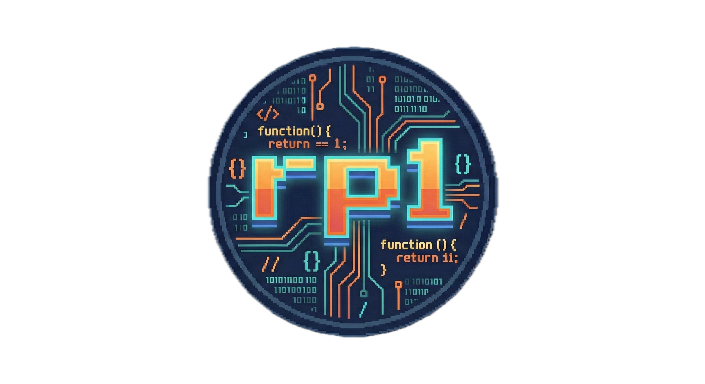

<p align="center">
  
</p>

<h1 align="center">Ready Player One</h1>

<p align="center">
  <strong>> stop prompting; start shipping</strong>
</p>

<p align="center">
  <!-- x-release-please-start-version -->
  <a href="https://github.com/rp1-run/rp1/releases"></a>
  <a href="https://github.com/rp1-run/rp1/releases"></a>
  <!-- x-release-please-end -->
  <a href="https://rp1.run"></a>
  <a href="LICENSE"></a>
</p>

<p align="center">
  Professional development workflows for AI coding assistants.<br>
  21 commands. 18 specialized agents. Single-pass execution.
</p>

---

## Quick Start

### Claude Code

```bash
/plugin marketplace add rp1-run/rp1
/plugin install rp1-base
/plugin install rp1-dev
```

### OpenCode

```bash
curl -fsSL https://raw.githubusercontent.com/rp1-run/rp1/main/scripts/install-for-opencode.sh | bash
```

### First Run

```bash
/rp1-base:knowledge-build    # Generate your codebase knowledge base
```

**[Full documentation at rp1.run →](https://rp1.run)**

---

## What You Get

- **Feature Development**: Requirements → Design → Tasks → Build → Verify
- **Code Quality**: Investigations, audits, hygiene checks
- **PR Management**: Map-reduce reviews, visual diffs, feedback workflows
- **Knowledge Base**: Auto-generated architecture docs that inform every command

---

## Platform Support

| Platform | Status |
|----------|--------|
| [Claude Code](https://www.anthropic.com/claude-code) | Available |
| [OpenCode](https://opencode.ai) | Available |
| Cursor, Goose, Amp | Coming Soon |

---

## Contributing

See the [documentation](https://rp1.run) for architecture and guides. Issues and PRs welcome!

## License

Apache 2.0 - See [LICENSE](LICENSE)

---

<p align="center">
  <a href="https://rp1.run">Documentation</a> ·
  <a href="https://github.com/rp1-run/rp1/issues">Issues</a> ·
  <a href="https://github.com/rp1-run/rp1/releases">Releases</a>
</p>
