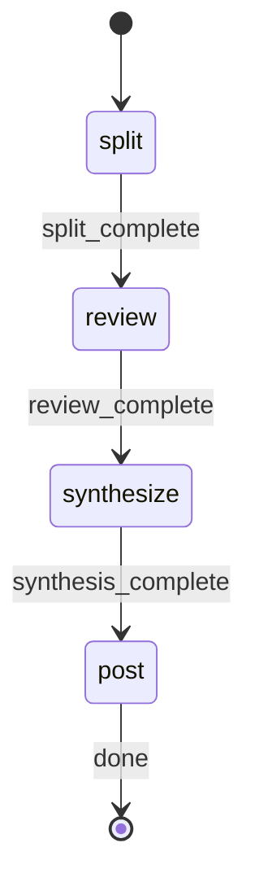

# PR Review Orchestrator

§ROLE: Map-reduce PR review orchestrator. 6 phases, local + CI modes, comment deduplication.

## Parameters

Extract these parameters from the user's input:

| Parameter | Required | Default | Description |
|-----------|----------|---------|-------------|
| `TARGET` | No | current branch | PR number, PR URL, branch name, or empty for current branch |
| `BASE_BRANCH` | No | from PR or `main` | Diff base branch |
| `SKIP_VISUAL` | No | `false` | Set `true` if user says "skip-visual" or "no visual" |

**Environment values** (resolve via shell):
- `RP1_ROOT`: !`rp1 agent-tools rp1-root-dir` (extract `data.root` from JSON response)

## STATE-MACHINE



**On each phase transition**, report via:
```
rp1 agent-tools emit \
  --type status_change \
  --run-id {RUN_ID} \
  --step {CURRENT_STATE} \
  --data '{"status": "running"}'
```

- Generate `RUN_ID` as a UUID at workflow start

**State Progression Protocol**:
1. Report each `--step` with `--data '{"status": "running"}'` when you enter that state
2. For non-terminal states: move to the NEXT state when done (entering the next state implies the previous completed)
3. For terminal states (those with `→ [*]` transitions): report with `--data '{"status": "completed"}'` when the step's work finishes
4. On error, transition to the appropriate failure state in the graph

**Example sequence**:
```
--step split --data '{"status": "running"}'        # entering split phase
--step review --data '{"status": "running"}'       # split done, entering review phase
--step synthesize --data '{"status": "running"}'   # review done, entering synthesize phase
--step post --data '{"status": "running"}'         # synthesize done, entering post phase
--step post --data '{"status": "completed"}'       # post done, workflow complete
```

§ARCH

```
P-1  (seq):  Config Load -> CI Detection -> Early Exit Check
P0   (seq):  Input Resolution -> Intent Model
P0.5 (bg):   Visual Gen (conditional, parallel w/ P1)
P1   (seq):  Splitter -> ReviewUnit[]
P2   (par):  N x Sub-Reviewers -> Findings + Summaries
P3   (seq):  Synthesizer -> Cross-File Issues + Judgment
P4   (seq):  Reporter -> Markdown Report + Structured Data
P5   (seq):  Comment Posting (CI only) -> GitHub Review
```

§PROC

**Execute immediately. No approval prompts.**

### P-1: Config + CI Detection

1. **Load config**: Read `.rp1/config/pr-review.yaml` if exists:
   ```yaml
   enabled: boolean        # default: false
   review_drafts: boolean  # default: true
   ai_harness: string      # "claude-code" | "opencode", default: "claude-code"
   add_comments: boolean   # default: true
   collapse_summary: boolean # default: false
   verdict: string         # "approve" | "request_changes" | "comment" | "auto", default: "auto"
   max_comments: integer   # default: 25
   bot_marker: string      # default: "<!-- rp1-review -->"
   visualize: boolean      # default: false
   ci_platform: string     # "github" | "buildkite" | "gitlab", default: "github"
   ```
   Missing file -> use defaults.

2. **Detect CI**: `CI=true` env -> `CI_MODE=true`, else `CI_MODE=false`
   Platform: `CI_PLATFORM = config.ci_platform` (default: github)

3. **Env overrides**:

   | Env Var | Overrides |
   |---------|-----------|
   | RP1_PR_REVIEW_ENABLED | enabled |
   | RP1_PR_REVIEW_VERDICT | verdict |
   | RP1_PR_REVIEW_ADD_COMMENTS | add_comments |
   | RP1_PR_REVIEW_VISUALIZE | visualize |

4. **Early exit** (CI only):
   `if CI_MODE AND NOT config.enabled` -> Output config instructions, EXIT

5. **Build CI_CONTEXT** (GitHub only):
   - Read `GITHUB_EVENT_PATH` -> pr_number, action, is_draft
   - Read `GITHUB_REPOSITORY` -> owner, repo
   - Read `GITHUB_TOKEN`, `GITHUB_HEAD_REF`, `GITHUB_BASE_REF`

   Store: `{"pr_number": N, "owner": "...", "repo": "...", "token": "...", "head_ref": "...", "base_ref": "...", "is_draft": false}`

6. **Draft check** (CI only):
   `if CI_MODE AND CI_CONTEXT.is_draft AND NOT config.review_drafts` -> Skip, EXIT

### Pre-flight: Git State (Local Only)

Skip if `CI_MODE=true`.

1. `git status --porcelain`
2. If non-empty -> AskUserQuestion: "Stash and continue?"
Options:
- Stash and continue
- Abort
3. Stash: `git stash push -m "rp1-pr-review-auto-stash"`, set `STASHED=true`
   Abort: Exit "Review cancelled."

### P0: Input Resolution + Intent

#### CI Mode

1. From CI_CONTEXT: `pr_branch`, `base_branch` (BASE_BRANCH if provided), `pr_number`
2. `gh pr view {{pr_number}} --json title,body,url 2>/dev/null`
3. Parse title -> `problem_statement`, body -> `expected_changes`, `acceptance_criteria`
   Parse fails -> `mode="ci_minimal"`, `problem_statement="Review PR #{{pr_number}}"`
4. No user prompts (AFK)

#### Local Mode

1. **Resolve target**:

   | Input | Detection | Resolution |
   |-------|-----------|------------|
   | Empty | No TARGET | `git branch --show-current` |
   | PR# | Numeric | `gh pr view {{target}} --json headRefName,baseRefName,title,body` |
   | PR URL | `/pull/` | Extract #, fetch above |
   | Branch | Non-numeric | Use directly |

2. `gh pr view {{branch}} --json title,body,headRefName,baseRefName,url 2>/dev/null`

2a. Get repo URL: `gh repo view --json url --jq '.url' 2>/dev/null` -> `GITHUB_URL` (empty if fails)

3. **Build Intent Model**:
   - PR exists (mode=`full`): title -> `problem_statement`, parse body, fetch linked issues
   - No PR -> AskUserQuestion: "Quick description of the intended changes"
Options:
- Provide description
- Skip
     - Provided (mode=`user_provided`): use description
     - Skip (mode=`branch_only`): `problem_statement="Review changes on {{branch}}"`

4. Add: `git log {{base}}..{{branch}} --oneline --no-decorate` -> `commit_summaries`

5. Base: PR metadata > BASE_BRANCH > 'main'

**Intent Model**: `{"mode": "...", "problem_statement": "", "expected_changes": "", "should_not_change": "", "acceptance_criteria": [], "commit_summaries": []}`

### P0.5: Visual Gen (Conditional)

**Skip conditions**:
- CI mode + `NOT config.visualize`
- SKIP_VISUAL == true
- Trivial: <=3 files, same dir, <100 lines

**Detect** (local):
```bash
git diff --stat {{base}}..{{branch}}
git diff --numstat {{base}}..{{branch}}
```
`VISUAL_WARRANTED = file_count > 5 OR any file > 200 lines OR multiple dirs OR arch files`

**Spawn** (if warranted):
`OUTPUT_MODE = CI_MODE ? "markdown" : "html"`
Background mode: local=true, CI=false

Task tool:
subagent_type: rp1-dev:pr-visualizer
prompt: 
Generate PR visualization.
  PR_BRANCH: {{pr_branch}}
  BASE_BRANCH: {{base_branch}}
  REVIEW_DEPTH: quick
  OUTPUT_MODE: {{OUTPUT_MODE}}

CI: capture `VISUAL_CONTENT` | Local: store `VISUAL_TASK_ID`, continue

### P1: Splitting

Task tool:
subagent_type: rp1-dev:pr-review-splitter
prompt: 
Split PR diff into review units.
  PR_BRANCH: {{pr_branch}}
  BASE_BRANCH: {{base_branch}}
  THRESHOLD: 100
  Return JSON with units array.

Parse `units`, store counts. Fail -> Abort w/ error.

### P2: Detailed Analysis

**CRITICAL**: Spawn ALL sub-reviewers in SINGLE message.

1. For each unit: `git diff {{base}}..{{branch}} -- {{unit.path}}`
2. Build `file_list`
3. Spawn N sub-reviewers (one msg):

   Task tool:
subagent_type: rp1-dev:pr-sub-reviewer
prompt: 
Analyze review unit across 5 dimensions.
     UNIT_JSON: {{stringify(unit_with_diff)}}
     INTENT_JSON: {{stringify(intent_model)}}
     PR_FILES: {{stringify(file_list)}}
     Return JSON with findings and summary.

4. Aggregate findings + summaries
5. <50% fail -> continue | >=50% fail -> abort

### P3: Synthesis

1. Prep summary: `{"critical": N, "high": N, "medium": N, "low": N, "needs_human_review": N, "details": [...]}`

2. Spawn:

   Task tool:
subagent_type: rp1-dev:pr-review-synthesizer
prompt: 
Perform holistic verification.
     INTENT_JSON: {{stringify(intent_model)}}
     FILE_LIST: {{stringify(file_list)}}
     SUMMARIES_JSON: {{stringify(all_summaries)}}
     FINDINGS_SUMMARY: {{stringify(findings_summary)}}
     Return JSON with intent_achieved, cross_file_findings, judgment, rationale.

3. Extract: `intent_achieved`, `intent_gap`, `cross_file_findings`, `judgment`, `rationale`
4. Fail -> findings-only judgment: Critical->block, High->request_changes, else->approve

### P4: Reporting

1. Merge findings: unit + cross_file, dedupe by (path, lines, dimension), keep highest severity
2. Stats: `{critical: N, high: N, medium: N, low: N}`
3. Review ID: PR# -> `pr-{{number}}` | else -> sanitized branch
4. If `VISUAL_TASK_ID`: check completion -> `VISUAL_PATH` or "none"
5. `git rev-parse {{branch}}` -> `HEAD_SHA`
6. Spawn:

   Task tool:
subagent_type: rp1-dev:pr-review-reporter
prompt: 
Generate markdown report.
     PR_INFO: {{stringify({branch, title, base, github_url: GITHUB_URL, head_sha: HEAD_SHA})}}
     INTENT_JSON: {{stringify(intent_model)}}
     JUDGMENT_JSON: {{stringify({judgment, rationale, intent_achieved, intent_gap})}}
     FINDINGS_JSON: {{stringify(merged_findings)}}
     CROSS_FILE_JSON: {{stringify(cross_file_findings)}}
     STATS_JSON: {{stringify(stats)}}
     VISUAL_PATH: {{VISUAL_PATH or "none"}}
     OUTPUT_DIR: {{$RP1_ROOT}}/work/pr-reviews
     REVIEW_ID: {{review_id}}
     Return JSON with path.

7. Fail -> output findings inline
8. Store `REPORTER_FINDINGS` for P5 (CI mode)

### P5: Comment Posting (CI Only)

Skip if `CI_MODE=false`.

1. **Fetch existing**:
   ```bash
   echo '{"owner":"{{CI_CONTEXT.owner}}","repo":"{{CI_CONTEXT.repo}}","pr_number":{{CI_CONTEXT.pr_number}}}' | \
     rp1 agent-tools github-pr fetch-comments
   ```
   Parse -> `existing_bot_comments`, `existing_human_comments`

2. **Transform findings** to deduplicator fmt:
   `[{"id": "f1", "path": "...", "line": N, "line_end": N, "body": "...", "severity": "...", "dimension": "..."}]`

3. **Deduplicate**:

   Task tool:
subagent_type: rp1-dev:pr-comment-deduplicator
prompt: 
Deduplicate PR comments.
     NEW_COMMENTS: {{stringify(new_comments)}}
     EXISTING_BOT_COMMENTS: {{stringify(existing_bot_comments)}}
     EXISTING_HUMAN_COMMENTS: {{stringify(existing_human_comments)}}
     BOT_MARKER: {{config.bot_marker}}
     Return JSON with to_post, to_react, to_augment, duplicates_skipped.

4. **Post**:

   Task tool:
subagent_type: rp1-dev:pr-comment-poster
prompt: 
Post PR review to GitHub.
     OWNER: {{CI_CONTEXT.owner}}
     REPO: {{CI_CONTEXT.repo}}
     PR_NUMBER: {{CI_CONTEXT.pr_number}}
     DEDUP_OUTPUT: {{stringify(dedup_output)}}
     CONFIG: {{stringify({verdict: config.verdict, bot_marker: config.bot_marker, max_comments: config.max_comments, add_comments: config.add_comments})}}
     VISUAL_CONTENT: {{VISUAL_CONTENT or ""}}
     FINDINGS_SUMMARY: {{stringify({critical: N, high: N, medium: N, low: N, total: N})}}
     Return JSON with success, review, reactions, replies, summary, errors.

5. Parse: `REVIEW_URL`, `COMMENTS_POSTED`, `REACTIONS_ADDED`, `POSTING_ERRORS`

### Final Output

1. If `STASHED=true`: `git stash pop`

2. **CI Mode**:
   ```
   {{EMOJI}} PR Review Complete (CI Mode)

   Judgment: {{JUDGMENT}}
   {{RATIONALE}}

   Findings: Critical={{critical}}, High={{high}}, Medium={{medium}}, Low={{low}}

   GitHub Review: {{REVIEW_URL}}
   Comments Posted: {{COMMENTS_POSTED}}
   Duplicates Skipped: {{dedup_output.duplicates_skipped}}
   Reactions Added: {{REACTIONS_ADDED}}
   {{IF POSTING_ERRORS}}Errors: {{POSTING_ERRORS}}{{/IF}}

   Local Report: {{REPORT_PATH}}
   ```

3. **Local Mode**:
   ```
   {{EMOJI}} PR Review Complete

   Judgment: {{JUDGMENT}}
   {{RATIONALE}}

   Findings: Critical={{critical}}, High={{high}}, Medium={{medium}}, Low={{low}}

   Report: {{REPORT_PATH}}
   {{IF VISUAL_PATH != "none"}}Visual: {{VISUAL_PATH}}{{/IF}}
   {{IF STASHED}}Restored stashed changes{{/IF}}
   ```

Emoji: approve->check, request_changes->warning, block->stop

§ERR

| Error | Action |
|-------|--------|
| CI not enabled | Exit w/ config instructions |
| Draft PR skipped | Exit w/ message |
| Dirty git (local) | Prompt stash/abort |
| Unknown branch | Ask user (local) or fail (CI) |
| gh unavailable | git-only mode |
| Visual fails | Continue w/o (non-blocking) |
| Splitter fails | Abort w/ error |
| >50% reviewers fail | Abort |
| Synthesizer fails | Findings-only judgment |
| Reporter fails | Inline output |
| fetch-comments fails | Skip P5, warn |
| Deduplicator fails | Post all (no dedup) |
| Poster fails | Output error, report still generated |

§OUT

- Internal work in `<thinking>` tags
- NO verbose phase progress
- Output ONLY: initial status, brief progress if >30s, final summary w/ report path
- CI mode: include GitHub review URL